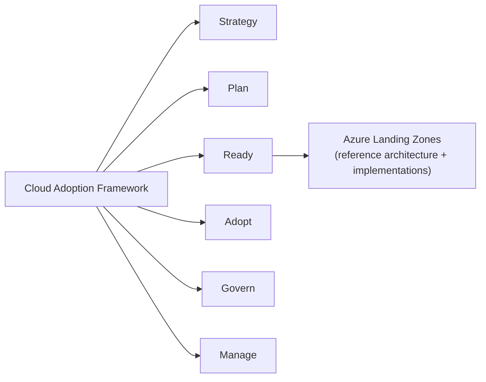

# 1. What is Azure Landing Zones (ALZ)?

[← Back to index](./README.md)

## 1.1 Definition

**Azure Landing Zones (ALZ)** is Microsoft's prescriptive guidance and tooling for building an
enterprise-ready **platform foundation** in Azure. It is the concrete implementation of the
**Ready** methodology in the **Cloud Adoption Framework (CAF)**.

A "landing zone" is an environment that has been pre-provisioned with the networking, identity,
governance, security, and management scaffolding required so that workloads can be deployed onto
it ("land") safely and consistently. ALZ splits this into two ideas:

- **Platform landing zone** — the shared services the whole organization relies on (management,
  connectivity, identity). Built and owned by the **platform team**.
- **Application landing zone** — a subscription (or set of subscriptions) handed to an
  application team to deploy a workload, already wrapped in the right guardrails.

## 1.2 The problem ALZ solves

Without a landing zone, organizations adopting Azure tend to grow organically: subscriptions are
created ad hoc, networking is inconsistent, governance is bolted on late, and security drifts.
ALZ front-loads the hard architectural decisions into a **repeatable, code-defined foundation**
so that:

- Governance (Azure Policy) is applied **by default**, at the right scope, from day one.
- New workloads get a consistent, compliant home **at scale** (via subscription vending).
- Platform and application responsibilities are clearly separated (a *federated* model).
- The whole platform is defined as code and can evolve ("Evergreen").

## 1.3 Relationship to the Cloud Adoption Framework

- **CAF** is the methodology (Strategy → Plan → **Ready** → Adopt → Govern → Manage).
- **ALZ** is what the *Ready* phase produces: the architecture and the deployable code.
- ALZ documentation lives primarily on **Microsoft Learn** (CAF & Azure Architecture Center /
  **AAC**), with the deployable code on GitHub.

## 1.4 Design principles

ALZ is built around a small set of principles that show up throughout the implementations:

| Principle | What it means in practice |
|---|---|
| **Subscription democratization** | Subscriptions are the unit of management/scale; teams get their own, governed by policy at the management-group level above them. |
| **Policy-driven governance** | Guardrails are expressed as **Azure Policy** assigned at management groups, not enforced manually. See [Policy Framework](./05-Policy-Framework.md). |
| **Single control & management plane** | Consistent governance via Azure Resource Manager rather than per-resource tooling. |
| **Application-centric & federated** | The platform team owns shared services; application teams own their landing zones within guardrails. |
| **Align with Azure-native design & roadmap** | Prefer Azure-native platform capabilities and stay current with the product roadmap (the "Evergreen" idea). |

## 1.5 Design areas

ALZ is organized into **design areas** — the categories of decisions you must make. New features
are always mapped to one of these (the source wiki's new-feature checklist asks "where does this
sit in the ALZ architecture?"). The design areas, grouped:

- **Environment / foundational**
  - Azure billing & Microsoft Entra tenant
  - Identity and access management
  - Resource organization (management groups & subscriptions)
- **Compliance**
  - Network topology and connectivity
  - Security
  - Management
  - Governance (Azure Policy)
  - Platform automation & DevOps

These map closely to the **feature areas** the ALZ engineering team uses to organize work:

> Azure Enablement Score · Bicep · Evergreen · Monitor · Networking · Policy · Portal ·
> Resource Management · Security · Terraform · Value Based Delivery (VBD)

## 1.6 The two landing-zone archetypes

The application-landing-zone management groups in ALZ default to two archetypes:

| Archetype | Intended for | Typical policy posture |
|---|---|---|
| **Corp** | Workloads that **require connectivity** to on-premises / the corporate network (via the hub). | No public inbound by default; routed through the hub; stricter networking policy. |
| **Online** | Internet-facing workloads that **don't need** corporate network connectivity. | May expose public endpoints; still governed by baseline security policy. |

> An **archetype** is a named bundle of policy assignments + role assignments + defaults applied
> to a management group. In "v.Next" tooling archetypes are defined in the **ALZ Library**.

## 1.7 What ALZ is *not*

- It is **not** a single product SKU you "turn on" — it's an architecture plus implementations
  you deploy and then own.
- It is **not** only networking — networking is one design area among several.
- The **platform** landing zone is not the place your apps run; apps run in **application**
  landing zones vended on top of it.

---

**Next:** [2. Architecture →](./02-Architecture.md)
