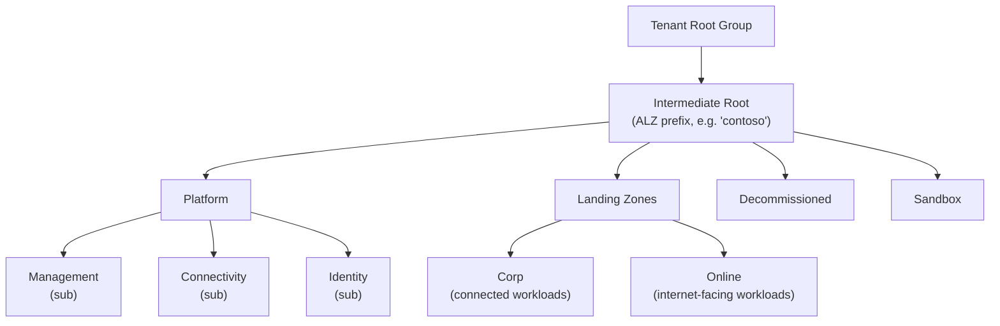
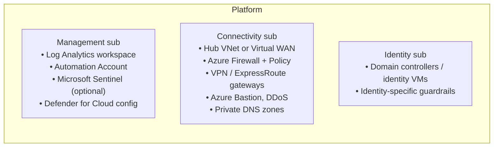
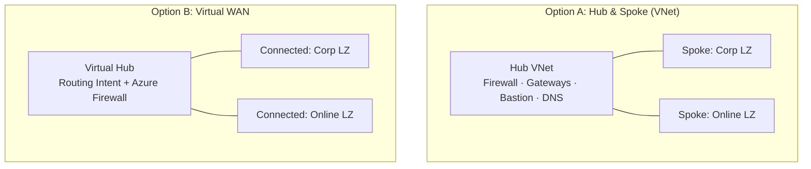
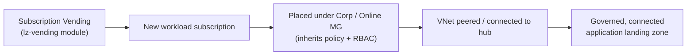

# 2. ALZ Architecture

[← Back to index](./README.md)

This page describes the **conceptual reference architecture** that all ALZ reference
implementations build. The authoritative diagram is always the latest one at
**<https://aka.ms/alz>** — the source wiki's "entry criteria" explicitly require new
accelerators to "align with the latest ALZ Reference Architecture / use the latest graphic at
point of release."

## 2.1 The "layers" model

The source wiki frames ALZ resources in layers:

| Layer | Name | What it is |
|---|---|---|
| **Layer-0** | Reference Architecture & Reference Implementation | The conceptual architecture (`aka.ms/alz`), the deployable code (`aka.ms/alz/aac`), and the public **ALZ Roadmap** (`aka.ms/alz/roadmap`). |
| **Layer-1** | Value Based Deliveries (VBD) | Microsoft delivery offerings (WorkshopPLUS, ALZ Assessment, ALZ Deployment) that help customers adopt ALZ. Delivery content, not part of the deployed platform. |

This wiki focuses on **Layer-0** — the technology itself.

## 2.2 Management group hierarchy

ALZ organizes governance through a **management group (MG) hierarchy** beneath the tenant root.
A single **intermediate root** MG (named with the customer's ALZ prefix) is the anchor for all
ALZ policy and role assignments, which keeps ALZ isolated from (and removable from) the tenant
root.

| Management group | Purpose |
|---|---|
| **Intermediate root** | Anchor for ALZ; baseline/enterprise-wide policy & RBAC assigned here. |
| **Platform** | Parent for shared-service subscriptions; platform-wide policy. |
| **Platform → Management** | Centralized logging, monitoring, automation (Log Analytics, Automation Account). |
| **Platform → Connectivity** | The network hub (Azure Firewall, gateways, DNS, Bastion, DDoS). |
| **Platform → Identity** | Domain controllers / identity services (where required). |
| **Landing Zones → Corp** | Application landing zones that need corporate/on-prem connectivity. |
| **Landing Zones → Online** | Application landing zones that are internet-facing. |
| **Sandbox** | Loosely-governed space for experimentation, isolated from production guardrails. |
| **Decommissioned** | Holding place for subscriptions being retired (cancelled subscriptions move here). |

> Policy and role assignments flow **down** the hierarchy: assign once at a management group and
> every subscription beneath inherits it. This is the mechanism behind "policy-driven
> governance."

## 2.3 Platform subscriptions

The **platform** is typically split across three subscriptions to separate concerns and blast
radius:

See [Platform Resources](./04-Platform-Resources.md) for the full list of resource types and
SKUs ALZ deploys into these subscriptions.

## 2.4 Network topology options

ALZ supports **two** connectivity topologies. New features must be evaluated against both (the
source wiki's checklist asks: *"Is there a difference in guidance/implementation depending on
Traditional Hub & Spoke vs Virtual WAN?"*).

| Topology | Built on | Use when |
|---|---|---|
| **Traditional hub & spoke** | Customer-managed hub **VNet** with Azure Firewall, gateways, and VNet peering to spokes. | You want maximum control over routing and network virtual appliances. |
| **Virtual WAN (vWAN)** | Microsoft-managed **Virtual WAN** hub(s) with routing intent, secured by Azure Firewall. | You want Microsoft-managed, globally-scaled connectivity with less routing overhead. |

Both topologies provide the same logical outcome: a **central, secured egress/transit point**
that spokes (application landing zones) connect to, with private DNS resolution and optional
hybrid connectivity (VPN / ExpressRoute).

## 2.5 How application landing zones attach

Application landing zones are **subscriptions** placed under the **Corp** or **Online**
management group (so they inherit the right policy set), then connected to the platform hub.
At scale they are produced by **[Subscription Vending](./06-Subscription-Vending.md)** rather
than created by hand.

---

**Prev:** [← 1. What is ALZ](./01-What-is-ALZ.md) · **Next:** [3. Reference Implementations →](./03-Reference-Implementations.md)
