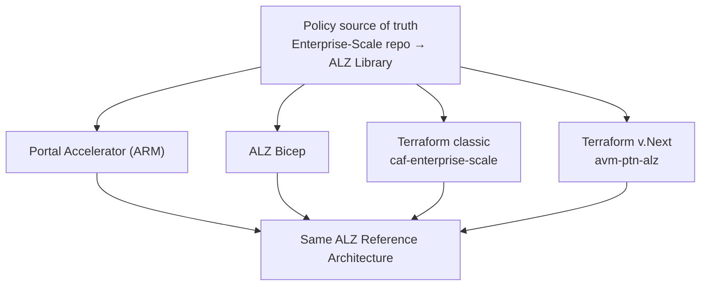
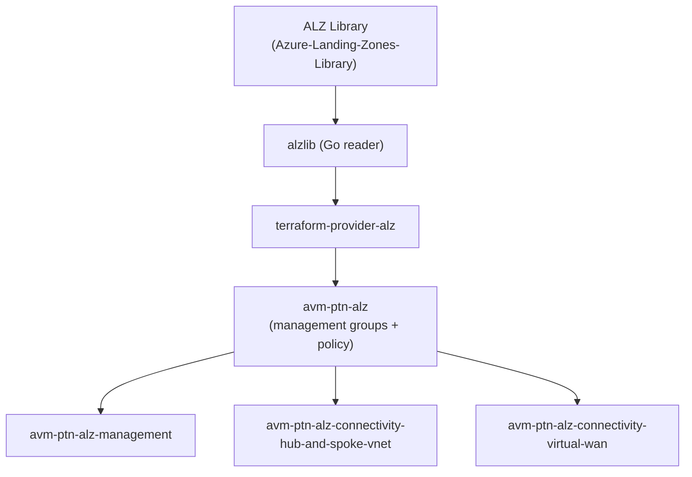
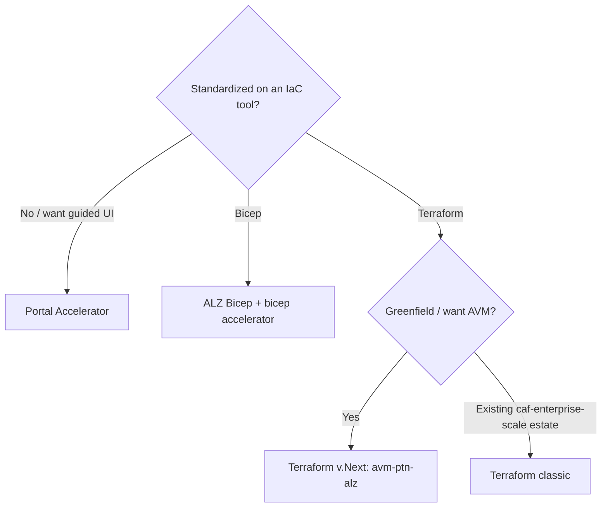

# 3. Reference Implementations (RI)

[← Back to index](./README.md)

A **Reference Implementation (RI)** is deployable code that builds the ALZ reference
architecture. CAF "leads with" different implementations depending on a customer's tooling
preference. There are **three** implementation flavors, and the Terraform flavor is mid-way
through a generational change ("classic" → "v.Next" on Azure Verified Modules).

## 3.1 The three flavors at a glance

| RI | Language | Home repository | Best when the customer… |
|---|---|---|---|
| **Portal Accelerator** | ARM (portal UX) | `Azure/Enterprise-Scale` | Wants a guided, UI-driven first deployment; not (yet) IaC-centric. |
| **ALZ Bicep** | Bicep | `Azure/ALZ-Bicep` | Standardizes on Bicep / native Azure IaC. |
| **ALZ Terraform** | Terraform | `caf-enterprise-scale` (classic) **or** `avm-ptn-alz` (v.Next) | Operates with HashiCorp Terraform. |

> All three are **fed from the same source of truth for policies** — the `Azure/Enterprise-Scale`
> repo today, moving to the **ALZ Library**. So whichever RI you pick, you get the same ALZ
> policy guardrails. See [Policy Framework](./05-Policy-Framework.md).

## 3.2 Portal Accelerator (ARM)

- **Home:** `Azure/Enterprise-Scale` (also the *source of truth for ALZ custom policies*).
- A **CustomDeployment** experience in the Azure portal, driven by `eslzArm/eslzArm.json`
  (template) and `eslz-portal.json` (UI definition).
- Deployments are pinned to a dated **release** (e.g. `2023-10-13`) embedded in the portal URL;
  `aka.ms/alz/portal` and `aka.ms/caf/ready/accelerator` point at the current release.
- Good for a first, guided platform deployment; the resulting environment can then be managed
  going forward with IaC.

## 3.3 ALZ Bicep

- **Home:** `Azure/ALZ-Bicep` (modules) plus `Azure/alz-bicep-accelerator` (starter
  modules + pipeline scaffolding, staging/preview at time of writing).
- A library of **Bicep modules** (management groups, policy, logging, hub networking, etc.) that
  you compose and deploy via pipelines.
- Pulls ALZ policies from the central `Enterprise-Scale` repo via automation, so it stays in sync
  with the policy refresh cycle.

## 3.4 ALZ Terraform — "classic" vs "v.Next"

Terraform is transitioning between two generations:

### Classic
- **Home:** `Azure/terraform-azurerm-caf-enterprise-scale` (often called *caf-enterprise-scale*).
- A single large module that builds the whole platform; policies are embedded/generated from the
  `Enterprise-Scale` repo via the `arm-template-parser` tool.

### v.Next (Azure Verified Modules)
The newer Terraform approach is built on **Azure Verified Modules (AVM)** and a dedicated
provider + library:

| Component | Repository | Role |
|---|---|---|
| **ALZ pattern module** | `Azure/terraform-azurerm-avm-ptn-alz` | The v.Next ALZ module (management groups + policy), uses the ALZ provider. |
| **ALZ provider** | `Azure/terraform-provider-alz` | Terraform provider that reads ALZ Library definitions and produces policy/role assignments. |
| **alzlib** | `Azure/alzlib` | Go library that reads **ALZ Library** definitions (the v.Next engine). |
| **ALZ Library** | `Azure/Azure-Landing-Zones-Library` | Source of truth for policies, archetypes, defaults (data, not code). |
| **Management resources** | `Azure/terraform-azurerm-avm-ptn-alz-management` | Deploys the ALZ management resources (Log Analytics, Automation, etc.). |
| **Connectivity (hub & spoke)** | `Azure/terraform-azurerm-avm-ptn-alz-connectivity-hub-and-spoke-vnet` | Platform hub-and-spoke VNet networking. |
| **Connectivity (Virtual WAN)** | `Azure/terraform-azurerm-avm-ptn-alz-connectivity-virtual-wan` | Platform Virtual WAN networking. |

> **Azure Verified Modules (AVM)** is Microsoft's single, standardized module library. ALZ
> "v.Next" composes **pattern modules** (whole-scenario, e.g. ALZ) from underlying **resource
> modules** (single resource). The source wiki's entry criteria require new accelerators to
> "use and build AVM modules — pattern modules built from underlying resource modules."

## 3.5 Accelerators

An **accelerator** wraps an RI with bootstrap automation (CI/CD pipelines, repo scaffolding,
identity/OIDC setup) so a customer can go from zero to a deployed, pipeline-managed platform
quickly:

| Accelerator | Repository |
|---|---|
| ALZ Accelerator PowerShell module | `Azure/ALZ-PowerShell-Module` |
| Accelerator bootstrap modules | `Azure/accelerator-bootstrap-modules` |
| Terraform accelerator (starter modules + docs) | `Azure/alz-terraform-accelerator` |
| Bicep accelerator (starter modules + docs) | `Azure/alz-bicep-accelerator` (staging/preview) |

## 3.6 Choosing an implementation

- **All flavors deliver the same architecture and the same policy guardrails.** The choice is
  about the customer's tooling and operating model, not about capability.
- For new Terraform work the strategic direction is **v.Next / AVM**.

---

**Prev:** [← 2. Architecture](./02-Architecture.md) · **Next:** [4. Platform Resources →](./04-Platform-Resources.md)
