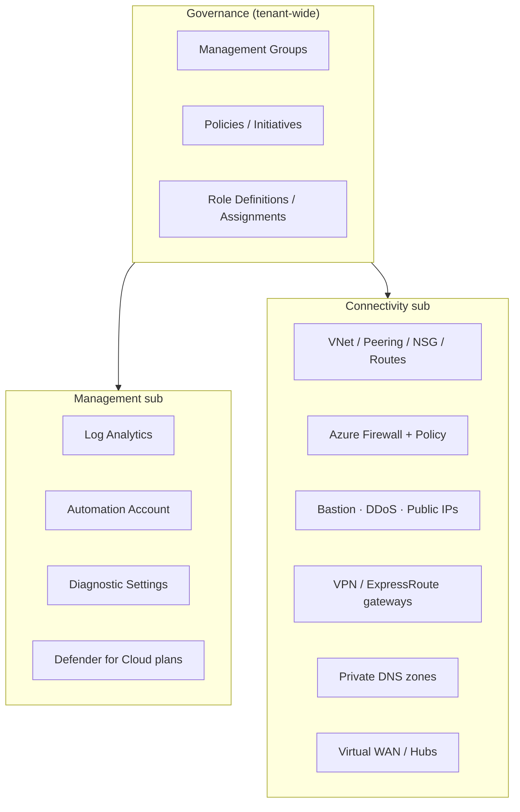

# 4. Platform Resources (ALZ "Core Services")

[← Back to index](./README.md)

This is the set of Azure resource types ALZ deploys to stand up the platform. It is taken
directly from the source wiki's **ALZ Core Services** list (snapshot dated **4 February 2025**),
re-grouped by function. SKUs/tiers are listed where the source called them out; `default` marks
the ALZ default.

> **Region/AZ requirement.** The source wiki notes all of these services must **support
> Availability Zones** in target regions — region & AZ coverage is a standard check when
> onboarding any new ALZ feature.

## 4.1 Governance & resource organization

| Resource type | SKU / tier |
|---|---|
| `Microsoft.Management/managementGroups` | — |
| `Microsoft.Management/managementGroups/subscriptions` | — |
| `Microsoft.Resources/resourceGroups` | — |
| `Microsoft.Authorization/policyDefinitions` | — |
| `Microsoft.Authorization/policySetDefinitions` (initiatives) | — |
| `Microsoft.Authorization/policyAssignments` | — |
| `Microsoft.Authorization/roleDefinitions` | — |
| `Microsoft.Authorization/roleAssignments` | — |

These are the building blocks of **policy-driven governance** — see
[Policy Framework](./05-Policy-Framework.md).

## 4.2 Management & monitoring (Management subscription)

| Resource type | SKU / tier |
|---|---|
| `Microsoft.OperationalInsights/workspaces` (Log Analytics) | `Standard` (required); also Free, PerNode, PerGB2018, Premium, Standalone, CapacityReservation, LACluster |
| `Microsoft.OperationalInsights/workspaces/linkedServices` | — |
| `Microsoft.OperationsManagement/solutions` | — |
| `Microsoft.Automation/automationAccounts` | `Basic` |
| `Microsoft.Insights/diagnosticSettings` | — |

## 4.3 Security — Microsoft Defender for Cloud

ALZ enables **Microsoft Defender for Cloud** plans. Plans called out by the source list:

- Defender for **Servers** (Plan 1 and Plan 2)
- Defender for **Containers**
- Defender for **SQL** (on Azure-connected databases, and outside Azure)
- Defender for **MySQL**, **PostgreSQL**, **MariaDB**
- Defender for **Cosmos DB**
- Defender for **Storage**
- Defender for **APIs** (plans 1–5)
- Defender for **App Service**
- Defender for **Key Vault**
- Defender for **Resource Manager**

## 4.4 Connectivity (Connectivity subscription)

### Core networking

| Resource type | SKU / tier |
|---|---|
| `Microsoft.Network/virtualNetworks` | — |
| `Microsoft.Network/virtualNetworks/virtualNetworkPeerings` | — |
| `Microsoft.Network/networkSecurityGroups` | — |
| `Microsoft.Network/routeTables` | — |
| `Microsoft.Network/publicIPAddresses` | `Standard`, Basic, Global |
| `Microsoft.Network/privateDnsZones` | — |
| `Microsoft.Network/privateDnsZones/virtualNetworkLinks` | — |

### Security & edge

| Resource type | SKU / tier |
|---|---|
| `Microsoft.Network/azureFirewalls` | `Premium` (default), Standard, Basic |
| `Microsoft.Network/firewallPolicies` | — |
| `Microsoft.Network/bastionHosts` | `Premium` (default), Standard, Basic, Developer |
| `Microsoft.Network/ddosProtectionPlans` | — |

### Hybrid connectivity gateways

| Resource type | SKU / tier |
|---|---|
| `Microsoft.Network/virtualNetworkGateways` | Basic, Standard, HighPerformance, UltraPerformance, ErGw1AZ/2AZ/3AZ, ErGwScale, VpnGw1–5 (+AZ variants) |
| `Microsoft.Network/expressRouteGateways` | Standard, HighPerformance, UltraPerformance, ErGw1Az/2Az/3Az |
| `Microsoft.Network/vpnGateways` | Basic, Standard, VpnGw1–5 (+AZ variants), High-Performance |

### Virtual WAN (vWAN topology)

| Resource type | SKU / tier |
|---|---|
| `Microsoft.Network/virtualWans` | `Standard` |
| `Microsoft.Network/virtualHubs` | — |
| `Microsoft.Network/virtualHubs/hubRouteTables` | — |
| `Microsoft.Network/virtualHubs/hubVirtualNetworkConnections` | — |
| `Microsoft.Network/virtualHubs/routingIntent` | — |

## 4.5 Mental model

> This list is a **point-in-time snapshot** from the source wiki and exists mainly to scope
> capacity/quotas/SKUs and AZ support. The deployed set evolves with each ALZ release — always
> check the current release notes (`aka.ms/alz/whatsnew`).

---

**Prev:** [← 3. Reference Implementations](./03-Reference-Implementations.md) · **Next:** [5. Policy Framework →](./05-Policy-Framework.md)
