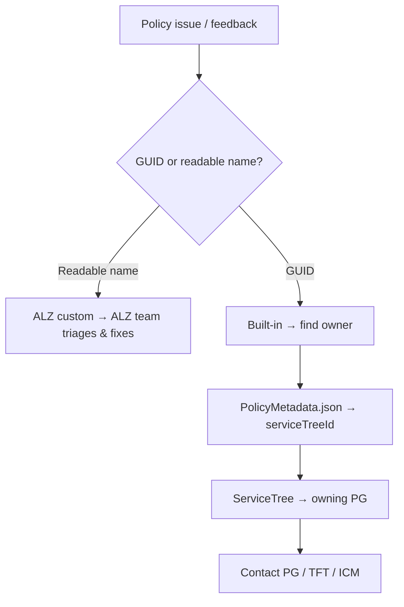
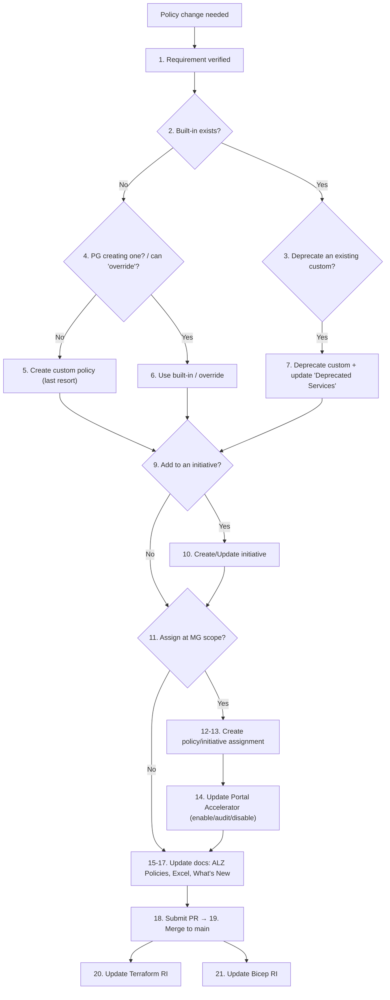
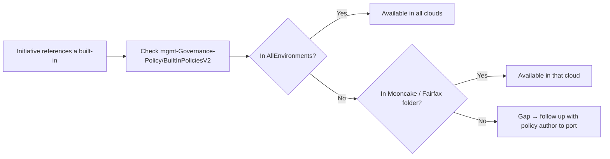

# 5. Policy Framework

[← Back to index](./README.md)

Azure Policy is the **heart** of ALZ governance. Guardrails are expressed as **policy
definitions** and **initiatives** (policy *set* definitions), **assigned** at management-group
scopes so subscriptions inherit them. This page explains the moving parts and the processes the
ALZ team uses to maintain them.

## 5.1 Custom vs built-in policies

ALZ delivers guardrails using a **mix** of two policy sources:

| | **ALZ custom policy** | **Built-in policy** |
|---|---|---|
| Created by | The ALZ (CSU) team | The individual Azure product group (PG) |
| Source of truth | `Azure/Enterprise-Scale` repo → **ALZ Library** | Azure platform |
| **Name format** (how to tell them apart) | A **readable name** | A **GUID** |
| Owns support/fixes | ALZ team (triaged by impact; *not* under CSS SLAs) | The owning PG (per their SLA) |

> **How to identify one:** in the portal go to **Policy → Definitions**, open the definition,
> scroll to the bottom of the JSON, and look at the `name`. A **GUID** = built-in; a
> **human-readable name** = ALZ custom.

### Why this split matters (support routing)
Feedback on a policy is **not** automatically the Azure Policy PG's responsibility. The Policy PG
owns the *policy engine* (e.g. versioning); each PG owns the *policies it authors*
(e.g. "Audit VMs that do not use managed disks" is owned by the **Compute** PG). To find a
built-in policy's owner:

1. Get the policy **GUID**.
2. Look it up in `PolicyMetadata.json` (in the `msazure/One/mgmt-Governance-Policy` repo).
3. Read the `serviceTreeId`; resolve it at **<https://aka.ms/servicetree>** to find the owning
   engineering team and contacts.
4. Raise via direct contact, a **TFT** item against the service, or an **ICM**. (If
   `serviceTreeId` is all-zeros, the entry predates the metadata file — contact the RP directly.)

## 5.2 Centralizing ALZ policies

**All ALZ-related policy contributions go to `Azure/Enterprise-Scale`**, regardless of which RI
will consume them — the Bicep and Terraform modules *pull* policies from this repo via
automation. Reasons the source wiki gives for centralizing here:

1. Mature contribution & review process already in place.
2. Existing automation keeps Bicep & Terraform modules in sync with this repo (customers built
   their own automation on it too).
3. **AzGovViz** & **AzAdvertizer** tooling scan this repo to build their views/reports.
4. Tests enforce required properties/metadata on policies.
5. Fewer locations for consumers to track.

> Strategic direction: the **ALZ Library** (`Azure/Azure-Landing-Zones-Library`) becomes the
> source of truth for policies, archetypes, and defaults for "v.Next" tooling.

## 5.3 The policy change / onboarding flow

When a new guardrail is needed, ALZ prefers a **built-in** policy over a custom one, and prefers
`override` over authoring net-new. The decision flow (adapted from the source wiki):

Key takeaways:
- **Prefer built-in** → then **override** → then **custom** (last resort).
- Net-new assignments must specify **which management group(s)** they target (assignment scope).
- The **Portal Accelerator** exposes each policy as **enable / audit / disable** to the user.
- Every change updates **What's New.md** (always required) and creates follow-up stories in the
  **Bicep** and **Terraform** backlogs so all RIs stay aligned.

## 5.4 Quarterly policy refresh

Policy changes are batched into a **quarterly release cycle** so the community can digest them:

- A backlog of policy issues is assembled at the start of a quarter and milestoned
  (e.g. `policy-refresh-fy23q4`).
- Work merges into a dedicated branch named `policy-refresh-<fyXXqX>` on `Azure/Enterprise-Scale`
  (urgent/PG fixes may go straight to `main` out-of-band).
- At quarter end the changes are packaged, tested (including the **upgrade path** — deploy
  `main`, then deploy the refresh branch over the top), and released.
- Proposed release versioning is date-based: `YYYY-MM-DD` (an out-of-band bugfix is "just a
  different day").
- Each policy should ship with **non-compliance messages** and **metadata** (including
  sovereign-cloud supportability).

## 5.5 Sovereign clouds (Mooncake / Fairfax)

Supporting the sovereign clouds is hard because the ALZ team **cannot access** them to test:

- **Mooncake** = Azure China (21Vianet). **Fairfax** = Azure US Government.
- Custom policies **cannot be validated** there by the ALZ team; what *can* be checked is whether
  the **built-in** policies an initiative references are **available** in each cloud.
- Availability is determined from the `msazure/One/mgmt-Governance-Policy` repo under
  `settings/BuiltInPoliciesV2`:
  - `AllEnvironments` subfolder = policies common to all clouds.
  - Per-cloud subfolders (e.g. `Mooncake`, `Fairfax`) = policies specific to that cloud; search
    by policy **name** (not ID).
  - Equivalently, a built-in's `base.json` whose URLs include `prod` + `fairfax` + `mooncake` is
    available in all three.
- **Important ownership note:** the Azure Policy PG does **not** own porting public-cloud policies
  to Fairfax/Mooncake — it is the **policy author's** responsibility to deploy there. So a
  referenced built-in may simply not exist in a sovereign cloud, which would break a consistent
  deployment experience if not caught.

---

**Prev:** [← 4. Platform Resources](./04-Platform-Resources.md) · **Next:** [6. Subscription Vending →](./06-Subscription-Vending.md)
