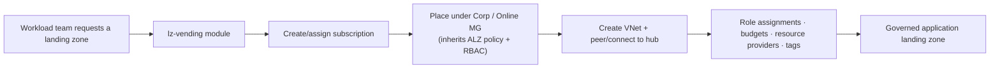
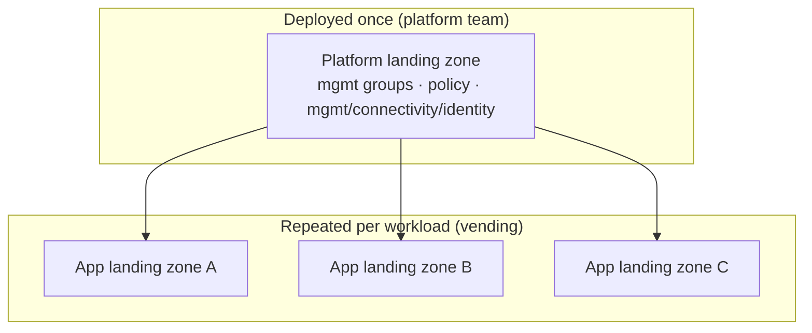

# 6. Subscription Vending (LZ Vending)

[← Back to index](./README.md)

## 6.1 What it is

**Subscription vending** (a.k.a. **LZ Vending** / Landing Zone Vending) is the automated,
**repeatable creation of application landing zones** — typically a new subscription, placed in
the right management group, wired into networking, and seeded with RBAC and budgets — so that
application teams can request a governed home for their workload "on demand."

It is the **scale mechanism** that complements the platform: the platform foundation is deployed
once, then subscription vending is used over and over to onboard each new workload consistently.

## 6.2 What a vending module typically configures

While exact inputs differ by implementation, subscription vending generally handles:

- **Subscription** creation (or use of an existing one) and **management-group placement**.
- **Networking**: a spoke VNet and peering to the hub (or connection to a Virtual WAN hub).
- **Identity/RBAC**: role assignments for the workload team.
- **Governance hooks**: budgets, resource-provider registration, tags.

This is the technical embodiment of **"subscription democratization"** — every workload gets its
own subscription as the unit of scale, automatically governed by the policies inherited from the
management group above it.

## 6.3 Implementations

| Implementation | Repository | Status |
|---|---|---|
| **Terraform** LZ Vending | `Azure/terraform-azurerm-lz-vending` | Live / in use |
| **Bicep** LZ Vending | `Azure/bicep-lz-vending` | **Archived — moved to Azure Verified Modules (`aka.ms/brm`)** |

> The Bicep vending module has graduated into **AVM**. When evaluating where a new ALZ feature
> belongs, the source wiki's checklist explicitly asks whether it is *"best placed in ALZ or
> Subscription Vending, or both"* — vending is treated as a first-class, separate building block
> from the platform itself.

## 6.4 Platform vs application landing zone (recap)

---

**Prev:** [← 5. Policy Framework](./05-Policy-Framework.md) · **Next:** [7. Repositories & Tooling →](./07-Repositories-and-Tooling.md)
