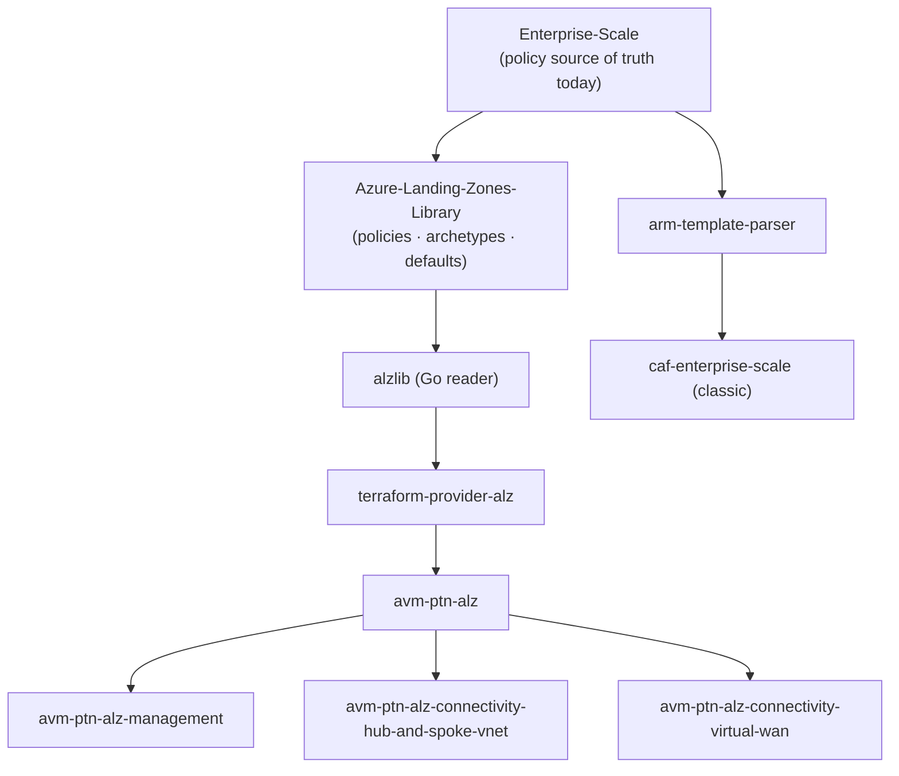

# 7. Repositories & Tooling

[← Back to index](./README.md)

ALZ is delivered through a set of public GitHub repositories plus governance-visualization
tooling. This page is the **map of the codebase** — what each repo is for and how they relate.

## 7.1 Core ALZ repositories

| Repository | Role |
|---|---|
| `Azure/Enterprise-Scale` | **Main ALZ repo.** Home of the **Portal Accelerator** and the **source of truth for ALZ custom policies**. |
| `Azure/ALZ-Bicep` | ALZ **Bicep** modules + Bicep accelerator home. |
| `Azure/terraform-azurerm-caf-enterprise-scale` | ALZ **Terraform "classic"** module (`caf-enterprise-scale`). |
| `Azure/Azure-Landing-Zones-Library` | **ALZ Library** — becoming source of truth for **policies, archetypes, and defaults** (data, consumed by v.Next tooling). |
| `Azure/Azure-Landing-Zones` | ALZ's newer "home," mainly docs outside of MS Learn. |
| `Azure/alzlib` | Go library that reads ALZ Library definitions (the Terraform **v.Next** engine). |
| `Azure/terraform-provider-alz` | Terraform **v.Next provider**. |
| `Azure/terraform-azurerm-avm-ptn-alz` | Terraform **v.Next** ALZ module (uses the ALZ provider). |
| `Azure/terraform-azurerm-avm-ptn-alz-management` | v.Next **management** resources (Log Analytics, Automation, etc.). |
| `Azure/terraform-azurerm-avm-ptn-alz-connectivity-hub-and-spoke-vnet` | v.Next **hub-and-spoke** platform networking. |
| `Azure/terraform-azurerm-avm-ptn-alz-connectivity-virtual-wan` | v.Next **Virtual WAN** platform networking. |
| `Azure/arm-template-parser` | CI/CD tool that parses upstream policy definitions/assignments into a Terraform-compatible format. |

## 7.2 Accelerators

| Repository | Role |
|---|---|
| `Azure/ALZ-PowerShell-Module` | ALZ Accelerator **PowerShell module**. |
| `Azure/accelerator-bootstrap-modules` | Accelerator **bootstrap** modules (CI/CD + repo + identity scaffolding). |
| `Azure/alz-terraform-accelerator` | Terraform accelerator **starter modules + docs**. |
| `Azure/alz-bicep-accelerator` | Bicep accelerator starter modules + docs (staging/preview). |

## 7.3 Subscription vending

| Repository | Role |
|---|---|
| `Azure/terraform-azurerm-lz-vending` | Terraform LZ vending module. |
| `Azure/bicep-lz-vending` | Bicep LZ vending — **archived, moved to AVM** (`aka.ms/brm`). |

See [Subscription Vending](./06-Subscription-Vending.md).

## 7.4 Governance visualization & policy discovery tooling

| Tool | Repository / site | What it does |
|---|---|---|
| **AzGovViz** (Azure Governance Visualizer) | `JulianHayward/Azure-MG-Sub-Governance-Reporting` (upstream) · `Azure/azure-governance-visualizer` (Azure-org clone) | Scans a management-group hierarchy and produces rich governance reports (policy, RBAC, networking, etc.). The Azure-org clone exists to meet some security-focused customers' needs. |
| **AzGovViz Accelerator** | `Azure/Azure-Governance-Visualizer-Accelerator` | Deploys AzGovViz (e.g. publishing to an App Service website) and keeps it up to date with releases. |
| **AzAdvertizer** | <https://www.azadvertizer.net> | Searchable index of Azure **built-in policies/initiatives**, roles, aliases, etc. Used during the policy change flow to find a suitable built-in before authoring custom. |

> The policy change flow ([Policy Framework](./05-Policy-Framework.md)) calls out AzAdvertizer
> for **discovering** built-ins and AzGovViz for **reporting** on what's deployed — both are
> driven off the central `Enterprise-Scale` policy repo.

## 7.5 Related / adjacent repositories

These are used by, referenced in CAF, or contributed to by the ALZ team but owned elsewhere:

| Repository | Role |
|---|---|
| `Azure/azure-monitor-baseline-alerts` | **AMBA** — Azure Monitor Baseline Alerts; integrates into ALZ as an optional monitoring layer (see [Operations](./08-Operations-and-Lifecycle.md)). |
| `Azure/review-checklists` | ALZ review checklists. |
| `Azure/enterprise-azure-policy-as-code` | **EPaC** — Enterprise Policy as Code. |
| `Azure/AzOps` & `Azure/AzOps-Accelerator` | AzOps PowerShell module (GitOps for ARM at MG scope) + accelerator. |
| `MicrosoftDocs/cloud-adoption-framework` (+ `-pr`) | CAF documentation home (live + PR staging). |
| `MicrosoftDocs/architecture-center` (+ `-pr`) | Azure Architecture Center (**AAC**) docs home (live + PR staging). |

## 7.6 How the v.Next repos chain together

---

**Prev:** [← 6. Subscription Vending](./06-Subscription-Vending.md) · **Next:** [8. Operations & Lifecycle →](./08-Operations-and-Lifecycle.md)
