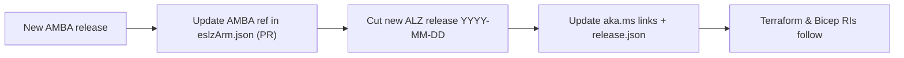
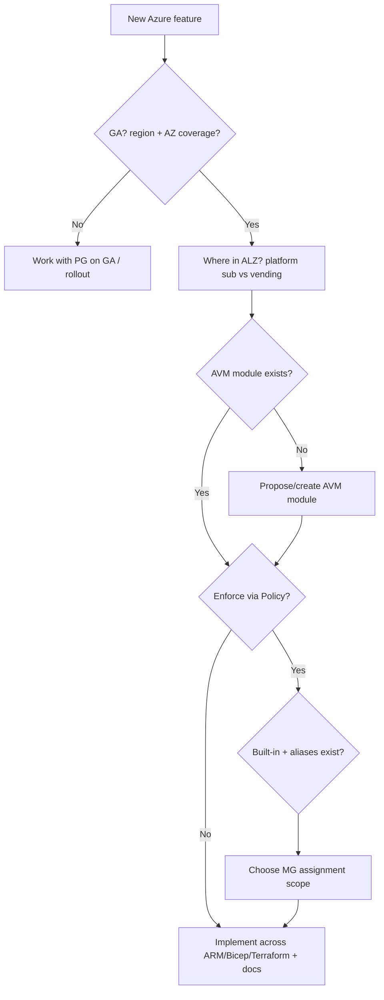

# 8. Operations & Lifecycle

[← Back to index](./README.md)

Technical operational topics for running and evolving an ALZ platform. (Team/process mechanics —
sprints, backlogs, reporting — are intentionally excluded; this page keeps only the
technically-relevant operations.)

## 8.1 Deploying ALZ — prerequisites

Before deploying, review the **Deploying ALZ pre-requisites** guidance in the
`Azure/Enterprise-Scale` wiki. At a minimum you need:

- A Microsoft **Entra ID** tenant and an account with **Owner** at the tenant root (to create
  management groups and assign policy/RBAC at root scope).
- An **ALZ prefix** that names the intermediate-root management group and anchors the hierarchy.
- The target **regions** confirmed to support the required services **and Availability Zones**
  (see [Platform Resources](./04-Platform-Resources.md)).

## 8.2 Cleaning up / wiping a deployment

For non-production tenants you can fully tear down an ALZ deployment with the community
**`Wipe-ESLZAzTenant.ps1`** script (from `jtracey93/PublicScripts`). It removes the management
groups, policy/role assignments, and resources created under the intermediate root.

```powershell
Connect-AzAccount -Tenant <Entra tenant ID>
.\Wipe-ESLZAzTenant.ps1 `
  -tenantRootGroupID <Entra tenant ID> `
  -intermediateRootGroupID "<ALZ prefix>"
```

> ⚠️ **Destructive.** This deletes management groups and everything ALZ created beneath them.
> Only run it against a **disposable test tenant**, never production. Double-check the
> `intermediateRootGroupID` (your ALZ prefix) before running.

For testing **non-production Portal releases**, there is a branch-construct utility that builds
the correct portal URL so you can deploy from a feature/refresh branch instead of `main`.

## 8.3 Releases & the "Evergreen" lifecycle

- ALZ ships **dated releases** (`YYYY-MM-DD`). Track changes via **`aka.ms/alz/whatsnew`** and
  always note which release you are working from.
- **Portal Accelerator** releases pin to a date embedded (twice) in the portal deployment URL;
  `aka.ms/alz/portal` and `aka.ms/caf/ready/accelerator` are updated to point at the current
  release, and `src/portal/release.json` is updated so the portal builds the right deploy link.
- **Evergreen** is the practice of keeping a deployed ALZ continuously up to date with new
  releases (one of the engineering **feature areas**).

## 8.4 Azure Monitor Baseline Alerts (AMBA) integration

**AMBA** (`Azure/azure-monitor-baseline-alerts`) is a baseline of monitoring **alerts** that ALZ
integrates as an **optional, enable/disable** monitoring layer. AMBA uses **releases**, and ALZ
**pins to a specific AMBA release** so unrelated AMBA changes don't flow in unexpectedly.

When a new AMBA release needs to be adopted, the **Portal RI** is updated by:

1. Updating the AMBA release reference in `eslzArm/eslzArm.json` (PR into `Azure/Enterprise-Scale`).
2. Cutting a new dated **ALZ release** (`YYYY-MM-DD`).
3. Updating the `aka.ms` short links and `src/portal/release.json` so the portal experience uses
   the new release. (Terraform & Bicep RIs follow with their own updates.)



## 8.5 Geo codes for Private DNS zones (Backup / Site Recovery)

Some **Private DNS zone** names for **Azure Backup / Site Recovery** require a region **geo
code** (e.g. `ae` for Australia East). There is no public API and the public docs lag, so the ALZ
team derives them from the internal `AzureServiceConfig.json`
(`Clouds > Public > DataCenters`) using the **`Get-AzureBackupGeoCodes.ps1`** script (stored in
this repo under `media/scripts/`). It filters to **active**, non-test public regions and emits a
JSON mapping:

```json
[
  { "FriendlyName": "Australia East", "ShortName": "australiaeast", "Geography": "Australia", "GeoCode": "ae" }
]
```

```powershell
.\Get-AzureBackupGeoCodes.ps1 `
  -pathToAzureServiceConfigJsonFile "<path>\AzureServiceConfig.json" `
  -outputPathForJsonMappingFile "<path>\AzureBackupGeoCodeMappings.json"
```

## 8.6 Entry criteria for a new Landing Zone Accelerator (LZA)

When a new scenario-specific **Landing Zone Accelerator** is proposed, it must meet baseline
criteria before it's accepted:

**Reference implementation**
- At least one of **Bicep** / **Terraform** (Portal optional).
- Aligns with the **latest ALZ Reference Architecture** (use the latest graphic at release time).
- Built from **AVM** modules (pattern modules composed from resource modules).
- Must be able to **create a new VNet or use an existing** one.

**Azure Policy**
- Must work **with the default ALZ policies** assigned (document any need to disable defaults).
- Check for **overlap/duplication** with ALZ policy and the correct **assignment scope**
  (platform vs application responsibility).
- Networking aligned to **Corp vs Online** guidance.

**Documentation**
- CAF docs (design-area mapping, scenario defined) and AAC implementation guides; keep current
  with `aka.ms/alz/whatsnew`.

## 8.7 Onboarding a new Azure feature into ALZ — technical checklist

When evaluating whether a new Azure feature belongs in ALZ, the key **technical** questions are:

- **Placement** — Where does it sit in the architecture? If in a platform subscription, which one
  (management / connectivity / identity)?
- **Readiness** — Is it **GA**? Good **region** coverage? Does it support **Availability Zones**?
- **ALZ vs Vending** — Best placed in the **platform**, in **Subscription Vending**, or both?
- **Modules** — Are **AVM** modules available? If not, propose/create them (to align with v.Next).
- **All RIs** — Is it supported across **ARM, Bicep, and Terraform**?
- **Policy** — Should it be enforced via Azure Policy? Do suitable **built-ins** exist? Do the
  required **policy aliases** exist? Which **management group(s)** should the policy target?
- **Networking** — Does guidance differ for **Hub & Spoke** vs **Virtual WAN**?
- **Docs** — Which need updating: CAF, AAC, ALZ Library, AVM module docs, What's New, the ALZ
  diagram?



---

**Prev:** [← 7. Repositories & Tooling](./07-Repositories-and-Tooling.md) · **Next:** [9. Glossary →](./09-Glossary.md)
