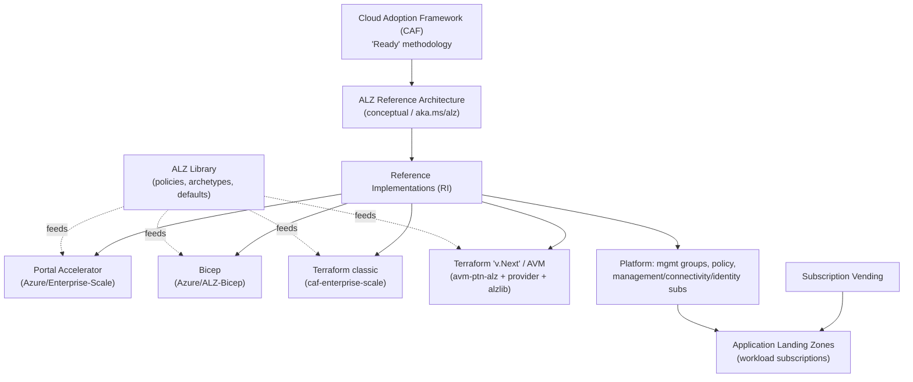

# Azure Landing Zones (ALZ) — Technology Wiki

A focused, technology-only wiki for **Azure Landing Zones (ALZ)**. It was synthesized by
extracting and re-organizing the *technical* content scattered across the
`CSU-SolEng-ALZ-Wiki` repository (team/process content such as sprints, reporting,
onboarding-people, and recognition is intentionally left out).

> **Authoritative upstream sources.** This wiki is a learning aid. The official, always-current
> references are the Cloud Adoption Framework "Ready" methodology and the ALZ reference
> architecture at **<https://aka.ms/alz>** (reference architecture) and
> **<https://aka.ms/alz/aac>** (deploy guidance). Where this wiki describes the conceptual
> architecture (management-group hierarchy, platform subscriptions, network topologies), it
> reflects the standard CAF ALZ reference architecture that the source wiki points to.

## What is ALZ in one paragraph

Azure Landing Zones is Microsoft's prescriptive, **opinionated platform foundation** for
adopting Azure at scale. It implements the *Ready* methodology of the **Cloud Adoption
Framework (CAF)** as a concrete **reference architecture** plus a set of **reference
implementations** (Portal Accelerator, Bicep, Terraform). ALZ stands up the management-group
hierarchy, platform subscriptions (management, connectivity, identity), a hub/spoke or Virtual
WAN network, centralized logging and security, and — most importantly — a set of
**policy-driven guardrails** (Azure Policy) so that every workload ("application landing zone")
is born governed, secure, and compliant.

## Pages

| # | Page | What it covers |
|--:|------|----------------|
| 1 | [What is ALZ](./01-What-is-ALZ.md) | Concept, the problem it solves, CAF relationship, design principles, design areas, the two landing-zone archetypes |
| 2 | [Architecture](./02-Architecture.md) | Reference architecture, management-group hierarchy, platform subscriptions, hub-spoke vs Virtual WAN, layers |
| 3 | [Reference Implementations](./03-Reference-Implementations.md) | Portal Accelerator, Bicep, Terraform (classic + AVM "v.Next"), how they relate, when to use which |
| 4 | [Platform Resources](./04-Platform-Resources.md) | The Azure resource types & SKUs ALZ deploys (the "core services") |
| 5 | [Policy Framework](./05-Policy-Framework.md) | Policy-driven guardrails, custom vs built-in, the change/onboarding flow, quarterly refresh, sovereign clouds |
| 6 | [Subscription Vending](./06-Subscription-Vending.md) | Automated subscription/landing-zone vending (Bicep & Terraform) |
| 7 | [Repositories & Tooling](./07-Repositories-and-Tooling.md) | Official repos, the ALZ Library / `alzlib`, accelerators, AzGovViz, AzAdvertizer |
| 8 | [Operations & Lifecycle](./08-Operations-and-Lifecycle.md) | Deploy prerequisites, clean-up/wipe, AMBA updates, geo codes, entry criteria, onboarding new features |
| 9 | [Glossary](./09-Glossary.md) | Every acronym and term used across ALZ |

## How the pieces fit together

## Source map (where each fact came from in this repo)

| This wiki page | Primary source file(s) in `CSU-SolEng-ALZ-Wiki/wiki` |
|---|---|
| What is ALZ / Architecture | `Azure-Landing-Zone-Resources.md`, `ALZ-Repo-Strategy.md`, `Onboarding-New-Azure-Product-Features-to-ALZ-Checklist.md` |
| Reference Implementations | `ALZ-Repo-Catalog.md`, `ALZ-Repo-Strategy.md`, `Azure-landing-zone-Terraform.md`, `LZA---ALZ-Entry-Criteria.md` |
| Platform Resources | `ALZ-Core-Services.md` |
| Policy Framework | `ALZ-Policy-Framework.md`, `ALZ-Policy-Framework/*`, `How-to-determine-ALZ-Policy-and-Initiatives-vs-Built-in...md`, `How-to-determine-if-an-Azure-Policy-or-Initiative-is-deployed-to-Mooncake-or-Fairfax.md` |
| Subscription Vending | `ALZ-Repo-Catalog.md` |
| Repositories & Tooling | `ALZ-Repo-Catalog.md` |
| Operations & Lifecycle | `Cleaning-Up-ALZ-Deployments.md`, `Getting-Geo-Codes-For-Private-DNS-Zones.md`, `Process-to-Update-ALZ-When-a-New-AMBA-ALZ-Pattern-Release-is-Generated.md`, `LZA---ALZ-Entry-Criteria.md`, `Onboarding-New-Azure-Product-Features-to-ALZ-Checklist.md` |
| Glossary | `ALZ-Repo-Strategy.md` + terms collected across all pages |
