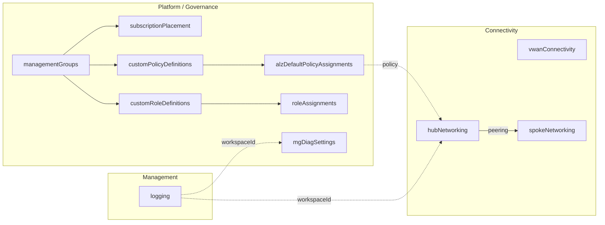
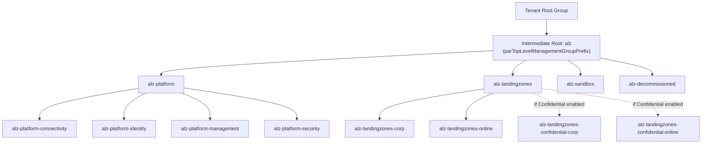
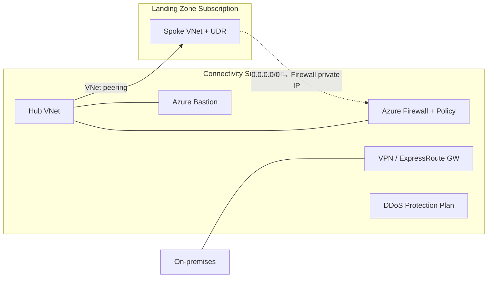
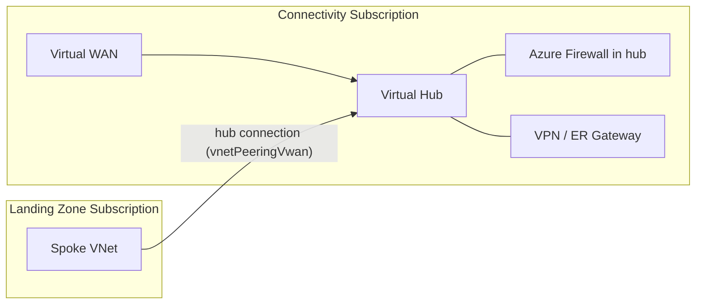
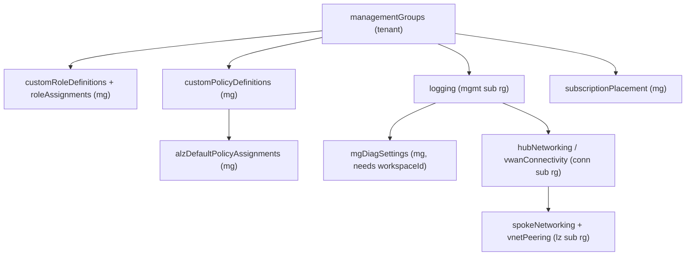

# Azure/ALZ-Bicep — Repository Overview

| Field | Value |
|-------|-------|
| Repository | `Azure/ALZ-Bicep` (a.k.a. **ALZ-Bicep Classic**) |
| Catalog id | A1 |
| Flavor | Bicep (97.7%) + PowerShell (2.3%) |
| Role | The **modular Bicep implementation** of the Cloud Adoption Framework ALZ conceptual architecture |
| Entry pattern | One module per folder under `infra-as-code/bicep/modules/`, each deployed **separately** via CLI |
| License | MIT · Latest release v0.25.4 (Apr 2026) · 79 releases |
| Source URL | <https://github.com/Azure/ALZ-Bicep> |
| Mode | deep (source-verified) |
| Last reviewed | 2026-06-17 |

## Purpose

ALZ-Bicep deploys and manages the **core platform capabilities** of the CAF Azure Landing Zones
conceptual architecture (management groups → policy → RBAC → logging → connectivity) using **Bicep**.
It is the most direct, readable view of the "management groups → policy → networking" backbone, because
each capability is an independent, parameterised Bicep module.

- **Platform/governance layer** — management-group hierarchy, custom + default Azure Policy, custom RBAC
  roles and role assignments, management-group diagnostic settings.
- **Management layer** — the central Log Analytics workspace, Automation Account, Microsoft Sentinel, and
  the Azure Monitor Agent (AMA) data-collection rules.
- **Connectivity layer** — hub-and-spoke (Hub VNet + Azure Firewall + gateways + Bastion) **or** Virtual
  WAN, plus spoke VNets, peering, and private DNS.



> **Status — "Classic":** With Bicep **AVM** now GA and the default starter in the ALZ Accelerator, ALZ-Bicep
> Classic is in deprecation. The Bicep Classic starter was removed from the Accelerator on **2026-02-16**;
> the repository is scheduled to be **archived 2027-02-16** (bug fixes / security patches / policy refreshes
> until then). The successor is the **AVM platform-landing-zone** stack (`br/public:avm/ptn/...`, the
> [avm-ptn-alz](../avm-ptn-alz/_overview.md) family). Migration guidance: `aka.ms/alz/acc/bicep`.

## Design philosophy (important)

- **No orchestration module.** Unlike Terraform's single `platform_landing_zone`, ALZ-Bicep historically
  has **no top-level module that calls the others** (cited Bicep/ARM limitations). Each module is deployed
  on its own with `az deployment <scope> create` and a `*.parameters.json`; the **operator wires outputs of
  one deployment into the parameters of the next** (e.g. `logging`'s `outLogAnalyticsWorkspaceId` →
  `mgDiagSettings` / `hubNetworking`). The recommended order is the repo's "Deployment Flow".
- **Multi-scope.** Modules target different scopes: `tenant` (management groups), `managementGroup` (policy,
  RBAC, placement, diag settings), `subscription` (resource group, vWAN peering), `resourceGroup` (logging,
  hub/spoke networking). This is the canonical example of ALZ scope layering.
- **`mc-` variants** = **Microsoft Cloud for Sovereignty** / sovereign clouds (e.g. Azure China, Gov). Files
  like `mc-customPolicyDefinitions.bicep`, `mc-alzDefaultPolicyAssignments.bicep`, `definitions/china/...`.
- **Telemetry (PID / Customer Usage Attribution).** Every module optionally deploys a no-resource
  `CRML/customerUsageAttribution/cuaId<scope>.bicep` named `pid-<guid>-<uniqueString(loc)>`, gated by
  `parTelemetryOptOut`. This is how Microsoft attributes ALZ-Bicep usage.

## Repository structure

```
ALZ-Bicep/
├── infra-as-code/bicep/
│   ├── modules/                 # ← the deployable modules (this overview's focus)
│   │   ├── managementGroups/    #   <name>.bicep + *.parameters.json + README.md + samples/
│   │   ├── subscriptionPlacement/
│   │   ├── policy/{definitions,assignments,exemptions}/
│   │   ├── customRoleDefinitions/{definitions}/
│   │   ├── roleAssignments/
│   │   ├── mgDiagSettings/
│   │   ├── logging/
│   │   ├── hubNetworking/  vwanConnectivity/  spokeNetworking/
│   │   ├── vnetPeering/  vnetPeeringVwan/  privateDnsZoneLinks/  publicIp/  resourceGroup/
│   │   └── CRML/customerUsageAttribution/   # PID telemetry helper modules
│   └── orchestration/           # sample multi-module wiring (verify on visit)
├── accelerator/                 # classic-accelerator wiring assets
├── docs/wiki/                   # deployment flow, policy deep-dive, code tours
└── tests/pipelines/             # PSRule + pipeline tests
```

## Module inventory

| Layer | Module (entry `.bicep`) | Scope | Purpose |
|-------|-------------------------|-------|---------|
| Governance | `managementGroups` (+ `managementGroupsScopeEscape`) | `tenant` (mg for scope-escape) | The ALZ management-group hierarchy |
| Governance | `subscriptionPlacement` | `managementGroup` | Move subscriptions into a management group |
| Governance | `policy/definitions/customPolicyDefinitions` (+ `mc-`) | `managementGroup` | Custom policy + initiative (set) definitions |
| Governance | `policy/assignments/policyAssignmentManagementGroup` | `managementGroup` | Generic single-assignment helper |
| Governance | `policy/assignments/alzDefaults/alzDefaultPolicyAssignments` (+ `mc-`) | `managementGroup` | The full ALZ **default** policy-assignment set |
| Governance | `policy/assignments/workloadSpecific/workloadSpecificPolicyAssignments` | `managementGroup` | Workload-specific assignments (e.g. AKS, trusted launch) |
| Governance | `policy/exemptions/policyExemptions` | `managementGroup` | Policy exemptions |
| Governance | `customRoleDefinitions` (+ `mc-`, `definitions/caf*Role`) | `managementGroup` | Custom RBAC role definitions |
| Governance | `roleAssignments/roleAssignment{ManagementGroup,Subscription,ResourceGroup}[Many]` | mg / sub | Role-assignment helpers (single + many) |
| Governance | `mgDiagSettings` | `managementGroup` | MG diagnostic settings → Log Analytics |
| Management | `logging` | `resourceGroup` | LAW + Automation + Sentinel + ChangeTracking + AMA |
| Connectivity | `hubNetworking` | `resourceGroup` | Hub VNet + Azure Firewall + Bastion + gateways + DDoS |
| Connectivity | `vwanConnectivity` | `resourceGroup` | Virtual WAN + virtual hubs + firewall + VPN/ER GW |
| Connectivity | `spokeNetworking` | `resourceGroup` | Spoke VNet + UDR + peering back to hub |
| Connectivity | `vnetPeering` / `vnetPeeringVwan` | rg / sub | VNet-to-VNet peering / spoke-to-vWAN-hub peering |
| Connectivity | `privateDnsZoneLinks` / `publicIp` / `resourceGroup` | rg / rg / sub | DNS-zone VNet links / public IP / RG creation |
| Telemetry | `CRML/customerUsageAttribution/cuaId<scope>` | tenant/mg/sub/rg | PID usage-attribution (no Azure resource) |

## Architecture diagrams

### Management-group hierarchy (default)



### Hub-and-Spoke topology (option A)



### Virtual WAN topology (option B)



### Recommended deployment flow



## Relationship to the rest of the ALZ ecosystem

- **Policy source:** the custom policy/initiative JSON shipped here originates from
  [Enterprise-Scale (E1)](../enterprise-scale-arm/_overview.md) / the
  [Azure-Landing-Zones-Library (G1)](../Azure-Landing-Zones-Library/_overview.md) — refreshed by automation
  (the repo's "Update Policy Library" workflow).
- **Accelerator:** consumed historically by the **classic Bicep accelerator** (A3 `alz-bicep-accelerator`)
  and the [ALZ-PowerShell-Module (F3)](../ALZ-PowerShell-Module/_overview.md) driver.
- **Successor:** the **AVM Bicep** platform-landing-zone modules — conceptually parallel to the Terraform
  [avm-ptn-alz (B1)](../avm-ptn-alz/_overview.md) governance pattern.
- **Vending sibling:** subscription vending is a **separate** Bicep repo,
  [bicep-lz-vending (A2)](../bicep-lz-vending/_overview.md) — ALZ-Bicep itself does not create subscriptions
  (only `subscriptionPlacement` moves existing ones).

## Notes & gotchas

- **Operator-driven orchestration** — there is no single deploy button; outputs are threaded between
  per-module deployments by the operator / pipeline. This is the biggest conceptual difference from the
  Terraform line.
- **Scope-escape variant** — `managementGroupsScopeEscape.bicep` lets you build the hierarchy **without
  tenant-root access** (deploys at `managementGroup` scope using ARM scope escaping) — useful in
  delegated-admin scenarios.
- **AMA via AVM** — `logging` already consumes an AVM pattern module (`br/public:avm/ptn/alz/ama`) for the
  Azure Monitor Agent DCRs, i.e. Classic is partially AVM-backed internally.
- **Locks everywhere** — connectivity + logging modules expose a `lockType` (`CanNotDelete`/`ReadOnly`/
  `None`) with a **global** lock that overrides per-resource locks.
- **Sovereign overlay (SLZ / I1)** — [`Azure/sovereign-landing-zone`](../sovereign-landing-zone/_overview.md)
  **vendors these ALZ-Bicep modules** under its `dependencies/infra-as-code/bicep/modules/` and composes the
  `logging`, `hubNetworking`, `roleAssignments`, and `policy/definitions` modules, adding confidential
  management groups + the Sovereignty Baseline policy initiatives on top.

## Open Questions

- [ ] `TODO: verify` the exact contents of `infra-as-code/bicep/orchestration/` (sample end-to-end wiring) — not read in this pass.
- [x] **Resolved (via F2):** the `accelerator/` folder is ALZ-Bicep's **`bicep-classic` starter** for the Accelerator. [F2 `accelerator-bootstrap-modules`](../accelerator-bootstrap-modules/_overview.md)'s `.config` maps `iac_type = bicep-classic` → this repo's `accelerator.zip` artifact with the nested starter config `accelerator/.config/ALZ-Powershell-Auto.config.json`. It is **distinct from A3 `alz-bicep-accelerator`**, which is the modern **AVM Bicep** starter used for `iac_type = bicep`. So `accelerator/` here = the *classic* starter; [A3](../alz-bicep-accelerator/_overview.md) = the *AVM* starter.
