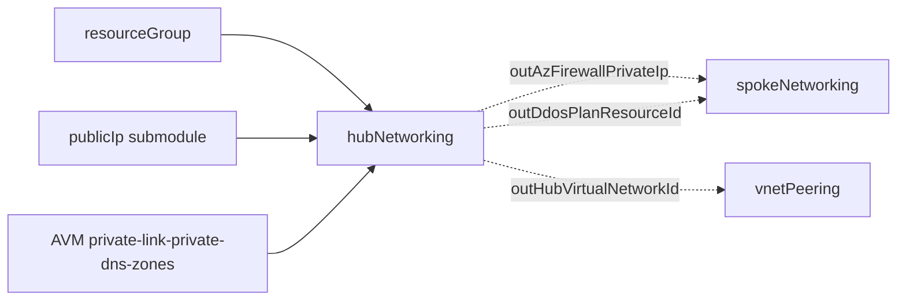
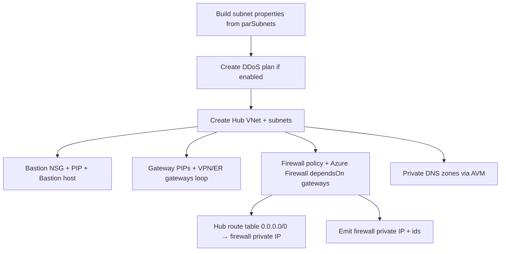

# Module: `hubNetworking`

| Field | Value |
|-------|-------|
| Repository | `Azure/ALZ-Bicep` |
| Flavor | Bicep |
| Entry file | `infra-as-code/bicep/modules/hubNetworking/hubNetworking.bicep` |
| Scope | `targetScope = 'resourceGroup'` (the Connectivity subscription) |
| Source URL | <https://github.com/Azure/ALZ-Bicep/blob/main/infra-as-code/bicep/modules/hubNetworking/hubNetworking.bicep> |
| Mode | deep (source-verified) |
| Last reviewed | 2026-06-17 |

## Purpose

Builds the **hub-and-spoke connectivity hub**: a central Hub VNet with Azure Firewall (+ policy), Azure
Bastion, VPN/ExpressRoute gateways, a DDoS protection plan, a firewall-default route table, and Private DNS
zones.

- The "option A" connectivity topology (the alternative is `vwanConnectivity`).
- Emits the **Azure Firewall private IP** — the single most important output, used as the spokes' default
  next-hop.
- Connectivity layer, deployed into the Connectivity platform subscription's resource group.

## Inputs (themed; defaults shown)

**Core / VNet**

| Name | Type | Default | Description |
|------|------|---------|-------------|
| `parLocation` | `string` | `resourceGroup().location` | Region |
| `parCompanyPrefix` | `string` | `'alz'` | Prepended to resource names |
| `parHubNetworkName` | `string` | `'${parCompanyPrefix}-hub-${parLocation}'` | Hub VNet name |
| `parHubNetworkAddressPrefix` | `string` | `'10.10.0.0/16'` | Hub address space |
| `parSubnets` | `subnetOptionsType[]` | Bastion + Gateway + Firewall + FirewallMgmt subnets | Subnet definitions (name, range, optional NSG/RT/delegation) |
| `parDnsServerIps` | `array` | `[]` | Custom DNS servers |

**Feature switches (each `true` by default):** `parAzBastionEnabled`, `parDdosEnabled`,
`parAzFirewallEnabled`, `parVpnGatewayEnabled`, `parExpressRouteGatewayEnabled`, `parPrivateDnsZonesEnabled`.

**Azure Firewall:** `parAzFirewallName`, `parAzFirewallTier` (`Basic`/`Standard`/`Premium`),
`parAzFirewallIntelMode` (`Alert`/`Deny`/`Off`), `parAzFirewallPoliciesEnabled`, `parAzFirewallDnsProxyEnabled`,
`parAzFirewallCustomPublicIps`, `parAzFirewallCustomManagementIp`, `parAzFirewallAvailabilityZones`.

**Gateways:** `parVpnGatewayConfig` / `parExpressRouteGatewayConfig` (`virtualNetworkGatewayOptionsType` — SKU,
BGP/ASN `65515`, active-active, generation), gateway PIP availability-zone params.

**Bastion / DDoS / Route table / DNS:** `parAzBastionSku` (`Basic`/`Standard`), `parAzBastionTunneling`,
`parDdosPlanName`, `parHubRouteTableName`, `parDisableBgpRoutePropagation`, `parPrivateDnsZones[]`,
`parVirtualNetworkResourceIdsToLinkTo`.

**Locks & telemetry:** `parGlobalResourceLock` (overrides per-resource locks) + per-resource `lockType`s;
`parTags`; `parTelemetryOptOut`.

## Outputs

| Name | Type | Description / Downstream use |
|------|------|------------------------------|
| `outAzFirewallPrivateIp` | `string` | **Spokes' next-hop** — feeds `spokeNetworking.parNextHopIpAddress` |
| `outAzFirewallName` | `string` | Firewall name |
| `outHubVirtualNetworkId` / `…Name` | `string` | Hub VNet — peering target |
| `outHubRouteTableId` / `…Name` | `string` | Firewall-default route table |
| `outDdosPlanResourceId` | `string` | DDoS plan — reused by spokes + policy |
| `outPrivateDnsZones` / `…Names` | `array` | Private DNS zones created (from the AVM module) |
| `outBastionNsgId` / `…Name` | `string` | Bastion NSG |

## Resources Created

| Resource type | Symbolic | Notes / condition |
|---------------|----------|-------------------|
| `Microsoft.Network/ddosProtectionPlans` | `resDdosProtectionPlan` | if `parDdosEnabled` |
| `Microsoft.Network/virtualNetworks@2024-05-01` | `resHubVnet` | inline `subnets`, DDoS-linked |
| `Microsoft.Network/networkSecurityGroups` | `resBastionNsg` | full Bastion rule set |
| `Microsoft.Network/bastionHosts` | `resBastion` | if `parAzBastionEnabled` (+ PIP submodule) |
| `Microsoft.Network/virtualNetworkGateways` (loop) | `resGateway` | VPN + ER from `varGwConfig` |
| `Microsoft.Network/firewallPolicies` | `resFirewallPolicies` | tier-specific (Basic vs Std/Prem) |
| `Microsoft.Network/azureFirewalls@2024-05-01` | `resAzureFirewall` | `AZFW_VNet`, `dependsOn` gateways |
| `Microsoft.Network/routeTables` | `resHubRouteTable` | `0.0.0.0/0 → firewall private IP` (if firewall on) |
| `br/public:avm/ptn/network/private-link-private-dns-zones:0.7.0` | `modPrivateDnsZonesAVM` | all Azure Private DNS zones |
| `../publicIp/publicIp.bicep` (submodules) | Bastion/Gateway/Firewall PIPs | standard PIPs |
| `Microsoft.Authorization/locks` (many) | `res*Lock` | global lock overrides per-resource |

## Dependencies

**Upstream:** a resource group in the Connectivity subscription; the `publicIp` submodule; the AVM
private-DNS-zones pattern module.

**Downstream:** `spokeNetworking` (consumes `outAzFirewallPrivateIp` as next-hop + `outDdosPlanResourceId`);
`vnetPeering` (peers hub ↔ spoke using `outHubVirtualNetworkId`); ALZ DINE policy (Private DNS zone ids).

## Module Dependency Diagram

## Deployment Flow

## Notes & Gotchas

- **Subnets are data-driven** — `parSubnets` is mapped into `subnets` inline; the Bastion subnet must be named
  `AzureBastionSubnet`, the firewall `AzureFirewallSubnet`, gateways `GatewaySubnet` (Azure-reserved names).
- **Firewall private IP → spoke UDR** — the hub route table sends `0.0.0.0/0` to
  `resAzureFirewall.properties.ipConfigurations[0].properties.privateIPAddress`; the same IP is the output the
  spoke consumes. Force-tunnelling is the whole point of the hub.
- **Gateway loop with sentinel configs** — VPN/ER gateways iterate over `varGwConfig`; disabled gateways are
  represented by the `noconfigVpn`/`noconfigEr` sentinel and skipped (`if name != 'noconfig…'`).
- **ZTN PID** — an extra zero-trust telemetry deployment fires when `parDdosEnabled && parAzFirewallEnabled &&
  tier == 'Premium'`.
- **Private DNS via AVM** — the long Private DNS zone list is delegated to
  `br/public:avm/ptn/network/private-link-private-dns-zones`, auto-linking the hub VNet.
- **Global lock** — `parGlobalResourceLock.kind != 'None'` overrides every per-resource lock kind + notes.

## Open Questions

- [ ] `TODO: verify` the `publicIp.bicep` submodule's exact PIP properties (zones/SKU) — wrapped, not read line-by-line.
