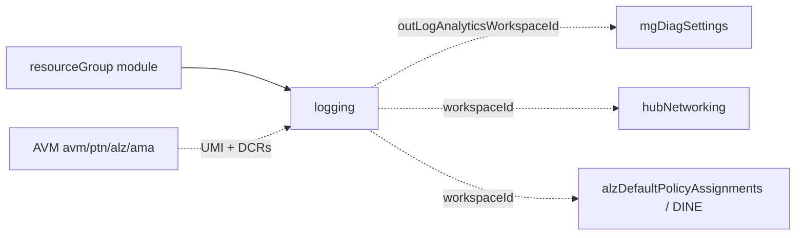
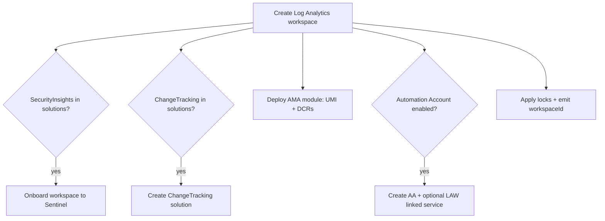

# Module: `logging`

| Field | Value |
|-------|-------|
| Repository | `Azure/ALZ-Bicep` |
| Flavor | Bicep |
| Entry file | `infra-as-code/bicep/modules/logging/logging.bicep` |
| Scope | `targetScope = 'resourceGroup'` (deployed into the **Management** subscription's RG) |
| Source URL | <https://github.com/Azure/ALZ-Bicep/blob/main/infra-as-code/bicep/modules/logging/logging.bicep> |
| Mode | deep (source-verified) |
| Last reviewed | 2026-06-17 |

## Purpose

Stands up the **central management / observability platform**: the shared Log Analytics workspace plus
Microsoft Sentinel, Change Tracking, an optional Automation Account, and the Azure Monitor Agent (AMA)
data-collection rules.

- The single "sink" workspace that diagnostic settings, policy (DINE), and Defender for Cloud point at.
- Lives in the **Management** platform subscription (CAF "Management" landing zone).
- Provides `outLogAnalyticsWorkspaceId`, the most-referenced output in the whole repo.

## Inputs (grouped)

**Log Analytics workspace**

| Name | Type | Default | Description |
|------|------|---------|-------------|
| `parLogAnalyticsWorkspaceName` | `string` | `'alz-log-analytics'` | Workspace name |
| `parLogAnalyticsWorkspaceLocation` | `string` | `resourceGroup().location` | Region (mind Automation region mapping) |
| `parLogAnalyticsWorkspaceSkuName` | `string` | `'PerGB2018'` | SKU (allowed list incl. `CapacityReservation`) |
| `parLogAnalyticsWorkspaceCapacityReservationLevel` | `int` | `100` | Only used when SKU = `CapacityReservation` |
| `parLogAnalyticsWorkspaceLogRetentionInDays` | `int` (30–730) | `365` | Retention |
| `parLogAnalyticsWorkspaceSolutions` | `array` | `['SecurityInsights','ChangeTracking']` | Which solutions/onboarding to enable |

**Automation Account**

| Name | Type | Default | Description |
|------|------|---------|-------------|
| `parAutomationAccountEnabled` | `bool` | `false` | Toggle the Automation Account |
| `parAutomationAccountName` | `string` | `'alz-automation-account'` | Name |
| `parAutomationAccountUseManagedIdentity` | `bool` | `true` | SystemAssigned identity |
| `parAutomationAccountPublicNetworkAccess` | `bool` | `true` | Public network access |
| `parLogAnalyticsWorkspaceLinkAutomationAccount` | `bool` | `false` | Create the LAW↔AA linked service |

**AMA / Data Collection Rules** — `parDataCollectionRuleVMInsightsName` / `…Experience` (`PerfAndMap`),
`parDataCollectionRuleChangeTrackingName`, `parDataCollectionRuleMDFCSQLName`,
`parUserAssignedManagedIdentityName` (`'alz-logging-mi'`).

**Locks & telemetry** — `parGlobalResourceLock` (`lockType`) overrides all per-resource locks
(`parLogAnalyticsWorkspaceLock`, `parAutomationAccountLock`, `parChangeTrackingSolutionLock`, …);
`parTags` / `parAutomationAccountTags` / `parLogAnalyticsWorkspaceTags`; `parTelemetryOptOut`.

## Outputs

| Name | Type | Description / Downstream use |
|------|------|------------------------------|
| `outLogAnalyticsWorkspaceId` | `string` | **Most-used output** — `mgDiagSettings`, `hubNetworking`, policy DINE all consume it |
| `outLogAnalyticsWorkspaceName` | `string` | Workspace name |
| `outLogAnalyticsCustomerId` | `string` | Workspace GUID (`properties.customerId`) |
| `outLogAnalyticsSolutions` | `array` | Echo of enabled solutions |
| `outAutomationAccountId` / `…Name` | `string` | AA id/name, or `'AA Deployment Disabled'` |

## Resources Created

| Resource type | Symbolic name | Key configuration |
|---------------|---------------|-------------------|
| `Microsoft.OperationalInsights/workspaces@2025-07-01` | `resLogAnalyticsWorkspace` | SKU, retention, capacity reservation |
| `Microsoft.SecurityInsights/onboardingStates@2025-09-01` | `resSentinelOnboarding` | Onboards LAW to **Sentinel** if `SecurityInsights` in solutions |
| `Microsoft.OperationsManagement/solutions` | `resChangeTrackingSolution` | `ChangeTracking(<law>)` if in solutions |
| `Microsoft.Automation/automationAccounts@2024-10-23` | `resAutomationAccount` | `if (parAutomationAccountEnabled)`, SystemAssigned MI, Basic SKU |
| `Microsoft.OperationalInsights/workspaces/linkedServices` | `resLogAnalyticsLinkedServiceForAutomationAccount` | LAW↔AA link if enabled |
| `br/public:avm/ptn/alz/ama:0.2.0` (module) | `modAma` | UMI + VM Insights / Change Tracking / MDFC-SQL **DCRs** (via AVM) |
| `Microsoft.Authorization/locks@2020-05-01` | `res*Lock` | Per-resource locks gated by global/per-resource lock kind |
| `CRML/.../cuaIdResourceGroup.bicep` (module) | `modCustomerUsageAttribution` | PID `pid-f8087c67-…` |

> **Scope:** `resourceGroup` — deploy after creating the management RG (e.g. via the `resourceGroup` module).

## Dependencies

**Upstream:** a resource group in the Management subscription; the AVM AMA pattern module
(`br/public:avm/ptn/alz/ama`).

**Downstream:** `mgDiagSettings` (needs `outLogAnalyticsWorkspaceId`), `hubNetworking` /
`vwanConnectivity` (firewall + flow-log diagnostics), and ALZ **DINE policy** assignments that point
resources at this workspace.

## Module Dependency Diagram

## Deployment Flow

## Notes & Gotchas

- **Solutions are data-driven** — Sentinel onboarding and Change Tracking are each created **only if** their
  key is present in `parLogAnalyticsWorkspaceSolutions`; drop a value to skip that capability.
- **Global lock wins** — when `parGlobalResourceLock.kind != 'None'` it overrides every per-resource lock
  (kind + notes), a repo-wide pattern in connectivity/logging modules.
- **AMA delegated to AVM** — the DCRs + user-assigned identity are created by the AVM module
  `br/public:avm/ptn/alz/ama`, so Classic logging is already partly AVM-backed.
- **Automation Account off by default** — `parAutomationAccountEnabled = false`; legacy Update Management /
  runbook scenarios must opt in.
- **Region mapping** — LAW and Automation must be in a supported region pairing (linked-service constraint).

## Open Questions

- [ ] `TODO: verify` the precise `dataSources` / table set provisioned by the AVM `ama` module (delegated, not read here).
