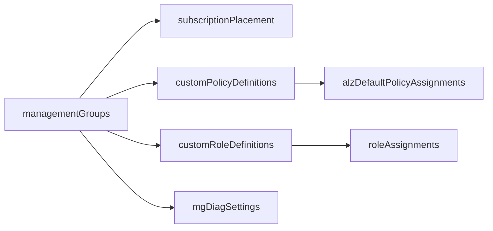
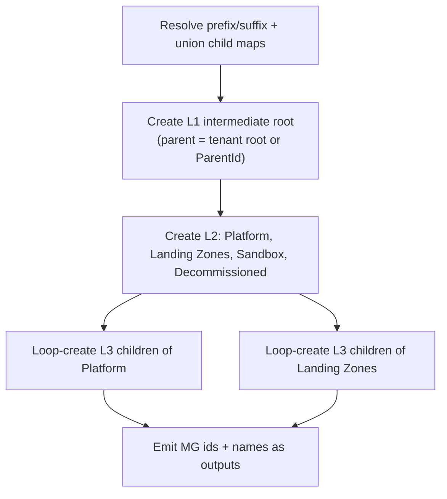

# Module: `managementGroups`

| Field | Value |
|-------|-------|
| Repository | `Azure/ALZ-Bicep` |
| Flavor | Bicep |
| Entry file | `infra-as-code/bicep/modules/managementGroups/managementGroups.bicep` |
| Variant | `managementGroupsScopeEscape.bicep` (deploy without tenant-root access) |
| Scope | `targetScope = 'tenant'` (scope-escape variant: `managementGroup`) |
| Source URL | <https://github.com/Azure/ALZ-Bicep/blob/main/infra-as-code/bicep/modules/managementGroups/managementGroups.bicep> |
| Mode | deep (source-verified) |
| Last reviewed | 2026-06-17 |

## Purpose

Creates the **ALZ management-group hierarchy** under the tenant root (or under a supplied parent),
implementing the CAF "Intermediate Root → Platform / Landing Zones / Sandbox / Decommissioned" model.

- The single foundational module — almost everything else (policy, RBAC, placement, diag settings) is
  scoped to the management groups this module creates.
- Builds three levels: **L1** intermediate root, **L2** the four standard groups, **L3** configurable
  children of Platform and Landing Zones.
- Emits the management-group **IDs and names** that downstream modules consume as input.

## Inputs

| Name | Type | Required | Default | Description |
|------|------|:--------:|---------|-------------|
| `parTopLevelManagementGroupPrefix` | `string` (2–10) | no | `'alz'` | Prefix for every MG id/name; the L1 group is created with this id |
| `parTopLevelManagementGroupSuffix` | `string` (≤10) | no | `''` | Optional suffix appended to every MG id/name (include leading dash) |
| `parTopLevelManagementGroupDisplayName` | `string` | no | `'Azure Landing Zones'` | Display name of the L1 intermediate root |
| `parTopLevelManagementGroupParentId` | `string` | no | `''` | Parent of L1; empty ⇒ tenant root group |
| `parLandingZoneMgAlzDefaultsEnable` | `bool` | no | `true` | Create **Corp** + **Online** under Landing Zones |
| `parPlatformMgAlzDefaultsEnable` | `bool` | no | `true` | Create **Connectivity / Identity / Management / Security** under Platform |
| `parLandingZoneMgConfidentialEnable` | `bool` | no | `false` | Also create **Confidential Corp** + **Confidential Online** |
| `parLandingZoneMgChildren` | `object` | no | `{}` | Extra/replacement child MGs of Landing Zones (`{ key: { displayName } }`) |
| `parPlatformMgChildren` | `object` | no | `{}` | Extra/replacement child MGs of Platform |
| `parTelemetryOptOut` | `bool` | no | `false` | Opt out of PID telemetry |

> The `*Children` objects are **maps keyed by a stable string**; the key becomes part of the MG id
> (`<prefix>-platform-<key><suffix>`) and `value.displayName` becomes the display name — the same
> map-of-objects + key-indirection pattern seen across ALZ.

## Outputs

| Name | Type | Description / Downstream use |
|------|------|------------------------------|
| `outTopLevelManagementGroupId` / `…Name` | `string` | L1 root id/name — used as policy/RBAC target |
| `outPlatformManagementGroupId` / `…Name` | `string` | Platform MG — diag settings, connectivity policy |
| `outPlatformChildrenManagementGroupIds` / `…Names` | `array` | Connectivity/Identity/Management/Security ids |
| `outLandingZonesManagementGroupId` / `…Name` | `string` | Landing Zones MG |
| `outLandingZoneChildrenManagementGroupIds` / `…Names` | `array` | Corp/Online (+ confidential) ids |
| `outSandboxManagementGroupId` / `…Name` | `string` | Sandbox MG |
| `outDecommissionedManagementGroupId` / `…Name` | `string` | Decommissioned MG |

## Resources Created

| Resource type | Symbolic name | Key configuration |
|---------------|---------------|-------------------|
| `Microsoft.Management/managementGroups@2023-04-01` | `resTopLevelMg` | L1; parent = tenant root, or normalised `parTopLevelManagementGroupParentId` |
| `…/managementGroups` | `resPlatformMg`, `resLandingZonesMg`, `resSandboxMg`, `resDecommissionedMg` | L2; parent = `resTopLevelMg.id` |
| `…/managementGroups` (loop) | `resPlatformChildMgs` | L3 `[for mg in items(varPlatformMgChildrenUnioned)]`, parent = Platform |
| `…/managementGroups` (loop) | `resLandingZonesChildMgs` | L3 `[for mg in items(varLandingZoneMgChildrenUnioned)]`, parent = Landing Zones |
| `CRML/.../cuaIdTenant.bicep` (module) | `modCustomerUsageAttribution` | PID `pid-9b7965a0-…`, if `!parTelemetryOptOut` |

> **Scope:** `tenant`. The parent id is normalised — a bare id is wrapped into
> `/providers/Microsoft.Management/managementGroups/<id>`; an empty value defaults to
> `/providers/Microsoft.Management/managementGroups/${tenant().tenantId}`.

## Dependencies

**Upstream (this module needs):** none — it is the root of the deployment chain (requires tenant-root
permission, or use the scope-escape variant).

**Downstream (depends on this module):** virtually everything — `customPolicyDefinitions`,
`alzDefaultPolicyAssignments`, `customRoleDefinitions`, `roleAssignments`, `mgDiagSettings`,
`subscriptionPlacement` all take a management-group id/name produced here.

**Explicit vs implicit:**
- Explicit: child MGs reference `resPlatformMg.id` / `resLandingZonesMg.id` as `parent.id` (implicit
  `dependsOn` via symbolic reference).
- Implicit: downstream **modules** consume the string outputs (output → parameter), not a Bicep reference,
  because they are deployed as separate CLI invocations.

## Module Dependency Diagram

## Deployment Flow

## Notes & Gotchas

- **Conditional union logic** — `varLandingZoneMgChildrenUnioned` / `varPlatformMgChildrenUnioned` combine
  ALZ defaults, confidential defaults, and custom children via a long nested ternary; passing
  `parLandingZoneMgChildren` can **add to or replace** the defaults depending on the enable flags.
- **Sandbox & Decommissioned are always created** (not behind a flag), unlike Corp/Online and the platform
  children which are flag-gated.
- **Scope-escape variant** — `managementGroupsScopeEscape.bicep` deploys at `managementGroup` scope so you
  do not need tenant-root rights; useful in delegated administration.
- **Idempotent by id** — management groups are keyed by name/id, so re-deploys converge.

## Open Questions

- [ ] `TODO: verify` the exact differences between `managementGroups.bicep` and `managementGroupsScopeEscape.bicep` beyond `targetScope` (the scope-escape file was not read line-by-line).
