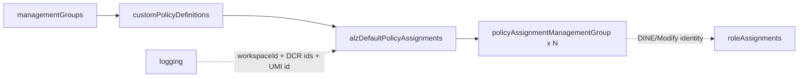
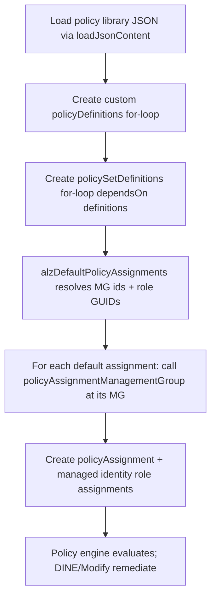

# Module: `policy` (custom definitions + default assignments)

| Field | Value |
|-------|-------|
| Repository | `Azure/ALZ-Bicep` |
| Flavor | Bicep |
| Entry files | `policy/definitions/customPolicyDefinitions.bicep` · `policy/assignments/alzDefaults/alzDefaultPolicyAssignments.bicep` · `policy/assignments/policyAssignmentManagementGroup.bicep` · `policy/exemptions/policyExemptions.bicep` |
| Scope | `targetScope = 'managementGroup'` (all) |
| Source URL | <https://github.com/Azure/ALZ-Bicep/tree/main/infra-as-code/bicep/modules/policy> |
| Mode | deep (source-verified) |
| Last reviewed | 2026-06-17 |

## Purpose

The governance heart of ALZ-Bicep: it (1) **creates** the ESLZ/ALZ custom policy + initiative definitions at
a management-group scope, then (2) **assigns** the curated ALZ "default" policy set across the management-group
hierarchy, wiring in the logging/monitoring resources so DINE/Modify policies are self-remediating.

- Two phases: **definitions** (`customPolicyDefinitions`) → **assignments** (`alzDefaultPolicyAssignments`),
  with a generic single-assignment helper (`policyAssignmentManagementGroup`) and an exemptions helper.
- Definitions are sourced from a JSON **policy library** under `policy/.../lib/`, refreshed by a daily GitHub
  Action (the repo's "Update Policy Library" workflow) — this is the same policy corpus as
  [Enterprise-Scale (E1)](../enterprise-scale-arm/_overview.md) / the
  [Azure-Landing-Zones-Library (G1)](../Azure-Landing-Zones-Library/_overview.md).
- Sits in the **platform / governance** layer; depends on `managementGroups` and (for parameter values) on
  `logging`.

## Phase 1 — `customPolicyDefinitions.bicep`

Creates every custom **policy definition** and **policy set (initiative) definition** at the target MG.

| Name | Type | Default | Description |
|------|------|---------|-------------|
| `parTargetManagementGroupId` | `string` | `'alz'` | MG to host the definitions (intermediate root) |
| `parTelemetryOptOut` | `bool` | `false` | Opt out of PID telemetry |

**Mechanism (data-driven loops):**

```bicep
var varTargetManagementGroupResourceId = tenantResourceId('Microsoft.Management/managementGroups', parTargetManagementGroupId)

var varCustomPolicyDefinitionsArray = [
  { name: 'Append-AppService-httpsonly', libDefinition: loadJsonContent('lib/policy_definitions/policy_definition_es_Append-AppService-httpsonly.json') }
  /* …~140 Append-/Audit-/Deny-/DenyAction-/Deploy-/Modify- definitions… */
]
resource resPolicyDefinitions 'Microsoft.Authorization/policyDefinitions@2025-01-01' = [for policy in varCustomPolicyDefinitionsArray: {
  name: policy.libDefinition.name
  properties: { …policy.libDefinition.properties… }
}]

resource resPolicySetDefinitions 'Microsoft.Authorization/policySetDefinitions@2025-01-01' = [for policySet in varCustomPolicySetDefinitionsArray: {
  dependsOn: [ resPolicyDefinitions ]   // sets must wait for definitions
  properties: { policyDefinitions: [for d in policySet.libSetChildDefinitions: { policyDefinitionId: d.definitionId, … }] }
}]
```

- `varCustomPolicySetDefinitionsArray` contains **~40 initiatives**, including the per-service
  `Enforce-Guardrails-*` set (KeyVault, Storage, SQL, Kubernetes, Network, AppServices, OpenAI, …),
  `Deploy-MDFC-Config`, `Deploy-Private-DNS-Zones`, `Deny-PublicPaaSEndpoints`, `Enforce-EncryptTransit`,
  `Enforce-Encryption-CMK`, `Enforce-ACSB`, `Enforce-Backup`, `Enforce-ALZ-Decomm`, `Enforce-ALZ-Sandbox`.
- Each initiative child reference mixes **built-in** ids (`/providers/Microsoft.Authorization/policyDefinitions/<guid>`)
  and **custom** ids (`${varTargetManagementGroupResourceId}/providers/Microsoft.Authorization/policyDefinitions/<name>`).
- The `lib/*` JSON and the `_policyDefinitionsBicepInput.txt` / `_policySetDefinitionsBicepInput.txt` arrays are
  **auto-generated daily** by a GitHub Action and pasted into the variable — so ALZ-Bicep stays current with the
  upstream policy library without hand-editing.

## Phase 2 — `alzDefaultPolicyAssignments.bicep`

Assigns the ALZ default policies/initiatives to each management group by **calling
`policyAssignmentManagementGroup.bicep` once per assignment**, each scoped to a specific MG.

**Selected inputs (themed):**

| Group | Inputs |
|-------|--------|
| Hierarchy | `parTopLevelManagementGroupPrefix`/`…Suffix`, `parPlatformMgAlzDefaultsEnable`, `parLandingZoneChildrenMgAlzDefaultsEnable`, `parLandingZoneMgConfidentialEnable`, `parManagementGroupIdOverrides` |
| Logging wiring | `parLogAnalyticsWorkspaceResourceId`, `parLogAnalyticsWorkSpaceAndAutomationAccountLocation`, `parLogAnalyticsWorkspaceResourceCategory` (`allLogs`), `parDataCollectionRule{VMInsights,ChangeTracking,MDFCSQL}ResourceId`, `parUserAssignedManagedIdentityResourceId` |
| Security/network | `parMsDefenderForCloudEmailSecurityContact`, `parDdosEnabled`, `parDdosProtectionPlanId`, `parPrivateDnsResourceGroupId`, `parPrivateDnsZonesLocation` |
| Toggles | `parDisableAlzDefaultPolicies`, `parPolicyAssignmentsToDisableEnforcement[]`, `parExcludedPolicyAssignments[]`, `parVmBackupExclusionTag*`, `parServiceHealthAlert*` |

**Key variables:**
- `varManagementGroupIds` — the resolved MG ids (`intRoot`, `platform`, `platformConnectivity`,
  `platformIdentity`, `landingZones`, `landingZonesCorp`/`…Online`/`…Confidential*`, `decommissioned`,
  `sandbox`), `union`-ed with `parManagementGroupIdOverrides` to allow renaming without changing intent.
- `varRbacRoleDefinitionIds` — a map of built-in role GUIDs (Owner, Contributor, Network Contributor, Log
  Analytics Contributor, …) used as the **policy managed-identity** role grants for DINE/Modify policies.
- Each assignment is a `var` of `{ definitionId, libDefinition: loadJsonContent('…/policy_assignment_es_*.tmpl.json') }`.

**Assignment-to-management-group mapping (verified):**

| Scope | Representative assignments |
|-------|----------------------------|
| Intermediate Root | `Deploy-MDFC-Config`, `Deploy-MDEndpoints(+AMA)`, `Deploy-AzActivityLog`, `Deploy-ASC/MCSB2-Monitoring`, `Deploy-Diag-Logs`, `Enforce-ACSB`, `Deploy-MDFC-OssDb/SqlAtp`, `Audit-LocationMatch/ZoneResiliency/UnusedResources/TrustedLaunch`, `Deny-UnmanagedDisk`, `Deny-Classic-Resources`, `Deploy-SvcHealth-BuiltIn` |
| Platform | `Deploy-GuestAttest`, `Deploy-VM/VMSS/vmArc-ChangeTrack`, `Deploy-vmHybr/VM/VMSS-Monitor`, `Deploy-MDFC-DefSQL-AMA`, `DenyAction-DeleteUAMIAMA`, `Enforce-Subnet-Private`, `Enforce-GR-KeyVault`, `Enforce-ASR`, `Enable-AUM-CheckUpdates` |
| Connectivity | `Enable-DDoS-VNET` (only if `parDdosProtectionPlanId` set) |
| Identity | `Deny-Public-IP`, `Deny-MgmtPorts-Internet`, `Deny-Subnet-Without-Nsg`, `Deploy-VM-Backup` |
| Landing Zones | ~25 incl. `Deny-IP-Forwarding`, `Enforce-AKS-HTTPS`, `Enforce-TLS-SSL`, `Deploy-AzSqlDb-Auditing`, `Deploy-SQL-Threat/TDE`, monitoring + change-tracking, `Audit-AppGW-WAF` |
| Corp / Confidential-Corp (`[for]` loop) | `Deny-Public-Endpoints`, `Deploy-Private-DNS-Zones`, `Deny-Public-IP-On-NIC`, `Deny-HybridNetworking`, `Audit-PeDnsZones` |
| Decommissioned | `Enforce-ALZ-Decomm` |
| Sandbox | `Enforce-ALZ-Sandbox` |

## `policyAssignmentManagementGroup.bicep` (the leaf helper)

A single, reusable assignment module: creates `Microsoft.Authorization/policyAssignments` at the given MG and
(for DINE/Modify) the policy managed identity's `roleAssignments`. Inputs include
`parPolicyAssignmentDefinitionId`, `parPolicyAssignmentParameters`, `parPolicyAssignmentParameterOverrides`,
`parPolicyAssignmentIdentityType`, `parPolicyAssignmentIdentityRoleDefinitionIds`,
`parPolicyAssignmentEnforcementMode`, `parPolicyAssignmentNotScopes`.

## Outputs

`customPolicyDefinitions` emits the created definition/set ids (consumed by assignments via the
`${mgResourceId}/providers/.../policyDefinitions/<name>` convention). `alzDefaultPolicyAssignments` primarily
produces side-effects (assignments + identity role assignments); per-assignment principal ids are emitted for
downstream remediation. `// TODO: verify` the exact output list of each leaf (not all read line-by-line).

## Resources Created

| Resource type | Where | Notes |
|---------------|-------|-------|
| `Microsoft.Authorization/policyDefinitions@2025-01-01` | target MG | `[for]` over the library array |
| `Microsoft.Authorization/policySetDefinitions@2025-01-01` | target MG | `[for]`, `dependsOn` definitions |
| `Microsoft.Authorization/policyAssignments` | each MG | one per default assignment (module call) |
| `Microsoft.Authorization/roleAssignments` | sub/MG | policy managed-identity grants for DINE/Modify |
| `Microsoft.Authorization/policyExemptions` | MG | via `policyExemptions.bicep` |
| `CRML/.../cuaIdManagementGroup.bicep` | MG | PID telemetry (+ a ZTN PID when zero-trust assignments active) |

## Dependencies

**Upstream:** `managementGroups` (target MG ids must exist); `logging` (workspace id + DCR ids + UMI id are
passed as assignment parameter overrides so monitoring DINE policies remediate to the right workspace).

**Downstream:** every workload subscription placed under the hierarchy inherits these assignments; remediation
tasks create resources (diagnostic settings, Private DNS links, Defender plans, backups, …).

## Module Dependency Diagram



## Deployment Flow



## Notes & Gotchas

- **Library is generated, not hand-written** — definitions come from `lib/*.json` refreshed daily; don't edit
  the big arrays by hand.
- **Enforcement kill-switches** — `parDisableAlzDefaultPolicies` flips *every* assignment to `DoNotEnforce`;
  `parPolicyAssignmentsToDisableEnforcement[]` does it per-assignment; `parExcludedPolicyAssignments[]` skips an
  assignment entirely (the module is wrapped in `if (!contains(parExcludedPolicyAssignments, …name))`).
- **MG id overrides** — `parManagementGroupIdOverrides` lets you rename ALZ default MGs while keeping the same
  policy intent/structure (the assignment scopes follow the override map).
- **Logging coupling** — DINE monitoring policies need `parLogAnalyticsWorkspaceResourceId` + the three DCR ids
  + the user-assigned identity id from the `logging` module; omitting them weakens self-remediation.
- **Corp uses a `[for]` loop** over `varCorpManagementGroupIdsFiltered` so Corp + Confidential-Corp get the same
  network-isolation assignments; the confidential entries are filtered out unless `parLandingZoneMgConfidentialEnable`.
- **`mc-` sovereign variants** — `mc-customPolicyDefinitions.bicep` / `mc-alzDefaultPolicyAssignments.bicep`
  carry the Microsoft Cloud for Sovereignty policy set.

## Open Questions

- [ ] `TODO: verify` the exact resource shape + outputs of `policyAssignmentManagementGroup.bicep` and `policyExemptions.bicep` (leaf helpers not read line-by-line).
- [ ] `TODO: verify` the `workloadSpecific/workloadSpecificPolicyAssignments.bicep` assignment set (separate entry, not covered here).
