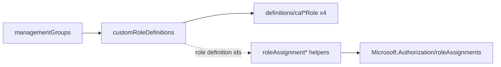
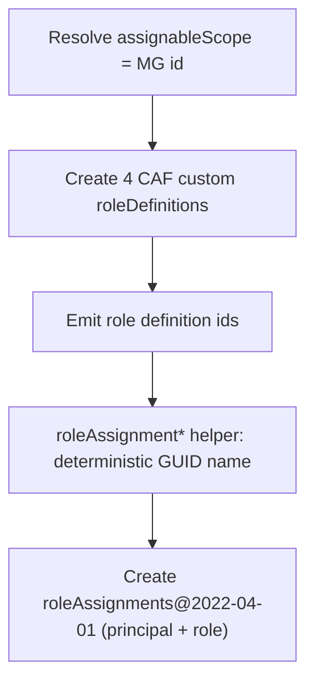

# Module: `customRoleDefinitions` + `roleAssignments` (RBAC)

| Field | Value |
|-------|-------|
| Repository | `Azure/ALZ-Bicep` |
| Flavor | Bicep |
| Entry files | `customRoleDefinitions/customRoleDefinitions.bicep` (+ `definitions/caf*Role.bicep`) · `roleAssignments/roleAssignment{ManagementGroup,Subscription,ResourceGroup}[Many].bicep` |
| Scope | `targetScope = 'managementGroup'` (subscription/RG variants differ) |
| Source URL | <https://github.com/Azure/ALZ-Bicep/tree/main/infra-as-code/bicep/modules/customRoleDefinitions> |
| Mode | deep (source-verified) |
| Last reviewed | 2026-06-17 |

## Purpose

Implements ALZ **RBAC**: creates the four CAF custom role definitions at a management group, and provides a
family of small helpers to assign any role to a management group, subscription, or resource group (single or
many).

- `customRoleDefinitions` = the **definitions** (what custom roles exist).
- `roleAssignments/*` = the **assignments** (who gets which role, where).
- Platform / identity-governance layer; pairs with `policy` (policy managed identities also get role
  assignments, but those are created inside the policy module).

## `customRoleDefinitions.bicep`

| Name | Type | Default | Description |
|------|------|---------|-------------|
| `parAssignableScopeManagementGroupId` | `string` | `'alz'` | MG id used as the role's `assignableScopes` |
| `parTelemetryOptOut` | `bool` | `false` | Opt out of PID telemetry |

It is an **orchestrator** that calls four definition sub-modules (each creates one
`Microsoft.Authorization/roleDefinitions`):

| Sub-module | Role | Output |
|------------|------|--------|
| `definitions/cafSubscriptionOwnerRole.bicep` | Subscription Owner (CAF) | `outRolesSubscriptionOwnerRoleId` |
| `definitions/cafApplicationOwnerRole.bicep` | Application Owner (CAF) | `outRolesApplicationOwnerRoleId` |
| `definitions/cafNetworkManagementRole.bicep` | Network Management (CAF) | `outRolesNetworkManagementRoleId` |
| `definitions/cafSecurityOperationsRole.bicep` | Security Operations (CAF) | `outRolesSecurityOperationsRoleId` |

Each sub-module sets `assignableScopes` to the management group and declares a curated `actions` /
`notActions` list. The four role-definition ids are emitted as outputs, ready to feed a `roleAssignment*` call.

> `mc-customRoleDefinitions.bicep` + `definitions/china/mc-*` are the **Microsoft Cloud for Sovereignty**
> variants.

## `roleAssignments/*` helpers

A small family, one per scope/cardinality. The canonical single-MG helper:

**`roleAssignmentManagementGroup.bicep`**

| Name | Type | Default | Description |
|------|------|---------|-------------|
| `parRoleDefinitionId` | `string` | — (required) | Role GUID (e.g. Reader `acdd72a7-…`) |
| `parAssigneeObjectId` | `string` | — (required) | Object id of group / SP / managed identity |
| `parAssigneePrincipalType` | `string` (`Group`\|`ServicePrincipal`) | — | Principal type |
| `parRoleAssignmentNameGuid` | `string` | `guid(managementGroup().name, parRoleDefinitionId, parAssigneeObjectId)` | Deterministic assignment name (idempotent) |
| `parRoleAssignmentCondition` / `…Version` | `string` | `''` / `'2.0'` | Optional ABAC condition |

```bicep
resource resRoleAssignment 'Microsoft.Authorization/roleAssignments@2022-04-01' = {
  name: parRoleAssignmentNameGuid
  properties: {
    roleDefinitionId: tenantResourceId('Microsoft.Authorization/roleDefinitions', parRoleDefinitionId)
    principalId: parAssigneeObjectId
    principalType: parAssigneePrincipalType
    condition: !empty(parRoleAssignmentCondition) ? parRoleAssignmentCondition : null
    conditionVersion: !empty(parRoleAssignmentCondition) ? parRoleAssignmentConditionVersion : null
  }
}
```

**The family (by scope/cardinality):**

| Module | Scope | Bulk input |
|--------|-------|-----------|
| `roleAssignmentManagementGroup` | `managementGroup` | single |
| `roleAssignmentManagementGroupMany` | `managementGroup` | `parManagementGroupIds[]` |
| `roleAssignmentSubscription` | `subscription` | single |
| `roleAssignmentSubscriptionMany` | `managementGroup` (loops subs) | `parSubscriptionIds[]` |
| `roleAssignmentResourceGroupMany` | `managementGroup` (loops RGs) | `parResourceGroupIds[]` (`subId/rgName`) |

## Outputs

`customRoleDefinitions` → the four role-definition ids (above). The `roleAssignment*` helpers are
side-effect modules (create the assignment); the `…Many` variants iterate with a `[for]` loop.

## Resources Created

| Resource type | Module | Notes |
|---------------|--------|-------|
| `Microsoft.Authorization/roleDefinitions` | `definitions/caf*Role.bicep` (×4) | custom roles, `assignableScopes` = the MG |
| `Microsoft.Authorization/roleAssignments@2022-04-01` | `roleAssignment*` | deterministic GUID name → idempotent |
| `CRML/.../cuaIdManagementGroup.bicep` | both | PID telemetry |

## Dependencies

**Upstream:** `managementGroups` (the MG that scopes the roles/assignments must exist).
**Downstream:** operators assign the custom role ids (from `customRoleDefinitions` outputs) to groups/SPs via
the `roleAssignment*` helpers; this is the human-access layer of the platform.

## Module Dependency Diagram



## Deployment Flow



## Notes & Gotchas

- **Idempotent assignment names** — the assignment name defaults to `guid(scope, roleDefId, principal)`, so
  re-deploys converge (no duplicate-assignment errors). Same pattern as the Terraform line's `uuidv5` names.
- **`tenantResourceId` for the role id** — role definitions are tenant-level resources, so the helper resolves
  `parRoleDefinitionId` via `tenantResourceId('Microsoft.Authorization/roleDefinitions', …)`.
- **Principal type matters** — must be `Group` or `ServicePrincipal`; using the right type avoids the
  "principal not found" race when assigning to a freshly-created identity.
- **ABAC conditions** — optional `parRoleAssignmentCondition` (+ version `2.0`) supports attribute-based
  conditions (e.g. constrain which role can be further assigned).
- **Definitions vs assignments are separate deployments** — create the roles first, then feed their output ids
  into the assignment helpers (operator-wired, like the rest of ALZ-Bicep).

## Open Questions

- [ ] `TODO: verify` the exact `actions`/`notActions`/`dataActions` of each `definitions/caf*Role.bicep` (the four leaf role files were not read line-by-line).
