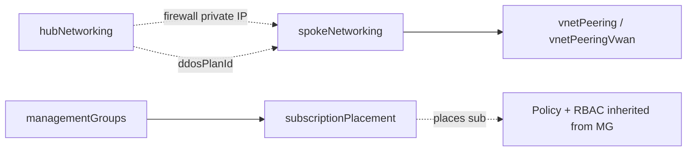
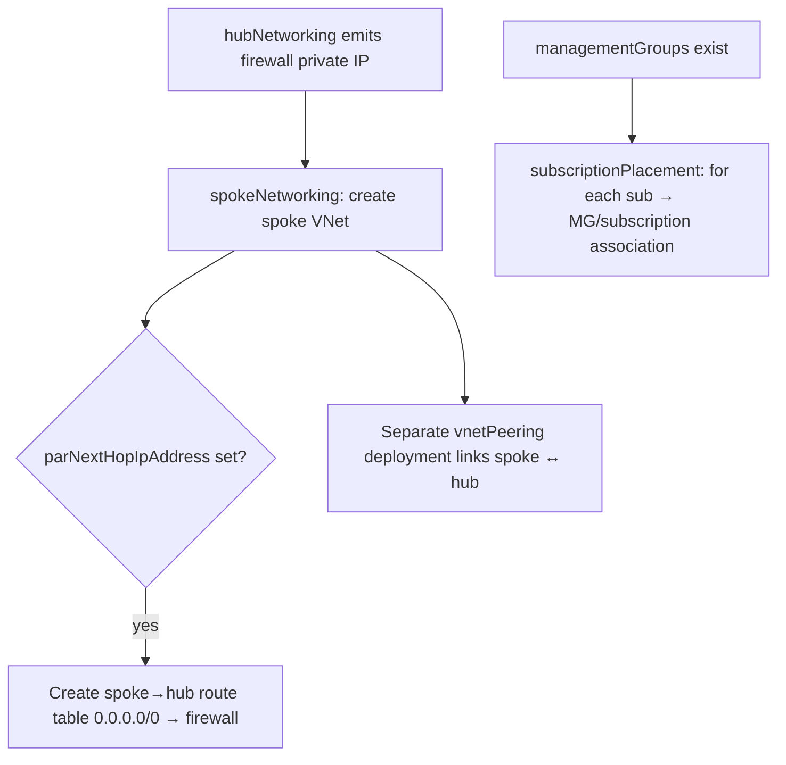

# Module: `spokeNetworking` + `subscriptionPlacement`

| Field | Value |
|-------|-------|
| Repository | `Azure/ALZ-Bicep` |
| Flavor | Bicep |
| Entry files | `spokeNetworking/spokeNetworking.bicep` (`resourceGroup`) · `subscriptionPlacement/subscriptionPlacement.bicep` (`managementGroup`) |
| Source URL | <https://github.com/Azure/ALZ-Bicep/tree/main/infra-as-code/bicep/modules/spokeNetworking> |
| Mode | deep (source-verified) |
| Last reviewed | 2026-06-17 |

## Purpose

Two small but pivotal landing-zone modules:

- **`spokeNetworking`** — creates a workload **spoke VNet** and the route table that forces its egress through
  the hub firewall (the spoke side of hub-and-spoke).
- **`subscriptionPlacement`** — **moves existing subscriptions** into a target management group (the glue that
  realises the archetype model: a subscription "becomes" a Corp/Online/etc. landing zone by its MG placement).

---

## `spokeNetworking.bicep`

`targetScope = 'resourceGroup'` (deployed into the landing-zone subscription).

### Inputs

| Name | Type | Default | Description |
|------|------|---------|-------------|
| `parLocation` | `string` | `resourceGroup().location` | Region |
| `parSpokeNetworkName` | `string` | `'vnet-spoke'` | Spoke VNet name |
| `parSpokeNetworkAddressPrefix` | `string` | `'10.11.0.0/16'` | Spoke address space |
| `parDdosProtectionPlanId` | `string` | `''` | DDoS plan id (from hub) — enables DDoS if set |
| `parDnsServerIps` | `array` | `[]` | Custom DNS servers |
| `parNextHopIpAddress` | `string` | `''` | **Hub firewall private IP** — enables the spoke→hub UDR if set |
| `parSpokeToHubRouteTableName` | `string` | `'rtb-spoke-to-hub'` | Route table name |
| `parDisableBgpRoutePropagation` | `bool` | `false` | BGP route propagation on the route table |
| `parGlobalResourceLock` / `parSpokeNetworkLock` / `parSpokeRouteTableLock` | `lockType` | `None` | Locks |

### Outputs

| Name | Type | Description |
|------|------|-------------|
| `outSpokeVirtualNetworkName` | `string` | Spoke VNet name |
| `outSpokeVirtualNetworkId` | `string` | Spoke VNet id — peering target |

### Resources Created

| Resource type | Symbolic | Condition |
|---------------|----------|-----------|
| `Microsoft.Network/virtualNetworks@2024-05-01` | `resSpokeVirtualNetwork` | always; DDoS-linked if `parDdosProtectionPlanId` set; DNS servers if provided |
| `Microsoft.Network/routeTables` | `resSpokeToHubRouteTable` | only if `parNextHopIpAddress` non-empty — `0.0.0.0/0 → VirtualAppliance @ next-hop` |
| `Microsoft.Authorization/locks` | `res*Lock` | per global/per-resource lock |

> **Note:** the spoke-to-hub **VNet peering** is *not* created here — it is a separate `vnetPeering` (classic)
> or `vnetPeeringVwan` (vWAN) deployment. `spokeNetworking` only creates the VNet + the firewall-default UDR.

---

## `subscriptionPlacement.bicep`

`targetScope = 'managementGroup'`.

### Inputs

| Name | Type | Default | Description |
|------|------|---------|-------------|
| `parSubscriptionIds` | `array` | `[]` | Subscription ids to move |
| `parTargetManagementGroupId` | `string` | — (required) | Destination MG (must already exist) |
| `parTelemetryOptOut` | `bool` | `false` | Opt out of PID telemetry |

### Resources Created

```bicep
resource resSubscriptionPlacement 'Microsoft.Management/managementGroups/subscriptions@2023-04-01' = [for subscriptionId in parSubscriptionIds: {
  scope: tenant()
  name: '${parTargetManagementGroupId}/${subscriptionId}'
}]
```

A `[for]` loop that creates a management-group↔subscription association per id, at `tenant()` scope. No
outputs (pure side-effect).

> **`subscriptionPlacement` does not create subscriptions** — it only places existing ones. Creating a
> subscription is the job of the separate [bicep-lz-vending (A2)](../bicep-lz-vending/_overview.md) repo.

## Dependencies

**`spokeNetworking` upstream:** `hubNetworking` / `vwanConnectivity` (provides `parNextHopIpAddress` = firewall
private IP, and `parDdosProtectionPlanId`). **Downstream:** `vnetPeering*` (peers the spoke to the hub).

**`subscriptionPlacement` upstream:** `managementGroups` (target MG must exist). **Downstream:** placed
subscriptions inherit the policy + RBAC assigned to their MG.

## Module Dependency Diagram



## Deployment Flow



## Notes & Gotchas

- **Spoke UDR is conditional** — without `parNextHopIpAddress` (the hub firewall IP) no route table is created,
  so the spoke would not force-tunnel; always wire the hub output in for the secure topology.
- **Peering is a separate step** — the modular design keeps VNet creation and peering apart; deploy
  `spokeNetworking` then `vnetPeering`/`vnetPeeringVwan`.
- **Placement realises the archetype model** — moving a subscription under (e.g.) `alz-landingzones-corp` is
  what applies the Corp policy/RBAC set; this is the Bicep equivalent of the Terraform line's
  subscription→archetype association.
- **Tenant-scope side-effect** — `subscriptionPlacement` writes at `tenant()` scope even though it's deployed
  at `managementGroup` scope (the association resource lives at tenant).

## Open Questions

- [ ] `TODO: verify` the `vnetPeering.bicep` / `vnetPeeringVwan.bicep` exact properties (sibling peering helpers, not deep-read here). **Also referenced by [vwanConnectivity](module-vwanConnectivity.md)** — same shared peering helpers.
