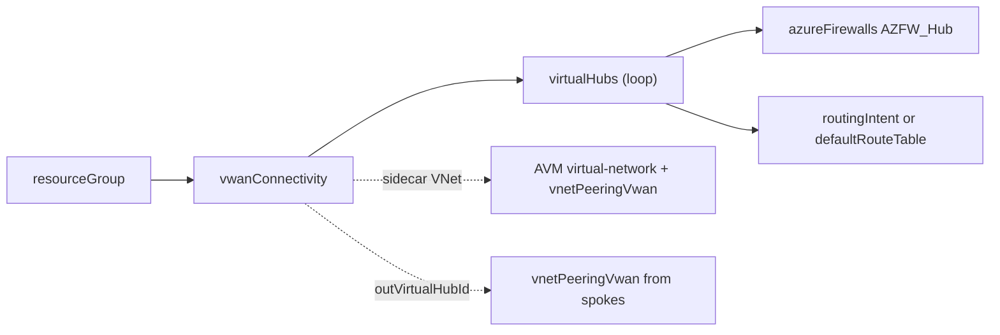
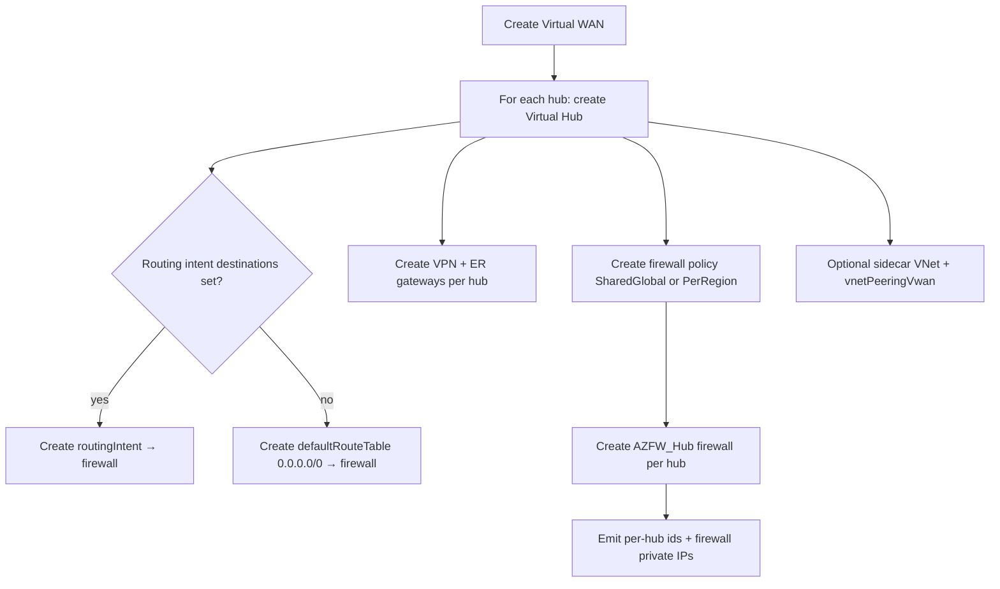

# Module: `vwanConnectivity`

| Field | Value |
|-------|-------|
| Repository | `Azure/ALZ-Bicep` |
| Flavor | Bicep |
| Entry file | `infra-as-code/bicep/modules/vwanConnectivity/vwanConnectivity.bicep` |
| Scope | `targetScope = 'resourceGroup'` (the Connectivity subscription) |
| Source URL | <https://github.com/Azure/ALZ-Bicep/blob/main/infra-as-code/bicep/modules/vwanConnectivity/vwanConnectivity.bicep> |
| Mode | deep (source-verified) |
| Last reviewed | 2026-06-17 |

## Purpose

The **Virtual WAN** connectivity option (the alternative to `hubNetworking`): a Virtual WAN with one or more
Virtual Hubs, each optionally hosting a hub Azure Firewall, VPN gateway, ExpressRoute gateway, routing
intent, and a sidecar VNet.

- "Option B" connectivity topology — Microsoft-managed hub routing instead of a self-managed Hub VNet.
- **Multi-hub by design** — `parVirtualWanHubs` is an array, so you can stamp regional hubs in one deploy.
- Connectivity layer; emits per-hub ids and firewall private IPs.

## Inputs (themed)

**Core:** `parLocation`, `parCompanyPrefix` (`'alz'`), `parVirtualHubEnabled` (`true`), `parVirtualWanName`,
`parVirtualWanType` (`'Standard'`), `parVirtualWanHubName`.

**The hubs array — `parVirtualWanHubs` (`virtualWanOptionsType[]`)** — one object per Virtual Hub:

| Field | Meaning |
|-------|---------|
| `parVpnGatewayEnabled` / `parExpressRouteGatewayEnabled` / `parAzFirewallEnabled` | per-hub feature switches |
| `parVirtualHubAddressPrefix` | hub CIDR (e.g. `10.100.0.0/23`) |
| `parHubLocation` | hub region |
| `parHubRoutingPreference` | `ASPath` / `VpnGateway` / `ExpressRoute` |
| `parVirtualRouterAutoScaleConfiguration` | hub capacity (2–50) |
| `parVirtualHubRoutingIntentDestinations` | `Internet` / `PrivateTraffic` (empty ⇒ no routing intent) |
| `parAzFirewall*` | per-hub firewall tier / intel mode / DNS proxy / zones |
| `parSidecarVirtualNetwork` | optional shared-services VNet peered to the hub |

**Firewall-policy style:** `parAzFirewallPolicyDeploymentStyle` (`SharedGlobal` ⇒ one policy, or `PerRegion` ⇒
one per hub). **DDoS / Private DNS:** `parDdosEnabled`, `parPrivateDnsZonesEnabled`,
`parVirtualNetworkResourceIdsToLinkTo`. **Locks/telemetry:** `parGlobalResourceLock`, `parTags`,
`parTelemetryOptOut`.

## Outputs

| Name | Type | Description / Downstream use |
|------|------|------------------------------|
| `outVirtualWanName` / `outVirtualWanId` | `string` | The Virtual WAN |
| `outVirtualHubName` / `outVirtualHubId` | `array` | Per-hub name/id objects |
| `outAzFwPrivateIps` | `array` | Per-hub firewall private IPs (`{ '<hub>': <ip> }`) |
| `outDdosPlanResourceId` | `string` | DDoS plan id |
| `outPrivateDnsZones` / `…Names` | `array` | Private DNS zones (AVM) |

## Resources Created

| Resource type | Symbolic | Notes |
|---------------|----------|-------|
| `Microsoft.Network/virtualWans@2024-05-01` | `resVwan` | branch-to-branch + vnet-to-vnet enabled |
| `Microsoft.Network/virtualHubs` (loop) | `resVhub` | one per `parVirtualWanHubs` |
| `Microsoft.Network/virtualHubs/hubRouteTables` (loop) | `resVhubRouteTable` | `defaultRouteTable → firewall` — **only when routing intent is empty** |
| `Microsoft.Network/virtualHubs/routingIntent` (loop) | `resVhubRoutingIntent` | when `parVirtualHubRoutingIntentDestinations` set |
| `Microsoft.Network/vpnGateways` (loop) | `resVpnGateway` | per hub if enabled, ASN `65515` |
| `Microsoft.Network/expressRouteGateways` (loop) | `resErGateway` | per hub if enabled |
| `Microsoft.Network/firewallPolicies` | `resFirewallPolicies[ ]` (PerRegion) / `resFirewallPoliciesSharedGlobal` | per deployment style |
| `Microsoft.Network/azureFirewalls` (loop) | `resAzureFirewall` | `AZFW_Hub` sku, attached to hub |
| `br/public:avm/res/network/virtual-network:0.7.0` (loop) | `modSidecarVirtualNetwork` | optional sidecar VNet |
| `../vnetPeeringVwan/vnetPeeringVwan.bicep` (loop) | `modVnetPeeringVwan` | peers sidecar VNet → hub (scope: `subscription()`) |
| `Microsoft.Network/ddosProtectionPlans` | `resDdosProtectionPlan` | if `parDdosEnabled` |
| `br/public:avm/ptn/network/private-link-private-dns-zones:0.7.0` | `modPrivateDnsZonesAVM` | linked to spokes (not the hub) |

## Dependencies

**Upstream:** a Connectivity RG; AVM `virtual-network` + `private-link-private-dns-zones` modules; the
`vnetPeeringVwan` submodule.

**Downstream:** spoke VNets connect to a hub via **`vnetPeeringVwan`** (a hub connection, not classic
peering); workloads route through the hub firewall via routing intent.

## Module Dependency Diagram

## Deployment Flow

## Notes & Gotchas

- **Routing intent xor default route table** — a hub uses **routing intent** when
  `parVirtualHubRoutingIntentDestinations` is non-empty, otherwise a **default route table** pointing at the
  hub firewall. They're mutually exclusive per hub (the same pattern A2 `bicep-lz-vending`'s
  `vHubRoutingIntentEnabled` gate reflects).
- **Firewall policy: shared vs per-region** — `SharedGlobal` makes one policy (named after hub[0]'s region);
  `PerRegion` makes one policy per hub. The firewall references whichever applies.
- **Sidecar VNet** — an optional shared-services VNet (AVM `virtual-network`) peered to the hub via
  `vnetPeeringVwan` at `subscription()` scope — handy for resources that can't live in a managed hub.
- **DDoS caveat** — the DDoS plan is created but **cannot attach to the Virtual WAN hub** today (Azure
  limitation); it's linked to spoke VNets via policy instead.
- **Private DNS linked to spokes, not the hub** — vWAN hubs can't host Private DNS links, so the AVM module
  links zones to the supplied spoke VNet ids.
- **ZTN PID** — fires when DDoS + all-hub firewalls + any `Premium` tier.

## Open Questions

- [ ] `TODO: verify` the exact `vnetPeeringVwan.bicep` resource (the spoke-to-hub vWAN connection) — a shared leaf peering helper. **Same open item as [spokeNetworking's `vnetPeering` / `vnetPeeringVwan` TODO](module-spokeNetworking-subscriptionPlacement.md)** (the helper is referenced from both the vWAN-connectivity and spoke-networking modules; neither was deep-read).
