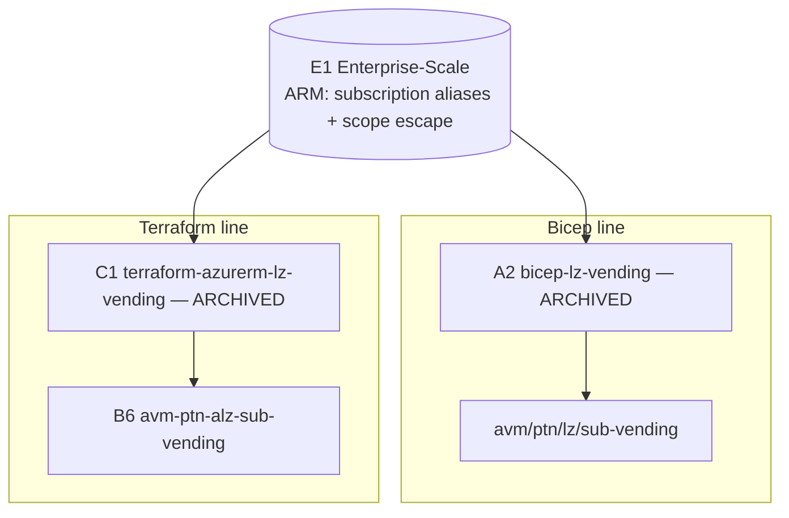
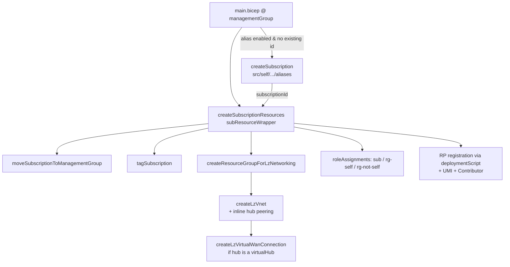

# Repository Overview: `Azure/bicep-lz-vending`

| Field | Value |
|-------|-------|
| Repository | `Azure/bicep-lz-vending` (catalog A2) |
| Registry | Bicep public registry `br/public:lz/sub-vending` → now **`br/public:avm/ptn/lz/sub-vending`** |
| Flavor | Bicep — subscription-vending orchestration (Bicep 93.9%) |
| Role | The **Bicep subscription-vending implementation** — create a subscription + baseline at a `managementGroup` deployment |
| Status | ⚠️ **ARCHIVED (Jun 2, 2026)** — moved to the AVM Bicep registry as `avm/ptn/lz/sub-vending` (v1.5.2 → AVM **0.1.0**) |
| Deploy scope | `targetScope = 'managementGroup'` (`az deployment mg create` / `New-AzManagementGroupDeployment`) |
| Building blocks | **CARML v0.6.0** modules (`src/carml/v0.6.0`) + local `src/self` orchestration |
| Latest | v1.5.1 (Nov 2023) |
| Source URL | <https://github.com/Azure/bicep-lz-vending> |
| Mode | deep (source-verified: `main.bicep` + `subResourceWrapper/deploy.bicep`) |
| Last reviewed | 2026-06-17 |

## Purpose

The **Bicep** sibling of C1 `terraform-azurerm-lz-vending`: instantiated once per landing zone to create an
Azure subscription (or adopt an existing one), place it under a management group, and deploy its baseline —
**a Virtual Network** (+ hub-spoke peering **or** vWAN Virtual Hub connection, DDoS-plan link, custom DNS),
**role assignments**, **subscription tags**, and **resource-provider (+ feature) registration**. Deployed at
`managementGroup` scope so it can both create the subscription (tenant-routed) and target it.

> **Archived → AVM.** Going-forward work lives in the Bicep public registry as
> **`br/public:avm/ptn/lz/sub-vending`** (this repo's v1.5.2 became AVM **0.1.0**; `disableTelemetry` became
> `enableTelemetry`). So the Bicep vending lineage mirrors Terraform's: **A2 (archived) → AVM Bicep ptn**,
> exactly as **C1 (archived) → B6 AVM Terraform ptn**. This resolves C1's open `TODO: verify` on A2 parity.

## The vending family (cross-language, now all AVM)



## Repository structure

```text
bicep-lz-vending/
├── main.bicep                    # ★ orchestration (targetScope = managementGroup)
├── main.bicep.parameters.md      # PSDocs-generated parameter reference
├── src/
│   ├── self/                     # local orchestration modules
│   │   ├── Microsoft.Subscription/aliases/deploy.bicep      # create subscription alias
│   │   ├── Microsoft.Management/managementGroups/subscriptions/deploy.bicep  # MG placement
│   │   └── subResourceWrapper/deploy.bicep                  # ★ sub-orchestration (all LZ resources)
│   ├── carml/v0.6.0/             # CARML building blocks (pre-AVM res modules)
│   │   ├── Microsoft.Network/virtualNetworks · .../virtualHubs/hubVirtualNetworkConnections
│   │   ├── Microsoft.Authorization/roleAssignments
│   │   ├── Microsoft.Resources/{resourceGroups,tags,deploymentScripts}
│   │   └── Microsoft.ManagedIdentity/userAssignedIdentity
│   └── scripts/                  # Invoke-RegisterSubscriptionResourceProviders.ps1
├── tests/ · docs/wiki/
```

## Capabilities (toggle-driven, single VNet)

- **Subscription creation + MG placement** — `subscriptionAliasEnabled` (new) **or** `existingSubscriptionId`
  (adopt); MG move via `subscriptionManagementGroupAssociationEnabled` + `…GroupId`.
- **Networking (one VNet)** — `virtualNetworkEnabled` + a single VNet (`virtualNetworkName`,
  `…AddressSpace`); optional **hub-spoke peering** *or* **vWAN Virtual Hub connection** (auto-detected),
  routing-intent aware, DDoS-plan link, custom DNS servers.
- **Role assignments** — `roleAssignmentEnabled` + `roleAssignments[]` (subscription or RG scope).
- **Subscription tags**.
- **Resource provider + feature registration** — via a **deployment script** (see below).
- **MCA cross-tenant** subscription creation (accept-ownership flow) — a Bicep-specific capability.



## Key parameters (`main.bicep`)

| Parameter | Meaning |
|-----------|---------|
| `subscriptionAliasEnabled` (true) | Create a new subscription via alias. |
| `subscriptionAliasName` / `subscriptionDisplayName` / `subscriptionBillingScope` / `subscriptionWorkload` | Alias details (EA/MCA/MPA billing scope; `Production`/`DevTest`). |
| `existingSubscriptionId` | Adopt an existing subscription instead of creating one. |
| `subscriptionTenantId` / `subscriptionOwnerId` | **MCA cross-tenant** create (accept-ownership). |
| `subscriptionManagementGroupAssociationEnabled` / `subscriptionManagementGroupId` | Place the subscription under a MG. |
| `subscriptionTags` | Tags appended to the subscription. |
| `virtualNetworkEnabled` + `virtualNetworkName` / `…ResourceGroupName` / `…Location` / `…AddressSpace` | Create one VNet (+ its RG + lock). |
| `virtualNetworkPeeringEnabled` + `hubNetworkResourceId` | Peer to a hub VNet **or** connect to a vWAN Virtual Hub (auto-detected by resource type in the id). |
| `virtualNetworkUseRemoteGateways` / `virtualNetworkVwan*` / `vHubRoutingIntentEnabled` | Peering/vWAN routing options. |
| `virtualNetworkDnsServers` / `virtualNetworkDdosPlanId` | Custom DNS / link existing DDoS plan. |
| `roleAssignmentEnabled` + `roleAssignments[]` | RBAC (principalId + definition + relativeScope). |
| `resourceProviders` (object) | RP namespace → features map (large default list). |
| `disableTelemetry` | Opt out of PID telemetry (AVM renamed this to `enableTelemetry`). |

## Outputs

`subscriptionId`, `subscriptionResourceId`, `subscriptionAcceptOwnershipState` / `…Url` (MCA cross-tenant
only), `failedResourceProviders`, `failedResourceProvidersFeatures`.

## Resources Created

Subscription alias + MG association; a Resource Group + Virtual Network (+ optional hub peering / vWAN hub
connection); subscription tags; role assignments (sub/RG); a deployment-script RG + user-assigned identity +
its Contributor role assignment + the RP-registration deployment script; one telemetry ARM deployment.

## Dependencies

**Upstream:** **CARML v0.6.0** building-block modules; the platform inputs (target MG, hub VNet/vWAN hub id,
DDoS plan). **Downstream:** the vended subscription hosts workloads. **Successor:** the AVM Bicep ptn module
`avm/ptn/lz/sub-vending`. **Terraform peer:** **C1 `lz-vending`** (→ B6).

## Notes & Gotchas

- **Archived → use `br/public:avm/ptn/lz/sub-vending`.** Existing pins keep working.
- **`managementGroup` deployment scope** — the orchestration must run at MG scope so it can create the
  subscription (routed to the tenant) and then deploy into it; the deployment-target MG ≠ the subscription's
  destination MG (`subscriptionManagementGroupId`).
- **RP registration uses a deployment script** (`Microsoft.Resources/deploymentScripts`, AzurePowerShell,
  `Invoke-RegisterSubscriptionResourceProviders.ps1`) with a purpose-built **UMI** (granted `Contributor`) —
  because ARM/Bicep can't register resource providers declaratively (this is the biggest A2-vs-C1 difference;
  C1/Terraform does it with azapi natively).
- **One VNet, not a map** — A2 vends a single VNet; C1 (and B6) take a `map` of VNets + extras (budgets, LZ
  UMI, NSGs, route tables, mesh peering, IPAM). A2 is the **leaner/older** feature set.
- **Hub auto-detection** — a single `hubNetworkResourceId` drives either VNet **peering** (`/virtualNetworks/`)
  or a vWAN **hub connection** (`/virtualHubs/`), decided by the resource type in the id.
- **MCA cross-tenant** create (accept-ownership) is an A2 capability surfaced via the `subscriptionAcceptOwnership*`
  outputs.
- **CARML** is the predecessor of AVM **res** modules — same "one module per resource type" idea, pre-AVM naming.

## Open Questions

- [ ] `TODO: verify` the `Invoke-RegisterSubscriptionResourceProviders.ps1` retry/idempotency behavior (it returns `failedProvidersRegistrations` / `failedFeaturesRegistrations` outputs).
- [ ] `TODO: verify` the exact feature parity of the AVM Bicep successor `avm/ptn/lz/sub-vending` (likely adds budgets/UMI to match B6) — out of scope for this archived repo. **Cross-ref:** the Terraform AVM peer [B6 `avm-ptn-alz-sub-vending`](../avm-ptn-alz-sub-vending/_overview.md) already includes budgets + UMI + federated credentials, so the Bicep successor is expected to reach the same parity.
