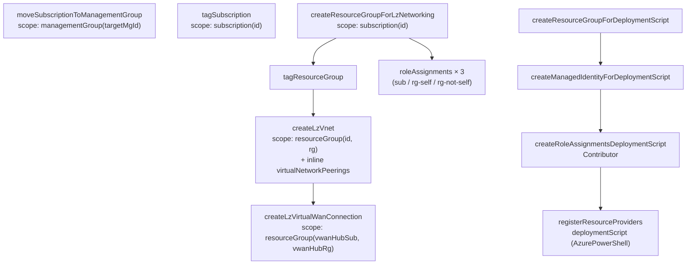
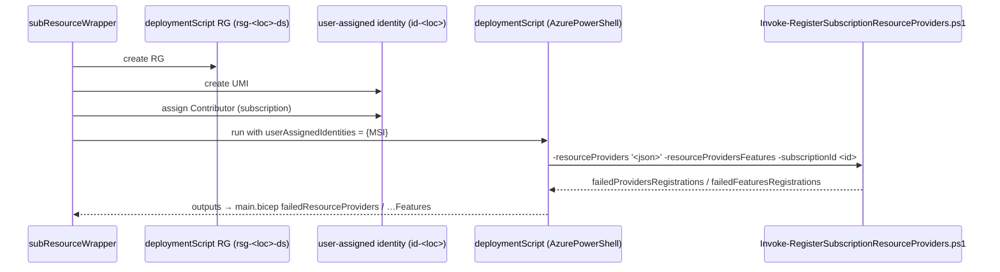

# Module: `main.bicep` + `subResourceWrapper` — Bicep vending orchestration

| Field | Value |
|-------|-------|
| Repository | `Azure/bicep-lz-vending` |
| Entry | `main.bicep` (orchestration) → `src/self/subResourceWrapper/deploy.bicep` (sub-orchestration) |
| Deploy scope | `targetScope = 'managementGroup'` |
| Source URL | <https://github.com/Azure/bicep-lz-vending/blob/main/main.bicep> |
| Mode | deep (source-verified) |
| Last reviewed | 2026-06-17 |

## Purpose

How the two-tier Bicep orchestration vends a subscription and its baseline. `main.bicep` is the thin
**orchestration** module a consumer deploys at MG scope; it creates the subscription, then hands off to the
**`subResourceWrapper`** sub-orchestration which deploys every in-subscription resource via CARML modules.

## Tier 1 — `main.bicep`

```bicep
targetScope = 'managementGroup'

module createSubscription 'src/self/Microsoft.Subscription/aliases/deploy.bicep' =
  if (subscriptionAliasEnabled && empty(existingSubscriptionId)) {
    scope: managementGroup()
    params: { subscriptionBillingScope, subscriptionAliasName, subscriptionDisplayName,
              subscriptionWorkload, subscriptionTenantId, subscriptionOwnerId }
  }

module createSubscriptionResources 'src/self/subResourceWrapper/deploy.bicep' =
  if (subscriptionAliasEnabled || !empty(existingSubscriptionId)) {
    params: {
      subscriptionId: (subscriptionAliasEnabled && empty(existingSubscriptionId))
                      ? createSubscription.outputs.subscriptionId : existingSubscriptionId
      /* …all wrapper params… */
    }
  }
```

- The `subscriptionId` is computed once (created **xor** adopted) and threaded into the wrapper — the same
  create-or-adopt pattern as C1's `coalesce`.
- A `pid-<cuaPid>` telemetry deployment (`cuaPid = 10d75183-0090-47b2-9c1b-48e3a4a36786`) runs unless
  `disableTelemetry`.
- MCA cross-tenant outputs (`subscriptionAcceptOwnershipState` / `…Url`) are surfaced only when
  `subscriptionTenantId` + `subscriptionOwnerId` are supplied.

## Tier 2 — `subResourceWrapper/deploy.bicep` (the CARML pipeline)

Also `targetScope = 'managementGroup'`. It calls CARML v0.6.0 modules, each scoped to where its resource
lives, with `dependsOn` chaining the order:



| Module | CARML path | Scope | Condition |
|--------|------------|-------|-----------|
| `moveSubscriptionToManagementGroup` | `src/self/Microsoft.Management/managementGroups/subscriptions` | `managementGroup(targetMgId)` | mg-assoc enabled + id set |
| `tagSubscription` | `carml/.../Microsoft.Resources/tags` | `subscription(id)` | tags non-empty |
| `createResourceGroupForLzNetworking` | `carml/.../resourceGroups` | `subscription(id)` | vnet enabled |
| `createLzVnet` | `carml/.../Microsoft.Network/virtualNetworks` | `resourceGroup(id, rg)` | vnet enabled + name/space/loc set |
| `createLzVirtualWanConnection` | `carml/.../virtualHubs/hubVirtualNetworkConnections` | `resourceGroup(vwanHubSub, vwanHubRg)` | hub id is a `/virtualHubs/` |
| `createLzRoleAssignmentsSub` / `…RsgsSelf` / `…RsgsNotSelf` | `carml/.../roleAssignments` | sub / rg | role-assignment enabled |
| `createResourceGroupForDeploymentScript` / `…ManagedIdentity` / `createRoleAssignmentsDeploymentScript` | carml RGs / UMI / roleAssignments | subscription / rg | RPs non-empty |
| `registerResourceProviders` | `carml/.../Microsoft.Resources/deploymentScripts` | `resourceGroup(id, dsRg)` | RPs non-empty |

## Hub auto-detection (one param, two paths)

```bicep
var virtualHubResourceIdChecked        = contains(hubNetworkResourceId, '/providers/Microsoft.Network/virtualHubs/')    ? hubNetworkResourceId : ''
var hubVirtualNetworkResourceIdChecked = contains(hubNetworkResourceId, '/providers/Microsoft.Network/virtualNetworks/') ? hubNetworkResourceId : ''
```

- If the hub id is a **VNet** → `createLzVnet` adds an inline `virtualNetworkPeerings[]` (bi-directional,
  `useRemoteGateways` from param).
- If the hub id is a **vWAN Virtual Hub** → `createLzVirtualWanConnection` creates a hub connection, with
  `routingConfiguration` (associated + propagated route tables / labels) **only when routing intent is
  disabled** (`!vHubRoutingIntentEnabled ? {…} : {}`).

## Role-assignment scope splitting (source-verified)

The wrapper filters the flat `roleAssignments[]` into three buckets by `relativeScope`, then loops each:

```bicep
var roleAssignmentsSubscription      = filter(roleAssignments, a => !contains(a.relativeScope, '/resourceGroups/'))
var roleAssignmentsResourceGroups    = filter(roleAssignments, a =>  contains(a.relativeScope, '/resourceGroups/'))
var roleAssignmentsResourceGroupSelf = filter(roleAssignmentsResourceGroups, a => contains(a.relativeScope, '/resourceGroups/${virtualNetworkResourceGroupName}'))
var roleAssignmentsResourceGroupNotSelf = filter(roleAssignmentsResourceGroups, a => !contains(a.relativeScope, '/resourceGroups/${virtualNetworkResourceGroupName}'))
```

`…Self` (the vnet RG, created in this run) gets a `dependsOn` so the RG exists first; `…NotSelf` assumes a
pre-existing RG.

## Resource-provider registration (the Bicep-specific mechanism)

ARM/Bicep cannot declaratively register resource providers, so A2 runs a **deployment script**:



- `kind: 'AzurePowerShell'`, `runOnce: true`, `cleanupPreference: 'Always'`, `retentionInterval: 'P1D'`.
- The script is embedded via `loadTextContent('../../scripts/Invoke-RegisterSubscriptionResourceProviders.ps1')`.

## Inputs / Outputs

See [_overview.md](./_overview.md). Pivotal: in = `subscription_*`, `virtualNetwork*`, `roleAssignments`,
`resourceProviders`; out = `subscriptionId`, `subscriptionResourceId`, `failedResourceProviders(.Features)`,
MCA accept-ownership.

## Resources Created

Subscription alias + MG move; RG + VNet (+ peering/vWAN connection); subscription tags; role assignments;
deployment-script RG + UMI + Contributor + deployment script; telemetry deployment.

## Dependencies

**Upstream:** CARML v0.6.0; platform inputs. **Downstream:** workloads in the vended subscription. **Successor:**
`avm/ptn/lz/sub-vending`. **Peer:** C1 `lz-vending`.

## Notes & Gotchas

- **Two-tier, MG-scoped** — `main.bicep` (create sub) → `subResourceWrapper` (deploy into sub); both at MG scope.
- **Deployment script = the RP-registration workaround** — needs a UMI + Contributor; this whole sub-pipeline
  exists only because Bicep can't register RPs natively (Terraform's azapi can, so C1 has no script).
- **`take(...,64)`** wraps every deployment name (ARM 64-char limit) with a `uniqueString` hash.
- **vWAN connection lives in the hub's RG/subscription** (`resourceGroup(vwanHubSub, vwanHubRg)`), not the LZ —
  cross-subscription module scoping.
- **Routing-intent gate** — when `vHubRoutingIntentEnabled`, the connection omits `routingConfiguration` (the
  hub's routing intent governs routes instead).

## Open Questions

- [ ] `TODO: verify` the CARML `virtualNetworks` module's subnet handling (A2's `main.bicep` exposes address space + DNS + DDoS but the subnet shape wasn't read line-by-line).
- [ ] `TODO: verify` the `aliases/deploy.bicep` MCA accept-ownership outputs path (surfaced but submodule not read in full).
