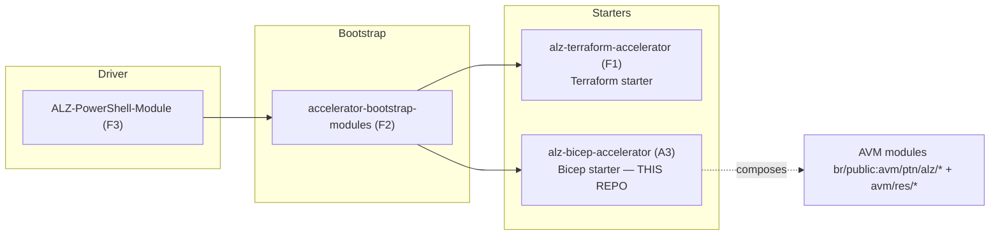
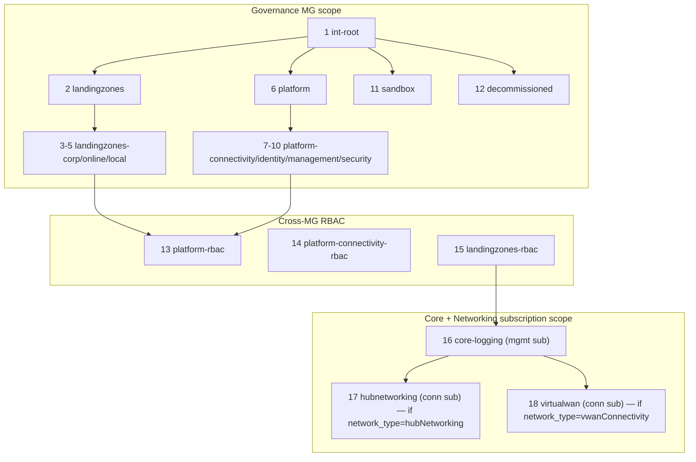

# Azure/alz-bicep-accelerator — Repository Overview

| Field | Value |
|-------|-------|
| Repository | `Azure/alz-bicep-accelerator` |
| Display title | **Bicep Azure Verified Modules for Platform Landing Zone (ALZ)** |
| Catalog id | A3 |
| Flavor | Bicep (94.6%) + PowerShell (5.4%) · CI/CD |
| Role | The **AVM Bicep starter module** for the ALZ Accelerator — the modern successor that replaced ALZ-Bicep Classic |
| License | MIT · Latest release v2.2.0 (May 2026) |
| Docs | `aka.ms/alz/acc/bicep` |
| Source URL | <https://github.com/Azure/alz-bicep-accelerator> |
| Mode | deep (source-verified) |
| Last reviewed | 2026-06-17 |

## Purpose

> **Catalog correction:** the catalog describes A3 as a wrapper that "consumes ALZ-Bicep modules". That is
> **outdated**. A3 does **not** consume classic [ALZ-Bicep (A1)](../ALZ-Bicep/_overview.md); it composes
> **Azure Verified Modules** (`br/public:avm/...`). A3 is the **AVM Bicep starter** that *replaced* ALZ-Bicep
> Classic as the default Bicep starter in the Accelerator (the deprecation A1's overview notes).

A3 is the **Bicep starter module** consumed by the [ALZ-PowerShell-Module (F3)](../ALZ-PowerShell-Module/_overview.md)
driver. It ships:

- a `.config/ALZ-Powershell.config.json` **contract** the F3 driver reads (the same mechanism as
  [accelerator-bootstrap-modules (F2)](../accelerator-bootstrap-modules/_overview.md)),
- a `templates/` tree of **AVM-composing Bicep modules** (governance, logging, networking), parameterised via
  `.bicepparam` files the driver tokenises,
- an **ordered deployment manifest** (18 deployments) the driver executes via **deployment stacks**.

It is the **Bicep analogue of [alz-terraform-accelerator (F1)](../alz-terraform-accelerator/_overview.md)** —
both are `platform_landing_zone` starter modules, seeded by F2 bootstrap and driven by F3.



## How it fits the accelerator (the F-line)

| Repo | Role | Relationship to A3 |
|------|------|--------------------|
| [F3 ALZ-PowerShell-Module](../ALZ-PowerShell-Module/_overview.md) | driver | reads A3's `.config`, runs the 18-deployment manifest |
| [F2 accelerator-bootstrap-modules](../accelerator-bootstrap-modules/_overview.md) | bootstrap | stands up VCS + backend, seeds A3 as the starter |
| [F1 alz-terraform-accelerator](../alz-terraform-accelerator/_overview.md) | Terraform starter | **the Terraform sibling of A3** (same `platform_landing_zone` role) |
| [A1 ALZ-Bicep](../ALZ-Bicep/_overview.md) | Bicep Classic | the **predecessor A3 replaced** in the Accelerator |
| [A2 bicep-lz-vending](../bicep-lz-vending/_overview.md) | Bicep vending | subscription vending (separate; A3 places, not creates, subs) |

## Repository structure

```
alz-bicep-accelerator/
├── .config/
│   └── ALZ-Powershell.config.json   # ← the F3 driver contract (inputs + 18-deploy manifest + groups)
├── templates/                       # ← retained on deploy (the starter modules)
│   ├── core/
│   │   ├── alzCoreType.bicep        # shared user-defined type (alzCoreType) for governance config
│   │   ├── governance/mgmt-groups/  # per-MG modules → avm/ptn/alz/empty
│   │   │   ├── int-root/            #   main.bicep (+ main.bicepparam)
│   │   │   ├── landingzones/        #   + landingzones-{corp,online,local}/
│   │   │   ├── platform/            #   + platform-{connectivity,identity,management,security}/
│   │   │   ├── sandbox/  decommissioned/
│   │   │   ├── <mg>/main-rbac.bicep #   cross-MG RBAC (deployment-stack workaround)
│   │   │   └── lib/alz/*.alz_*.json #   VENDORED ALZ Library (G1) policy/role/assignment data
│   │   └── logging/main.bicep       # AVM res (RG + LAW + AA) + avm/ptn/alz/ama
│   └── networking/
│       ├── hubnetworking/main.bicep # AVM res/network/* hub composition (+ DNS Private Resolver)
│       └── virtualwan/main.bicep    # vWAN variant
├── examples/                        # example .bicepparam sets (removed on deploy)
├── tests/templates/                 # e2e test templates (mgmt-group + resource-group)
└── bicepconfig.json                 # retained on deploy
```

## The deployment manifest (18 ordered deployments)

`.config/ALZ-Powershell.config.json → starter_modules.platform_landing_zone.deployment_files` — the F3 driver
runs these in `order`, each a `.bicep` + `.bicepparam`, at `managementGroup` or `subscription` scope:



- Deployments **17 and 18 are mutually exclusive** — the driver runs the one matching the `network_type`
  input (`hubNetworking` xor `vwanConnectivity`).
- **Cross-MG RBAC (13–15) is a separate phase** because **Azure deployment stacks do not support cross-management-group
  role assignments**; the policy managed identities created in one MG are granted roles in another by these
  dedicated `main-rbac.bicep` deployments.
- `deployment_file_groups` collapses the 18 into 10 UI groups (governance-int-root, -landingzones,
  -landingzones-children, -platform, -platform-children, -sandbox, -decommissioned, -rbac, core, networking).

## How A3 composes AVM (the three layers)

| Layer | Module | Composes |
|-------|--------|----------|
| Governance | `templates/core/governance/mgmt-groups/<mg>/main.bicep` | **`br/public:avm/ptn/alz/empty`** — one MG + its policy/initiative/role payload (loaded from the vendored ALZ Library + customer additions) |
| Management | `templates/core/logging/main.bicep` | `avm/res/resources/resource-group`, `avm/res/operational-insights/workspace`, `avm/res/automation/automation-account`, **`avm/ptn/alz/ama`** |
| Connectivity | `templates/networking/hubnetworking/main.bicep` | `avm/res/network/{virtual-network,azure-firewall,firewall-policy,bastion-host,network-security-group,route-table,ddos-protection-plan,virtual-network-gateway,dns-resolver}`, `avm/ptn/network/private-link-private-dns-zones` |

This is the key difference from A1 (Classic): A1 hand-wrote the Azure resources; **A3 delegates to AVM** —
governance to the `avm/ptn/alz/*` pattern modules (the Bicep equivalent of the Terraform
[avm-ptn-alz (B1)](../avm-ptn-alz/_overview.md) family), networking to `avm/res/network/*` resource modules.

## Notes & gotchas

- **Starter, not a library** — you don't `import` A3; the F3 driver copies `templates/` into the customer's
  repo, tokenises the `.bicepparam` files from config inputs, and deploys.
- **Two starter configs** — `platform_landing_zone` (the real one) and `test` (e2e: a management-group + four
  resource-group probe deployments with `{{unique_postfix}}` templating).
- **AVM telemetry** — modules use `enableTelemetry` (AVM convention), not Classic's `parTelemetryOptOut`.
- **Vendored ALZ Library** — `templates/core/governance/.../lib/alz/*.alz_*.json` is a copy of the
  [Azure-Landing-Zones-Library (G1)](../Azure-Landing-Zones-Library/_overview.md) policy/role corpus, so the
  Bicep starter ships the same policy set as the Terraform line.

## Open Questions

- [ ] `TODO: verify` whether the F3 driver deploys via `New-AzManagementGroupDeploymentStack` / `New-AzSubscriptionDeploymentStack` explicitly (deployment-stacks usage is strongly implied by the cross-MG RBAC workaround + `deploymentType` field, but the PowerShell invocation was not read here).
- [ ] `TODO: verify` the `virtualwan/main.bicep` AVM module set (assumed the **Bicep** `avm/ptn/virtualwan` — the Bicep peer of Terraform [B5 `avm-ptn-virtualwan`](../avm-ptn-virtualwan/_overview.md) — plus `avm/res/network/*`, not read line-by-line).
- [ ] `TODO: verify` the exact `alzCoreType` shape in `templates/core/alzCoreType.bicep`.
