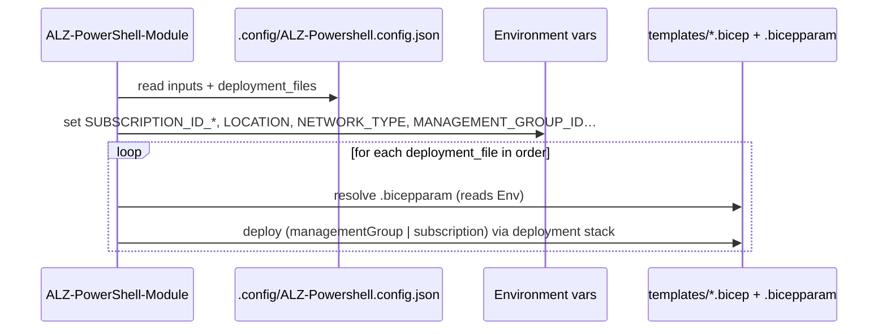

# Module: `.config/ALZ-Powershell.config.json` (the F3 driver contract)

| Field | Value |
|-------|-------|
| Repository | `Azure/alz-bicep-accelerator` |
| Flavor | JSON config (consumed by PowerShell) |
| Entry file | `.config/ALZ-Powershell.config.json` |
| Source URL | <https://github.com/Azure/alz-bicep-accelerator/blob/main/.config/ALZ-Powershell.config.json> |
| Mode | deep (source-verified) |
| Last reviewed | 2026-06-17 |

## Purpose

The **contract** between the A3 Bicep starter and the [ALZ-PowerShell-Module (F3)](../ALZ-PowerShell-Module/_overview.md)
driver. It declares the user **inputs**, which files to **keep/strip**, and an **ordered deployment manifest**
that the driver executes. This is the same mechanism [accelerator-bootstrap-modules (F2)](../accelerator-bootstrap-modules/_overview.md)
uses — A3 plugs into the accelerator purely through this file.

- Top-level `starter_modules` map with two entries: **`platform_landing_zone`** (the real starter) and
  **`test`** (e2e probe).
- Each entry: `short_name`, `description`, `inputs`, `folders_or_files_to_retain`,
  `subfolders_or_files_to_remove`, `deployment_files`, `deployment_file_groups`, `destroy_script_path`.

## Inputs (`platform_landing_zone.inputs`)

Each input has a `source` (`powershell` = computed by the driver from earlier answers, or `input` = asked of
the user), a `sourceInput` expression, a `default`, and `targets` mapping it to an **environment variable**
the `.bicepparam` files read.

| Input | Source | → Env var | Meaning |
|-------|--------|-----------|---------|
| `management_subscription_id` | powershell `subscription_ids["management"]` | `SUBSCRIPTION_ID_MANAGEMENT` | Management sub |
| `connectivity_subscription_id` | powershell `subscription_ids["connectivity"]` | `SUBSCRIPTION_ID_CONNECTIVITY` | Connectivity sub |
| `identity_subscription_id` | powershell `subscription_ids["identity"]` | `SUBSCRIPTION_ID_IDENTITY` | Identity sub |
| `security_subscription_id` | powershell `subscription_ids["security"]` | `SUBSCRIPTION_ID_SECURITY` | Security sub |
| `primary_location` | powershell `starter_locations[0]` | `LOCATION`, `LOCATION_PRIMARY` | Primary region |
| `secondary_location` | powershell `starter_locations[1]` | `LOCATION_SECONDARY` | Secondary region |
| `root_parent_management_group_id` | input | `MANAGEMENT_GROUP_ID` | Parent MG / prefix |
| `network_type` | input (default `hubNetworking`) | `NETWORK_TYPE` | `hubNetworking` xor `vwanConnectivity` |
| `management_group_int_root_id` | input (default `alz`) | `INTERMEDIATE_ROOT_MANAGEMENT_GROUP_ID` | Intermediate root MG id |
| `management_group_id_prefix` | input | `MANAGEMENT_GROUP_ID_PREFIX` | MG id prefix |
| `management_group_id_postfix` | input | `MANAGEMENT_GROUP_ID_POSTFIX` | MG id postfix |

## File retain / strip

- `folders_or_files_to_retain`: `["templates", "bicepconfig.json"]` — only the starter templates + bicep config
  survive into the customer's repo.
- `subfolders_or_files_to_remove`: `.github`, `.gitignore`, `CODE_OF_CONDUCT.md`, `DEVELOPER.md`, `examples`,
  `LICENSE`, `README.md`, `SECURITY.md`, `SUPPORT.md` — repo scaffolding is discarded.

## Deployment manifest (`deployment_files`, 18 entries)

Each entry: `order`, `name`, `displayName`, `templateFilePath` (`.bicep`), `templateParametersFilePath`
(`.bicepparam`), `managementGroupId`/`subscriptionId` (env-var name), `deploymentType`
(`managementGroup` | `subscription`), `firstRunWhatIf`, `group`, optional `networkType`.

| # | name | scope | template | group |
|--:|------|-------|----------|-------|
| 1 | governance-int-root | MG | governance/mgmt-groups/int-root | governance-int-root |
| 2 | governance-landingzones | MG | …/landingzones | governance-landingzones |
| 3 | governance-landingzones-corp | MG | …/landingzones/landingzones-corp | governance-landingzones-children |
| 4 | governance-landingzones-online | MG | …/landingzones/landingzones-online | governance-landingzones-children |
| 5 | governance-landingzones-local | MG | …/landingzones/landingzones-local | governance-landingzones-children |
| 6 | governance-platform | MG | …/platform | governance-platform |
| 7 | governance-platform-connectivity | MG | …/platform/platform-connectivity | governance-platform-children |
| 8 | governance-platform-identity | MG | …/platform/platform-identity | governance-platform-children |
| 9 | governance-platform-management | MG | …/platform/platform-management | governance-platform-children |
| 10 | governance-platform-security | MG | …/platform/platform-security | governance-platform-children |
| 11 | governance-sandbox | MG | …/sandbox | governance-sandbox |
| 12 | governance-decommissioned | MG | …/decommissioned | governance-decommissioned |
| 13 | governance-platform-rbac | MG | …/platform/**main-rbac** | governance-rbac |
| 14 | governance-platform-connectivity-rbac | MG | …/platform/platform-connectivity/**main-rbac** | governance-rbac |
| 15 | governance-landingzones-rbac | MG | …/landingzones/**main-rbac** | governance-rbac |
| 16 | core-logging | **subscription** (`SUBSCRIPTION_ID_MANAGEMENT`) | core/logging | core |
| 17 | networking-hubnetworking | **subscription** (`SUBSCRIPTION_ID_CONNECTIVITY`) | networking/hubnetworking · `networkType: hubNetworking` | networking |
| 18 | networking-virtualwan | **subscription** (`SUBSCRIPTION_ID_CONNECTIVITY`) | networking/virtualwan · `networkType: vwanConnectivity` | networking |

- **Governance (1–12)** deploy each MG's policy/role payload at `managementGroup` scope.
- **Cross-MG RBAC (13–15)** run after the MGs exist (the deployment-stack cross-MG workaround).
- **Core logging (16)** deploys to the Management subscription.
- **Networking (17/18)** deploy to the Connectivity subscription; the driver picks the one whose `networkType`
  matches the `network_type` input.

`deployment_file_groups` lists the 10 UI groups (orders 1–10) used to present progress.

## The `test` starter

A minimal e2e config: a `management-group` deployment + four `resource-group` probe deployments (management,
connectivity, identity, security) using `{{unique_postfix}}` name templating and `firstRunWhatIf: true`.
Retains `tests`, `templates/core/alzCoreType.bicep`, `bicepconfig.json`.

## Deployment Flow

## Notes & Gotchas

- **Env-var indirection** — inputs never touch Bicep directly; they become environment variables that the
  `.bicepparam` files read (`readEnvironmentVariable(...)`), keeping the templates driver-agnostic.
- **Order matters** — MGs must exist before policy/RBAC; networking after logging (it consumes the workspace).
- **`firstRunWhatIf`** — every real deployment is `false` here (apply on first run); only the `test` probes use
  `true` (what-if dry run).

## Open Questions

- [ ] `TODO: verify` the exact driver cmdlet that consumes `deploymentType` (deployment-stack vs plain deployment) — inferred, not read.
