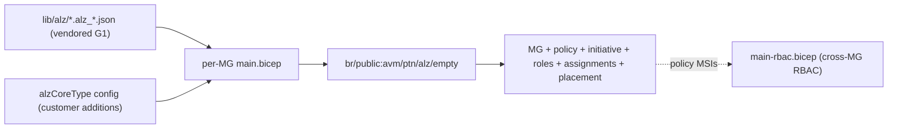
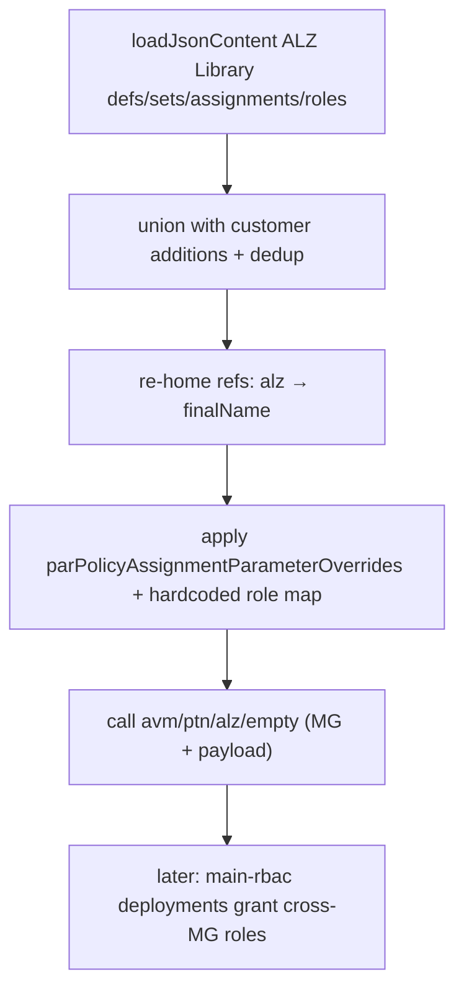

# Module: `governance` (per-MG modules + cross-MG RBAC)

| Field | Value |
|-------|-------|
| Repository | `Azure/alz-bicep-accelerator` |
| Flavor | Bicep |
| Entry files | `templates/core/governance/mgmt-groups/<mg>/main.bicep` · `<mg>/main-rbac.bicep` |
| Scope | `targetScope = 'managementGroup'` (all) |
| Source URL | <https://github.com/Azure/alz-bicep-accelerator/tree/main/templates/core/governance> |
| Mode | deep (source-verified — `int-root/main.bicep`) |
| Last reviewed | 2026-06-17 |

## Purpose

Deploys the **governance layer one management group at a time**: each MG gets its own module that creates the
MG, its custom policy + initiative definitions, custom RBAC roles, policy assignments, and (optionally)
subscription placement — by delegating to the AVM pattern module **`br/public:avm/ptn/alz/empty`**. A separate
family of `main-rbac.bicep` modules then grants the policy managed identities the cross-management-group roles
that deployment stacks cannot.

- **One module per MG** (vs A1's single `alzDefaultPolicyAssignments`): `int-root`, `landingzones`
  (+ `corp`/`online`/`local`), `platform` (+ `connectivity`/`identity`/`management`/`security`), `sandbox`,
  `decommissioned`.
- Each module **loads the vendored ALZ Library** policy/role JSON and merges customer additions, then hands
  the whole payload to `avm/ptn/alz/empty`.
- Platform / governance layer; the AVM Bicep equivalent of the Terraform [avm-ptn-alz (B1)](../avm-ptn-alz/_overview.md).

## `<mg>/main.bicep` (per-MG governance)

### Inputs

| Name | Type | Description |
|------|------|-------------|
| `<mg>Config` (e.g. `intRootConfig`) | `alzCoreType` | The MG's config: `managementGroupName`, `…DisplayName`, `…ParentId`, `createOrUpdateManagementGroup`, `subscriptionsToPlaceInManagementGroup`, `customerPolicyDefs`/`customerPolicySetDefs`/`customerPolicyAssignments`/`customerRbacRoleDefs`/`customerRbacRoleAssignments`, `waitForConsistencyCounterBefore*`, `managementGroupDoNotEnforce/ExcludedPolicyAssignments` |
| `parLocations` | `array` | Deploy locations (default `[deployment().location]`) |
| `parPolicyAssignmentParameterOverrides` | `object` | Per-assignment overrides (location / scope / parameters); role defs are **hardcoded**, not overridable |
| `parEnableTelemetry` | `bool` | AVM telemetry toggle |

### How it builds the payload (source-verified)

```bicep
// 1) Load the vendored ALZ Library (G1) corpus
var alzPolicyDefsJson      = [ loadJsonContent('../../lib/alz/Append-AppService-httpsonly.alz_policy_definition.json') /* …~140… */ ]
var alzPolicySetDefsJson   = [ loadJsonContent('../../lib/alz/Enforce-Guardrails-KeyVault_20260203.alz_policy_set_definition.json') /* …~40… */ ]
var alzPolicyAssignmentsJson = [ loadJsonContent('../../lib/alz/Deploy-MDFC-Config-H224.alz_policy_assignment.json') /* … */ ]
var alzRbacRoleDefsJson    = [ loadJsonContent('../../lib/alz/<guid>.alz_role_definition.json') /* … */ ]

// 2) Merge customer additions
var unionedPolicyDefs        = union(alzPolicyDefsJson,        config.?customerPolicyDefs ?? [])
var unionedPolicyAssignments = union(alzPolicyAssignmentsWithOverrides, config.?customerPolicyAssignments ?? [])

// 3) Re-home policy refs from the library's 'alz' MG to the real MG name
policyDefinitionId: replace(pa.properties.policyDefinitionId,
  '/providers/Microsoft.Management/managementGroups/alz/',
  '/providers/Microsoft.Management/managementGroups/${managementGroupFinalName}/')

// 4) Hand the whole payload to the AVM pattern module
module intRoot 'br/public:avm/ptn/alz/empty:0.3.6' = {
  params: {
    managementGroupName: managementGroupFinalName
    managementGroupParentId: config.?managementGroupParentId ?? tenantRootMgExisting.name
    managementGroupCustomPolicyDefinitions: allPolicyDefs
    managementGroupCustomPolicySetDefinitions: allPolicySetDefinitions
    managementGroupPolicyAssignments: allPolicyAssignments
    managementGroupCustomRoleDefinitions: allRbacRoleDefs
    managementGroupRoleAssignments: config.?customerRbacRoleAssignments
    subscriptionsToPlaceInManagementGroup: config.?subscriptionsToPlaceInManagementGroup
    waitForConsistencyCounterBeforePolicyAssignments: config.?waitForConsistencyCounterBeforePolicyAssignments
    /* …other waitForConsistency* counters… */
  }
}
```

- **Policy→identity role map (hardcoded):** `alzPolicyAssignmentRoleDefinitions` pins the role each DINE/Modify
  assignment's managed identity needs — e.g. `Deploy-MDFC-Config-H224 → Owner`, `Deploy-MDEndpoints → Contributor`,
  `Deploy-MDEndpointsAMA → RBAC Security Admin`, `Deploy-AzActivity-Log → [Log Analytics Contributor,
  Monitoring Contributor]`, `Deploy-MDFC-SqlAtp → SQL Security Manager`, `Deploy-SvcHealth-BuiltIn →
  Monitoring Policy Contributor`.
- **Re-homing** rewrites both `policyDefinitionId` (`…/alz/…` → `…/<finalName>/…`) and custom role names
  (`(alz)` → `(<finalName>)`) so a renamed MG keeps working.
- **`waitForConsistencyCounterBefore*`** parameters insert eventual-consistency waits between definition →
  assignment → role-assignment phases (ARM RBAC/policy propagation lag).

## `<mg>/main-rbac.bicep` (cross-MG RBAC)

A separate module (deployment orders 13–15) that assigns RBAC roles to **policy-assigned managed identities
across management groups** — e.g. granting a Corp/Connectivity policy identity a role on the Platform MG.

> **Why a separate module:** "deployment stacks do not support cross-management group role assignments" (verbatim
> from the module metadata). The accelerator deploys each MG with a stack, then runs these standalone RBAC
> deployments to wire the cross-MG grants the stacks omit. Examples: `platform/main-rbac.bicep` (Corp +
> Connectivity identities → Platform), `platform/platform-connectivity/main-rbac.bicep` (Corp identity →
> Connectivity, e.g. for `Deploy-Private-DNS-Zones`), `landingzones/main-rbac.bicep` (Platform identities →
> Landing Zones).

## Resources Created

| Resource | Via | Notes |
|----------|-----|-------|
| `Microsoft.Management/managementGroups` | `avm/ptn/alz/empty` | the MG itself (createOrUpdate) |
| `Microsoft.Authorization/policyDefinitions` + `policySetDefinitions` | `avm/ptn/alz/empty` | from the merged library payload |
| `Microsoft.Authorization/roleDefinitions` | `avm/ptn/alz/empty` | custom CAF roles |
| `Microsoft.Authorization/policyAssignments` (+ identity) | `avm/ptn/alz/empty` | assignments + DINE/Modify MSIs |
| `Microsoft.Authorization/roleAssignments` | `avm/ptn/alz/empty` + `main-rbac.bicep` | in-MG via ptn; cross-MG via the RBAC modules |
| `Microsoft.Management/managementGroups/subscriptions` | `avm/ptn/alz/empty` | optional subscription placement |

## Dependencies

**Upstream:** the vendored ALZ Library (`lib/alz/*.alz_*.json`); the `avm/ptn/alz/empty` registry module; the
parent MG (tenant root by default). **Downstream:** the cross-MG RBAC modules (need the MGs + policy identities
to exist); all workload subscriptions inherit the assignments.

## Module Dependency Diagram



## Deployment Flow



## Notes & Gotchas

- **AVM-delegated, not hand-written** — unlike A1 (which declared `policyDefinitions`/`policyAssignments`
  resources directly), A3 hands everything to `avm/ptn/alz/empty`; the per-MG `main.bicep` is mostly data
  loading + transformation.
- **Vendored library = same policy as Terraform** — the `lib/alz/*.alz_*.json` files are the
  [G1 ALZ Library](../Azure-Landing-Zones-Library/_overview.md) corpus, so Bicep and Terraform starters enforce
  the same policy set.
- **Customer extension points** — every `customer*` field on `alzCoreType` lets you add defs/assignments/roles
  without forking the templates.
- **Eventual consistency** — the `waitForConsistencyCounterBefore*` knobs exist because ARM RBAC/policy
  propagation is async; raise them if assignments fail on first deploy.

## Open Questions

- [ ] `TODO: verify` the full `alzCoreType` field list (`templates/core/alzCoreType.bicep` not read line-by-line).
- [ ] `TODO: verify` the child-MG modules (`platform-*`, `landingzones-*`) follow the identical pattern as `int-root` (assumed; only `int-root/main.bicep` read in full).
