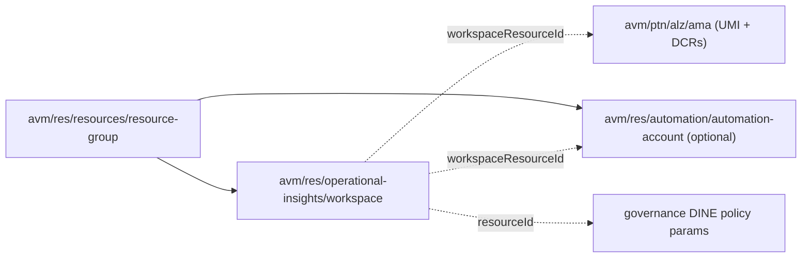
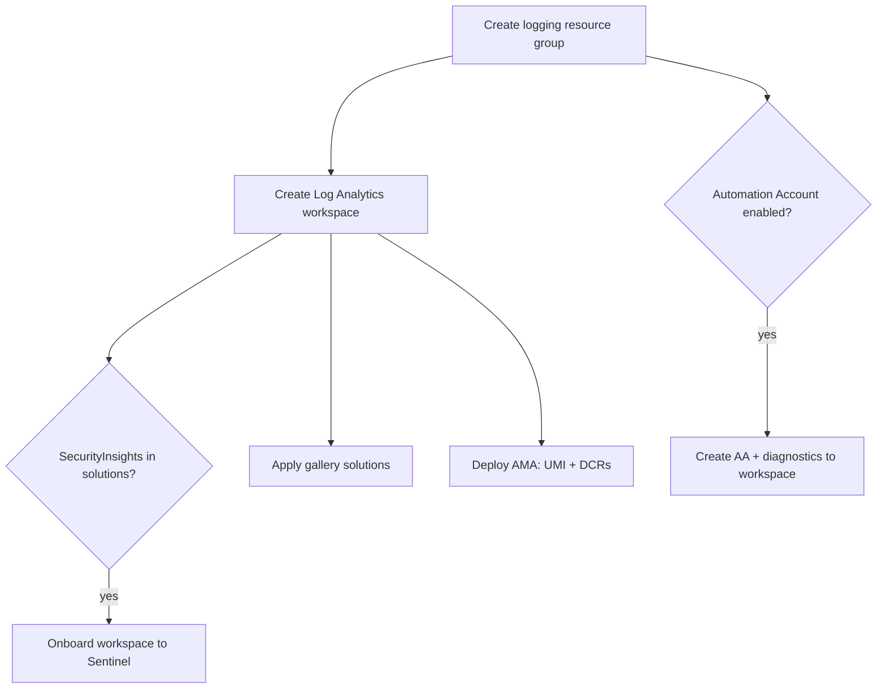

# Module: `logging` (core management + logging)

| Field | Value |
|-------|-------|
| Repository | `Azure/alz-bicep-accelerator` |
| Flavor | Bicep |
| Entry file | `templates/core/logging/main.bicep` |
| Scope | `targetScope = 'subscription'` (the Management subscription) |
| Source URL | <https://github.com/Azure/alz-bicep-accelerator/blob/main/templates/core/logging/main.bicep> |
| Mode | deep (source-verified) |
| Last reviewed | 2026-06-17 |

## Purpose

Deploys the **central management/observability platform** into the Management subscription by composing **AVM
resource modules**: a resource group, a Log Analytics workspace (with Sentinel onboarding + gallery
solutions), an optional Automation Account, and the Azure Monitor Agent data-collection rules.

- The AVM-native equivalent of [A1's `logging`](../ALZ-Bicep/module-logging.md) — but assembled entirely from
  `br/public:avm/...` modules rather than hand-written resources.
- Emits the workspace the governance DINE policies + diagnostics point at.
- Deployment #16 in the manifest, `subscription` scope, `SUBSCRIPTION_ID_MANAGEMENT`.

## Inputs (themed)

**Resource group / workspace**

| Name | Type | Default | Description |
|------|------|---------|-------------|
| `parMgmtLoggingResourceGroup` | `string` | — (required) | RG name |
| `parLogAnalyticsWorkspaceName` | `string` | — (required) | Workspace name |
| `parLogAnalyticsWorkspaceLocation` | `string` | — (required) | Workspace region |
| `parLogAnalyticsWorkspaceSku` | `string` | `'PerGB2018'` | SKU |
| `parLogAnalyticsWorkspaceLogRetentionInDays` | `int` | `365` | Retention |
| `parLogAnalyticsWorkspaceSolutions` | `array` | `['SecurityInsights','ChangeTracking']` | Gallery solutions / Sentinel toggle |
| `parLogAnalyticsWorkspaceDailyQuotaGb` / `…Replication` / `…Features` / `…DataExports` / `…DataSources` | various | — | Passed through to the AVM workspace module |

**Automation Account**

| Name | Type | Default | Description |
|------|------|---------|-------------|
| `parDeployAutomationAccount` | `bool` | `false` | Toggle the AA |
| `parAutomationAccountName` | `string` | — (required) | Name |
| `parAutomationAccountUseManagedIdentity` | `bool` | `true` | SystemAssigned identity |
| `parAutomationAccountSku` | `string` (`Basic`/`Free`) | `'Basic'` | SKU |

**AMA / DCRs:** `parUserAssignedIdentityName`, `parDataCollectionRuleVMInsightsName` / `…ChangeTrackingName` /
`…MDFCSQLName`, `parDataCollectionRuleVMInsightsExperience` (`'PerfAndMap'`).

**General:** `parLocations` (default `[deployment().location]`), `parTags`, `parGlobalResourceLock`
(`lockType`, overrides per-resource locks), `parEnableTelemetry`.

## Resources Created (all AVM modules)

| AVM module | Symbolic | Notes |
|------------|----------|-------|
| `br/public:avm/res/resources/resource-group:0.4.3` | `modMgmtLoggingResourceGroup` | the logging RG (scope `subscription()`) |
| `Microsoft.Resources/resourceGroups@2025-04-01` (existing) | `resResourceGroupPointer` | re-scope pointer, `dependsOn` the RG module |
| `br/public:avm/res/operational-insights/workspace:0.14.2` | `modLogAnalyticsWorkspace` | LAW; `onboardWorkspaceToSentinel = contains(solutions,'SecurityInsights')`; `gallerySolutions` from `varGallerySolutions` |
| `br/public:avm/res/automation/automation-account:0.17.1` | `modAutomationAccount` | `if (parDeployAutomationAccount)`; diagnostics → workspace |
| `br/public:avm/ptn/alz/ama:0.2.0` | `modAzureMonitoringAgent` | UMI + VM Insights / Change Tracking / MDFC-SQL **DCRs** |

> `varGallerySolutions` maps each solution name to its `OMSGallery/*` plan (`SecurityInsights` →
> `OMSGallery/SecurityInsights`, `ChangeTracking` → `OMSGallery/ChangeTracking`).

## Outputs

The module is primarily a composition; the workspace resource id is surfaced via the AVM workspace module's
outputs (`modLogAnalyticsWorkspace.outputs.resourceId`) and consumed by the AMA + Automation diagnostics inside
this module. `// TODO: verify` the module's own top-level `output` list (not shown in the read excerpt).

## Dependencies

**Upstream:** the AVM modules above (`avm/res/resources/resource-group`, `avm/res/operational-insights/workspace`,
`avm/res/automation/automation-account`, `avm/ptn/alz/ama`). **Downstream:** the governance DINE policies'
parameter overrides reference this workspace (the F3 driver wires the id into the governance `.bicepparam`);
hub/spoke flow-log diagnostics also target it.

## Module Dependency Diagram

## Deployment Flow

## Notes & Gotchas

- **AVM-composed** — every Azure resource is an AVM module; the starter's job is wiring parameters + the
  `resResourceGroupPointer` `existing` trick to re-scope subsequent modules into the just-created RG.
- **Sentinel is data-driven** — onboarding is `contains(parLogAnalyticsWorkspaceSolutions,'SecurityInsights')`;
  drop the value to skip Sentinel.
- **Same AMA module as A1** — both A1 and A3 logging use `avm/ptn/alz/ama` for the DCRs, so the agent story is
  identical across Classic and AVM starters.
- **`enableTelemetry`** (AVM convention), not Classic's `parTelemetryOptOut`.
- **Lock precedence** — `parGlobalResourceLock` overrides each module's per-resource `lock` via the
  `?? parGlobalResourceLock` pattern.

## Open Questions

- [ ] `TODO: verify` the module's declared `output` block (workspace id / customer id) — not in the read excerpt.
