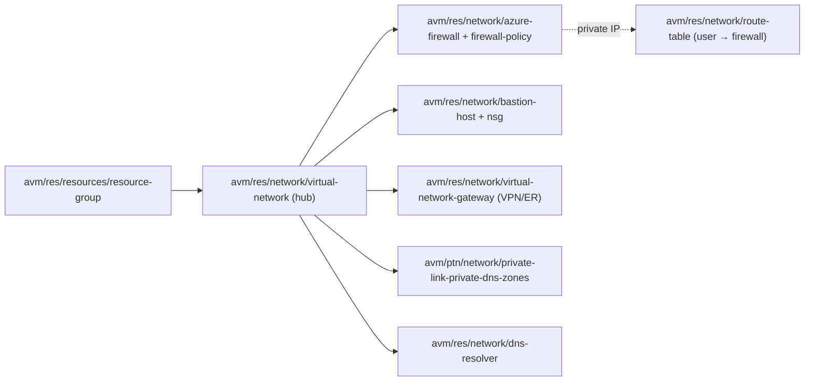
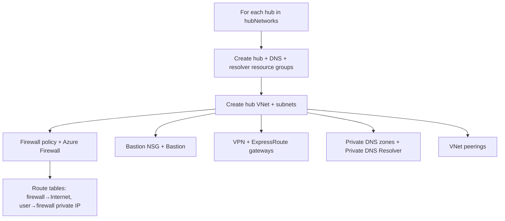

# Module: `networking` (hubnetworking + virtualwan)

| Field | Value |
|-------|-------|
| Repository | `Azure/alz-bicep-accelerator` |
| Flavor | Bicep |
| Entry files | `templates/networking/hubnetworking/main.bicep` · `templates/networking/virtualwan/main.bicep` |
| Scope | `targetScope = 'subscription'` (the Connectivity subscription) |
| Source URL | <https://github.com/Azure/alz-bicep-accelerator/blob/main/templates/networking/hubnetworking/main.bicep> |
| Mode | deep (source-verified — `hubnetworking`) |
| Last reviewed | 2026-06-17 |

## Purpose

Deploys the **connectivity layer** into the Connectivity subscription by composing **AVM `res/network/*`
modules**: a multi-region hub VNet with Azure Firewall (+ policy), Bastion, VPN/ExpressRoute gateways, DDoS,
route tables, Private DNS zones, and (new vs A1) a **Private DNS Resolver**. The `virtualwan` sibling is the
Virtual WAN variant. The F3 driver runs **exactly one** of the two, matching the `network_type` input.

- The AVM-native, **array-driven, multi-region** evolution of [A1's `hubNetworking`](../ALZ-Bicep/module-hubNetworking.md).
- Deployment #17 (hub) xor #18 (vWAN), `subscription` scope, `SUBSCRIPTION_ID_CONNECTIVITY`.

## Inputs (`hubnetworking`)

| Name | Type | Description |
|------|------|-------------|
| `hubNetworks` | `hubVirtualNetworkType[]` | **The hubs array** (one per region) — each object carries `name`, `addressPrefixes`, `location`, `subnets`, and nested `azureFirewallSettings` / `privateDnsSettings` / `ddosProtectionPlanSettings` / `vpnGatewaySettings` / `expressRouteGatewaySettings` / `bastionHostSettings` / `peeringSettings` |
| `parHubNetworkingResourceGroupNamePrefix` (+ `…Overrides`) | `string` / `array` | RG naming (`{prefix}-{location}` or explicit overrides) |
| `parDnsResourceGroupNamePrefix` / `parDnsPrivateResolverResourceGroupNamePrefix` (+ overrides) | `string` / `array` | DNS + resolver RG naming |
| `parGlobalResourceLock` | `lockType` | Overrides per-resource locks |
| `parLocations` / `parTags` / `parEnableTelemetry` | array / object / bool | General |

Nested type highlights: `azureFirewallType` (`deployAzureFirewall`, `azureSkuTier` Basic/Standard/Premium,
`firewallPolicyId`, `firewallSubnetDefaultRouteNextHopType`, zones, threat-intel, DNS proxy);
`privateDnsType` (`deployPrivateDnsZones`, `deployDnsPrivateResolver`, `privateDnsZones`, inbound/outbound
endpoints); `vpnGatewaySettingsType` (`skuName` VpnGw1-5AZ, `vpnMode` active-active/passive ±BGP);
`expressRouteGatewaySettingsType`; `bastionHostSettingsType` (SKU, scale units, NSG rules).

## Resources Created (all AVM modules, looped over `hubNetworks`)

| AVM module | Symbolic | Condition |
|------------|----------|-----------|
| `avm/res/resources/resource-group:0.4.3` | `modHubNetworkingResourceGroups` / `modDnsResourceGroups` / `modPrivateDnsResolverResourceGroups` | hub RG always; DNS/resolver RGs per flags |
| `avm/res/network/virtual-network:0.7.2` | `resHubVirtualNetwork` (+ `resVnetPeering`) | hub VNet + subnets; peering if `deployPeering` |
| `avm/res/network/azure-firewall:0.9.2` | `resAzureFirewall` | if `deployAzureFirewall` |
| `avm/res/network/firewall-policy:0.3.4` | `resFirewallPolicy` | if firewall + no existing policy |
| `avm/res/network/bastion-host:0.8.2` | `resBastion` | if `deployBastion` |
| `avm/res/network/network-security-group:0.5.2` | `resBastionNsg` | Bastion NSG (full inbound/outbound rule set) |
| `avm/res/network/route-table:0.5.0` | `resFirewallRouteTable` (→ Internet) + `resUserSubnetsRouteTable` (→ firewall private IP) | if firewall |
| `avm/res/network/ddos-protection-plan:0.3.2` | `resDdosProtectionPlan` | if `deployDdosProtectionPlan` |
| `avm/res/network/virtual-network-gateway:0.10.1` | `resVpnGateway` / `resExpressRouteGateway` | per gateway flags |
| `avm/ptn/network/private-link-private-dns-zones:0.7.2` | `resPrivateDnsZones` | if `deployPrivateDnsZones` |
| `avm/res/network/dns-resolver:0.5.6` | `resDnsPrivateResolver` | **if `deployDnsPrivateResolver` (new vs A1)** |

**Computed helpers:** `pickZones('Microsoft.Network', '<type>', location, 3)` for recommended availability
zones; `cidrHost(<AzureFirewallSubnet prefix>, 3)` to derive the firewall private IP (used as the
user-subnets route-table next hop and, when a resolver is present, as the VNet DNS server).

## Outputs

Per-hub resource ids surface through the AVM modules' outputs (e.g. `resHubVirtualNetwork[i].outputs.resourceId`,
firewall private IPs via `firewallPrivateIpAddresses`). `// TODO: verify` the module's own top-level `output`
block.

## Dependencies

**Upstream:** the AVM `res/network/*` + `ptn/network/private-link-private-dns-zones` registry modules.
**Downstream:** spoke VNets peer to the hub; workloads route `0.0.0.0/0` to the firewall private IP via the
user-subnets route table; DINE Private-DNS policies target the deployed zones.

## Module Dependency Diagram

## Deployment Flow

## Notes & Gotchas

- **Array-driven multi-region** — `hubNetworks` is an array; every resource is a `[for hub in hubNetworks]`
  loop, so a single deploy can stamp regional hubs (the `secondary_location` input feeds the second element).
- **Private DNS Resolver is new** — A3 adds `avm/res/network/dns-resolver` (inbound/outbound endpoints on
  dedicated subnets); when resolver + private DNS + firewall are all on, the hub VNet's DNS server is set to the
  firewall private IP and the firewall's DNS servers point at the resolver inbound IP.
- **Two route tables** — `rt-hub-fw-<loc>` sends the AzureFirewallSubnet default route to Internet;
  `rt-hub-std-<loc>` sends user subnets `0.0.0.0/0` to the firewall private IP (force-tunnel).
- **Zone-aware by default** — `pickZones(...)` picks recommended AZs for PIPs, firewall, Bastion, and ER
  gateway SKU selection (`ErGw1AZ` when zonal).
- **`enableTelemetry`** (AVM), not Classic's `parTelemetryOptOut`. Global lock overrides per-resource locks.

## Open Questions

- [ ] `TODO: verify` the `virtualwan/main.bicep` AVM module set (assumed the **Bicep** `avm/ptn/virtualwan` — the Bicep peer of the Terraform [B5 `avm-ptn-virtualwan`](../avm-ptn-virtualwan/_overview.md), which builds vWAN + hubs + S2S/P2S/ER gateways + Secured-Hub firewall — plus `avm/res/network/*`; not read line-by-line).
- [ ] `TODO: verify` the module's top-level `output` block (hub VNet ids / firewall private IPs).
