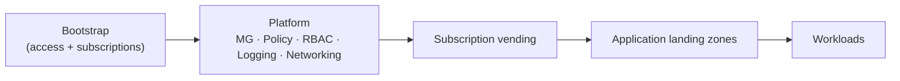
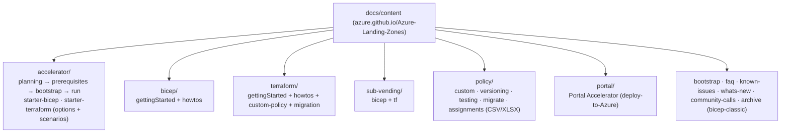
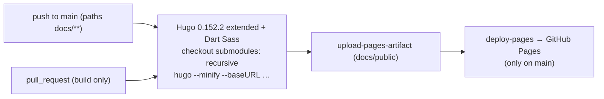
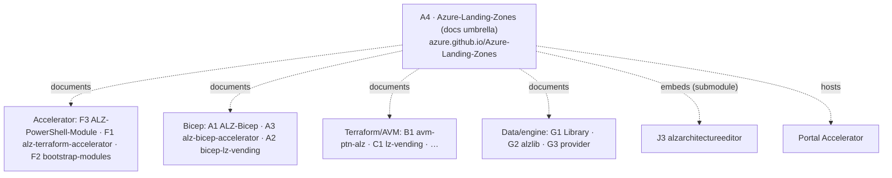

# Azure/Azure-Landing-Zones (A4) — Repository Overview

| Field | Value |
|-------|-------|
| Repository | `Azure/Azure-Landing-Zones` |
| Catalog id | A4 |
| Flavor | Mixed (documentation umbrella — Hugo static site + utilities) |
| Role | The **central ALZ documentation hub** — the canonical docs site that ties together every ALZ implementation (Bicep, Terraform, Accelerator, Portal, policy, sub-vending) |
| License | MIT |
| Published | <https://azure.github.io/Azure-Landing-Zones/> (Hugo → GitHub Pages) |
| Source URL | <https://github.com/Azure/Azure-Landing-Zones> |
| Mode | deep (source-verified) |
| Last reviewed | 2026-06-17 |

## Purpose

`Azure/Azure-Landing-Zones` is **not** an IaC deployment repo — it is the **umbrella documentation site** for the
entire Azure Landing Zones product family. Its README states it plainly:

> *“This site contains documentation for the Azure landing zone software: Bicep modules, ALZ Accelerator,
> Terraform modules.”*

It is a **Hugo** static site (theme `hugo-geekdoc`) published to GitHub Pages at
**azure.github.io/Azure-Landing-Zones**, and it is the canonical entry point that links out to all the other
repos analyzed in these notes (the Bicep modules, the Terraform/AVM modules, the accelerators, the Library, the
Portal accelerator). It also **embeds the [ALZ Architecture Editor (J3)](../alzarchitectureeditor/_overview.md)**
as a git submodule so the editor is hosted on the same site.

> **Engine/tooling track** — analyzed for site structure, content taxonomy, build/publish flow, the J3 embedding,
> and the repo's PowerShell/automation utilities (not as IaC inputs/outputs).

## The “Azure landing zone Journey” (the site's spine)

The landing page frames everything as a journey, which doubles as the map of the whole ecosystem:



- **Bootstrap** → the [bootstrap docs](#) (CI/CD identity, state, pipelines — implemented by F2/F3).
- **Platform** → MG hierarchy + Policy + RBAC + centralized logging + networking; the reference structure lives in
  the [ALZ Library (G1)](../Azure-Landing-Zones-Library/_overview.md).
- **Subscription vending** → automated subscription creation (C1/A2/B6).
- **Application landing zones / Workloads** → app teams' pre-configured environments.

## Repository structure (verified via git tree)

```
Azure-Landing-Zones/
├── .github/
│   ├── workflows/
│   │   ├── hugo.yml                  # build + deploy the Hugo site to GitHub Pages
│   │   ├── issue-triage.lock.yml     # AI-assisted issue triage (agentic workflow, ~95 KB lockfile)
│   │   ├── issue-triage.md  scorecard.yml  copilot-setup-steps.yml
│   ├── agents/agentic-workflows.agent.md   # GitHub agentic workflow definition
│   ├── aw/actions-lock.json  copilot-instructions.md (~30 KB)
│   └── ISSUE_TEMPLATE/ (bug-report, feature-request, policy-submission-proposal)
├── .gitmodules                       # → docs/static/alzarchedit = J3 alzarchitectureeditor
├── Makefile  DEVELOPER.md  README.md
├── docs/                             # ← the Hugo site
│   ├── hugo.toml                     # Hugo config
│   ├── data/menu/*.yaml              # nav menus
│   ├── layouts/  themes/hugo-geekdoc/  # custom + vendored theme (mermaid + katex bundles)
│   ├── static/
│   │   ├── alzarchedit/              # git submodule = J3 (embedded editor)
│   │   └── examples/tf/{1_management,2_network,accelerator}   # runnable TF examples
│   └── content/                      # ← all the documentation (markdown)
│       ├── accelerator/  bicep/  terraform/  sub-vending/  policy/  portal/
│       ├── bootstrap/  faq/  known-issues/  whats-new/  community-calls/  archive/
└── utl/                              # PowerShell utilities
    ├── cost-estimates/Get-ScenarioCostEstimates.ps1
    └── github-labels/{Set-ALZGitHubLabels, Invoke-GitHubIssueTransfer, Remove-DefaultGitHubLabels}.ps1 + alz-labels.csv
```

## Documentation taxonomy (`docs/content/`)



| Section | Documents |
|---------|-----------|
| `accelerator/` | the ALZ Accelerator end-to-end: `0_planning` → `1_prerequisites` (GitHub/Azure DevOps, service principal, platform subscriptions, root access) → `2_bootstrap` → `3_run`; plus `starter-bicep`, `starter-terraform` (with `options/*` and `scenarios/*`), release notes, troubleshooting, FAQ |
| `bicep/` | getting started + how-tos (modify MG hierarchy, policy assets, policy assignments, update) |
| `terraform/` | getting started + how-tos + custom-policy (definition/initiative/assignment) + migration |
| `sub-vending/` | subscription vending docs for both Bicep and Terraform |
| `policy/` | custom policy, versioning, testing, migration, update-to-latest, assignment data (CSV/XLSX) |
| `portal/` | the **Portal Accelerator** (deploy-to-Azure / portal-based ALZ) |
| `community-calls/`, `whats-new/`, `faq/`, `known-issues/`, `archive/bicep-classic/` | community + lifecycle content |

## Build & publish (verified `hugo.yml`)



- Triggers on `push`/`pull_request` to `main` scoped to `docs/**` (PRs build only; `main` builds **and** deploys).
- **`submodules: recursive`** is what pulls in the [J3 editor](../alzarchitectureeditor/_overview.md) at
  `docs/static/alzarchedit` so it ships inside the published site.
- Mermaid + KaTeX are bundled by the theme, so diagrams/maths render in the docs.

## Ecosystem placement — the hub



- **A4 is the documentation front-door** for the entire product; the other repos are the implementations it
  describes. Where earlier notes analyzed each implementation, A4 is where Microsoft publishes the guidance that
  stitches them into one journey.
- It **embeds J3** (the architecture editor) and **hosts the Portal Accelerator** docs, making it the closest
  thing to the “portal / umbrella” the catalog describes.

## Notes & gotchas

- **Docs, not deploy** — there is no `main.bicep`/`main.tf` here; the value is the curated guidance + the
  build/publish pipeline + the embedded tools. Treat code blocks in the content as illustrative (the runnable
  examples live under `docs/static/examples/tf/`).
- **Submodule = J3** — `.gitmodules` pins `docs/static/alzarchedit` to `Azure/alzarchitectureeditor`; the docs
  build checks it out recursively. Cloning A4 without `--recursive` omits the editor.
- **AI-assisted maintenance** — the repo uses **GitHub agentic workflows** (`.github/agents`, `.github/aw`) and a
  large `issue-triage` workflow to triage issues, plus `copilot-instructions.md` — see
  [module-utilities-and-automation.md](module-utilities-and-automation.md).
- **`whats-new/_index.md` is huge (~166 KB)** — it's the running changelog for the whole product.
- **Archive of the classic Bicep** — `content/archive/bicep-classic/` preserves the superseded classic ALZ-Bicep
  guidance (consistent with A1 being replaced by the AVM Bicep starter A3).

## Open Questions

- [ ] `TODO: verify` the exact `data/menu/*.yaml` → top-level nav mapping (menus read but not transcribed in full).
- [ ] `TODO: verify` whether `docs/static/examples/tf/*` are CI-tested or illustrative only.
