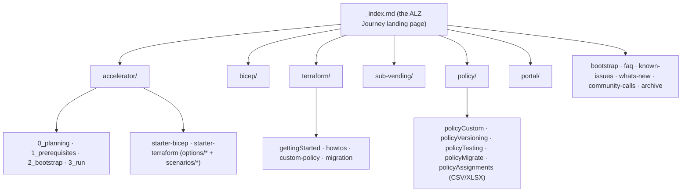
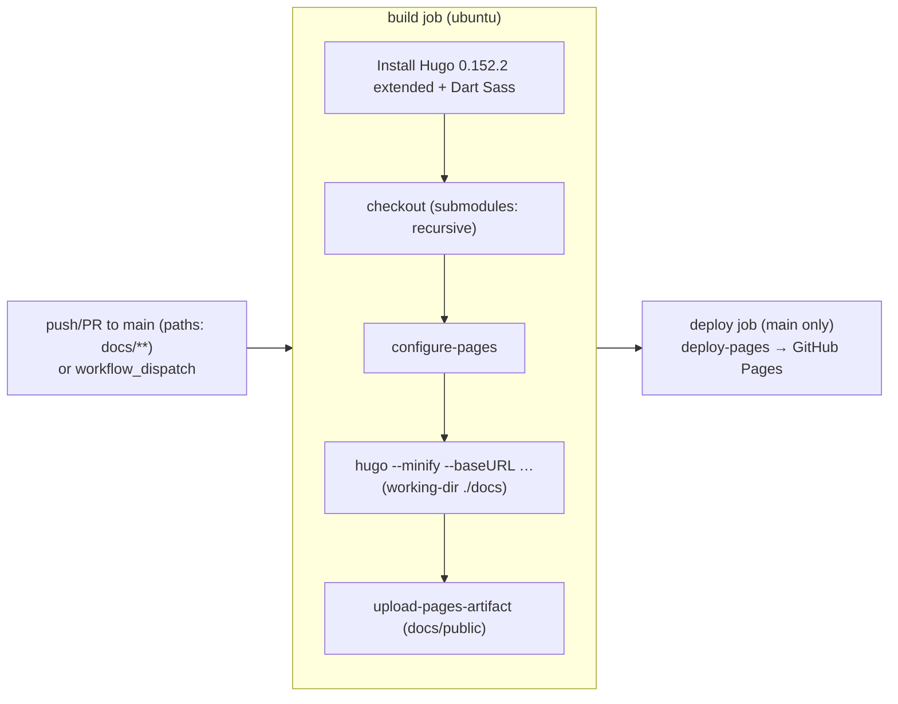

# Module — Docs Site & Content (`docs/`)

| Field | Value |
|-------|-------|
| Path | `docs/` (Hugo site), `docs/content/` (markdown), `.gitmodules`, `.github/workflows/hugo.yml` |
| Kind | Hugo static site (theme `hugo-geekdoc`) → GitHub Pages |
| Source-verified | `hugo.yml`, `.gitmodules`, `docs/content/_index.md`, `accelerator/_index.md` + git tree |
| Last reviewed | 2026-06-17 |

## Purpose

The `docs/` folder **is** the published product — the Hugo source for
**azure.github.io/Azure-Landing-Zones**. It contains the content (markdown), the theme, custom layouts, runnable
examples, and the embedded [J3 architecture editor](../alzarchitectureeditor/_overview.md). This module covers the
site's structure, the content taxonomy, the J3 submodule, and the build/publish pipeline.

## Site structure

| Path | Role |
|------|------|
| `docs/hugo.toml` | Hugo configuration (site params, theme, output) |
| `docs/data/menu/{main,extra}.yaml` | left-nav menu definitions |
| `docs/data/consent.yaml` + `layouts/partials/consent.html` | cookie/telemetry consent banner |
| `docs/layouts/` | site-specific overrides (partials, shortcodes, `llms-section-tree.txt`) |
| `docs/themes/hugo-geekdoc/` | vendored theme — bundles **Mermaid** + **KaTeX** so diagrams/maths render |
| `docs/static/alzarchedit/` | **git submodule = [J3](../alzarchitectureeditor/_overview.md)** (embedded editor) |
| `docs/static/examples/tf/` | runnable Terraform examples (`1_management`, `2_network`, `accelerator`) |
| `docs/content/` | all the documentation markdown |

## Content taxonomy (`docs/content/`)



### Landing page — the “Azure landing zone Journey” (verified `_index.md`)

The site's front page frames the whole product as a journey:
**Bootstrap → Platform (MG · Policy · RBAC · Logging · Networking) → Subscription vending → Application landing
zones → Workloads**, and points the platform's reference MG/policy structure at the
[ALZ Library (G1)](../Azure-Landing-Zones-Library/_overview.md).

### Accelerator section (verified `accelerator/_index.md`)

The most substantial section documents the **IaC Accelerator for Bicep and Terraform**:

- It links the **AVM for Platform Landing Zone** modules:
  [Terraform (F1 `alz-terraform-accelerator`)](../alz-terraform-accelerator/_overview.md) and
  [Bicep (A3 `alz-bicep-accelerator`)](../alz-bicep-accelerator/_overview.md).
- **3-phase approach:** Prerequisites → Bootstrap → Run, driven by the
  [ALZ PowerShell module (F3)](../ALZ-PowerShell-Module/_overview.md).
- Supports **GitHub** and **Azure DevOps** VCS (and an `alz_local` local-filesystem bootstrap); documents exactly
  what the bootstrap creates per VCS (state RG/storage, identity RG, **UAMI with federated credentials**, repos,
  pipelines/actions, environments, approvals, optional self-hosted runners/agents + private networking).

> This mirrors what earlier notes found analyzing F1/F2/F3 directly — A4 is where that flow is *documented* for end
> users.

## J3 embedding (verified `.gitmodules`)

```ini
[submodule "docs/static/alzarchedit"]
    path = docs/static/alzarchedit
    url = https://github.com/Azure/alzarchitectureeditor.git
```

The [ALZ Architecture Editor (J3)](../alzarchitectureeditor/_overview.md) is pulled in as a **git submodule** under
`docs/static/`, so the editor is published as part of this site. The Hugo build checks out submodules recursively
(below), so the editor ships with the docs.

## Build & publish (verified `hugo.yml`)



| Aspect | Detail |
|--------|--------|
| Trigger | `push`/`pull_request` to `main` filtered to `docs/**`; PRs **build only**, `main` builds **and** deploys; plus `workflow_dispatch` |
| Build | Hugo **0.152.2 extended** + Dart Sass; `checkout` with **`submodules: recursive`** (pulls J3); `hugo --minify --baseURL <pages-url>` in `./docs` |
| Publish | `upload-pages-artifact` (`docs/public`) → `deploy-pages` to the `github-pages` environment |
| Concurrency | single `pages` group, `cancel-in-progress: false` (don't cancel in-flight production deploys) |

## Dependencies

- **Upstream:** the implementation repos it documents (A1/A3, B-series, C1, F1/F2/F3, G1) and the embedded **J3**
  submodule; Hugo + the vendored `hugo-geekdoc` theme.
- **Downstream:** the published site **azure.github.io/Azure-Landing-Zones** consumed by ALZ adopters.

## Notes & gotchas

- **Clone with `--recursive`** or the J3 editor (and thus part of the site) is missing.
- **PR builds are safe** — they build but never deploy, so doc PRs get validated without touching production.
- **The theme carries Mermaid + KaTeX** — diagrams and equations in the markdown render without extra config.
- **`whats-new/_index.md` (~166 KB)** is the consolidated changelog across the whole product family.

## Open Questions

- [ ] `TODO: verify` `hugo.toml` params (base URL, output formats, menu wiring) — file present, not transcribed in full.
- [ ] `TODO: verify` whether `docs/static/examples/tf/*` are validated in CI or illustrative.
