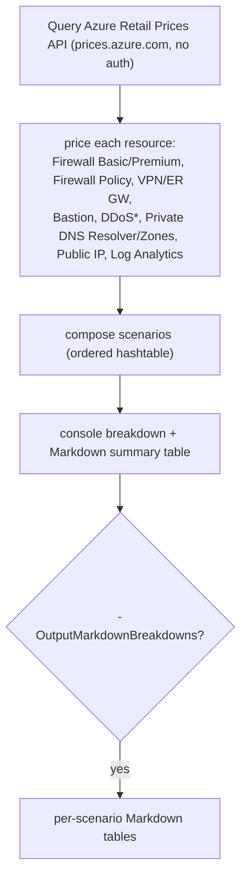
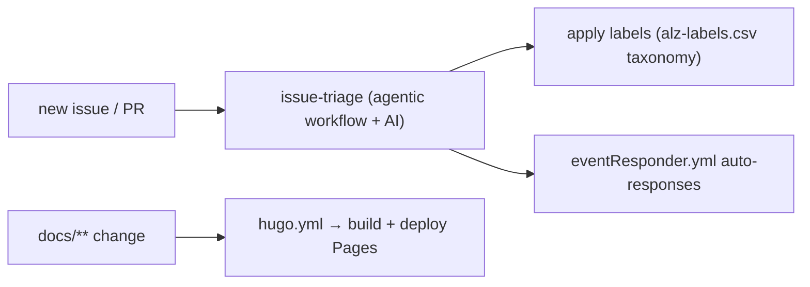

# Module — Utilities & Automation (`utl/` + `.github/`)

| Field | Value |
|-------|-------|
| Path | `utl/`, `.github/workflows/`, `.github/agents/`, `.github/aw/` |
| Kind | PowerShell utilities + GitHub Actions / agentic workflows |
| Source-verified | `utl/cost-estimates/Get-ScenarioCostEstimates.ps1`, git tree, `hugo.yml` |
| Last reviewed | 2026-06-17 |

## Purpose

Beyond the docs, A4 carries the **repo-operations tooling** for the ALZ team: PowerShell utilities (cost estimates,
GitHub label/issue management) and a set of GitHub automation/AI workflows that triage issues and maintain the
project. These don't deploy Azure — they keep the docs repo and its community running.

## `utl/cost-estimates/Get-ScenarioCostEstimates.ps1` (verified)

> *Generates cost estimates for Azure Landing Zone scenarios using the Azure Retail Prices API.*

A standalone PowerShell script that prices the connectivity options the accelerator offers, so the docs can show
indicative monthly costs.

### Inputs

| Parameter | Default | Meaning |
|-----------|---------|---------|
| `Region` | `westus` | Azure region for pricing |
| `Currency` | `USD` | currency code |
| `Scenario` | `''` | optional partial-name filter |
| `OutputMarkdownBreakdowns` | switch | also emit per-scenario markdown tables (for embedding in docs) |

### Behaviour

- Helper functions `Get-RetailPrice` / `Get-HourlyMonthlyPrice` (× **730** h/month) / `Get-FixedMonthlyPrice` call
  the **public, unauthenticated** Azure Retail Prices API with `$filter` queries.
- **Scenarios** (ordered) mirror the accelerator's `starter-terraform/scenarios`: Multi-/Single-Region
  **Hub & Spoke** and **Virtual WAN** (with **Azure Firewall** or **NVA**), **Management Only**, and **SMB**
  variants — each summing the relevant firewall/gateway/Bastion/DDoS/DNS/public-IP line items.
- **Caveats encoded in the script:** DDoS plan is hard-coded (`$ddos = 2944.00`/month — not in the Retail API);
  `$privateDnsZoneCount = 110`; consumption costs (log ingestion, data processing, DNS queries) excluded; NVA
  scenarios exclude the appliance's own licensing cost.
- **Outputs:** a console breakdown, a Markdown summary table, and (optionally) per-scenario Markdown breakdowns —
  used to keep the cost guidance in the docs current.

## `utl/github-labels/` (repo operations)

| Script / file | Role |
|---------------|------|
| `Set-ALZGitHubLabels.ps1` | apply the standard ALZ label taxonomy to the repo |
| `alz-labels.csv` | the label definitions (name/colour/description) |
| `Remove-DefaultGitHubLabels.ps1` | strip GitHub's default labels |
| `Invoke-GitHubIssueTransfer.ps1` | move issues between repos |

> These standardise issue/label hygiene across the ALZ org's repos. `TODO: verify` exact parameters (scripts listed
> from the tree; only the cost-estimates script was read line-by-line).

## `.github/` automation (verified tree + `hugo.yml`)

| Item | Role |
|------|------|
| `workflows/hugo.yml` | build + deploy the docs site (see [module-docs-site-and-content.md](module-docs-site-and-content.md)) |
| `workflows/issue-triage.lock.yml` (~95 KB) + `issue-triage.md` | **AI-assisted issue triage** — an *agentic workflow* (compiled lockfile + markdown spec) |
| `agents/agentic-workflows.agent.md` | GitHub **agentic workflow** agent definition |
| `aw/actions-lock.json` | pinned action versions for the agentic workflows |
| `copilot-instructions.md` (~30 KB) | repo-wide Copilot guidance for contributors/agents |
| `workflows/scorecard.yml` | OpenSSF Scorecard security scanning |
| `workflows/copilot-setup-steps.yml` | environment setup for Copilot coding agent |
| `ISSUE_TEMPLATE/` | bug-report, feature-request, **policy-submission-proposal** |
| `policies/eventResponder.yml` | automated issue/PR event responses |

> The repo leans heavily on **GitHub agentic workflows + Copilot** for maintenance — notable as an example of an
> ALZ repo automating its own triage/curation rather than deploying Azure.

## Dependencies

- **`Get-ScenarioCostEstimates.ps1`** → public Azure Retail Prices API (no auth); PowerShell.
- **github-labels scripts** → GitHub CLI/API + `GITHUB_TOKEN`.
- **agentic workflows** → GitHub Actions + the pinned actions in `aw/actions-lock.json` + Copilot.

## Notes & gotchas

- **Cost numbers are indicative** — Retail-API fixed infra only; consumption + DDoS (hard-coded) + NVA licensing
  are excluded; regenerate per region/currency with the script.
- **Label/issue scripts mutate the repo** — they change GitHub state (labels, issue locations); run deliberately.
- **The triage lockfile is generated** — `issue-triage.lock.yml` is compiled from the agentic workflow spec; edit
  the source (`issue-triage.md` / agent definition), not the lockfile.

## Open Questions

- [ ] `TODO: verify` parameters/behaviour of the `github-labels` scripts (listed from tree; not read line-by-line).
- [ ] `TODO: verify` the agentic `issue-triage` workflow's triggers + model wiring (large generated lockfile not transcribed).
