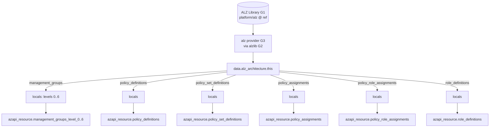
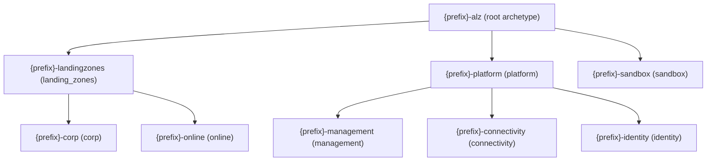

# Repository Overview: `Azure/terraform-azurerm-avm-ptn-alz`

| Field | Value |
|-------|-------|
| Repository | `Azure/terraform-azurerm-avm-ptn-alz` (catalog B1) |
| Flavor | Terraform (AVM pattern module) — registry `Azure/avm-ptn-alz/azurerm` |
| Role | **Governance core** of ALZ: management group hierarchy + Azure Policy + RBAC, driven by an architecture/archetype |
| Entry file | root `main.tf` (+ `main.*.tf`, `locals.tf`, `variables*.tf`, `outputs.tf`, `terraform.tf`) |
| Latest release | `v0.21.0` (used by F1) |
| Source URL | <https://github.com/Azure/terraform-azurerm-avm-ptn-alz> |
| Mode | deep (remote analysis via GitHub) |
| Last reviewed | 2026-06-17 |

## Purpose

This is the AVM pattern module that **deploys ALZ governance**: it creates the management group
hierarchy and applies the Azure Policy + role assets defined by an **architecture** (default: ALZ) and
its **archetypes**. It is the first of the B-series modules orchestrated by F1's `platform_landing_zone`
(as `module.management_groups`, version 0.21.0).

Crucially, the module does **not** hand-author policies. It reads a fully-resolved **architecture** from
the **`alz` Terraform provider** (data source `alz_architecture`), which is backed by **`alzlib` (G2)**
reading the **`Azure-Landing-Zones-Library` (G1)**. The module then materializes that data as Azure
resources via the **AzAPI provider**. This is the junction where the chain meets the data/engine layer:

```
F3 driver → F2 bootstrap → F1 starter → B1 avm-ptn-alz → alz provider (G3) → alzlib (G2) → ALZ Library (G1)
```

## Features (from README)

- Deploy **management groups** according to the supplied architecture (default ALZ).
- Deploy **policy assets** (definitions, set definitions/initiatives, assignments) per architecture + archetypes.
- **Modify policy assignments:** enforcement mode, identity, non-compliance messages, overrides, parameters, resource selectors.
- Create **policy role assignments** (incl. honoring the `assignPermissions` metadata tag, like the Portal).
- Deploy **custom role definitions** and management-group role assignments.
- Place **subscriptions** into management groups (with configurable destroy behavior).

## Providers & dependencies

| Provider | Version | Why |
|----------|---------|-----|
| `alz` | `~> 0.21` | The ALZ provider (G3). Its `alz_architecture` data source resolves the architecture/archetypes from the ALZ Library into concrete policy/role/MG objects. |
| `azapi` | `~> 2.4` | Creates all Azure resources directly via ARM APIs (faster + retry logic vs azurerm). |
| `modtm` | `~> 0.3` | AVM telemetry. |
| `random` | `~> 3.6` | Telemetry UUID + optional random role-assignment names. |
| `time` | `~> 0.9` | `time_sleep` race-condition mitigation between MG/policy creation. |

Called module: `avm_interfaces` = `Azure/avm-utl-interfaces/azure` `0.5.0` (AVM interface helpers).

> The provider is configured by the **consumer** (e.g. F1) with `library_references` pointing at
> `platform/alz` at a pinned `ref` (e.g. `2026.04.2`), plus optional `custom_url` overrides (the `lib/`
> folder noted in F1). The library is downloaded into `.alzlib` (which must be git-ignored).

## How it works (the central mechanism)

`main.tf` declares a single data source that does the heavy lifting:

```hcl
data "alz_architecture" "this" {
  name                         = var.architecture_name      # e.g. "alz"
  root_management_group_id     = var.parent_resource_id     # tenant id or parent MG name
  location                     = var.location
  policy_assignments_to_modify = var.policy_assignments_to_modify
  policy_default_values        = var.policy_default_values
  # + non-compliance + assignPermissions overrides
}
```

`locals.tf` then flattens `data.alz_architecture.this` into maps:
- `management_groups` → split into `management_groups_level_0` … `_level_6` (by `level`, skipping `exists == true`).
- `policy_definitions`, `policy_set_definitions`, `policy_assignments`, `policy_role_assignments`, `role_definitions` (keyed by `<mg-id>/<name>`).

Each `main.<asset>.tf` then does `for_each` over the relevant local map to create `azapi_resource`s.



## Default ALZ architecture (the management-group tree)

From `examples/default/lib/alz.alz_architecture_definition.json` — each MG carries an **archetype** that
determines its policy/role posture:



## Resources created (all `azapi_resource` unless noted)

| Logical resource | Azure type (default) | Notes |
|------------------|----------------------|-------|
| `management_groups_level_0..6` | `Microsoft.Management/managementGroups@2023-04-01` | One per non-existing MG, split by hierarchy level for ordering. |
| `hierarchy_settings` (+ `azapi_update_resource`) | `…/managementGroups/settings@2023-04-01` | Default MG name, auth-for-group-creation, etc. |
| `policy_definitions` | `…/policyDefinitions@2023-04-01` | Custom policy definitions from the archetype. |
| `policy_set_definitions` | `…/policySetDefinitions@2023-04-01` | Initiatives. |
| `policy_assignments` | `…/policyAssignments@2024-04-01` | Assignments at MG scope. |
| `policy_role_assignments` | `…/roleAssignments@2022-04-01` | RBAC for policy managed identities (DINE/Modify). |
| `role_definitions` | `…/roleDefinitions@2022-04-01` | Custom role definitions. |
| `management_group_role_assignments` | `…/roleAssignments@2022-04-01` | User-supplied MG role assignments. |
| `subscription_placement` (+ `azapi_resource_action` create/delete) | `…/managementGroups/subscriptions@2023-04-01` | Places subs into MGs. |
| `time_sleep.after_*`, `terraform_data.*_dependencies`, telemetry | — | Ordering + dependency workarounds + AVM telemetry. |

## Required inputs

| Name | Type | Meaning |
|------|------|---------|
| `architecture_name` | `string` | Name of the architecture (matches a `*.alz_architecture_definition.{json,yaml,yml}` in the library). |
| `location` | `string` | Default location for policy managed identities. |
| `parent_resource_id` | `string` | Parent MG **name** (use tenant id for a child of tenant root). No `/providers/...` prefix. |

## Key optional inputs

`policy_assignments_to_modify` (override enforcement/identity/params/overrides/non-compliance per assignment),
`policy_default_values` (library-defined default tokens, e.g. AMBA/Log Analytics ids),
`management_group_hierarchy_settings`, `management_group_role_assignments`, `subscription_placement`
(+ `subscription_placement_destroy_behavior`), `override_policy_definition_parameter_assign_permissions_{set,unset}`,
`parent_id_overrides` (casing fixes), `resource_types` (API-version/casing overrides for sovereign clouds),
`retries` / `timeouts` / `delays` (deprecated), and the three `*_dependencies` variables (see below).

## Outputs

| Output | Description / downstream use |
|--------|------------------------------|
| `management_group_resource_ids` | Map of MG name → resource id (e.g. F1/AMBA read `keys(...)[0]` as the root MG). |
| `policy_assignment_identity_ids` | Policy assignment → managed identity id. |
| `policy_assignment_resource_ids` | Policy assignment → resource id. |
| `policy_definition_resource_ids` / `policy_set_definition_resource_ids` | Definition/initiative ids. |
| `policy_role_assignment_resource_ids` | Policy role assignment ids. |
| `role_definition_resource_ids` | Custom role definition ids. |

## Dependencies

**Upstream:** the `alz` provider (G3) + `alzlib` (G2) + `Azure-Landing-Zones-Library` (G1) supply the
architecture data; `azapi` client config supplies tenant/subscription.
**Downstream:** F1 `platform_landing_zone` consumes `management_group_resource_ids`; sibling modules
(management resources, connectivity) deploy into the MGs/subscriptions this module creates; AMBA and
private-DNS examples chain via `policy_default_values` / `policy_assignments_dependencies`.

## Notes & Gotchas

- **No `depends_on` on the module.** The `alz_architecture` data source must be read at plan time, so
  passing unknown values or `depends_on` breaks it. Use the **`_dependencies` variables**
  (`management_groups_dependencies`, `policy_assignments_dependencies`, `policy_role_assignments_dependencies`)
  to order against external resources, and provider/string functions for unknown inputs.
- **AzAPI over azurerm** for speed + retry; `retries.*.error_message_regex` defaults retry on
  `AuthorizationFailed` (eventual consistency after MG creation) and out-of-scope policy errors.
- **`exists` flag:** MGs marked `exists: true` in the architecture are not (re)created — supports
  deploying under a pre-existing intermediate root.
- **`.alzlib` must be git-ignored** — it's the downloaded library cache.
- **Archetype = governance posture:** changing a MG's archetype (root/platform/corp/online/...) changes
  which policy/role assets it receives, all defined in the ALZ Library.
- **Predecessor:** this module replaces the classic **D1 `caf-enterprise-scale`** archetype engine (deprecated, archived 2026-08-01) — the same archetype→policy/role concept, but here the engine is the Go `alz` provider instead of HCL `locals`. See [terraform-caf-enterprise-scale/_overview.md](../terraform-caf-enterprise-scale/_overview.md).
- New terms captured in [glossary.md](../glossary.md): architecture definition, archetype (ALZ Library sense),
  alz provider, AzAPI provider, `_dependencies` variables, assignPermissions, subscription placement.

## Open Questions

- [ ] `TODO: verify` exact attributes returned by `alz_architecture` (policy_definitions/assignments shape) — inferred from `locals.tf` `jsondecode` usage.
- [x] Where archetypes and policy assets actually live — now documented in **G1**: see [Azure-Landing-Zones-Library/_overview.md](../Azure-Landing-Zones-Library/_overview.md). The name→scoped-id resolution engine is **G2 `alzlib`**: see [alzlib/_overview.md](../alzlib/_overview.md). The Terraform data-source surface is **G3 `terraform-provider-alz`**: see [terraform-provider-alz/module-alz-architecture-datasource.md](../terraform-provider-alz/module-alz-architecture-datasource.md). **Full chain G1→G2→G3→B1 traced.**
