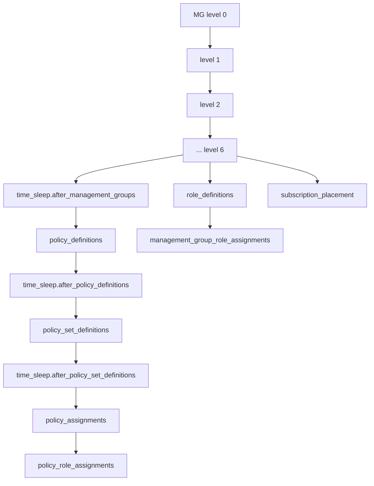
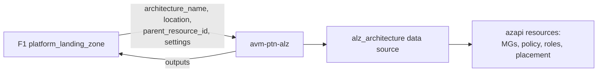

# Module: `avm-ptn-alz` (root module — governance engine)

| Field | Value |
|-------|-------|
| Repository | `Azure/terraform-azurerm-avm-ptn-alz` |
| Flavor | Terraform (AVM pattern module) |
| Entry files | `main.tf`, `main.management_groups.tf`, `main.policy_*.tf`, `main.role_*.tf`, `main.subscription_placement.tf`, `main.hierarchy_settings.tf`, `locals.tf` |
| Source URL | <https://github.com/Azure/terraform-azurerm-avm-ptn-alz> |
| Mode | deep |
| Last reviewed | 2026-06-17 |

## Purpose

The single root module that converts an **architecture definition** (resolved by the `alz` provider from
the ALZ Library) into live Azure governance resources. This doc focuses on the resource-creation flow and
the two design constraints that shape the module: the **AzAPI-only** resource strategy and the
**no-`depends_on`** rule of the `alz` provider.

## Inputs → data source → locals → resources

### 1. The data source (`main.tf`)

```hcl
data "alz_architecture" "this" {
  name                         = var.architecture_name
  root_management_group_id     = var.parent_resource_id
  location                     = var.location
  policy_assignments_to_modify = var.policy_assignments_to_modify
  policy_default_values        = var.policy_default_values
  default_non_compliance_message_settings = var.policy_assignment_non_compliance_message_settings
  override_policy_definition_parameter_assign_permissions_set   = var.override_..._set
  override_policy_definition_parameter_assign_permissions_unset = var.override_..._unset
}
```

It returns, per management group: `id`, `level`, `exists`, `display_name`, `parent_id`,
`policy_definitions`, `policy_set_definitions`, `policy_assignments`, `role_definitions`; plus a
top-level `policy_role_assignments` list.

### 2. The flattening (`locals.tf`)

| Local | Built from | Used by |
|-------|-----------|---------|
| `management_groups` + `management_groups_level_0..6` | `data...management_groups` (filtered by `level` & `!exists`) | `main.management_groups.tf` |
| `policy_definitions` | `mg.policy_definitions` (jsondecode) | `main.policy_definitions.tf` |
| `policy_set_definitions` | `mg.policy_set_definitions` | `main.policy_set_definitions.tf` |
| `policy_assignments` (+ `_final`) | `mg.policy_assignments`, filtered by `creation_enabled` | `main.policy_assignments.tf` |
| `policy_role_assignments` | `data...policy_role_assignments` (uuidv5 keys) | `main.policy_role_assignments.tf` |
| `role_definitions` | `mg.role_definitions` | `main.role_definitions.tf` |

### 3. The resources (one `for_each` per local)

Example — management groups are created level-by-level so parents exist before children:

```hcl
resource "azapi_resource" "management_groups_level_0" {
  for_each  = local.management_groups_level_0
  name      = each.value.id
  parent_id = "/"
  type      = var.resource_types.management_group   # Microsoft.Management/managementGroups@2023-04-01
  body = { properties = { details = { parent = { id = ".../${each.value.parent_id}" } }, displayName = each.value.display_name } }
  replace_triggers_external_values = [ each.value.parent_id ]
}
# ... identical pattern for levels 1..6
```

## Ordering model (race-condition mitigation)

Because management group + policy creation is subject to ARM eventual consistency, the module inserts
`time_sleep` and `terraform_data` barriers:



> `retries` (AzAPI) additionally retries on `AuthorizationFailed`, `ResourceNotFound`,
> `RoleAssignmentNotFound`, and out-of-scope policy errors.

## The no-`depends_on` constraint & `_dependencies` variables

The `alz` provider's data source is read **before** plan. Therefore:
- ❌ Do **not** put `depends_on` on the module, and do **not** pass unknown (known-after-apply) values directly.
- ✅ To order against *external* resources, pass their outputs into the `_dependencies` variables; the
  module wires them through `terraform_data.*_dependencies` so the relevant resources wait.
- ✅ For unknown *input values*, use string interpolation or `provider::azapi::*` functions to build ids.

```hcl
# Example from examples/management — ensure DCR/UAMI exist before policy assignments
module "alz" {
  source = "Azure/terraform-azurerm-avm-ptn-alz/azurerm"
  # ...
  policy_assignments_dependencies = [
    module.management.data_collection_rule_ids,
    module.management.resource_id,
    module.management.user_assigned_identity_ids,
  ]
  policy_default_values = { /* tokens consumed by assignments */ }
}
```

## Dependencies

**Upstream:** `alz` provider (architecture data) ← `alzlib` ← ALZ Library; `azapi` client config (tenant/sub).
**Downstream:** F1 `module.management_groups`; consumers reading `management_group_resource_ids` /
`policy_assignment_identity_ids` (e.g. AMBA, private-DNS, management examples).

## Module Dependency Diagram



## Notes & Gotchas

- **Levels 0–6** support up to a 7-deep MG hierarchy; only non-existing MGs are created (`exists` filter).
- `policy_assignments_to_modify[...].creation_enabled = false` is a convenience way to drop a single
  assignment (the recommended path is editing the custom library).
- `subscription_placement_destroy_behavior` controls where subs go on destroy (`parent` / `intermediate_root` / `custom` / `default`).
- `role_assignment_name_use_random_uuid = true` is recommended to avoid recreation churn (default `false` for back-compat).
- Replacement is keyed on `parent_id` (`replace_triggers_external_values`), so moving a MG re-creates it.

## Open Questions

- [ ] `TODO: verify` `main.policy_role_assignments.tf` handling of the `assignPermissions` metadata → role scope derivation (logic split across `locals.tf`).
- [x] Archetype → policy/role mapping lives in **G1 ALZ Library** — now documented: see [Azure-Landing-Zones-Library/_overview.md](../Azure-Landing-Zones-Library/_overview.md) and [module-platform-alz.md](../Azure-Landing-Zones-Library/module-platform-alz.md).
