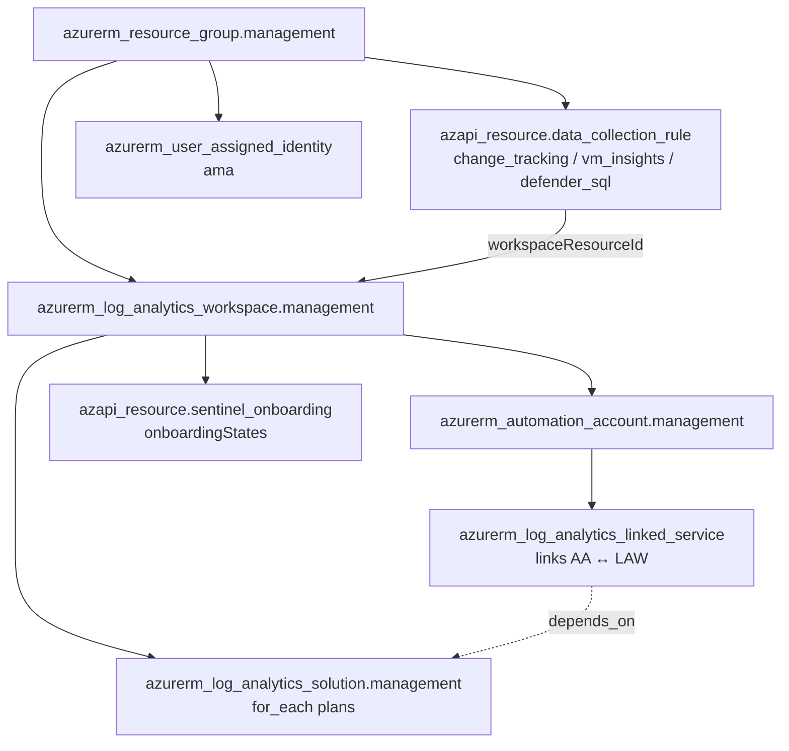
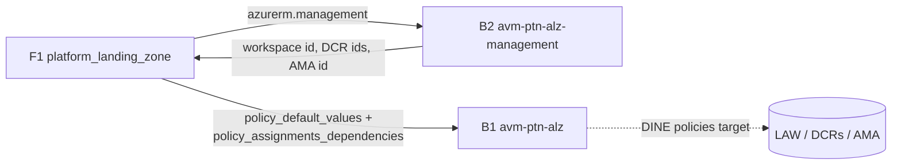

# Repository Overview: `Azure/terraform-azurerm-avm-ptn-alz-management`

| Field | Value |
|-------|-------|
| Repository | `Azure/terraform-azurerm-avm-ptn-alz-management` (catalog B2) |
| Flavor | Terraform (AVM pattern module) — registry `Azure/avm-ptn-alz-management/azurerm` |
| Role | **Management subscription resources**: Log Analytics + Automation + Sentinel + Azure Monitor DCRs + AMA identity |
| Entry file | root `main.tf` (+ `locals.*.tf`, `variables.tf`, `outputs.tf`, `terraform.tf`) |
| Latest release | `v0.9.0` (used by F1 as `module.management_resources`) |
| Source URL | <https://github.com/Azure/terraform-azurerm-avm-ptn-alz-management> |
| Mode | deep (remote analysis via GitHub) |
| Last reviewed | 2026-06-17 |

## Purpose

The AVM pattern module that deploys the **monitoring/management plane** of an Azure Landing Zone into the
**management subscription**. It is the second B-series module called by F1's `platform_landing_zone` (as
`module.management_resources`, version 0.9.0, with `providers = { azurerm = azurerm.management }`).

Unlike B1 (governance), this is a **flat resource module** — no child modules, no `alz` provider. It just
provisions the central observability + automation resources that ALZ policies (DINE) later point at via
`policy_default_values` (e.g. the Log Analytics workspace id, DCR ids, AMA identity id).

- Sits in the **Platform / Management** layer.
- Mixes the **azurerm** provider (RG, Log Analytics, Automation, solutions, UAMI) and the **azapi** provider (Data Collection Rules, Sentinel onboarding).
- Supports **greenfield** (create everything) and **brownfield / BYO** (reuse existing Log Analytics workspace or resource group).

## Features (from README)

- Deployment of **Log Analytics Workspace** (or bring-your-own via `log_analytics_workspace_id`).
- Optional **Azure Automation Account** (linked to the workspace).
- Optional **Azure Resource Group** creation.
- Customizable **Log Analytics Solution Plans**.
- Optional **Data Collection Rules** (3 built-in: change tracking, VM insights, Defender for SQL).
- Optional **User Assigned Managed Identity** (for the Azure Monitor Agent).
- Optional **Microsoft Sentinel** onboarding (off by default since v0.x — `sentinel_onboarding = null`).

## Providers & dependencies

| Provider | Version | Why |
|----------|---------|-----|
| `azurerm` | `~> 4.35` | RG, Log Analytics workspace + linked service + solutions, Automation account, user-assigned identity. |
| `azapi` | `~> 2.4` | Data Collection Rules + Sentinel onboarding (`Microsoft.SecurityInsights/onboardingStates`). |
| `modtm` | `~> 0.3` | AVM telemetry. |
| `random` | `~> 3.6` | Telemetry UUID. |

**Modules called:** none (flat resource module).

## Resources created

| Resource | Provider | Created when | Notes |
|----------|----------|--------------|-------|
| `azurerm_resource_group.management` | azurerm | `resource_group_creation_enabled` (default true) | The management RG. |
| `azurerm_log_analytics_workspace.management` | azurerm | `log_analytics_workspace_creation_enabled` (default true) | Central LAW; SKU `PerGB2018`, retention 30d by default. |
| `azurerm_automation_account.management` | azurerm | `linked_automation_account_creation_enabled` (default **false**) | Automation account. |
| `azurerm_log_analytics_linked_service.management` | azurerm | linked automation enabled | Links the Automation account to the LAW. |
| `azurerm_log_analytics_solution.management` | azurerm | `for_each` over `log_analytics_solution_plans` | Solutions (e.g. ContainerInsights, VMInsights). |
| `azapi_resource.data_collection_rule` | azapi | `for_each` over enabled DCRs | `Microsoft.Insights/dataCollectionRules@2021-04-01`. |
| `azapi_resource.sentinel_onboarding` | azapi | `sentinel_onboarding != null` | `Microsoft.SecurityInsights/onboardingStates@2024-03-01`, parent = the LAW. |
| `azurerm_user_assigned_identity.management` | azurerm | `for_each` over enabled UAMIs (`ama`) | Identity for the Azure Monitor Agent. |
| telemetry (`modtm_telemetry`, `random_uuid`) | modtm/random | `enable_telemetry` | AVM telemetry. |

### The three built-in Data Collection Rules

| DCR key | Default name | Purpose |
|---------|-------------|---------|
| `change_tracking` | `dcr-change-tracking` | Change Tracking & Inventory (files/services/software/registry → LAW). |
| `vm_insights` | `dcr-vm-insights` | VM Insights perf counters + Dependency Agent (ServiceMap). |
| `defender_sql` | `dcr-defender-sql` | Microsoft Defender for SQL telemetry/alerts. |

> All DCRs send to `local.log_analytics_workspace_id` and are built as inline AzAPI `body` JSON in
> `locals.data-collection-rules.tf`.

## Architecture



## Greenfield vs brownfield (BYO) logic

`locals.tf` decides whether to use created or pre-existing resources:

```hcl
resource_group_name = var.resource_group_creation_enabled
  ? azurerm_resource_group.management[0].name : var.resource_group_name
log_analytics_workspace_id = var.log_analytics_workspace_creation_enabled
  ? azurerm_log_analytics_workspace.management[0].id : var.log_analytics_workspace_id
```

- **BYO workspace:** set `log_analytics_workspace_creation_enabled = false` + `log_analytics_workspace_id` (validated as a full workspace resource id).
- **BYO resource group:** set `resource_group_creation_enabled = false` + `resource_group_name`.

## Required inputs

| Name | Type | Meaning |
|------|------|---------|
| `automation_account_name` | `string` | Name of the Automation account (used even if not yet created). |
| `location` | `string` | Azure region for the resources. |
| `resource_group_name` | `string` | Management resource group name (created or referenced). |

## Key optional inputs

`log_analytics_workspace_name`, `log_analytics_workspace_sku` (`PerGB2018`), `..._retention_in_days` (30),
`log_analytics_solution_plans` (default ContainerInsights + VMInsights), `data_collection_rules`
(per-DCR enable/name/location/tags), `linked_automation_account_creation_enabled` (false),
`sentinel_onboarding` (null = off; `{}` = on), `user_assigned_managed_identities.ama`,
`automation_account_*` (sku/identity/encryption/network), `tags`, `timeouts`.

## Outputs

| Output | Downstream use |
|--------|----------------|
| `resource_id` / `log_analytics_workspace` | The LAW id — consumed by ALZ policy `policy_default_values` + diagnostic settings. |
| `data_collection_rule_ids` | DCR ids — used by AMA/Change-Tracking/Defender policies (F1 passes these into B1 via `policy_assignments_dependencies`). |
| `user_assigned_identity_ids` | AMA identity ids — referenced by Azure Monitor Agent policy assignments. |
| `automation_account` / `automation_account_dsc_keys` | Automation account details (DSC endpoints, keys). |
| `log_analytics_workspace_keys` | Sensitive workspace keys. |
| `resource_group` | RG id/name. |

## Dependencies

**Upstream:** `azapi_client_config` (subscription id for building RG resource ids); a target management subscription (via `azurerm.management` alias in F1).
**Downstream:** **B1 `avm-ptn-alz`** consumes these outputs through F1 — the workspace id, DCR ids and AMA identity id feed Azure Policy `policy_default_values` so DINE policies can configure diagnostics/monitoring tenant-wide.



## Notes & Gotchas

- **Sentinel is off by default** (`feat!: sentinel no longer default`); the deprecated `SecurityInsights` solution-plan path was replaced by the `sentinel_onboarding` AzAPI resource. `main.deprecated.tf` keeps `moved`/`removed` blocks so existing state migrates without destroying the workspace.
- **Linked Automation account is off by default** (`linked_automation_account_creation_enabled = false`); F1 sets it false too (Automation is increasingly optional).
- **AzAPI for DCR + Sentinel** because those resource shapes/areas are better served by direct ARM bodies; everything else uses azurerm.
- The Automation account location can differ from `location` via `automation_account_location` (region-mapping requirement between LAW and Automation).
- `log_analytics_workspace_id` BYO value is regex-validated to a full workspace resource id.
- New terms captured in [glossary.md](../glossary.md): Data Collection Rule (DCR), Azure Monitor Agent (AMA), Change Tracking, VM Insights, Microsoft Sentinel, Automation Account, Log Analytics Solution, brownfield/BYO.

## Open Questions

- [ ] `TODO: verify` exact `change_tracking` Windows datasource block (only the Linux file settings were captured in the excerpt). **Same item as [module-avm-ptn-alz-management.md](module-avm-ptn-alz-management.md)'s change-tracking TODO; the equivalent DCR set is also referenced by D1 [caf-enterprise-scale](../terraform-caf-enterprise-scale/_overview.md).**
- [ ] `TODO: verify` whether F1 enables Sentinel/Automation by default in any scenario (toggled via `management_resource_settings` in the config-templating module).
