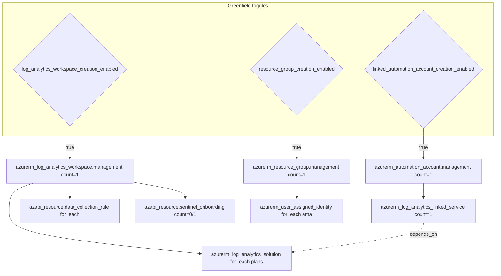
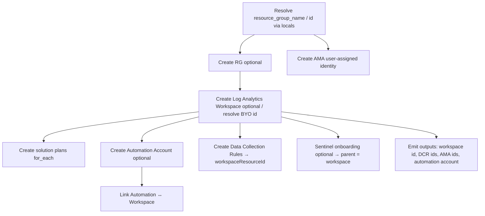

# Module: `avm-ptn-alz-management` (root module — management resources)

| Field | Value |
|-------|-------|
| Repository | `Azure/terraform-azurerm-avm-ptn-alz-management` |
| Flavor | Terraform (AVM pattern module, flat resources) |
| Entry files | `main.tf`, `locals.tf`, `locals.data-collection-rules.tf`, `locals.user-assigned-managed-identity.tf`, `outputs.tf` |
| Source URL | <https://github.com/Azure/terraform-azurerm-avm-ptn-alz-management> |
| Mode | deep |
| Last reviewed | 2026-06-17 |

## Purpose

The single root module that provisions the ALZ **management subscription** resources: a Log Analytics
workspace plus optional Automation, Sentinel onboarding, Azure Monitor Data Collection Rules, solutions,
and the Azure Monitor Agent identity. This doc focuses on the resource graph and the greenfield/brownfield
toggles.

## Inputs (grouped)

| Group | Key inputs |
|-------|-----------|
| Required | `automation_account_name`, `location`, `resource_group_name` |
| Resource group | `resource_group_creation_enabled` (true) |
| Log Analytics | `log_analytics_workspace_creation_enabled` (true), `log_analytics_workspace_id` (BYO), `log_analytics_workspace_name`, `_sku` (`PerGB2018`), `_retention_in_days` (30), `_daily_quota_gb`, `_internet_ingestion_enabled`, `_internet_query_enabled`, `_local_authentication_enabled`, `_allow_resource_only_permissions`, `_reservation_capacity_in_gb_per_day`, `_cmk_for_query_forced` |
| Solutions | `log_analytics_solution_plans` (default ContainerInsights + VMInsights) |
| Automation | `linked_automation_account_creation_enabled` (false), `automation_account_sku_name` (`Basic`), `_location`, `_identity`, `_encryption`, `_local_authentication_enabled`, `_public_network_access_enabled` |
| DCRs | `data_collection_rules.{change_tracking,vm_insights,defender_sql}` (enable/name/location/tags; defender adds `enable_collection_of_sql_queries_for_security_research`) |
| Sentinel | `sentinel_onboarding` (null = disabled; `{}` = enabled; `name`, `customer_managed_key_enabled`) |
| Identity | `user_assigned_managed_identities.ama` (enable/name/location/tags) |
| Cross-cutting | `tags`, `timeouts`, `enable_telemetry` |

## Resource graph (from `main.tf`)



## Deployment flow



## The greenfield/brownfield switch (`locals.tf`)

```hcl
resource_group_name = var.resource_group_creation_enabled
  ? azurerm_resource_group.management[0].name
  : var.resource_group_name

resource_group_resource_id = var.resource_group_creation_enabled
  ? azurerm_resource_group.management[0].id
  : provider::azapi::build_resource_id("/subscriptions/${data.azapi_client_config.current.subscription_id}",
      "Microsoft.Resources/resourceGroups", var.resource_group_name)

log_analytics_workspace_id = var.log_analytics_workspace_creation_enabled
  ? azurerm_log_analytics_workspace.management[0].id
  : var.log_analytics_workspace_id

log_analytics_workspace_name = var.log_analytics_workspace_creation_enabled
  ? azurerm_log_analytics_workspace.management[0].name
  : provider::azapi::parse_resource_id("Microsoft.OperationalInsights/workspaces", var.log_analytics_workspace_id).name
```

> Every downstream reference (DCRs, solutions, Sentinel, linked service) uses these `local.*` values, so the
> three BYO toggles cleanly swap created vs pre-existing resources without touching the rest of the graph.

## Outputs

| Output | Shape | Use |
|--------|-------|-----|
| `resource_id` | `string` | LAW resource id (the canonical handle). |
| `log_analytics_workspace` | `{ id, name, workspace_id }` | Curated workspace details. |
| `log_analytics_workspace_keys` | sensitive | Primary/secondary shared keys. |
| `data_collection_rule_ids` | `map(key → { id })` | DCR ids per rule. |
| `user_assigned_identity_ids` | `map(key → { id })` | AMA identity ids. |
| `automation_account` | `{ id, name, identity, dsc_server_endpoint, hybrid_service_url }` | Automation account details. |
| `automation_account_dsc_keys` | sensitive | DSC primary/secondary keys. |
| `resource_group` | `{ id, name }` | RG handle. |

## Dependencies

**Upstream:** target management subscription (provider alias); `azapi_client_config` for the subscription id.
**Downstream (via F1):** B1 `avm-ptn-alz` — the workspace id, DCR ids and AMA identity id are passed into
Azure Policy `policy_default_values`, and the resources are listed in B1's `policy_assignments_dependencies`
so DINE/monitoring policy assignments only create after these exist.

## Notes & Gotchas

- **Explicit `depends_on` on solutions:** `azurerm_log_analytics_solution.management` depends on the linked
  service so the Automation↔LAW link exists first.
- **`moved`/`removed` blocks** in `main.deprecated.tf` migrate the legacy `SecurityInsights` solution and
  the pre-BYO single workspace into the current addresses without destroy.
- **Sentinel parent is the workspace** (`parent_id = local.log_analytics_workspace_id`), not the RG.
- **Solutions key** is `"<publisher>/<product>"` and `solution_name = basename(product)`.

## Open Questions

- [ ] `TODO: verify` the full Windows change-tracking datasource block and the exact `vm_insights` dataFlows (Linux + perf captured). **Same item as [_overview.md](_overview.md)'s change-tracking TODO.**
