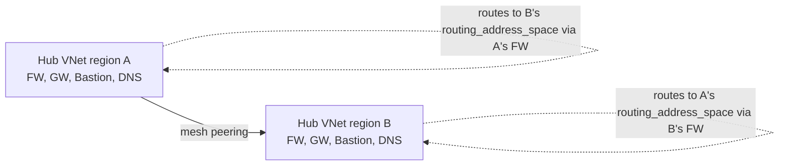
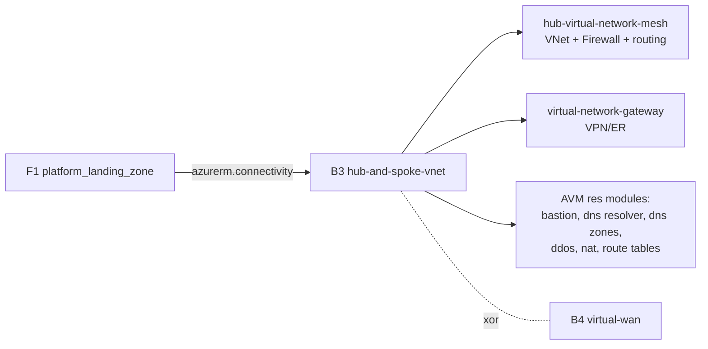

# Repository Overview: `Azure/terraform-azurerm-avm-ptn-alz-connectivity-hub-and-spoke-vnet`

| Field | Value |
|-------|-------|
| Repository | `Azure/terraform-azurerm-avm-ptn-alz-connectivity-hub-and-spoke-vnet` (catalog B3) |
| Flavor | Terraform (AVM pattern module) — registry `Azure/avm-ptn-alz-connectivity-hub-and-spoke-vnet/azurerm` |
| Role | **Hub-and-spoke connectivity**: hub VNet(s), Azure Firewall, gateways, Bastion, DNS, NAT, DDoS |
| Entry file | root `main.tf` (+ `locals.*.tf`, `main.ip_ranges.tf`, `variables.tf`, `outputs.tf`) |
| Latest release | `v0.17.1` (used by F1 as `module.hub_and_spoke_vnet`) |
| Source URL | <https://github.com/Azure/terraform-azurerm-avm-ptn-alz-connectivity-hub-and-spoke-vnet> |
| Mode | deep (remote analysis via GitHub) |
| Last reviewed | 2026-06-17 |

## Purpose

The AVM pattern module that deploys the **hub-and-spoke network topology** for an Azure Landing Zone. It
is one of the two mutually-exclusive connectivity options orchestrated by F1's `platform_landing_zone`
(this one as `module.hub_and_spoke_vnet`, v0.17.1, on the `azurerm.connectivity` + `azapi.connectivity`
providers; the alternative is B4 Virtual WAN).

It is a **composition module** — it declares almost no resources directly. Instead it wires together many
AVM **resource (`res`)** modules plus two **local sub-modules** (`hub-virtual-network-mesh` and
`virtual-network-gateway`), driven by a single rich `hub_virtual_networks` map input (keyed per region/hub).

- Platform / Connectivity layer.
- Multi-region: the `hub_virtual_networks` map can contain multiple hubs, optionally peered in a mesh.
- Almost everything is toggleable per-hub via `enabled_resources` (firewall, bastion, gateways, DNS, NAT…).

## Providers

| Provider | Version | Notes |
|----------|---------|-------|
| `azurerm` | `~> 4.0` | Most network resources (via AVM res modules); direct `azurerm_route` in the mesh module. |
| `azapi` | `~> 2.4` | Used by some underlying AVM modules + telemetry client config. |
| `modtm` / `random` | `~> 0.3` / `~> 3.5` | AVM telemetry. |

## Composed modules

### Top-level (`main.tf` + siblings)

| Local name | Source | Version | Role |
|------------|--------|---------|------|
| `hub_and_spoke_vnet` | `./modules/hub-virtual-network-mesh` (local) | — | ★ Hub VNets, subnets, peering mesh, **Azure Firewall**, firewall policy, routing. |
| `virtual_network_gateway` | `./modules/virtual-network-gateway` (local) | — | VPN + ExpressRoute gateways (per hub, `for_each`). |
| `bastion_host` | `Azure/avm-res-network-bastionhost/azurerm` | 0.6.0 | Azure Bastion. |
| `bastion_public_ip` | `Azure/avm-res-network-publicipaddress/azurerm` | 0.2.0 | Bastion public IP. |
| `ddos_protection_plan` | `Azure/avm-res-network-ddosprotectionplan/azurerm` | 0.3.0 | Shared DDoS plan. |
| `dns_resolver` | `Azure/avm-res-network-dnsresolver/azurerm` | 0.7.3 | Private DNS Resolver (inbound/outbound endpoints, rulesets). |
| `private_dns_zones` | `Azure/avm-ptn-network-private-link-private-dns-zones/azurerm` | 0.23.1 | Private Link private DNS zones + VNet links. |
| `private_dns_zone_auto_registration` | `Azure/avm-res-network-privatednszone/azurerm` | 0.4.3 | Auto-registration zone. |
| `gateway_route_table` / `_routes` | `Azure/avm-res-network-routetable/azurerm` (+ `//modules/route`) | 0.5.0 | Gateway subnet route table. |
| `regions` | `Azure/avm-utl-regions/azurerm` | 0.5.2 | Region metadata utility. |
| `virtual_network_ip_prefixes` / `virtual_network_subnet_ip_prefixes` | `Azure/avm-utl-network-ip-addresses/azurerm` | 0.1.0 | Auto IP/subnet prefix calculation. |

### Inside `modules/hub-virtual-network-mesh`

| Local name | Source | Version | Role |
|------------|--------|---------|------|
| `hub_virtual_networks` | `Azure/avm-res-network-virtualnetwork/azurerm` | 0.15.0 | The hub VNet(s). |
| `hub_virtual_network_subnets` | `…/azurerm//modules/subnet` | 0.15.0 | Subnets (firewall, gateway, bastion, dns-resolver, user). |
| `hub_virtual_network_peering` | `…/azurerm//modules/peering` | 0.15.0 | Mesh peering between hubs. |
| `hub_firewalls` | `Azure/avm-res-network-azurefirewall/azurerm` | 0.4.0 | **Azure Firewall** per hub. |
| `fw_policies` | `Azure/avm-res-network-firewallpolicy/azurerm` | 0.3.3 | Firewall policy. |
| `fw_default_ips` / `fw_management_ips` | `Azure/avm-res-network-publicipaddress/azurerm` | 0.2.0 | Firewall public IPs. |
| `hub_routing_firewall` / `hub_routing_user_subnets` | `Azure/avm-res-network-routetable/azurerm` | 0.3.1 | Route tables + `azurerm_route` mesh/default routes. |
| `nat_gateway` | `Azure/avm-res-network-natgateway/azurerm` | 0.3.2 | NAT Gateway. |

> So the **Azure Firewall is created in the mesh sub-module** (`main.firewall.tf`), not at the top level —
> which is why the top-level "Resources" list only shows telemetry.

## Architecture (single hub)

```mermaid
flowchart TD
    subgraph Hub VNet (per region)
        vnet[Hub VNet]
        fwsub[AzureFirewallSubnet] --> fw[Azure Firewall + Policy]
        gwsub[GatewaySubnet] --> gw[VPN / ExpressRoute GW]
        bassub[AzureBastionSubnet] --> bas[Azure Bastion]
        dnssub[dns-resolver subnet] --> dnsr[Private DNS Resolver]
        natgw[NAT Gateway]
    end
    ddos[(DDoS Protection Plan)] -. optional .-> vnet
    pdns[(Private DNS Zones + VNet links)] --> vnet
    fw --> rtfw[Firewall route table]
    rtfw --> usersub[User subnets routing]
    onprem[On-premises] --- gw
    vnet -- peering (mesh) --> vnet2[Other hub VNets]
```

## Multi-hub mesh



> `mesh_peering_enabled` + `routing_address_space` per hub drive peering and cross-hub route-table entries
> (each hub routes to the other hubs' address spaces via its own Azure Firewall private IP).

## Inputs

Largely a single map, plus naming/retry/timeouts:

| Name | Type | Meaning |
|------|------|---------|
| `hub_virtual_networks` | `map(object)` | ★ The hubs. Per-hub: `location` (required), `enabled_resources`, `hub_virtual_network` (name/address_space/parent_id/routing), `firewall`, `firewall_policy`, `bastion`, `virtual_network_gateways` (`express_route` + `vpn`), `nat_gateway`, `private_dns_zones`, `private_dns_resolver`, `subnets`, route-table entries. |
| `hub_and_spoke_networks_settings` | `object` | Shared/global settings incl. the shared `ddos_protection_plan`. |
| `default_naming_convention` (+ `_sequence`) | `object` | Name templates with `${location}`/`${sequence}` placeholders. |
| `retry` / `timeouts` / `tags` / `enable_telemetry` | — | Cross-cutting. |

**Per-hub `enabled_resources` defaults:** `firewall`, `firewall_policy`, `bastion`,
`virtual_network_gateway_express_route`, `virtual_network_gateway_vpn`, `private_dns_zones`,
`private_dns_resolver` all `true`; `nat_gateway` defaults vary (top-level var `false`, README mentions `true`).

**Default IP sizing** (`main.ip_ranges.tf`): hub default `/16` (auto `10.<index>.0.0/16` per hub), hub prefix `/22`; subnet sizes: bastion `/26`, firewall `/26`, firewall mgmt `/26`, gateway `/27`, dns_resolver `/28`.

## Outputs (grouped by hub key)

`virtual_network_resource_ids` / `_names` / `name`, `firewall_resource_ids` / `_names` /
`firewall_private_ip_addresses` / `_public_ip_addresses` / `firewall_policies`,
`dns_server_ip_addresses` (= firewall private IP or `hub_router_ip_address`), `bastion_host_resource_ids`
(+ public IP / DNS), `nat_gateways` / `nat_gateway_resource_ids`, `ddos_protection_plan_resource_id`,
`dns_resolver_resource_ids` / `dns_resolver_inbound_endpoint_ip_addresses`,
`private_dns_zone_resource_ids` / `_auto_registration_resource_ids`,
`virtual_network_gateway_resource_ids` (keyed `<hub>-express-route` / `<hub>-vpn`) + public IPs + connections,
`route_tables_firewall` / `_user_subnets` / `_gateway_resource_ids`.

## Dependencies

**Upstream:** a connectivity subscription (via F1's `azurerm.connectivity` alias); `hub_virtual_networks` settings from F1's `config-templating` module.
**Downstream:** the **firewall private IP** and **private DNS zones** are what ALZ workloads/spokes route through and resolve against; DDoS plan + DNS are referenced by other platform pieces. F1 selects this module **xor** B4 (Virtual WAN) via `local.connectivity_hub_and_spoke_vnet_enabled`.



## Notes & Gotchas

- **Composition over declaration:** the module's own resource list is just telemetry; the real resources come from ~13 top-level + ~9 mesh-level AVM/sub-modules.
- **Firewall drives routing:** `dns_server_ip_addresses` and cross-hub routes default to the **Azure Firewall private IP**; if no firewall, supply `hub_router_ip_address`.
- **Subnet naming is fixed** for some: `AzureFirewallSubnet`, `AzureFirewallManagementSubnet`, `GatewaySubnet`, `AzureBastionSubnet` — required by Azure.
- **`retry` defaults** to retrying on `ReferencedResourceNotProvisioned` (eventual consistency between dependent network resources).
- **Auto IP allocation** via `avm-utl-network-ip-addresses` means you can omit explicit address spaces and let the module carve subnets from the hub `/16`.
- **Standalone gateway counterpart:** the per-hub `virtual_network_gateway` logic mirrors the standalone gateway
  module [B9 `terraform-azurerm-vnet-gateway`](../terraform-azurerm-vnet-gateway/_overview.md) (now obsolete, superseded
  by `terraform-azurerm-avm-ptn-vnetgateway`) — useful as a reference for the VNG/connection/LNG resource shape.
- New terms captured in [glossary.md](../glossary.md): Azure Bastion, VPN Gateway, ExpressRoute Gateway, GatewaySubnet, Private DNS Resolver, DDoS Protection Plan, NAT Gateway, mesh peering, AVM resource module composition.

## Open Questions

- [x] **Resolved (via B9):** the `virtual-network-gateway` local sub-module deploys the same resource shape as the standalone [B9 `terraform-azurerm-vnet-gateway`](../terraform-azurerm-vnet-gateway/_overview.md) — a VPN **or** ExpressRoute `azurerm_virtual_network_gateway` + `azurerm_virtual_network_gateway_connection` + `azurerm_local_network_gateway` + `azurerm_public_ip` (per IP config) + the `GatewaySubnet` (+ optional route table) + `azurerm_express_route_circuit_peering`. (These are classic VNet-gateway resources, not the vWAN-native gateways of B4/B5.) `TODO: verify` only whether this AVM sub-module wraps them via azurerm or azapi.
- [ ] `TODO: verify` the `nat_gateway` enabled default discrepancy (top-level var default `false` vs README text `true`).
