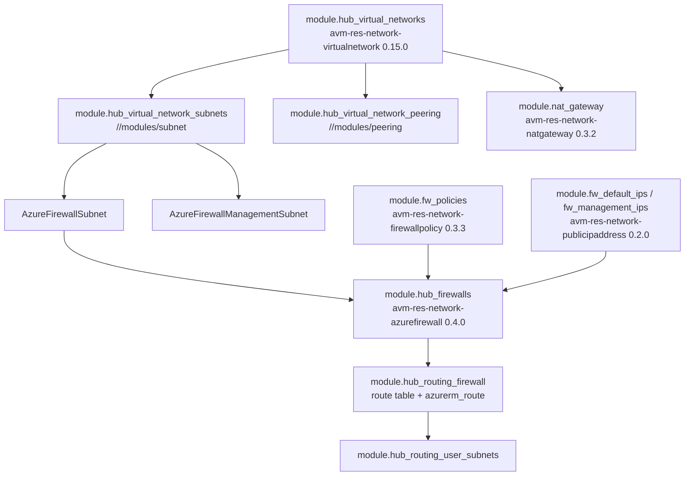
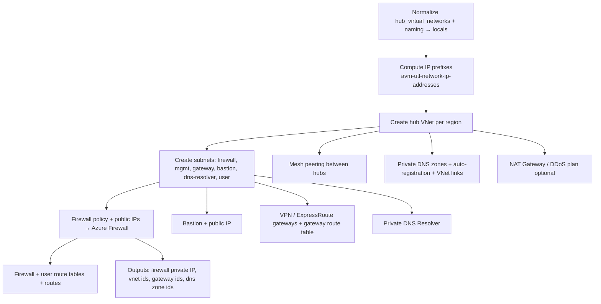

# Module: `avm-ptn-alz-connectivity-hub-and-spoke-vnet` (root + mesh sub-module)

| Field | Value |
|-------|-------|
| Repository | `Azure/terraform-azurerm-avm-ptn-alz-connectivity-hub-and-spoke-vnet` |
| Flavor | Terraform (AVM pattern module composing res modules) |
| Entry files | `main.tf`, `main.ip_ranges.tf`, `locals.*.tf`; sub-module `modules/hub-virtual-network-mesh/main*.tf` |
| Source URL | <https://github.com/Azure/terraform-azurerm-avm-ptn-alz-connectivity-hub-and-spoke-vnet> |
| Mode | deep |
| Last reviewed | 2026-06-17 |

## Purpose

This doc focuses on the **data flow** from the `hub_virtual_networks` map into the composed modules, and
on the **mesh sub-module** that owns the hub VNet + Azure Firewall + routing — the heart of the topology.

## Top-level composition (`main.tf`)

```hcl
module "hub_and_spoke_vnet" {
  source               = "./modules/hub-virtual-network-mesh"
  hub_virtual_networks = local.hub_virtual_networks   # the normalized per-hub map
  # ...
}

module "virtual_network_gateway" {
  source   = "./modules/virtual-network-gateway"
  for_each = local.virtual_network_gateways           # one per hub gateway (ER/VPN)
  # ...
}
# + bastion_host, bastion_public_ip, ddos_protection_plan, dns_resolver,
#   private_dns_zones, private_dns_zone_auto_registration, gateway_route_table(+routes),
#   regions, virtual_network_ip_prefixes, virtual_network_subnet_ip_prefixes
```

`locals.*.tf` per concern (`locals.firewall.tf`, `locals.gateways.tf`, `locals.dns.tf`,
`locals.dns_resolver.tf`, `locals.bastion.tf`, `locals.ddos.tf`, `locals.route_tables.tf`,
`locals.subnets.tf`, `locals.names.tf`) normalize the raw `hub_virtual_networks` map + naming convention
into per-module inputs, with `enabled` flags gating each `for_each`.

## The mesh sub-module (`modules/hub-virtual-network-mesh`)

This is the local module that actually builds each hub. Key resources/sub-modules:



Direct resources in the mesh module: `azurerm_route.firewall_default` (0.0.0.0/0 → firewall),
`azurerm_route.firewall_mesh` (to other hubs' ranges), `azurerm_route.user_subnets`, plus telemetry.

## Deployment flow



## Key inputs (per hub, from `hub_virtual_networks[<key>]`)

| Field | Meaning |
|-------|---------|
| `location` (required) | Region for the hub. |
| `enabled_resources` | Toggles: `firewall`, `firewall_policy`, `bastion`, `virtual_network_gateway_express_route`, `virtual_network_gateway_vpn`, `private_dns_zones`, `private_dns_resolver`, `nat_gateway`. |
| `hub_virtual_network` | `name`, `address_space`, `parent_id`, route-table toggles, `routing_address_space`, `mesh_peering_enabled`, `peering_names`, `hub_router_ip_address`, `dns_servers`, subnets, route entries. |
| `firewall` | SKU (`AZFW_VNet`/`AZFW_Hub`), tier (`Basic`/`Standard`/`Premium`), subnet prefixes, IP configs, management IP, zones. |
| `firewall_policy` | SKU, DNS proxy, threat intel, intrusion detection, insights (→ Log Analytics), TLS cert, identity. |
| `bastion` | SKU, scale units, feature toggles, public IP config. |
| `virtual_network_gateways` | `express_route` (circuits/peerings/connections) + `vpn` (P2S/S2S, BGP, IPsec, local network gateways). |
| `private_dns_zones` | Private Link zones, VNet links, regex filter, auto-registration zone. |
| `private_dns_resolver` | Inbound/outbound endpoints, forwarding rulesets. |
| `nat_gateway` | SKU, IP configs, zones, lock. |

## Outputs (consumed downstream)

- `firewall_private_ip_addresses` / `dns_server_ip_addresses` → spoke routing + DNS.
- `private_dns_zone_resource_ids` → Private Link resolution for workloads.
- `virtual_network_resource_ids` → spoke peering targets.
- `virtual_network_gateway_resource_ids` → hybrid connectivity.

## Dependencies

**Upstream:** connectivity subscription (provider alias); normalized settings from F1's config-templating.
**Downstream:** spokes/workloads peer to the hub VNet, route through the firewall, and resolve via the private DNS zones; mutually exclusive with B4 Virtual WAN.

## Notes & Gotchas

- **Two local sub-modules** (`hub-virtual-network-mesh`, `virtual-network-gateway`) keep the gateway logic
  separate from the VNet/firewall logic; everything else is upstream AVM `res` modules.
- **Cross-hub routing** is generated from each hub's `routing_address_space` and points at the peer hub's
  firewall private IP (`azurerm_route.firewall_mesh`).
- **Firewall route table** has `bgp_route_propagation_enabled = true`; the default internet route
  (`0.0.0.0/0`) points all egress at the Azure Firewall.
- **NAT Gateway + Firewall** can coexist (see `firewall-with-nat-gatewayv2` example) for SNAT scale.

## Open Questions

- [x] **Resolved (via B9):** the `virtual-network-gateway` sub-module deploys the same resources as the standalone [B9 `terraform-azurerm-vnet-gateway`](../terraform-azurerm-vnet-gateway/module-vnet-gateway.md) — VNG (VPN/ER) + gateway connections + local network gateways + public IPs (+ `GatewaySubnet`/route table). `TODO: verify` only whether this AVM sub-module uses azapi vs azurerm for those resources.
- [ ] `TODO: verify` how `private_dns_zones` (the `avm-ptn-network-private-link-private-dns-zones` module) expands the Private Link zone set + regex filter. **(Same open question as [B4](../avm-ptn-alz-connectivity-virtual-wan/module-avm-ptn-alz-connectivity-virtual-wan.md) — shared `avm-ptn-network-private-link-private-dns-zones` module.)**
