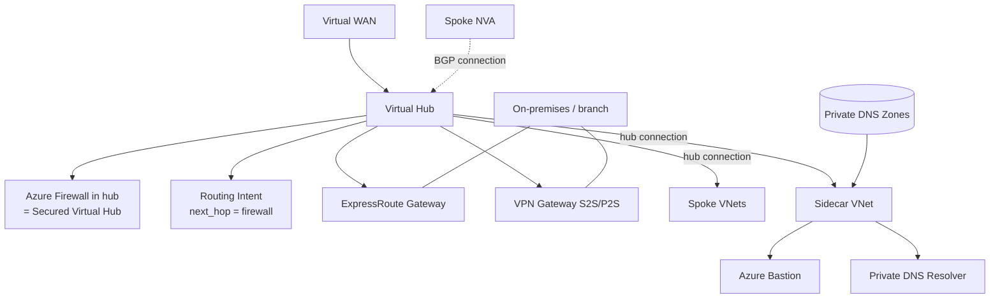
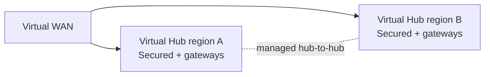
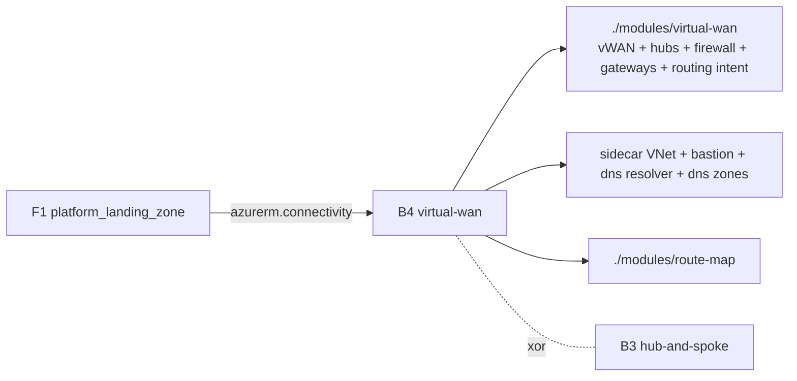

# Repository Overview: `Azure/terraform-azurerm-avm-ptn-alz-connectivity-virtual-wan`

| Field | Value |
|-------|-------|
| Repository | `Azure/terraform-azurerm-avm-ptn-alz-connectivity-virtual-wan` (catalog B4) |
| Flavor | Terraform (AVM pattern module) — registry `Azure/avm-ptn-alz-connectivity-virtual-wan/azurerm` |
| Role | **Virtual WAN connectivity**: vWAN + Virtual Hub(s), Secured Hub (firewall), gateways, sidecar VNet, DNS |
| Entry file | root `main.tf` (+ `locals.*.tf`, `main.ip_ranges.tf`, `variables.tf`, `outputs.tf`); local sub-modules under `modules/` |
| Latest release | `v0.16.0`; **F1 pins `v0.15.0`** as `module.virtual_wan` |
| Source URL | <https://github.com/Azure/terraform-azurerm-avm-ptn-alz-connectivity-virtual-wan> |
| Mode | deep (remote analysis via GitHub) |
| Last reviewed | 2026-06-17 |

## Purpose

The AVM pattern module that deploys the **Virtual WAN topology** for an Azure Landing Zone — the
Microsoft-managed alternative to B3's self-managed hub-and-spoke. It is the second connectivity option
orchestrated by F1's `platform_landing_zone` (as `module.virtual_wan`, v0.15.0, on the
`azurerm.connectivity` alias). F1 selects **B3 xor B4** via `local.connectivity_virtual_wan_enabled`.

Like B3, it is a **composition module**: its own resource list is just telemetry. The real work is done by
a rich local **`./modules/virtual-wan`** sub-module (plus sibling local sub-modules) and a set of top-level
AVM **resource (`res`)** modules — all driven by a single `virtual_hubs` map (keyed per region/hub).

- Platform / Connectivity layer.
- Multi-region: multiple virtual hubs in one Virtual WAN.
- Per-hub `enabled_resources` toggles (firewall, bastion, gateways, DNS, sidecar VNet…).

## Virtual WAN vs hub-and-spoke (B4 vs B3)

| Aspect | B3 hub-and-spoke (self-managed) | B4 Virtual WAN (Microsoft-managed) |
|--------|----------------------------------|------------------------------------|
| Hub | Hub **VNet** you own | **Virtual Hub** inside a **Virtual WAN** (managed) |
| Firewall | Azure Firewall in `AzureFirewallSubnet` | Azure Firewall **in the Virtual Hub** = **Secured Virtual Hub** (`AZFW_Hub` SKU) |
| Routing | Route tables + `azurerm_route` (UDRs) | **Routing Intent** (`next_hop = firewall`, destinations `Internet`/`PrivateTraffic`) |
| Spokes | VNet peering | **Virtual Network Connections** (`azurerm_virtual_hub_connection`) |
| Branch/on-prem | VPN/ER gateways in hub VNet | vWAN-native VPN/ER gateways + **VPN Sites** |
| Bastion/DNS | In the hub VNet | In a **sidecar VNet** (can't live in a Virtual Hub) |

## Providers

| Provider | Version | Notes |
|----------|---------|-------|
| `azurerm` | `~> 4.0` | vWAN, virtual hub, firewall, gateways, connections, route tables. |
| `azapi` | `~> 2.4` | Route maps (`Microsoft.Network/virtualHubs/routeMaps`) + telemetry client config. |
| `modtm` / `random` | `~> 0.3` / `~> 3.5` | AVM telemetry. |

## Composed modules

### Top-level (`main.tf`)

| Local name | Source | Version | Role |
|------------|--------|---------|------|
| `virtual_wan` | `./modules/virtual-wan` (local) | — | ★ vWAN + virtual hubs + firewalls + gateways + routing intents + VPN sites (gated `count = has_regions ? 1 : 0`). |
| `firewall_policy` | `Azure/avm-res-network-firewallpolicy/azurerm` | 0.3.3 | Firewall policy per hub. |
| `virtual_network_side_car` | `Azure/avm-res-network-virtualnetwork/azurerm` | 0.15.0 | **Sidecar VNet** (hosts Bastion / DNS resolver / gateways' subnets). |
| `bastion_host` / `bastion_public_ip` | `avm-res-network-bastionhost` / `…-publicipaddress` | 0.6.0 / 0.2.0 | Azure Bastion in the sidecar VNet. |
| `dns_resolver` | `Azure/avm-res-network-dnsresolver/azurerm` | 0.7.3 | Private DNS Resolver. |
| `private_dns_zones` | `Azure/avm-ptn-network-private-link-private-dns-zones/azurerm` | 0.23.1 | Private Link DNS zones + VNet links. |
| `private_dns_zone_auto_registration` | `Azure/avm-res-network-privatednszone/azurerm` | 0.4.3 | Auto-registration zone. |
| `ddos_protection_plan` | `Azure/avm-res-network-ddosprotectionplan/azurerm` | 0.3.0 | Shared DDoS plan. |
| `route_map` | `./modules/route-map` (local) | — | vWAN route maps (azapi). |
| `regions` / `virtual_network_ip_prefixes` / `virtual_network_subnet_ip_prefixes` | AVM utl | 0.5.2 / 0.1.0 | Region + IP-prefix utilities. |

### Inside `./modules/virtual-wan` (+ sibling local sub-modules)

| Resource / sub-module | Source | Creates |
|-----------------------|--------|---------|
| `azurerm_virtual_wan` | (in-module) | The Virtual WAN (gated; supports **BYO vWAN** via `virtual_wan.id`). |
| `virtual_hubs` | `../virtual-hub` → `azurerm_virtual_hub` | Virtual Hub(s). |
| `firewalls` | `../firewall` → `azurerm_firewall` (`virtual_hub{}` block) | **Secured Virtual Hub** firewall(s). |
| `azurerm_virtual_hub_routing_intent` | (in-module) | **Routing Intent** (next_hop = firewall). |
| `virtual_network_connections` | `../virtual-network-connection` → `azurerm_virtual_hub_connection` | Spoke connections. |
| `express_route_gateways` / `er_connections` | `../expressroute-gateway` / `…-connection` | ER gateway + circuit connections. |
| `vpn_site` | `../site-to-site-vpn-site` → `azurerm_vpn_site` | S2S VPN sites; + S2S VPN gateway + connections. |
| `azurerm_point_to_site_vpn_gateway` + `azurerm_vpn_server_configuration` | (in-module) | P2S VPN gateway + server config. |
| `azurerm_virtual_hub_bgp_connection` | (in-module) | **BGP connections** for NVA peering. |
| `azurerm_virtual_hub_route_table` | (in-module) | Custom hub route tables. |

## Architecture (single secured hub)

## Multi-region

> Hub-to-hub transit is managed by the Virtual WAN itself (no manual peering needed), controlled by
> `allow_branch_to_branch_traffic` and routing intents.

## Inputs

| Name | Type | Meaning |
|------|------|---------|
| `virtual_hubs` | `map(object)` | ★ Per-hub: `location` (required), `enabled_resources`, `hub` (address_prefix, sku, `hub_routing_preference`), `virtual_network_connections`, `express_route_circuit_connections`, `bgp_connections`, `p2s_gateway_vpn_server_configurations`, `p2s_gateways`, `routing_intents`, `vpn_site_connections`, `vpn_sites`, `sidecar_virtual_network`, `firewall`, `firewall_policy`, `bastion`, `virtual_network_gateways`, `private_dns_zones`, `private_dns_resolver`. |
| `virtual_wan_settings` | `object` | Shared: the `virtual_wan` block (incl. **BYO** `id`, `type`, `allow_branch_to_branch_traffic`, `office365_local_breakout_category`) + shared `ddos_protection_plan`. |
| `route_maps` | `map(object)` | vWAN route maps (rules + match criteria + actions). |
| `default_naming_convention` (+ `_sequence`) | `object` | Name templates with `${location}`/`${sequence}`. |
| `retry` / `timeouts` / `tags` / `enable_telemetry` | — | Cross-cutting. `retry` defaults handle vWAN-specific transient errors (`UpdateGatewayInProgress`, `CannotDeleteVirtualHubWhenItIsInUse`, `InUseVirtualWanCannotBeDeleted`). |

**Per-hub `enabled_resources` defaults** (all `true`): `firewall`, `firewall_policy`, `bastion`,
`virtual_network_gateway_express_route`, `virtual_network_gateway_vpn`, `private_dns_zones`,
`private_dns_resolver`, `sidecar_virtual_network`.

## Outputs (grouped by hub key unless noted)

`name` / `resource_id` (the vWAN), `virtual_hub_resource_ids` / `_names`,
`firewall_resource_ids` / `_names` / `firewall_private_ip_address` / `_public_ip_addresses` / `firewall_policy_resource_ids`,
`express_route_gateway_resource_ids` / `_resources`, `dns_server_ip_address`,
`bastion_host_resource_ids` (+ public IP / DNS), `private_dns_resolver_resource_ids` / `_resources`,
`private_dns_zone_resource_ids`, `sidecar_virtual_network_resource_ids` / `_resources`,
`virtual_hub_bgp_connection_resource_ids` (keyed `<hub>-<bgp>`), `route_map_resource_ids_by_name` / `_resources`.

## Dependencies

**Upstream:** a connectivity subscription (F1's `azurerm.connectivity` alias); `virtual_hubs` settings from F1's config-templating module.
**Downstream:** spokes connect via hub connections and route through the **Secured Virtual Hub** firewall (via routing intent); private DNS zones serve Private Link resolution. F1 selects this module **xor** B3.

## Notes & Gotchas

- **Secured Virtual Hub:** the firewall is created with a `virtual_hub { virtual_hub_id }` block (SKU
  `AZFW_Hub`) — it lives *inside* the managed hub, not in a subnet. Traffic is steered via **Routing Intent**, not UDRs.
- **Sidecar VNet is mandatory for Bastion/DNS:** Azure Bastion, Private DNS Resolver, and the AVM gateway
  modules can't be placed in a Virtual Hub, so they go in a connected "sidecar" VNet.
- **BYO Virtual WAN:** set `virtual_wan.id` to attach hubs/gateways to an existing vWAN (the module then
  skips creating one — `create_virtual_wan = var.virtual_wan_id == null`).
- **`has_regions` gate:** the entire `./modules/virtual-wan` is `count = has_regions ? 1 : 0`, so with no
  hubs nothing vWAN-related is created.
- **Routing Intent destinations** are `Internet` / `PrivateTraffic`, with `next_hop = <firewall id>`
  resolved from the `next_hop_firewall_key`.
- **Route maps** (azapi `routeMaps@2025-05-01`) allow BGP AS-path/community/prefix transformations on connections.
- **`moved` blocks** throughout migrate older flat resources into the new sub-module addresses.
- New terms captured in [glossary.md](../glossary.md): Virtual Hub, Secured Virtual Hub, Routing Intent, Virtual Hub Connection, Sidecar VNet, VPN Site, P2S/S2S VPN Gateway (vWAN), Route Map, BYO Virtual WAN.

## Open Questions

- [x] **Resolved (via B5):** the per-hub `virtual_network_gateways` block targets **vWAN-native gateways inside the Virtual Hub** — the `virtual-wan` sub-module (= [B5 `avm-ptn-virtualwan`](../avm-ptn-virtualwan/_overview.md) code) creates ER/S2S/P2S gateways in the hub, not a sidecar `GatewaySubnet`. The sidecar VNet in B4 exists only for DDoS + Private DNS links (which vWAN hubs can't host), never for gateways.
- [x] Relationship between this repo's local `./modules/virtual-wan` and the standalone **B5 `avm-ptn-virtualwan`**: confirmed — B5 was **deprecated and its code migrated into this repo's `virtual-wan` submodule**. B5 is the standalone ancestor; the submodule is the living copy. See [avm-ptn-virtualwan/_overview.md](../avm-ptn-virtualwan/_overview.md).
