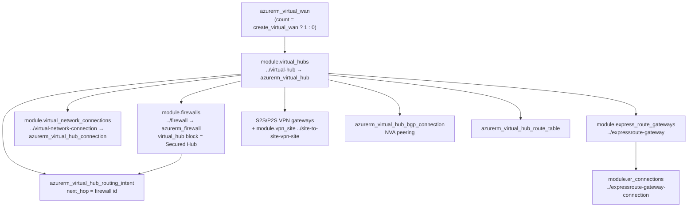
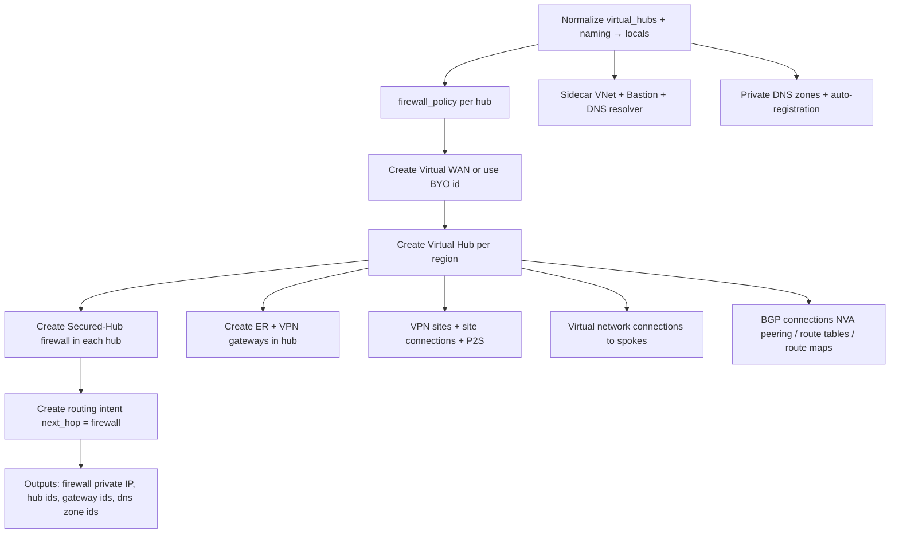

# Module: `avm-ptn-alz-connectivity-virtual-wan` (root + virtual-wan sub-module)

| Field | Value |
|-------|-------|
| Repository | `Azure/terraform-azurerm-avm-ptn-alz-connectivity-virtual-wan` |
| Flavor | Terraform (AVM pattern module composing local sub-modules + res modules) |
| Entry files | `main.tf`, `locals.*.tf`, `main.ip_ranges.tf`; sub-module `modules/virtual-wan/main*.tf` |
| Source URL | <https://github.com/Azure/terraform-azurerm-avm-ptn-alz-connectivity-virtual-wan> |
| Mode | deep |
| Last reviewed | 2026-06-17 |

## Purpose

This doc focuses on the **data flow** from the `virtual_hubs` map into the composed modules, and on the
local **`./modules/virtual-wan`** sub-module that owns the Virtual WAN, Virtual Hub(s), Secured-Hub
firewall, gateways and routing intents — the heart of the topology.

## Top-level composition (`main.tf`)

```hcl
module "firewall_policy" {                 # avm-res-network-firewallpolicy 0.3.3, for_each hub
  source = "Azure/avm-res-network-firewallpolicy/azurerm"
  # ...
}

module "virtual_wan" {                      # ★ the local vWAN sub-module
  source = "./modules/virtual-wan"
  count  = local.has_regions ? 1 : 0
  virtual_wan_id        = local.virtual_wan.id   # BYO support
  virtual_hubs          = local.virtual_hubs
  firewalls             = local.firewalls
  routing_intents       = local.routing_intents
  expressroute_gateways = local.virtual_network_gateways_express_route
  vpn_gateways          = local.virtual_network_gateways_vpn
  vpn_sites             = local.vpn_sites
  # + bgp_connections, er_circuit_connections, p2s_*, virtual_network_connections, ...
}

module "virtual_network_side_car" {         # avm-res-network-virtualnetwork 0.15.0
  source = "Azure/avm-res-network-virtualnetwork/azurerm"
  # hosts Bastion / DNS resolver subnets
}
# + bastion_host, bastion_public_ip, dns_resolver, private_dns_zones,
#   private_dns_zone_auto_registration, ddos_protection_plan, route_map, regions, ip-prefix utils
```

`locals.*.tf` per concern (`locals.firewall.tf`, `locals.gateways.tf`, `locals.dns.tf`,
`locals.dns_resolver.tf`, `locals.bastion.tf`, `locals.ddos.tf`, `locals.routing_intents.tf`,
`locals.bgp_connections.tf`, `locals.vpn_sites.tf`, `locals.virtual.network.tf`, `locals.names.tf`)
normalize the raw `virtual_hubs` map + naming convention into per-module inputs, with `enabled` flags
gating each.

## The `virtual-wan` sub-module (`modules/virtual-wan`)



BYO logic (`modules/virtual-wan/main.tf`):

```hcl
locals {
  create_virtual_wan         = var.virtual_wan_id == null
  effective_virtual_wan_id   = local.create_virtual_wan ? azurerm_virtual_wan.virtual_wan[0].id : var.virtual_wan_id
  effective_virtual_wan_name = local.create_virtual_wan ? azurerm_virtual_wan.virtual_wan[0].name : provider::azapi::parse_resource_id("Microsoft.Network/virtualWans", var.virtual_wan_id).name
}
```

The Secured-Hub firewall (`modules/firewall/main.tf`):

```hcl
resource "azurerm_firewall" "fw" {
  for_each            = var.firewalls
  sku_name            = each.value.sku_name   # AZFW_Hub
  firewall_policy_id  = each.value.firewall_policy_id
  virtual_hub {
    virtual_hub_id  = each.value.virtual_hub_id
    public_ip_count = each.value.vhub_public_ip_count
  }
}
```

Routing intent (`modules/virtual-wan/main.network.tf`):

```hcl
resource "azurerm_virtual_hub_routing_intent" "routing_intent" {
  for_each       = local.routing_intents
  virtual_hub_id = module.virtual_hubs.resource_object[each.value.virtual_hub_key].id
  dynamic "routing_policy" {
    for_each = each.value.routing_policies
    content {
      destinations = routing_policy.value.destinations    # Internet / PrivateTraffic
      next_hop     = module.firewalls.resource_object[routing_policy.value.next_hop_firewall_key].id
    }
  }
}
```

## Deployment flow



## Key inputs (per hub, from `virtual_hubs[<key>]`)

| Field | Meaning |
|-------|---------|
| `location` (required) | Region for the hub. |
| `enabled_resources` | Toggles: firewall, firewall_policy, bastion, ER gateway, VPN gateway, private_dns_zones, private_dns_resolver, sidecar_virtual_network. |
| `hub` | `address_prefix` (recommend `/23`), `sku`, `hub_routing_preference` (`ExpressRoute`/`VpnGateway`/`ASPath`), `virtual_router_auto_scale_min_capacity`. |
| `firewall` / `firewall_policy` | `AZFW_Hub` SKU, tier, zones, `vhub_public_ip_count`; policy DNS/threat-intel/IDPS/insights/TLS. |
| `virtual_network_connections` | Spoke `azurerm_virtual_hub_connection`s (+ routing, internet security). |
| `routing_intents` | Routing policies (`destinations`, `next_hop_firewall_key`). |
| `express_route_circuit_connections` / `vpn_site_connections` / `vpn_sites` | Hybrid connectivity. |
| `bgp_connections` | NVA BGP peers (`peer_asn` ≠ 65515, `peer_ip`). |
| `sidecar_virtual_network` | VNet for Bastion/DNS/gateways (address space, subnets, connection settings). |
| `bastion` / `private_dns_zones` / `private_dns_resolver` | As in B3, but attached to the sidecar VNet. |

## Outputs (consumed downstream)

- `firewall_private_ip_address` → spoke routing reference (though vWAN uses routing intent, not UDRs).
- `virtual_hub_resource_ids` → spoke `virtual_network_connection` targets.
- `private_dns_zone_resource_ids` → Private Link resolution.
- `express_route_gateway_resource_ids` / VPN gateway ids → hybrid connectivity.

## Dependencies

**Upstream:** connectivity subscription (provider alias); normalized settings from F1's config-templating.
**Downstream:** spokes connect to the virtual hub and route through the Secured-Hub firewall; mutually exclusive with B3.

## Notes & Gotchas

- **Local sub-module sprawl:** `modules/` contains `virtual-wan`, `virtual-hub`, `firewall`,
  `virtual-network-connection`, `expressroute-gateway(-connection)`, `site-to-site-vpn-site`, `route-map` —
  the pattern composes its own sub-modules rather than referencing B5 via the registry (though the
  `virtual-wan` sub-module README mirrors B5 `avm-ptn-virtualwan`).
- **Routing Intent replaces UDRs** — this is the vWAN-native way to force traffic through the firewall.
- **`peer_asn` for BGP connections must not be `65515`** (the Azure-assigned vHub ASN).
- **`moved` blocks** migrate older flat `azurerm_*` resources into the new sub-module addresses.

## Open Questions

- [x] **Resolved (via B5):** B4's `virtual-wan` submodule is **B5's code** ([avm-ptn-virtualwan](../avm-ptn-virtualwan/_overview.md)), so its gateway sub-modules create the **vWAN-native** gateways B5 documents — ExpressRoute gateway (`./modules/expressroute-gateway`) + ER circuit connections; S2S VPN gateway + VPN sites + site connections; P2S VPN gateway + `azurerm_vpn_server_configuration`. (Distinct from B3/B9's classic VNet-gateway resources.)
- [ ] `TODO: verify` how `private_dns_zones` (the `avm-ptn-network-private-link-private-dns-zones` module) expands the Private Link zone set + regex filter. **(Same open question as [B3](../avm-ptn-alz-connectivity-hub-and-spoke-vnet/module-avm-ptn-alz-connectivity-hub-and-spoke-vnet.md) — shared `avm-ptn-network-private-link-private-dns-zones` module.)**
