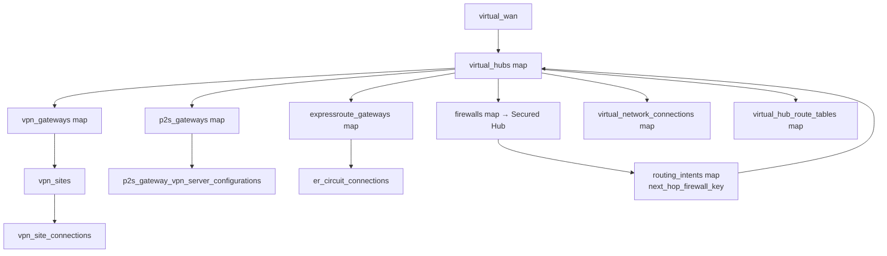

# Repository Overview: `Azure/terraform-azurerm-avm-ptn-virtualwan`

| Field | Value |
|-------|-------|
| Repository | `Azure/terraform-azurerm-avm-ptn-virtualwan` (catalog B5) |
| Registry | `Azure/avm-ptn-virtualwan/azurerm` (latest v0.14.1) |
| Flavor | Terraform — AVM **pattern** module (HCL 92%) |
| Role | **Generic Virtual WAN building block** — vWAN + Virtual Hubs + gateways + Secured-Hub firewall + routing intent |
| Status | ⚠️ **DEPRECATED + archived** (Jun 2, 2026). Code **migrated into B4's `virtual-wan` submodule**. |
| Providers | azapi `~>2.4`, azurerm `~>4.0`, modtm `~>0.3`, random `~>3.6`; Terraform `~>1.7` |
| Counts | 17 resources, 25 inputs, 27 outputs, 8 local submodules |
| Source URL | <https://github.com/Azure/terraform-azurerm-avm-ptn-virtualwan> |
| Mode | deep (remote analysis via GitHub) |
| Last reviewed | 2026-06-17 |

## Purpose

A focused AVM pattern module that builds a complete **Azure Virtual WAN hub network**: the vWAN, one or more
**Virtual Hubs**, optional **Secured Virtual Hub** (Azure Firewall inside the hub), **routing intent**, and the
full set of gateways — **S2S VPN** (+ VPN sites/connections), **P2S VPN** (+ server configs), and
**ExpressRoute** (+ circuit connections) — plus VNet connections and hub route tables.

It is the **generic vWAN construct**: it knows nothing about ALZ archetypes/policy. The ALZ-specific
connectivity module **B4 `avm-ptn-alz-connectivity-virtual-wan`** wraps this building block (today as a
**submodule**), adding the secured-hub/DDoS/DNS/sidecar-VNet conventions.

> **Deprecation:** per the README, *"The code for this module was migrated to a submodule
> [here](…/avm-ptn-alz-connectivity-virtual-wan/…/submodules/virtual-wan)."* So **B5 is the standalone
> ancestor of the `./modules/virtual-wan` sub-module documented inside B4** — same code, now living inside B4.
> Existing versions keep working; new deployments should use B4. See
> [avm-ptn-alz-connectivity-virtual-wan/_overview.md](../avm-ptn-alz-connectivity-virtual-wan/_overview.md).

## The map-of-objects model

Like B3/B4, B5 is driven by a central **`virtual_hubs`** map; every other capability is a map of objects that
references a hub (or a gateway/site) by an **arbitrary key** (`virtual_hub_key`, `vpn_gateway_key`,
`express_route_gateway_key`, `next_hop_firewall_key`, …). Keys are deliberately arbitrary to avoid
"known-after-apply" issues in Terraform `for_each`.

## Module composition (8 local submodules)

The root composes per-capability local submodules (`modules/*`), each instantiated `for_each` over the
relevant map:

| Module call | Source | Builds |
|-------------|--------|--------|
| `virtual_hubs` | `./modules/virtualhub` | Virtual Hub resources. |
| `firewalls` | `./modules/firewall` | Azure Firewall in the hub (Secured Virtual Hub). |
| `express_route_gateways` | `./modules/expressroute-gateway` | ER gateways in the hub. |
| `er_connections` | `./modules/expressroute-gateway-conn` | ER circuit connections. |
| `vpn_gateway` | `./modules/site-to-site-gateway` | S2S VPN gateways. |
| `vpn_site` | `./modules/site-to-site-vpn-site` | VPN sites (on-prem/branch). |
| `vpn_site_connection` | `./modules/site-to-site-gateway-conn` | VPN site connections. |
| `virtual_network_connections` | `./modules/vnet-conn` | Spoke VNet → hub connections. |

Root-level resources (not in submodules): `azurerm_virtual_wan`, `azurerm_virtual_hub_route_table`,
`azurerm_virtual_hub_routing_intent`, `azurerm_point_to_site_vpn_gateway`,
`azurerm_vpn_server_configuration`, `azurerm_resource_group` (optional), + modtm/random telemetry.

> File layout confirms the split: `main.tf`, `main.network.tf`, `main.firewall.tf`,
> `main.express-route-gateway.tf`, `main.s2s-vpn-gateway.tf`, `main.p2s-vpn-gateway.tf`,
> `main.vpn-gatewya.tf` [sic], `locals.tf`, `outputs.tf` + `outputs.standard.tf`, `terraform.tf`.

## Inputs (selected — 25 total)

### Required
| Input | Meaning |
|-------|---------|
| `location` | The Virtual WAN location (hubs set their own `location` in the `virtual_hubs` map). |
| `resource_group_name` | RG for the vWAN + children; created if `create_resource_group = true`. |
| `virtual_wan_name` | Name of the Virtual WAN. |

### Optional (the capability maps)
`virtual_hubs`, `firewalls`, `routing_intents`, `vpn_gateways`, `vpn_sites`, `vpn_site_connections`,
`p2s_gateways`, `p2s_gateway_vpn_server_configurations`, `expressroute_gateways`, `er_circuit_connections`,
`virtual_network_connections`, `virtual_hub_route_tables`, `diagnostic_settings_azure_firewall` — all
`map(object(...))`, default `{}`.

### Optional (vWAN-level scalars)
| Input | Default | Meaning |
|-------|---------|---------|
| `type` | `Standard` | Basic / Standard. |
| `allow_branch_to_branch_traffic` | `true` | Global-transit branch↔branch. |
| `disable_vpn_encryption` | `false` | Toggle VPN encryption. |
| `bgp_community` / `office365_local_breakout_category` | – / `None` | BGP community; O365 breakout. |
| `create_resource_group` | `false` | Create vs reuse RG. |
| `tags` / `virtual_wan_tags` / `resource_group_tags` | – | Tagging. |
| `enable_telemetry` | `true` | AVM telemetry. |

## Outputs (selected — 27 total)

`resource_id` / `virtual_wan_id` / `name`, `resource_group_name`, `virtual_hub_resource_ids[_names]`,
`firewall_resource_ids[_by_hub_key]`, `firewall_private_ip_address[_by_hub_key]`,
`firewall_public_ip_addresses[_by_hub_key]`, `vpn_gateway_resource_ids[_names]`, `s2s_vpn_gw[_id]`,
`p2s_vpn_gw_id` / `p2s_vpn_gw_resource_ids[_names]`, `ergw[_id]` / `ergw_resource_ids_by_hub_key`,
`diagnostic_settings_azure_firewall_resource_ids`, `resource` (full outputs).

> The **`firewall_private_ip_address_by_hub_key`** output is the key one for ALZ: the hub firewall's private
> IP is what spoke routing / routing intent uses as the next hop (the same role documented in B3/B4).

## Resources Created

Virtual WAN, Virtual Hub(s), Virtual Hub route tables, routing intent, Azure Firewall (Secured Hub), S2S VPN
gateway + VPN sites + VPN site connections, P2S VPN gateway + VPN server configuration, ExpressRoute gateway +
circuit connections, VNet connections, optional resource group, firewall diagnostic settings.

## Dependencies

**Upstream:** azurerm/azapi providers; the operator-supplied hub/gateway maps. **Downstream:** **B4
`avm-ptn-alz-connectivity-virtual-wan`** consumes this (now as its `virtual-wan` submodule) and is itself
called by F1's `platform_landing_zone` starter. No dependency on the governance stack (G1–G3/B1).

## Notes & Gotchas

- **Deprecated → use B4.** B5 and B4's `virtual-wan` submodule are the **same code**; B4 adds the ALZ
  conventions (DDoS/DNS/sidecar VNet) around it.
- **Generic, not ALZ-aware** — no archetype/policy/management-group logic; it's pure vWAN networking.
- **Secured Virtual Hub** = a `firewalls` entry with `sku_name = AZFW_Hub` deployed into a hub; **routing
  intent** then steers `Internet`/`PrivateTraffic` through it via `next_hop_firewall_key`.
- **Everything keys off `virtual_hubs`** — the arbitrary-key map pattern (avoids unknown-key `for_each`
  errors) is identical to B3/B4; learn it once, reuse across all three.
- **AzAPI + azurerm + modtm** providers — standard AVM stack; `modtm`/`random` are telemetry only.

## Open Questions

- [ ] `TODO: verify` exact `main.tf` wiring of `routing_intents` → firewall private IP (read via README feature list + the `next_hop_firewall_key` input; `github_repo` index was unavailable at analysis time).
- [ ] `TODO: verify` whether B5 and B4's submodule have diverged at all since the migration, or are kept byte-identical.
