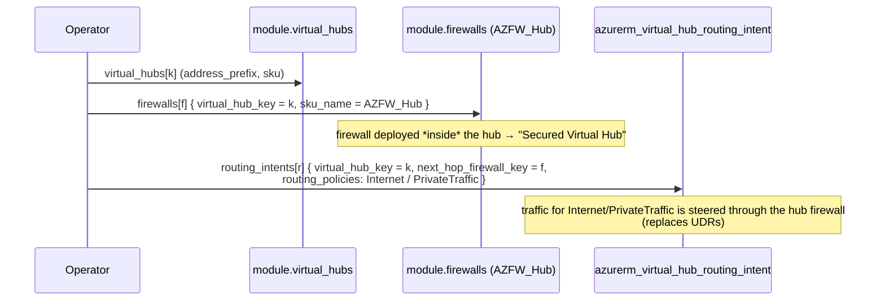

# Module: `avm-ptn-virtualwan` (root) — generic Virtual WAN building block

| Field | Value |
|-------|-------|
| Repository | `Azure/terraform-azurerm-avm-ptn-virtualwan` |
| Entry | root `main.tf` (+ `main.*.tf` per capability) |
| Registry | `Azure/avm-ptn-virtualwan/azurerm` v0.14.1 |
| Source URL | <https://github.com/Azure/terraform-azurerm-avm-ptn-virtualwan> |
| Mode | deep |
| Last reviewed | 2026-06-17 |

## Purpose

Deep-dive on how the root module turns the operator's capability maps into a working Virtual WAN topology:
the vWAN + hubs, the Secured-Hub firewall, routing intent, and the three gateway families (S2S/P2S/ER). It's a
**composition module** — almost every resource is created by a local `modules/*` submodule iterated with
`for_each` over a map; the root only owns the vWAN, hub route tables, routing intent, P2S gateway/server-config,
and the optional resource group.

## Data flow (map → submodule → resource)

```mermaid
flowchart TD
    subgraph inputs[Operator inputs]
      vwn[virtual_wan_name + type]
      vhm[virtual_hubs map]
      fwm[firewalls map]
      gwm[vpn_gateways / p2s_gateways / expressroute_gateways]
      cxn[vpn_sites / *_connections / virtual_network_connections]
      rim[routing_intents map]
    end
    vwn --> vw[azurerm_virtual_wan @ root]
    vhm --> mvh[module.virtual_hubs<br/>for_each hub] --> vh[(Virtual Hub)]
    fwm --> mfw[module.firewalls<br/>for_each fw] --> fw[(Azure Firewall in hub)]
    gwm --> mgw[module.vpn_gateway / express_route_gateways<br/>+ root p2s gateway] --> gw[(Gateways)]
    cxn --> mcx[module.vpn_site(_connection) / virtual_network_connections] --> cx[(Sites + Connections)]
    rim --> ri[azurerm_virtual_hub_routing_intent @ root]
    fw -.private IP next hop.-> ri
```

## Per-capability wiring

| File | Resource(s) | Keyed by |
|------|-------------|----------|
| `main.tf` | `azurerm_virtual_wan`, `azurerm_resource_group` (opt), `module.virtual_hubs`, `azurerm_virtual_hub_route_table`, `azurerm_virtual_hub_routing_intent` | — / `virtual_hubs` |
| `main.firewall.tf` | `module.firewalls` (Azure Firewall, `AZFW_Hub`) + diag settings | `firewalls` → `virtual_hub_key` |
| `main.s2s-vpn-gateway.tf` | `module.vpn_gateway`, `module.vpn_site`, `module.vpn_site_connection` | `vpn_gateways` / `vpn_sites` / `vpn_site_connections` |
| `main.p2s-vpn-gateway.tf` | `azurerm_point_to_site_vpn_gateway`, `azurerm_vpn_server_configuration` | `p2s_gateways` / `p2s_gateway_vpn_server_configurations` |
| `main.express-route-gateway.tf` | `module.express_route_gateways`, `module.er_connections` | `expressroute_gateways` / `er_circuit_connections` |
| `main.network.tf` | `module.virtual_network_connections` | `virtual_network_connections` → `virtual_hub_key` |

### Cross-references resolved by key (not by id)
- A firewall references its hub via `virtual_hub_key`.
- A routing intent references its firewall via `next_hop_firewall_key` (so the module looks up the correct
  firewall resource id / private IP — no need to pass ids around).
- A VPN site connection references both `vpn_gateway_key` and `remote_vpn_site_key`.
- An ER circuit connection references `express_route_gateway_key`.

This **key-indirection** is what lets the whole topology be declared as flat maps while Terraform still
resolves dependencies correctly at plan time.

## Secured Virtual Hub + Routing Intent (the ALZ-relevant path)



This is exactly the **Secured Virtual Hub + Routing Intent** mechanism documented in B4 — because B4's
`virtual-wan` submodule *is* this module.

## Inputs / Outputs

See [_overview.md](./_overview.md) for the full tables. The most consequential:
- **In:** `virtual_hubs` (the spine), `firewalls`, `routing_intents`, the gateway maps.
- **Out:** `firewall_private_ip_address_by_hub_key` (next-hop for spoke routing), `virtual_hub_resource_ids`,
  `vpn_gateway_resource_ids`, `ergw_resource_ids_by_hub_key`.

## Resources Created

vWAN, Virtual Hub(s) + route tables + routing intent, Azure Firewall (Secured Hub) + diag settings, S2S VPN
gateway + sites + connections, P2S VPN gateway + server config, ER gateway + circuit connections, VNet
connections, optional RG. (17 distinct resource types incl. telemetry.)

## Dependencies

**Upstream:** azurerm/azapi; operator maps. **Downstream:** **B4** (as its `virtual-wan` submodule) → F1
starter. No link to the governance stack.

## Notes & Gotchas

- **Composition, not monolith** — the root is mostly `module "x" { for_each = var.x_map }` calls; the real
  resource schemas live in `modules/*`.
- **Map keys are arbitrary + stable** — never use a computed/unknown value as a map key (the README repeats
  this for every map); it breaks `for_each`.
- **P2S is root-level, S2S/ER are submodules** — minor asymmetry to be aware of when reading the code.
- **`outputs.standard.tf`** holds the AVM-standard outputs (`resource`, `resource_id`); `outputs.tf` holds the
  vWAN-specific maps.
- **Deprecated** — treat as read-only reference; the living copy is B4's submodule.

## Open Questions

- [ ] `TODO: verify` the exact `locals.tf` flattening that joins `vpn_site_connections` → `vpn_links` → gateway link index (multi-level map/list flatten) — described from the input schema, not the source (index unavailable).
