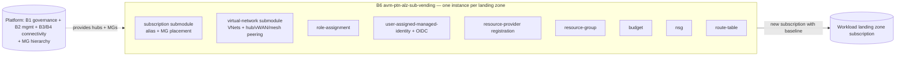

# Repository Overview: `Azure/terraform-azure-avm-ptn-alz-sub-vending`

| Field | Value |
|-------|-------|
| Repository | `Azure/terraform-azure-avm-ptn-alz-sub-vending` (catalog B6) |
| Registry | `Azure/avm-ptn-alz-sub-vending/azure` (latest v0.2.1) |
| Flavor | Terraform — AVM **pattern** module (HCL 90%) |
| Role | **Subscription vending** — create a landing-zone subscription + its baseline (networking / RBAC / RP registration / budgets / UMI) in **one `terraform apply`** |
| Providers | **azapi `~>2.5`** (no azurerm), modtm `~>0.3`, random `~>3.5`; Terraform `~>1.10` |
| Submodules | 10 local module calls under `modules/` |
| Relationship | The **AVM repackaging of the `lz-vending` engine** (C1) — same submodule design; example label `module "lz_vending"`; issues redirected to `terraform-azurerm-lz-vending` |
| Source URL | <https://github.com/Azure/terraform-azure-avm-ptn-alz-sub-vending> |
| Mode | deep (remote analysis via GitHub) |
| Last reviewed | 2026-06-17 |

## Purpose

The **subscription vending** AVM pattern module: instantiated **once per landing zone** to create a new
Azure subscription (or adopt an existing one), place it in a management group, and stamp out its standard
baseline — virtual networks (+ hub/vWAN/mesh peering), role assignments, resource-provider registration,
resource groups, budgets, NSGs, route tables, and a user-assigned managed identity (+ OIDC federated
credentials). It uses the **AzAPI** provider to do subscription creation + resource deployment in a single
`terraform apply`.

This is the **demand side** of ALZ (one subscription per workload), complementing the **supply side** (the
platform: B1 governance, B2 management, B3/B4 connectivity). It's the productized, repeatable version of the
ARM subscription-vending idiom first seen in E1 (`Microsoft.Subscription/aliases` + scope escape).

> **Relationship to C1 `lz-vending`:** this repo is the **AVM-compliant packaging** of the long-standing
> `Azure/terraform-azurerm-lz-vending` module — it ships the *same* submodules (subscription, virtual-network,
> role-assignment, user-assigned-managed-identity, budget, …), the example module label is `lz_vending`, and
> the README points issues at `terraform-azurerm-lz-vending`. So B6 ≈ C1 re-badged to AVM (azapi-only,
> modtm telemetry, AVM repo scaffolding). `TODO: verify` the exact code-sharing mechanism when analyzing C1.

## Where it sits in the chain

## Capabilities (from the README)

- **Subscription creation + management-group placement** (or adopt/update an existing subscription).
- **Networking** — multiple VNets with: hub-and-spoke peering, **vWAN** connection, **mesh** peering between
  spokes, and **IPAM pool** allocation (dynamic address space from Azure Virtual Network Manager IPAM).
- **Role assignments** (subscription/RG scope; by role name or definition id; conditions; deterministic or
  random UUID names).
- **Resource provider (and feature) registration** (sensible default RP list from the AzureRM provider).
- **Resource group creation** (with optional resource lock).
- **User-assigned managed identity** creation + RBAC + **federated credentials** (GitHub Actions / Terraform
  Cloud / advanced OIDC) — so the new LZ can run its own pipelines.
- **Budgets**, **NSGs** (+ rules), **route tables** (+ routes).

## Module composition (10 local submodule calls)

| Module call | Source | Builds |
|-------------|--------|--------|
| `subscription` | `./modules/subscription` | ★ `Microsoft.Subscription/aliases` + MG association. |
| `virtualnetwork` | `./modules/virtual-network` | VNets, subnets, hub/vWAN/mesh peering, IPAM. |
| `roleassignment` | `./modules/role-assignment` | Subscription/RG role assignments. |
| `roleassignment_umi` | `./modules/role-assignment` | Role assignments for the UMI (same submodule, 2nd call). |
| `usermanagedidentity` | `./modules/user-assigned-managed-identity` | UMI + federated credentials. |
| `resourceproviders` | `./modules/resource-provider` | RP + feature registration. |
| `resourcegroup` | `./modules/resource-group` | Resource groups (+ locks). |
| `budget` | `./modules/budget` | Consumption budgets + notifications. |
| `networksecuritygroup` | `./modules/network-security-group` | NSGs + security rules. |
| `routetable` | `./modules/route-table` | Route tables + routes. |

> Every capability is gated by an `*_enabled` toggle (`subscription_alias_enabled`, `virtual_network_enabled`,
> `role_assignment_enabled`, `umi_enabled`, `budget_enabled`, `resource_group_creation_enabled`,
> `route_table_enabled`, `network_security_group_enabled`, `subscription_register_resource_providers_enabled`).
> The root files mirror this: `main.tf`, `main.subscription`-via-`variables.subscription.tf`,
> `main.virtual-network.tf`, `main.role-assignment.tf`, `main.user-assigned-managed-identity.tf`,
> `main.resource-providers.tf`, `main.resource-group.tf`, `main.budget.tf`,
> `main.network-security-group.tf`, `main.route-table.tf`, `main.telemetry.tf`.

## Key inputs

### Required
| Input | Meaning |
|-------|---------|
| `location` | Default region for created resources / VNets. |

### Subscription
`subscription_alias_enabled` (create new) + `subscription_alias_name` / `subscription_display_name` /
`subscription_billing_scope` (EA / MCA / MPA scope) / `subscription_workload` (`Production`/`DevTest`);
OR `subscription_id` (adopt existing) with `subscription_update_existing`. Placement:
`subscription_management_group_association_enabled` + `subscription_management_group_id`. Plus
`subscription_tags`, `subscription_register_resource_providers_and_features`.

### Networking / baseline (capability maps)
`virtual_networks` (the big one — address_space **or** `ipam_pools`, subnets, hub/vWAN/mesh peering),
`role_assignments`, `user_managed_identities`, `resource_groups`, `budgets`, `network_security_groups`,
`route_tables` — all `map(object(...))`, default `{}`, keyed by **plan-time-known** keys.

### Tuning
`wait_for_subscription_before_subscription_operations` (`create`/`destroy` delays after vending — eventual
consistency).

## Outputs (selected)

`subscription_id` / `subscription_resource_id` / `resource_id`,
`management_group_subscription_association_id`, `virtual_network_resource_ids` (keyed by `virtual_networks`),
`resource_group_resource_ids`, `route_table_resource_ids`, `budget_resource_id`, and the UMI set
(`umi_client_ids` / `umi_principal_ids` / `umi_resource_ids` / `umi_tenant_ids`) — null when `umi_enabled = false`.

## Resources Created

A subscription alias + MG association; VNets/subnets/peerings (hub-spoke + vWAN connection + mesh) with
optional IPAM; role assignments; a user-assigned managed identity + federated credentials; resource groups
(+ locks); budgets; NSGs (+ rules); route tables (+ routes); RP/feature registrations. (Root owns only modtm
telemetry; everything real is in the submodules, created via **AzAPI**.)

## Dependencies

**Upstream:** AzAPI provider; the platform (hub network resource ids, the target management group) supplied as
inputs — typically the MGs from **B1** and the hub from **B3/B4**. **Downstream:** the vended subscription is
where workloads (application landing zones) get deployed. **Sibling:** **C1 `terraform-azurerm-lz-vending`**
(the engine this packages).

## Notes & Gotchas

- **AzAPI-only, single apply** — no azurerm provider; the subscription *and* its resources are created in one
  `terraform apply` (AzAPI talks straight to ARM, incl. the subscription alias).
- **NetworkWatcherRG on destroy** — when a vended subscription is destroyed, the module tries to remove
  `NetworkWatcherRG` via `az cli` (needs az installed/authenticated); it recommends managing that RG
  explicitly via `resource_groups`.
- **Map keys must be plan-known** — every capability map repeats this; never key off a computed value.
- **IPAM vs static** — `ipam_pools` (VNet) / per-subnet `ipam_pools` are **mutually exclusive** with
  `address_space` / `address_prefixes`; IPAM avoids manual CIDR planning across LZs.
- **OIDC federated credentials** let the vended LZ run its own GitHub/ADO/Terraform-Cloud pipelines — the
  same federated-credential mechanism the bootstrap (F2) uses, but for the workload subscription.
- **Early version (v0.2.1)** — the AVM packaging is recent ("convert to avm"); the underlying vending logic is
  the mature `lz-vending` engine.

## Open Questions

- [x] B6 vs C1 relationship — resolved: **C1 `lz-vending` is the original engine, now archived (Jun 2026) with seamless migration to B6 v0.1.0**; B6 is the AVM repackaging (same submodule design + IPAM-pool support + modtm telemetry). Same lineage, B6 going-forward. See [terraform-azurerm-lz-vending/_overview.md](../terraform-azurerm-lz-vending/_overview.md).
- [x] `./modules/subscription` AzAPI body — confirmed (via C1, the shared design): `azapi_resource` type `Microsoft.Subscription/aliases@2021-10-01`, `parent_id = "/"` (scope escape), `additionalProperties.managementGroupId` for placement, `response_export_values = ["properties.subscriptionId"]`. See [terraform-azurerm-lz-vending/module-lz-vending.md](../terraform-azurerm-lz-vending/module-lz-vending.md).
