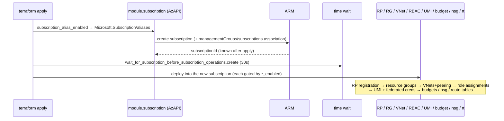
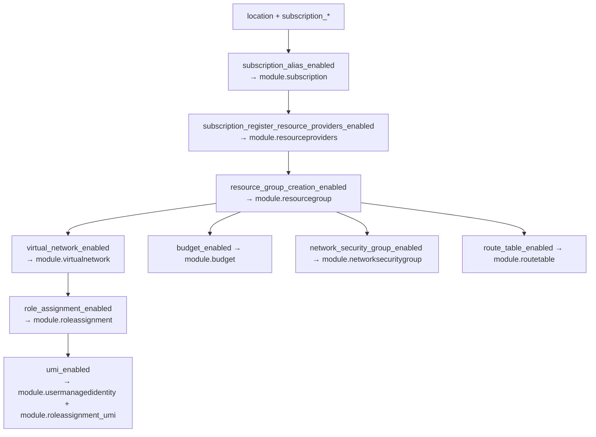
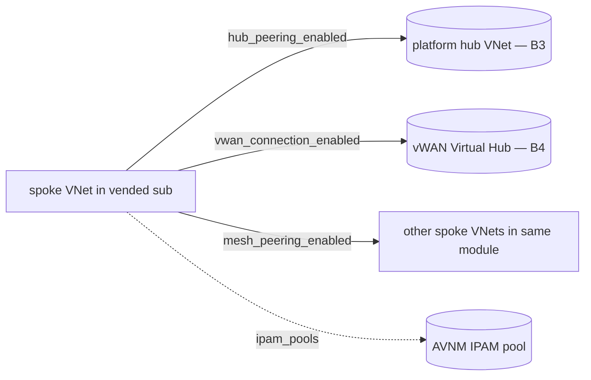

# Module: `avm-ptn-alz-sub-vending` (root) — subscription vending flow

| Field | Value |
|-------|-------|
| Repository | `Azure/terraform-azure-avm-ptn-alz-sub-vending` |
| Entry | root `main.tf` (+ `main.*.tf` per capability) |
| Registry | `Azure/avm-ptn-alz-sub-vending/azure` v0.2.1 |
| Source URL | <https://github.com/Azure/terraform-azure-avm-ptn-alz-sub-vending> |
| Mode | deep |
| Last reviewed | 2026-06-17 |

## Purpose

Deep-dive on how one module instance vends a landing-zone subscription and its baseline. The root is a
**toggle-gated composition**: each `*_enabled` flag turns on a `modules/*` submodule (`count`/`for_each`),
all created through **AzAPI** so the subscription and everything in it land in a single `terraform apply`.

## Deployment flow (single apply)

The **`wait`** between subscription creation and subscription operations absorbs ARM eventual consistency
(the new subscription id isn't immediately usable for child deployments).

## Capability toggles → submodules

## The `subscription` submodule (the vending core)

- Creates `Microsoft.Subscription/aliases` (the same ARM primitive as E1's sub-vending), supplying
  `billingScope` (EA enrollment / MCA invoice section / MPA customer), `displayName`, `workload`.
- Associates the subscription to a management group (`Microsoft.Management/managementGroups/subscriptions`)
  when `subscription_management_group_association_enabled = true`.
- Can instead **adopt** an existing `subscription_id` (and optionally update its tags/display name) — useful
  when billing-API subscription creation isn't available.
- Outputs `subscription_id` / `subscription_resource_id` consumed by every other submodule as the deployment
  target.

## The `virtual-network` submodule (the richest capability)

Per entry in `var.virtual_networks`:
- **Address space:** `address_space` (static CIDRs) **xor** `ipam_pools` (dynamic from Azure Virtual Network
  Manager IPAM) — same xor at the subnet level (`address_prefixes` vs `ipam_pools`).
- **Hub-and-spoke peering:** `hub_peering_enabled` + `hub_network_resource_id`, bi-directional
  (`hub_peering_direction = tohub|fromhub|both`) with per-direction options (gateway transit, forwarded
  traffic, use-remote-gateways, partial address-space peering).
- **vWAN connection:** `vwan_connection_enabled` + `vwan_hub_resource_id` (+ propagated/associated route
  tables, `vwan_security_configuration` for secure internet/private traffic / routing-intent compatibility).
- **Mesh peering:** `mesh_peering_enabled` creates bi-directional peerings between all mesh-enabled VNets in
  the map.
- Subnets with NSG/route-table associations (by id **or** `key_reference` into this module's NSG/RT maps),
  delegations, service endpoints, NAT gateway, private-endpoint/link policies.

## Inputs / Outputs

See [_overview.md](./_overview.md) for the full tables. The pivotal ones:
- **In:** `subscription_*` (vend/place), `virtual_networks` (connect), `role_assignments` (delegate),
  `user_managed_identities` (pipeline identity).
- **Out:** `subscription_id` (where workloads go), `virtual_network_resource_ids`, the `umi_*` set.

## Resources Created

Subscription alias + MG association; VNets/subnets/peerings (+ IPAM); role assignments; UMI + federated
credentials; resource groups (+ locks); budgets; NSGs (+ rules); route tables (+ routes); RP/feature
registrations.

## Dependencies

**Upstream:** AzAPI; platform inputs (target MG from B1, hub id from B3/B4). **Downstream:** the workloads
deployed into the vended subscription. **Sibling/source:** C1 `lz-vending`.

## Notes & Gotchas

- **Single-apply atomicity** depends on the `wait` timer — too short and child deployments race the new
  subscription's availability.
- **`key_reference` indirection** lets a subnet reference an NSG/route-table created *in the same module run*
  (whose id is unknown at plan time) by map key instead of id — the AVM answer to ordering within one apply.
- **Federated credentials** are how the vended LZ becomes self-sufficient for CI/CD (GitHub/ADO/TFC OIDC).
- **Default RP list** mirrors the AzureRM provider's required providers; customize via
  `subscription_register_resource_providers_and_features`.

## Open Questions

- [ ] `TODO: verify` the precise ordering/`depends_on` between `module.subscription`, the `wait`, and the baseline submodules in `main.tf` (described from the documented `wait` variable + AVM conventions; submodule source not read — index unavailable).
- [ ] `TODO: verify` whether mesh peering uses a flattened pair list in `locals.tf` (the cross-VNet `for` join) — inferred from the mesh semantics.
