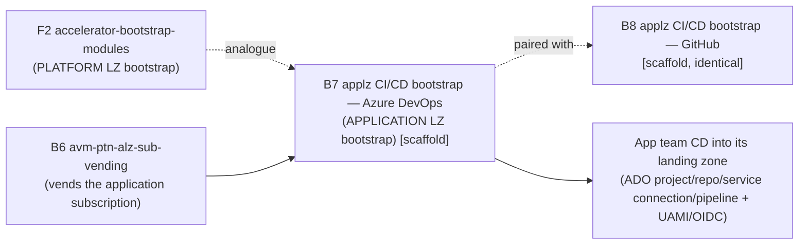

# Azure/terraform-azure-avm-ptn-alz-application-landing-zone-cicd-bootstrap-azure-devops (B7) — Overview

| Field | Value |
|-------|-------|
| Repository | `Azure/terraform-azure-avm-ptn-alz-application-landing-zone-cicd-bootstrap-azure-devops` |
| Catalog id | B7 |
| Flavor | Terraform (AVM **pattern** module) |
| Intended role | **Application** landing zone **CI/CD bootstrap for Azure DevOps** — project / repo / service connection / pipeline + identity |
| ⚠️ Current state | **Scaffold only — not yet implemented** (AVM template skeleton; see below) |
| Registry name (intended) | `Azure/avm-ptn-alz-application-landing-zone-cicd-bootstrap-azure-devops/azure` |
| Source URL | <https://github.com/Azure/terraform-azure-avm-ptn-alz-application-landing-zone-cicd-bootstrap-azure-devops> |
| Mode | quick (overview) — there is no implemented module to deep-analyze yet |
| Last reviewed | 2026-06-17 |

## Purpose (intended)

Per the catalog and the repository name, B7 is meant to be the **application landing zone CI/CD bootstrap** pattern
for **Azure DevOps** — i.e. the per-application analogue of the platform bootstrap done by
[F2 `accelerator-bootstrap-modules`](../accelerator-bootstrap-modules/_overview.md). It would stand up the
continuous-delivery plumbing an application team needs to deploy into its landing zone: an Azure DevOps **project**,
**repository**, **service connection** (workload-identity federation), **pipelines**, and the supporting Azure
**identity** (UAMI + federated credentials) and state.

> **Important:** as inspected (2026-06-17), the repository does **not** implement any of this yet — see the verified
> state below. These notes document the *intended* role plus the *actual* current contents, and explicitly avoid
> inventing resources that are not in the code.

## ⚠️ Verified current state — AVM template scaffold

The repo is a **freshly scaffolded AVM Terraform module** that still contains the generic template placeholder, not a
CI/CD bootstrap implementation. Evidence (all source-verified):

- **`main.tf`** contains only the template dummy resource:
  ```hcl
  # TODO: Replace this dummy resource azurerm_resource_group.TODO with your module resource
  resource "azurerm_resource_group" "TODO" {
    location = var.location
    name     = var.name
    tags     = var.tags
  }
  ```
  plus the standard AVM interface resources (`azurerm_management_lock.this`, `azurerm_role_assignment.this`).
- **README** is the unmodified AVM template (“This is a template repo for Terraform Azure Verified Modules”); its
  Resources list is the template set (private endpoints, `azurerm_resource_group.TODO`, telemetry), and its
  **required inputs are the generic `location` / `name` / `resource_group_name`** — not CI/CD-bootstrap inputs.
- **Provider requirements** (`terraform.tf` / README): `azapi ~> 2.4`, `azurerm ~> 4.0`, `modtm ~> 0.3`,
  `random ~> 3.5` — there is **no `azuredevops` provider**, confirming the Azure DevOps functionality is not built.
- **`examples/default/main.tf`** is the template example (`module "test" { source = "../../" name = "TODO" }`).
- **B7 and B8 are byte-for-byte identical** — every tracked blob SHA matches the
  [GitHub variant (B8)](../avm-ptn-alz-applz-cicd-bootstrap-github/_overview.md); they were scaffolded from the same
  template and neither has diverged yet.

## Repository structure (AVM standard layout)

```
terraform-azure-avm-ptn-alz-application-landing-zone-cicd-bootstrap-azure-devops/
├── main.tf                     # dummy azurerm_resource_group.TODO + AVM lock/role-assignment interfaces
├── main.privateendpoint.tf     # AVM private-endpoint interface (template)
├── main.telemetry.tf           # AVM telemetry (modtm)
├── locals.tf  variables.tf     # standard AVM interface variables (~13 KB)
├── outputs.tf                  # only output: private_endpoints (template)
├── terraform.tf                # provider constraints (no azuredevops provider)
├── examples/
│   ├── default/                # template example (name = "TODO")
│   └── ignore_example_for_e2e/
├── modules/                    # placeholder (README only)
├── tests/                      # placeholder
├── .agents/skills/avm-terraform-module-development/   # AI skill to BUILD OUT the module
│   ├── SKILL.md  + references/{AzAPI, interfaces, module-composition, terraform-test, …}.md
│   └── scripts/Get-AzureSchema.ps1
├── .github/{workflows/pr-check.yml, codeql.yml; actions/1es-runner-auth-docker; policies; ISSUE_TEMPLATE}
├── AGENTS.md                   # generic AVM Terraform agent guidance (not module-specific)
└── avm / avm.ps1 / avm.bat / Makefile / .terraform-docs.yml   # AVM tooling wrappers
```

The present inputs/outputs are the **standard AVM interfaces** (not module-specific): required `location`, `name`,
`resource_group_name`; optional `customer_managed_key`, `diagnostic_settings`, `enable_telemetry`, `lock`,
`managed_identities`, `private_endpoints`, `private_endpoints_manage_dns_zone_group`, `role_assignments`, `tags`.

## Where it fits (intended)



- **Platform vs application:** F2 bootstraps the *platform* landing zone's CD; B7/B8 are intended to bootstrap an
  *application* landing zone's CD (one per app team / vended subscription).
- **Pairs with [B8 (GitHub)](../avm-ptn-alz-applz-cicd-bootstrap-github/_overview.md):** same pattern, different VCS
  target (Azure DevOps here, GitHub there).
- **Downstream of vending:** typically follows [B6 `avm-ptn-alz-sub-vending`](../avm-ptn-alz-sub-vending/_overview.md)
  creating the application subscription. `TODO: verify` the exact wiring once implemented.

## Notes & gotchas

- **Don't treat the README inputs/outputs as the real contract** — they are the AVM template's, not this module's.
  When the module is implemented, the inputs (Azure DevOps org/project, repo, service-connection, identity, MG/sub
  scope, …) and resources (`azuredevops_*` + `azurerm_user_assigned_identity` + federated credentials) will replace
  the `azurerm_resource_group.TODO` placeholder.
- **AI-assisted build-out:** the repo ships an `.agents/skills/avm-terraform-module-development` skill + `AGENTS.md`,
  signalling it is intended to be implemented (possibly agent-assisted) against the AVM spec.
- **Identical to B8:** analyze once; the two repos only differ by intended VCS target until they diverge.

## Open Questions

- [ ] `TODO: verify` (re-check later) the implemented inputs, the `azuredevops_*` resources, and the UAMI/federated-credential wiring once the module moves past the template scaffold.
- [ ] `TODO: verify` how B7 consumes outputs from B6 (sub-vending) and relates to F1/F2 in the application-LZ flow.
