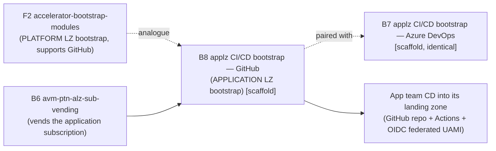

# Azure/terraform-azure-avm-ptn-alz-application-landing-zone-cicd-bootstrap-github (B8) — Overview

| Field | Value |
|-------|-------|
| Repository | `Azure/terraform-azure-avm-ptn-alz-application-landing-zone-cicd-bootstrap-github` |
| Catalog id | B8 |
| Flavor | Terraform (AVM **pattern** module) |
| Intended role | **Application** landing zone **CI/CD bootstrap for GitHub** — repository / Actions / OIDC + identity |
| ⚠️ Current state | **Scaffold only — not yet implemented** (identical AVM template skeleton to B7) |
| Registry name (intended) | `Azure/avm-ptn-alz-application-landing-zone-cicd-bootstrap-github/azure` |
| Source URL | <https://github.com/Azure/terraform-azure-avm-ptn-alz-application-landing-zone-cicd-bootstrap-github> |
| Mode | quick (overview) — no implemented module to deep-analyze yet |
| Last reviewed | 2026-06-17 |

## Purpose (intended)

B8 is the **GitHub** counterpart of [B7 (Azure DevOps)](../avm-ptn-alz-applz-cicd-bootstrap-azure-devops/_overview.md):
the **application landing zone CI/CD bootstrap** pattern that would stand up an application team's continuous-delivery
plumbing on **GitHub** — a **repository**, **GitHub Actions** workflows, **environments**, and the Azure **identity**
(user-assigned managed identity + **OIDC federated credentials**) the Actions use to deploy into the application's
landing zone. It is the per-application analogue of the platform bootstrap in
[F2 `accelerator-bootstrap-modules`](../accelerator-bootstrap-modules/_overview.md).

> **Important:** as inspected (2026-06-17), B8 does **not** implement this yet — it is byte-for-byte identical to the
> B7 scaffold. These notes document the intended role + the verified current contents without fabricating resources.

## ⚠️ Verified current state — identical AVM template scaffold

B8's tracked files are **byte-for-byte identical to [B7](../avm-ptn-alz-applz-cicd-bootstrap-azure-devops/_overview.md)**
(every blob SHA matches: `main.tf` `49e0d4c…`, `variables.tf` `2689b8e…`, `README.md` `c1ea57e…`,
`examples/default/main.tf` `45b2c9e…`, etc.). It is the unmodified AVM Terraform module template:

- `main.tf` = the dummy `azurerm_resource_group.TODO` (`# TODO: Replace this dummy resource … with your module
  resource`) + the standard AVM `management_lock` / `role_assignment` interfaces.
- README = the generic AVM template; required inputs are `location` / `name` / `resource_group_name`; the only output
  is `private_endpoints`.
- Provider requirements: `azapi ~> 2.4`, `azurerm ~> 4.0`, `modtm ~> 0.3`, `random ~> 3.5` — **no `github` provider**,
  confirming the GitHub functionality is not built yet.
- `examples/default/main.tf` = template example (`module "test" { source = "../../" name = "TODO" }`).

See the [B7 overview](../avm-ptn-alz-applz-cicd-bootstrap-azure-devops/_overview.md#️-verified-current-state--avm-template-scaffold)
for the full structure breakdown — it applies verbatim to B8.

## Repository structure

Identical to B7 (AVM standard layout): `main.tf` (dummy RG) + `main.privateendpoint.tf` + `main.telemetry.tf` +
`locals.tf` + `variables.tf` + `outputs.tf` + `terraform.tf`; `examples/{default, ignore_example_for_e2e}`;
`modules/` + `tests/` placeholders; the `.agents/skills/avm-terraform-module-development` AI build-out skill;
`AGENTS.md` (generic AVM guidance); and the AVM `.github/` CI + tooling wrappers (`avm`, `avm.ps1`, `Makefile`).

The current inputs/outputs are the **standard AVM interfaces** (required `location`/`name`/`resource_group_name`;
optional `customer_managed_key`, `diagnostic_settings`, `enable_telemetry`, `lock`, `managed_identities`,
`private_endpoints`, `private_endpoints_manage_dns_zone_group`, `role_assignments`, `tags`) — not GitHub-specific.

## Where it fits (intended)

- **Pairs with [B7 (Azure DevOps)](../avm-ptn-alz-applz-cicd-bootstrap-azure-devops/_overview.md)** — same pattern,
  GitHub VCS target instead of Azure DevOps.
- When implemented, expect `github_*` resources (repository, actions secrets/variables, environments) +
  `azurerm_user_assigned_identity` + federated credentials with subject `repo:<org>/<repo>:…` (the OIDC pattern used
  elsewhere in ALZ — see the glossary's *Federated credential (OIDC)*).

## Notes & gotchas

- **README contract is the template's, not the module's** — once implemented, GitHub-specific inputs (org, repo,
  environments, identity, scope) and `github_*` resources will replace the `azurerm_resource_group.TODO` placeholder.
- **Identical to B7** — only the intended VCS target differs until the two repos diverge.
- **AI-assisted build-out** — ships the `.agents/skills/avm-terraform-module-development` skill + `AGENTS.md`.

## Open Questions

- [ ] `TODO: verify` (re-check later) the implemented GitHub inputs, the `github_*` resources, and the OIDC/UAMI wiring once B8 moves past the template scaffold.
- [ ] `TODO: verify` whether B7 and B8 stay as separate repos or converge on a shared submodule once implemented.
