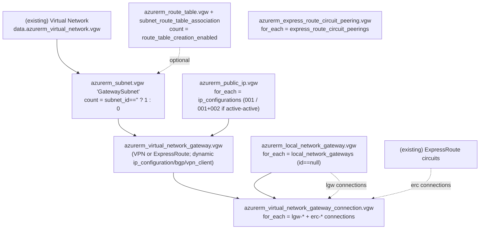
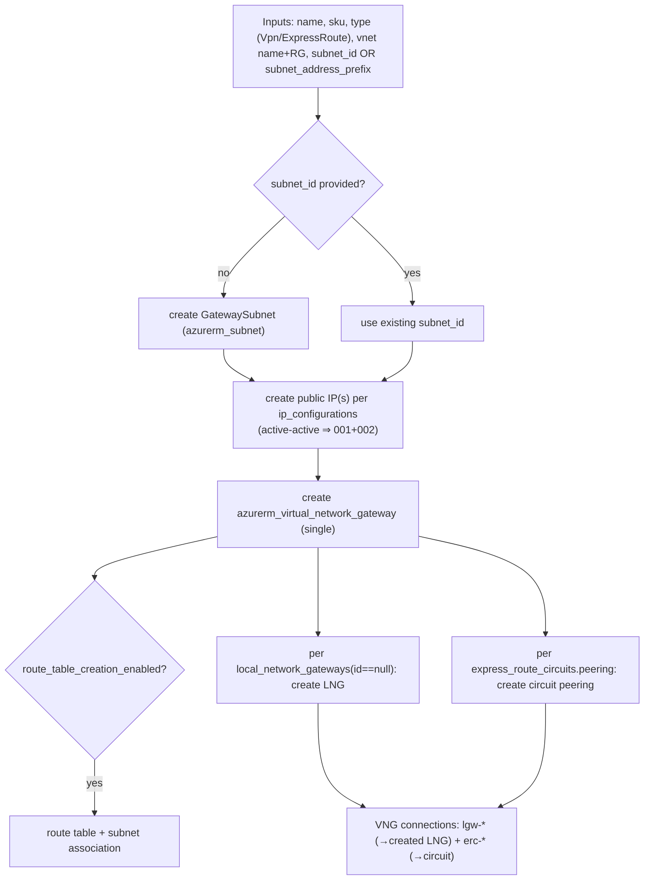
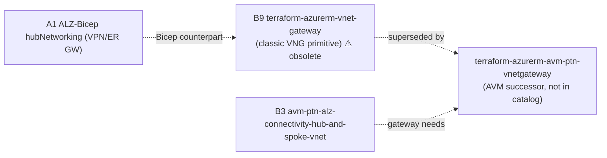

# Azure/terraform-azurerm-vnet-gateway (B9) — Repository Overview

| Field | Value |
|-------|-------|
| Repository | `Azure/terraform-azurerm-vnet-gateway` |
| Catalog id | B9 |
| Flavor | Terraform (classic, **pre-AVM** module) |
| Role | Deploy an Azure **Virtual Network Gateway** (VPN or ExpressRoute) + auxiliary resources — the connectivity building-block for gateways |
| ⚠️ Status | **Obsolete / unmaintained** — superseded by `Azure/terraform-azurerm-avm-ptn-vnetgateway` (the AVM version) |
| Registry | `Azure/vnet-gateway/azure` |
| Providers | `terraform >= 1.3`, `azurerm >= 3.1, < 4.0` (azurerm **3.x**) |
| Source URL | <https://github.com/Azure/terraform-azurerm-vnet-gateway> |
| Mode | deep (source-verified) |
| Last reviewed | 2026-06-17 |

## Purpose

> *“This module is designed to deploy an Azure Virtual Network Gateway and several auxiliary resources associated to
> it.”* (README)

B9 is the **classic** Terraform module for an Azure **Virtual Network Gateway** — either a **VPN** gateway or an
**ExpressRoute** gateway — plus everything around it: the `GatewaySubnet`, public IPs, an optional route table, local
network gateways, and the gateway connections (S2S/VNet2VNet and ExpressRoute). It is the gateway primitive that the
hub-and-spoke and Virtual WAN connectivity modules build on.

> ⚠️ **Obsolete:** the README's first line is *“:warning: This repository is obsolete :warning: … Please use the
> [terraform-azurerm-avm-ptn-vnetgateway](https://github.com/Azure/terraform-azurerm-avm-ptn-vnetgateway) repository
> for the updated code.”* These notes document the classic module as it stands (it is fully implemented), and flag
> that new work should target the AVM successor. The successor is **not** one of the 33 catalog repos.

## Features (verified README)

- **Virtual Network Gateway** — VPN **or** ExpressRoute; Active-Active or Single; deploys the `GatewaySubnet`.
- **Route Table** — optional route table on the gateway subnet (+ subnet association).
- **Local Network Gateways** — optional deployment of *n* LNGs (+ optional *n* gateway connections for them).
- **ExpressRoute Circuits** — configure peering on *n* pre-provisioned ER circuits (+ optional *n* connections).

## Repository structure (verified git tree) — flat classic module

```
terraform-azurerm-vnet-gateway/
├── main.tf            # all resources (~12 KB) — the gateway + aux resources
├── variables.tf       # inputs (~18.5 KB)
├── outputs.tf         # 6 curated outputs
├── locals.tf          # ip-config / connection / peering wiring (~2.5 KB)
├── versions.tf        # provider constraints (azurerm >= 3.1 < 4.0)
├── _header.md / _footer.md   # README fragments (terraform-docs)
├── CHANGELOG.md  GNUmakefile  .terraform-docs.yml
├── examples/basic/    # main.tf + outputs.tf + providers.tf + TestRecord.md
├── test/              # Go terratest: e2e/terraform_test.go + upgrade/upgrade_test.go + go.mod
└── .github/workflows/ # acc-test, pr-check, weekly-e2e, breaking-change-detect, post-push
```

No sub-modules — a single flat Terraform module. There is **one module file** to analyze; see
[module-vnet-gateway.md](module-vnet-gateway.md).

## Resource topology (verified `main.tf`)



## Deployment flow (verified conditionals)



## Where it fits



- **Connectivity building-block:** B9 provides the VPN/ER gateway that hub topologies need. In the modern Terraform
  line, the [hub-and-spoke (B3)](../avm-ptn-alz-connectivity-hub-and-spoke-vnet/_overview.md) / vWAN modules use the
  **AVM successor**, not this classic module.
- **Bicep counterpart:** the gateway resources here mirror what
  [ALZ-Bicep's `hubNetworking` (A1)](../ALZ-Bicep/module-hubNetworking.md) deploys inline (VPN/ER gateways inside the
  hub) — B9 is the standalone Terraform equivalent.

## Notes & gotchas

- **Use the AVM successor for new work** — `terraform-azurerm-avm-ptn-vnetgateway` replaces this repo; B9 is pinned to
  the old **azurerm 3.x** provider.
- **`subnet_id` XOR `subnet_address_prefix`** — supply one. With `subnet_address_prefix`, the module creates the
  `GatewaySubnet`; with `subnet_id`, it uses an existing subnet and creates no subnet.
- **Active-active ⇒ two IP configs** — when `vpn_active_active_enabled = true` and no explicit `ip_configurations`,
  the module auto-creates configs `001` + `002` (and two public IPs); otherwise just `001`.
- **Connections are derived, key-prefixed** — local-network-gateway connections use key `lgw-<k>` (linked to the LNG
  the module creates) and ExpressRoute connections use `erc-<k>` (linked to the circuit). See
  [module-vnet-gateway.md](module-vnet-gateway.md).
- **Existing vs new LNG** — `local_network_gateways` entries with a non-null `id` are treated as *existing*
  (referenced, not created); only `id == null` entries are created.
- **Tracing tags (Yor):** every resource merges BridgeCrew **Yor** tracing tags when `tracing_tags_enabled = true`
  (prefix `tracing_tags_prefix`, default `avm_`).

## Open Questions

- [ ] `TODO: verify` whether the AVM successor (`terraform-azurerm-avm-ptn-vnetgateway`) should be added to the 33-repo catalog as B9's replacement (currently not catalogued).
