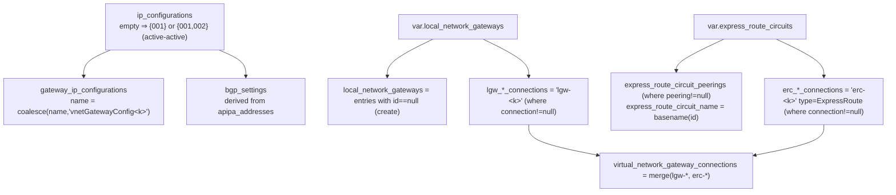

# Module — Virtual Network Gateway (`main.tf`)

| Field | Value |
|-------|-------|
| Path | `main.tf` (+ `locals.tf`, `variables.tf`, `outputs.tf`) |
| Module | the whole repo (flat — no sub-modules) |
| Registry | `Azure/vnet-gateway/azure` |
| Source-verified | `main.tf`, `locals.tf`, README (terraform-docs), git tree |
| Last reviewed | 2026-06-17 |

> ⚠️ This is the **obsolete** classic module — superseded by `terraform-azurerm-avm-ptn-vnetgateway`. See the
> [overview](_overview.md). Documented as-is because it is fully implemented.

## Purpose

Deploy a single Azure **Virtual Network Gateway** (VPN or ExpressRoute) and its auxiliary resources: the
`GatewaySubnet`, public IP(s), an optional route table, local network gateways, ExpressRoute circuit peerings, and the
gateway connections that tie them together.

## Inputs

### Required

| Name | Type | Meaning |
|------|------|---------|
| `location` | string | Azure region |
| `name` | string | name of the Virtual Network Gateway |
| `sku` | string | SKU/size (e.g. `VpnGw1`, `ErGw1AZ`) |
| `type` | string | `Vpn` or `ExpressRoute` |
| `virtual_network_name` | string | the (existing) VNet's name |
| `virtual_network_resource_group_name` | string | the VNet's resource group |

### Optional (selected — full schema in README)

| Name | Type | Default | Meaning |
|------|------|---------|---------|
| `subnet_id` | string | `""` | use an existing gateway subnet (XOR `subnet_address_prefix`) |
| `subnet_address_prefix` | string | `""` | CIDR for a `GatewaySubnet` the module creates |
| `ip_configurations` | map(object) | `{}` | gateway IP configs + public-IP settings; auto-filled if empty |
| `vpn_active_active_enabled` | bool | `false` | active-active (⇒ two IP configs/public IPs) |
| `vpn_bgp_enabled` | bool | `false` | enable BGP on the gateway |
| `vpn_bgp_settings` | object | `null` | `{ asn, peer_weight }` |
| `vpn_type` | string | `"RouteBased"` | VPN type |
| `vpn_generation` | string | `null` | `Generation1` / `Generation2` |
| `vpn_private_ip_address_enabled` | bool | `null` | private IP for connections (AZ SKUs) |
| `vpn_point_to_site` | object | `null` | P2S config (address space, AAD/RADIUS, root/revoked certs, protocols) |
| `edge_zone` | string | `null` | availability zone (AZ SKUs) |
| `local_network_gateways` | map(object) | `{}` | LNGs to create/reference (+ optional connection) |
| `express_route_circuits` | map(object) | `{}` | ER circuits to peer (+ optional connection) |
| `route_table_creation_enabled` | bool | `false` | create a route table on the gateway subnet |
| `route_table_bgp_route_propagation_enabled` | bool | `true` | BGP route propagation on that route table |
| `route_table_name` / `route_table_tags` | string / map | `null` / `{}` | route table name/tags |
| `default_tags` / `tags` | map(string) | `{}` | tags (all resources / gateway) |
| `tracing_tags_enabled` / `tracing_tags_prefix` | bool / string | `false` / `"avm_"` | Yor tracing tags |

#### Key nested objects

- **`local_network_gateways[*]`** — `id` (reference existing), `name`, `address_space`, `gateway_fqdn`,
  `gateway_address`, `bgp_settings { asn, bgp_peering_address, peer_weight }`, and an optional **`connection`**
  (`type` IPsec/Vnet2Vnet, `connection_mode/protocol`, `dpd_timeout_seconds`, NAT rule ids, `enable_bgp`,
  `peer_virtual_network_gateway_id`, `shared_key`, `custom_bgp_addresses { primary, secondary }`,
  `ipsec_policy { dh_group, ike_encryption, ike_integrity, ipsec_encryption, ipsec_integrity, pfs_group, sa_* }`,
  `traffic_selector_policy [{ local_address_prefixes, remote_address_prefixes }]`).
- **`express_route_circuits[*]`** — `id` (the circuit), `resource_group_name`, optional **`connection`**
  (`authorization_key`, `express_route_gateway_bypass`, `name`, `routing_weight`, `shared_key`), optional
  **`peering`** (`peering_type` AzurePrivate/AzurePublic/MicrosoftPeering, `vlan_id`, `ipv4_enabled`, `peer_asn`,
  primary/secondary prefixes, `shared_key`, `route_filter_id`, `microsoft_peering_config { advertised_public_prefixes,
  advertised_communities, customer_asn, routing_registry_name }`).
- **`ip_configurations[*]`** — `ip_configuration_name`, `apipa_addresses`, `private_ip_address_allocation` (Dynamic),
  `public_ip { name, allocation_method (Dynamic), sku (Basic), tags }`.

## Resources created (verified `main.tf`)

| Resource | Cardinality / condition | Notes |
|----------|-------------------------|-------|
| `azurerm_subnet.vgw` | `count = subnet_id == "" ? 1 : 0` | always named **`GatewaySubnet`** |
| `azurerm_route_table.vgw` | `count = route_table_creation_enabled ? 1 : 0` | `disable_bgp_route_propagation = !route_table_bgp_route_propagation_enabled` |
| `azurerm_subnet_route_table_association.vgw` | `count = route_table_creation_enabled ? 1 : 0` | associates route table to gateway subnet |
| `azurerm_public_ip.vgw` | `for_each = local.ip_configurations` | one PIP per IP config |
| `azurerm_virtual_network_gateway.vgw` | single | dynamic `ip_configuration` / `bgp_settings` / `vpn_client_configuration` |
| `azurerm_local_network_gateway.vgw` | `for_each = local.local_network_gateways` | only entries with `id == null` |
| `azurerm_virtual_network_gateway_connection.vgw` | `for_each = local.virtual_network_gateway_connections` | `lgw-*` + `erc-*` |
| `azurerm_express_route_circuit_peering.vgw` | `for_each = local.express_route_circuit_peerings` | dynamic `microsoft_peering_config` |
| `data.azurerm_virtual_network.vgw` | data source | used for region/RG fallback (e.g. route table) |

## The `locals.tf` wiring (verified — this is the clever part)

- **IP configs:** `local.ip_configurations` defaults to `{ "001" = default }`, or `{ "001", "002" }` when
  active-active; `gateway_ip_configurations` derives the config names (`vnetGatewayConfig<k>`).
- **BGP:** `bgp_settings` is built from any `apipa_addresses` on the IP configs (or `vpn_bgp_settings`).
- **LNGs:** only `local_network_gateways` entries with `id == null` are *created*; entries with an `id` are
  *referenced* by their connection.
- **Connections:** `virtual_network_gateway_connections = merge(lgw_*, erc_*)`. A `lgw-<k>` connection links to the
  module-created LNG (`azurerm_local_network_gateway.vgw[trimprefix(key,"lgw-")].id`); an `erc-<k>` connection sets
  `type = "ExpressRoute"` + `express_route_circuit_id = v.id`.
- **Peerings:** `express_route_circuit_peerings` are taken from `express_route_circuits` where `peering != null`,
  with `express_route_circuit_name = basename(v.id)`.

## Outputs (verified `outputs.tf` / README) — all "curated"

| Output | Description |
|--------|-------------|
| `virtual_network_gateway` | the Virtual Network Gateway created |
| `virtual_network_gateway_connections` | the gateway connections created |
| `local_network_gateways` | the local network gateways created |
| `public_ip_addresses` | the public IPs created |
| `route_table` | the route table created (if any) |
| `subnet` | the `GatewaySubnet` created (if any) |

## Dependencies

- **Upstream (inputs):** an **existing** Virtual Network (the module creates only the `GatewaySubnet` within it);
  optionally existing ExpressRoute circuits and/or existing local network gateways (referenced by `id`).
- **Explicit `depends_on`:** the gateway depends on the subnet + public IPs; connections depend on the LNGs + the
  gateway; the route-table association depends on the subnet + route table.
- **Downstream (consumers):** hub/connectivity compositions that need a VPN/ER gateway. In the modern Terraform line
  these use the **AVM successor**; B9 is the classic standalone primitive.

## Open Questions

- [ ] `TODO: verify` the exact `sku` allow-list and SKU↔generation/AZ constraints (enforced by Azure/azurerm, not by this module's variables).
