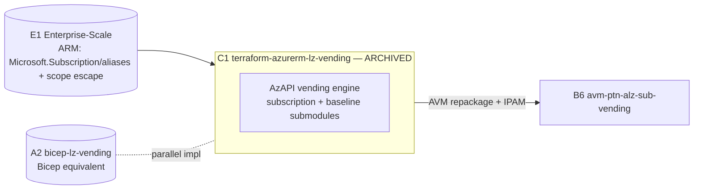
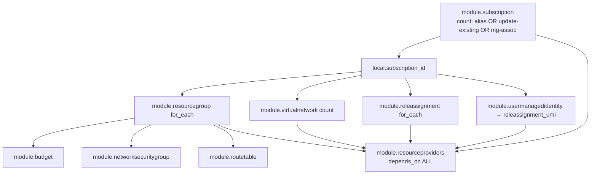

# Repository Overview: `Azure/terraform-azurerm-lz-vending`

| Field | Value |
|-------|-------|
| Repository | `Azure/terraform-azurerm-lz-vending` (catalog C1) |
| Registry | `Azure/lz-vending/azurerm` (latest v7.0.3) |
| Flavor | Terraform — landing-zone **vending engine** (HCL 44.7% + Go 54.5% test suite) |
| Role | The **original subscription-vending module** — create a subscription + baseline in one `terraform apply` |
| Status | ⚠️ **ARCHIVED (Jun 2, 2026)** — "Migration is seamless to v0.1.0 of the AVM module" → **B6 `avm-ptn-alz-sub-vending`** |
| Providers | **azapi `~>2.5`** + **time `~>0.9`** only (no azurerm in the root) |
| Submodules | 9 local `modules/*` |
| Source URL | <https://github.com/Azure/terraform-azurerm-lz-vending> |
| Mode | deep (remote analysis via GitHub) |
| Last reviewed | 2026-06-17 |

## Purpose

The long-standing, battle-tested **subscription-vending engine**: instantiated once per landing zone to
create an Azure subscription (or adopt an existing one), place it in a management group, and deploy its
baseline — VNets (+ hub/vWAN/mesh peering), role assignments, resource-provider registration, resource
groups, budgets, NSGs, route tables, and a user-assigned managed identity (+ OIDC federated credentials).
It uses **AzAPI** end to end so subscription creation + resource deployment happen in a **single
`terraform apply`** (no second provider pass for the new subscription).

> **Archived → use B6.** This module is the **original**; the going-forward, AVM-compliant successor is
> **B6 `terraform-azure-avm-ptn-alz-sub-vending`** (registry `Azure/avm-ptn-alz-sub-vending/azure`). The
> README states migration is *seamless* to AVM v0.1.0. The two share the same submodule design; B6 adds
> IPAM-pool allocation and the modtm telemetry/AVM scaffolding. **This resolves B6's open `TODO: verify`:
> C1 is the source engine; B6 is its AVM repackaging.** See
> [avm-ptn-alz-sub-vending/_overview.md](../avm-ptn-alz-sub-vending/_overview.md).

## The vending-family lineage (cross-language)



## Repository structure (root = orchestrator, submodules = resources)

```text
terraform-azurerm-lz-vending/
├── main.subscription.tf          # module.subscription (alias + MG placement)
├── main.virtualnetwork.tf        # module.virtualnetwork (count = enabled)
├── main.roleassignment.tf        # module.roleassignment + module.roleassignment_umi
├── main.usermanagedidentity.tf   # module.usermanagedidentity
├── main.resourceproviders.tf     # module.resourceproviders (depends_on ALL others)
├── main.resourcegroup.tf         # module.resourcegroup
├── main.budget.tf / main.networksecuritygroup.tf / main.routetable.tf
├── main.telemetry.tf             # azapi_resource.telemetry_root (empty ARM deployment)
├── locals.tf                     # flatten UMI role-assignments, vnet/rt/role maps
├── locals.telemetry.tf           # PUID + bitfield telemetry encoding
├── variables.*.tf / outputs.tf / terraform.tf
└── modules/
    ├── subscription/             # ★ Microsoft.Subscription/aliases + MG association
    ├── virtualnetwork/           # wraps AVM res avm-res-network-virtualnetwork 0.14.1
    ├── roleassignment/           # azapi role assignment + avm-utl-roledefinitions lookup
    ├── usermanagedidentity/      # UMI + federated credentials
    ├── resourceprovider/         # one RP (+ features) registration
    ├── resourcegroup/ · budget/ · networksecuritygroup/ · routetable/
```

## Capabilities (toggle-gated)

Every capability is off by default and turned on by an `*_enabled` flag + its data map:
`subscription_alias_enabled` / `subscription_management_group_association_enabled`,
`virtual_network_enabled`, `role_assignment_enabled`, `umi_enabled`,
`subscription_register_resource_providers_enabled`, `resource_group_creation_enabled`, `budget_enabled`,
`network_security_group_enabled`, `route_table_enabled`.



## The `subscription` submodule (the vending core — source-verified)

```hcl
resource "azapi_resource" "subscription" {
  count = var.subscription_alias_enabled ? 1 : 0
  type  = "Microsoft.Subscription/aliases@2021-10-01"
  body  = { properties = {
    displayName  = var.subscription_display_name
    workload     = var.subscription_workload
    billingScope = var.subscription_billing_scope
    additionalProperties = {
      managementGroupId = var.subscription_management_group_association_enabled ? "/providers/Microsoft.Management/managementGroups/${var.subscription_management_group_id}" : null
      tags              = var.subscription_tags
    }
  }}
  name                   = var.subscription_alias_name
  parent_id              = "/"                                    # ← scope escape to tenant root (the E1 ARM idiom)
  response_export_values = ["properties.subscriptionId"]
  lifecycle { ignore_changes = [body, name] }
}
```

- `parent_id = "/"` is the **scope escape** to the tenant root (same idea as E1's `"scope": "/"`).
- The new `subscriptionId` is exported and `coalesce`d with `var.subscription_id` (adopt-existing path).
- Companion resources (from the integration test plan): `azapi_resource_action.subscription_cancel`,
  `…subscription_rename`, `azapi_update_resource.subscription_tags`, and
  `time_sleep.wait_for_subscription_before_subscription_operations` (eventual-consistency gate).
- It can also just **manage MG membership** for an existing subscription (no creation), or **update** an
  existing subscription's tags/name.

## Submodule resources (all via AzAPI)

| Submodule | Resource | Notes |
|-----------|----------|-------|
| `subscription` | `Microsoft.Subscription/aliases@2021-10-01` + MG association action | scope escape `/`, time_sleep wait. |
| `virtualnetwork` | wraps **`Azure/avm-res-network-virtualnetwork/azurerm` 0.14.1** | hub peering map (uuidv5 names, inbound+outbound), mesh, vWAN connection. |
| `roleassignment` | `Microsoft.Authorization/roleAssignments@2022-04-01` | name = `random_uuid` **or** deterministic `uuidv5("url", scope+principal+roledef)` (idempotent); role-name→id via **`Azure/avm-utl-roledefinitions/azure` 0.1.0**; retry on `PrincipalNotFound`. |
| `budget` | `Microsoft.Consumption/budgets@2021-10-01` | scoped to sub or RG. |
| `usermanagedidentity` | UMI + federated credentials | OIDC for GitHub/ADO/TFC. |
| `resourceprovider` | RP + feature registration | `depends_on` everything (runs last). |
| `resourcegroup` / `networksecuritygroup` / `routetable` | RG (+lock) / NSG (+rules) / RT (+routes) | — |

## Inputs / Outputs

Identical surface to B6 (B6 = this + IPAM). Key inputs: `location` (required), the `subscription_*`
family (EA/MCA/MPA billing scope, workload, MG placement, adopt-existing), and the capability maps
(`virtual_networks`, `role_assignments`, `user_managed_identities`, `resource_groups`, `budgets`,
`network_security_groups`, `route_tables`). Key outputs: `subscription_id` / `subscription_resource_id`,
`management_group_subscription_association_id`, `virtual_network_resource_ids`, `resource_group_resource_ids`,
`route_table_resource_ids`, `budget_resource_id`, and the `umi_*` set. Full tables: see
[module-lz-vending.md](./module-lz-vending.md).

## Dependencies

**Upstream:** AzAPI + time providers; the AVM **res** module `avm-res-network-virtualnetwork` and the AVM
**utl** module `avm-utl-roledefinitions`; platform inputs (target MG, hub id). **Downstream:** the vended
subscription hosts workloads. **Successor:** **B6** (AVM). **Parallel:** **A2 `bicep-lz-vending`** (Bicep).

## Notes & Gotchas

- **Archived → migrate to B6** (seamless to AVM v0.1.0). Existing pins keep working; new work uses B6.
- **AzAPI-only single apply** — no azurerm in the root, so the new subscription needs no separate provider
  declaration; the AzAPI identity just needs rights in the LZ subscription + billing scope.
- **Scope escape `parent_id = "/"`** is the same tenant-root routing as E1's ARM templates — this module is
  the Terraform productization of that idiom.
- **Idempotent role assignments** via deterministic `uuidv5` names (or `use_random_uuid` to force new).
- **`virtualnetwork` wraps an AVM res module** — so even the original engine composes AVM building blocks.
- **RP registration runs last** (`depends_on` all) so providers are registered after the resources that need them.
- **Telemetry** is an empty ARM **subscription** deployment (`pid-…` name) with a bitfield encoding which
  features were used; `disable_telemetry = true` removes it. (B6 switched to modtm.)
- **Go 54.5%** is the **terratest** suite, not module code — the module itself is HCL.
- **Self-service demo consumer:** the [K1 sub-vending sample](../sample-sub-vending-tfc-github/_overview.md) drives this
  module (v3.4.1) from a GitHub `repository_dispatch` Action via **Terraform Cloud**, using `umi_federated_credentials_terraform_cloud`
  to give each vended subscription an OIDC-authenticated TFC workspace.

## Open Questions

- [x] **Largely resolved (cross-ref B6):** beyond **IPAM** (B6 adds the `avm-utl-network-ip-addresses` IPAM utility) and the **telemetry provider** (C1 = empty ARM `pid-` deployment; [B6 `avm-ptn-alz-sub-vending`](../avm-ptn-alz-sub-vending/_overview.md) = `modtm`), NSG/RT/role/budget/UMI parity is the same; only the submodule **names** differ (C1 `resourceprovider`/`networksecuritygroup` vs B6 `resource-provider`/`network-security-group`). `TODO: verify` only whether any submodule behaviour (not just naming) diverged.
- [x] ~~`TODO: verify` A2 `bicep-lz-vending` feature parity~~ **Resolved** — analyzed in [../bicep-lz-vending/_overview.md](../bicep-lz-vending/_overview.md). A2 is **leaner/older** than C1: a single VNet (singular params, not a map), **no** budgets / no LZ user-assigned identity / no NSG / no route-table modules. It composes **CARML v0.6.0** (vs C1's azapi + AVM res/utl), and needs a **deployment script + UMI** to register resource providers (Bicep can't do it declaratively; C1's azapi can). A2 **adds** MCA cross-tenant subscription creation (accept-ownership). Both deploy at `managementGroup` scope and both are archived → AVM (A2 → `avm/ptn/lz/sub-vending`; C1 → B6).
