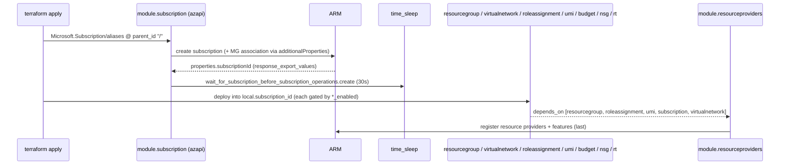
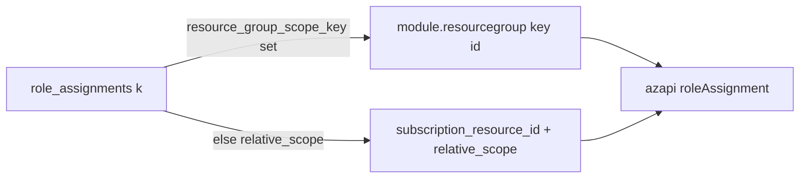

# Module: `lz-vending` (root) — AzAPI subscription-vending flow

| Field | Value |
|-------|-------|
| Repository | `Azure/terraform-azurerm-lz-vending` |
| Entry | root `main.*.tf` (one file per capability) |
| Registry | `Azure/lz-vending/azurerm` v7.0.3 (archived) |
| Source URL | <https://github.com/Azure/terraform-azurerm-lz-vending> |
| Mode | deep (source-verified) |
| Last reviewed | 2026-06-17 |

## Purpose

How the engine vends a landing-zone subscription and its baseline in a single AzAPI `terraform apply`. The
root is a thin **orchestrator**: each `main.<capability>.tf` calls a `modules/*` submodule gated by an
`*_enabled` flag, and `locals.tf` flattens the user's maps and computes scopes. This is the same design B6
(AVM) inherited.

## Deployment flow (single apply, source-verified)

`local.subscription_id = coalesce(azapi_resource.subscription[0].output.properties.subscriptionId, var.subscription_id)`
— so the same downstream wiring serves both **create-new** and **adopt-existing** paths.

## Root → submodule wiring (verified from `main.*.tf`)

| File | Call | Gate | Scope expression |
|------|------|------|------------------|
| `main.subscription.tf` | `module.subscription` | `count` = alias **or** update-existing **or** mg-assoc | `parent_id = "/"` |
| `main.resourcegroup.tf` | `module.resourcegroup` | `for_each` if `resource_group_creation_enabled` | `subscription_id` |
| `main.virtualnetwork.tf` | `module.virtualnetwork` | `count` if `virtual_network_enabled` | `local.subscription_id` |
| `main.roleassignment.tf` | `module.roleassignment` (+ `roleassignment_umi`) | `for_each` if `role_assignment_enabled` / per UMI | `rg key → resourcegroup id` **else** `${subscription_resource_id}${relative_scope}` |
| `main.usermanagedidentity.tf` | `module.usermanagedidentity` | per `user_managed_identities` | RG key / existing |
| `main.budget.tf` | `module.budget` | `for_each` if `budget_enabled` | RG id **or** `${subscription_resource_id}${relative_scope}` |
| `main.resourceproviders.tf` | `module.resourceproviders` | `for_each` if RP enabled | `depends_on` all submodules |

## Scope resolution (the two indirections)

1. **Relative scope:** `role_assignments` / `budgets` use `relative_scope` appended to the subscription
   resource id (`/subscriptions/<id>` + `/resourceGroups/MyRg`).
2. **Resource-group key:** `resource_group_scope_key` / `resource_group_key` reference an RG **created in the
   same run** (whose id is unknown at plan time) by its map key → `module.resourcegroup[key].…_resource_id`.

## Submodule mechanics (source-verified highlights)

### `subscription`
`azapi_resource "subscription"` = `Microsoft.Subscription/aliases@2021-10-01`, `parent_id = "/"`,
`additionalProperties.managementGroupId` for placement, `response_export_values = ["properties.subscriptionId"]`,
`lifecycle { ignore_changes = [body, name] }`. Plus `azapi_resource_action` for cancel/rename,
`azapi_update_resource` for tags, and the `time_sleep` wait. A drift check (`terraform_data.replacement`)
compares the subscription's current MG against the desired one.

### `virtualnetwork`
Wraps **`Azure/avm-res-network-virtualnetwork/azurerm` 0.14.1** (`module.virtual_networks` `for_each`
`var.virtual_networks`). A `hub_peering_map` builds bidirectional peerings with `uuidv5`-calculated names
(outbound = this→hub, inbound = hub→this); mesh peering and vWAN hub connection are computed similarly.

### `roleassignment`
`azapi_resource "this"` = `Microsoft.Authorization/roleAssignments@2022-04-01`; **name** =
`random_uuid` (if `use_random_uuid`) **else** deterministic `uuidv5("url", scope+principal+roleDefinitionId)`
→ **idempotent**. Role **name → id** resolved by the utility module `Azure/avm-utl-roledefinitions/azure`
0.1.0 (`use_cached_data = !definition_lookup_enabled` — static catalog by default, Azure API lookup if
enabled). `scope` validation forces `/subscriptions/…` minimum. Retries on `PrincipalNotFound`.

### `budget`
`azapi_resource "budget"` = `Microsoft.Consumption/budgets@2021-10-01`, `parent_id = budget_scope`,
notifications mapped from snake_case → ARM camelCase.

## Inputs / Outputs

See [_overview.md](./_overview.md) (same surface as B6 minus IPAM). Pivotal:
- **In:** `subscription_*` (vend/place/adopt), `virtual_networks`, `role_assignments`, `user_managed_identities`.
- **Out:** `subscription_id` (target for workloads), `virtual_network_resource_ids`, the `umi_*` set.

## Resources Created

Subscription alias + MG association; VNets/subnets/peerings (via AVM res); role assignments; UMI + federated
credentials; resource groups (+locks); budgets; NSGs (+rules); route tables (+routes); RP/feature
registrations; one telemetry ARM deployment.

## Dependencies

**Upstream:** AzAPI + time; AVM `avm-res-network-virtualnetwork` + `avm-utl-roledefinitions`; platform inputs.
**Downstream:** workloads in the vended subscription. **Successor:** B6.

## Notes & Gotchas

- **`parent_id = "/"`** (scope escape) is how AzAPI creates the tenant-scoped subscription alias from a normal
  apply — the Terraform analogue of E1's ARM `"scope": "/"`.
- **Idempotent role-assignment names** (`uuidv5`) are the fix that lets re-applies not churn assignments.
- **RP registration last** via `depends_on` — avoids "provider not registered" races for the resources above.
- **AVM composition inside the engine** — the vnet/roledef pieces are themselves AVM modules; this is the
  same composition philosophy as the B-series ptn modules.
- **Adopt vs create** is one variable flip (`subscription_id` vs `subscription_alias_enabled`); downstream
  wiring is identical because of the `coalesce`.

## Open Questions

- [ ] `TODO: verify` the `usermanagedidentity` submodule's federated-credential resource types (azapi `Microsoft.ManagedIdentity/userAssignedIdentities/federatedIdentityCredentials`) — inferred from inputs, not read line-by-line.
- [ ] `TODO: verify` the exact `networksecuritygroup`/`routetable` submodule resource API versions (azapi) — captured at the input level.
