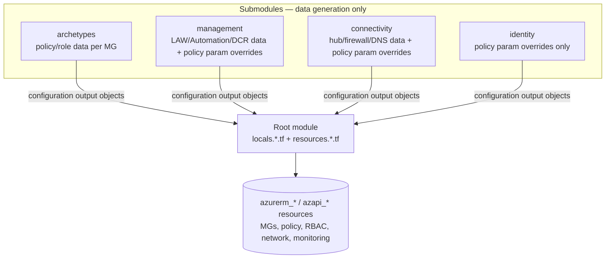
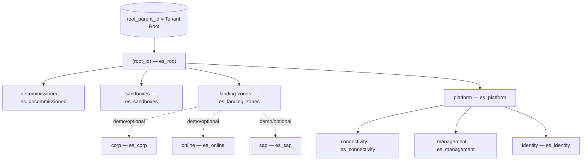

# Repository Overview: `Azure/terraform-azurerm-caf-enterprise-scale`

| Field | Value |
|-------|-------|
| Repository | `Azure/terraform-azurerm-caf-enterprise-scale` (catalog D1) |
| Registry | `Azure/caf-enterprise-scale/azurerm` |
| Flavor | Terraform — **monolithic root module** + 5 local submodules (HCL 85%, OPA/PowerShell/Shell for tests/library tooling) |
| Role | **Classic CAF Enterprise-Scale** ALZ implementation; core is the **archetype engine** (HCL-native policy/role library) |
| Status | ⚠️ **DEPRECATED** — extended support (bug/policy fixes only) until **2026-08-01**, then archived. Migrate to AVM (B1–B4). |
| Latest | v6.3.1 (Jul 2025); 59 releases |
| Providers | azurerm (+ aliases `azurerm.connectivity`, `azurerm.management`), azapi, random, time |
| Source URL | <https://github.com/Azure/terraform-azurerm-caf-enterprise-scale> |
| Mode | deep (remote analysis via GitHub) |
| Last reviewed | 2026-06-17 |

## Purpose

The original "all-in-one" Terraform module for Azure Landing Zones: from a tiny config it deploys the
**management-group hierarchy + governance baseline (Azure Policy + RBAC)** and, optionally, the
**management / connectivity / identity** platform resources — all in a single module instance.

Its defining characteristic is the **archetype engine**: a pure-HCL system that reads a JSON/YAML **policy
library** (built-in `lib/` folders + an optional custom `library_path`) and turns named **archetypes** into
the policy assignments, definitions, set definitions, role definitions and role assignments applied at each
management-group scope. This is the **predecessor** of the modern data/engine stack (G1 Library → G2 alzlib
→ G3 provider → B1 avm-ptn-alz): here the library + engine live *inside Terraform/HCL* rather than in a Go
provider.

> **Deprecation:** new deployments should use the AVM Platform Landing Zone modules (B1–B4). These notes
> document it as the **classic archetype engine** and the conceptual ancestor of the AVM approach.

## Repository structure

```text
terraform-azurerm-caf-enterprise-scale/
├── main.tf                       # calls the 5 submodules (for_each archetypes + platform data-gen)
├── variables.tf                  # huge: deploy_* toggles, configure_* settings, archetype_config_overrides, custom_landing_zones …
├── outputs.tf                    # returns configuration data for every resource type
├── terraform.tf                  # provider requirements (azurerm/azapi/random/time)
├── locals.tf                     # input → locals
├── locals.management_groups.tf   # ★ the MG hierarchy + archetype_config merge logic
├── locals.policy_assignments.tf  # flatten archetype outputs → policy assignment resources
├── locals.policy_definitions.tf  / locals.policy_set_definitions.tf
├── locals.role_assignments.tf    / locals.role_definitions.tf
├── locals.connectivity.tf / locals.management.tf / locals.virtual_wan.tf  # flatten submodule config → resources
├── locals.telemetry.*.tf         # customer-usage telemetry (PUID per domain)
├── resources.management_groups.tf       # azurerm_management_group.level_1..6 + subscription association
├── resources.policy_*.tf / resources.role_*.tf  # the actual azurerm policy/role resources
├── resources.management.tf / resources.connectivity.tf / resources.virtual_wan.tf
├── resources.telemetry.tf
└── modules/
    ├── archetypes/               # ★ the archetype engine (data-gen, no resources)
    ├── management/               # management resources data-gen + policy param overrides
    ├── connectivity/             # connectivity resources data-gen + policy param overrides
    ├── identity/                 # identity policy param overrides only (no resources)
    └── role_assignments_for_policy/  # role assignments for DINE/Modify policy identities
```

## The "data-generation + central resource creation" pattern

This is the module's key architectural idea (and its biggest difference from AVM):

- The five submodules **create no Azure resources**. Each one's `main.tf` literally says *"No resources
  deployed by this module … navigate the variables, locals and outputs to see how the data model is
  generated."* They emit a single `configuration` output — a big data object describing *what to deploy*.
- The **root module** then iterates those config objects in `locals.*.tf` / `resources.*.tf` to create the
  real `azurerm_*` resources (e.g. `for resource in module.connectivity_resources.configuration.azurerm_virtual_network`).



## Management-group hierarchy (default)

`locals.management_groups.tf` builds the core hierarchy; each MG carries an `archetype_config`
(`archetype_id` + `parameters` + `access_control`).



- MGs are created by `azurerm_management_group.level_1 … level_6` (up to 6 nested levels).
- `custom_landing_zones` adds extra MGs (each with an `archetype_config`); `subscription_id_overrides` /
  `subscription_id_{management,connectivity,identity}` place subscriptions and the
  `azurerm_management_group_subscription_association` resource associates them.

## Key inputs (root)

| Input | Type | Meaning |
|-------|------|---------|
| `root_parent_id` | string (req) | Tenant root (or parent) MG id the hierarchy attaches under. |
| `default_location` | string (req) | Default Azure region. |
| `root_id` / `root_name` | string | Intermediate-root MG id/display name (id prefixes all core MGs). |
| `deploy_core_landing_zones` | bool (true) | Deploy the core MG hierarchy + baseline policy/roles. |
| `deploy_management_resources` / `_connectivity_` / `_identity_` | bool | Turn on each platform landing zone's resources/settings. |
| `deploy_corp/online/sap/demo_landing_zones` | bool | Optional landing-zone MGs. |
| `configure_management_resources` / `_connectivity_` / `_identity_` | object | Rich settings for each platform domain (LAW, Defender, firewall, DNS, identity guardrails…). |
| `archetype_config_overrides` | any | Override `archetype_id` / `parameters` / `enforcement_mode` / `access_control` per **core** MG. |
| `custom_landing_zones` | any | Add custom MGs with their own archetype config. |
| `library_path` | string | Path to a **custom** archetype/policy library (layered over built-in). |
| `template_file_variables` | any | Extra variables injected into library file templating. |
| `subscription_id_*` | string/map | Platform subscription placement. |
| `create_duration_delay` / `destroy_duration_delay` / `resource_custom_timeouts` | object | `time_sleep` tuning for ARM eventual consistency. |

## Resources created (root)

- **Governance:** `azurerm_management_group.level_1..6`, `…_subscription_association`,
  `azurerm_policy_definition`, `…_policy_set_definition`, `azurerm_management_group_policy_assignment`,
  `azurerm_role_definition`, `azurerm_role_assignment` (+ `…_role_assignment.policy_assignment` for DINE/Modify).
- **Management:** `azurerm_log_analytics_workspace`, `…_solution`, `…_linked_service`,
  `azurerm_automation_account`, `azurerm_user_assigned_identity` (AMA), `azapi_resource.data_collection_rule`
  (×3 — VM Insights / Change Tracking / Defender-SQL), resource group, `azapi_resource.diag_settings`.
- **Connectivity:** resource groups, `azurerm_virtual_network` + subnets, `…_virtual_network_gateway`,
  `…_virtual_network_peering`, `azurerm_firewall` + `…_firewall_policy`, `azurerm_public_ip`,
  `azurerm_network_ddos_protection_plan`, `azurerm_dns_zone`, `azurerm_private_dns_zone` + VNet links.
- **Virtual WAN:** `azurerm_virtual_wan`, `…_virtual_hub`, `…_virtual_hub_connection`,
  `…_virtual_hub_routing_intent`, firewall, `…_vpn_gateway`, `…_express_route_gateway`.
- **Telemetry:** `azurerm_subscription_template_deployment.telemetry_{core,management,connectivity,identity}`
  (empty ARM deployments for customer-usage attribution; `disable_telemetry` opts out), `random_id.telem`.
- **Sequencing:** `time_sleep.after_azurerm_*` around MG/policy/role create+destroy for eventual consistency.

## Outputs

`outputs.tf` exports a `configuration`-style object per resource type (`azurerm_management_group`,
`azurerm_policy_definition`, `azurerm_policy_set_definition`, `azurerm_management_group_policy_assignment`,
`azurerm_log_analytics_workspace`, `azurerm_virtual_network`, … `ama_user_assigned_identity`,
`data_collection_rules`) — so callers/orchestration layers can consume what was deployed.

## Dependencies

**Upstream:** the **built-in archetype/policy library** (`modules/archetypes/lib/` + each platform module's
overrides) — the HCL-native analogue of G1's ALZ Library, ultimately sourced from the **E1 `Enterprise-Scale`**
ARM reference implementation (see [enterprise-scale-arm/_overview.md](../enterprise-scale-arm/_overview.md)).
**Downstream:** consumed directly as the platform deployment; `Azure/arm-template-parser` (D1/G4) historically
generated the policy-assignment library content from upstream ARM. Migration target: **AVM B1–B4**.

## Notes & Gotchas

- **Deprecated** — extended support only until 2026-08-01; the modern equivalent is B1 `avm-ptn-alz` (governance)
  + B2/B3/B4 (management/connectivity). See [avm-ptn-alz/_overview.md](../avm-ptn-alz/_overview.md).
  The migration to AVM is assisted by **H1 `terraform-state-importer`** (discovers the brownfield resources and
  generates Terraform `import {}` blocks; ships pre-built ALZ configs). See [terraform-state-importer/_overview.md](../terraform-state-importer/_overview.md).
- **Single module = whole platform** — unlike AVM's composition, one instance deploys MGs, policy, RBAC, and
  optionally management/connectivity/identity resources. Can be split across workspaces by toggling `deploy_*`.
- **HCL-native archetype engine** — the library is parsed with `fileset` + `templatefile` + `jsondecode`
  inside Terraform (no Go provider). See [module-archetype-engine.md](./module-archetype-engine.md).
- **Multi-subscription via provider aliases** — `azurerm.connectivity` / `azurerm.management` place platform
  resources in their subscriptions (same pattern as F1/B-series).
- **`strict_subscription_association = false`** by default so it co-exists with subscription vending.

## Open Questions

- [ ] `TODO: verify` exact `modules/role_assignments_for_policy` logic (how it maps policy `roleDefinitionIds` + `custom_policy_roles` to the managed-identity role assignments) — captured at a high level only.
- [x] **Resolved (cross-ref B2):** the `azapi_resource.data_collection_rule` set matches [B2 `avm-ptn-alz-management`](../avm-ptn-alz-management/_overview.md)'s **three DCRs — VM Insights, Change Tracking, and Defender-for-SQL** (both emit them as direct AzAPI/ARM bodies). The classic engine and the AVM management module are functionally equivalent here; the only still-open detail (the Windows change-tracking datasource block) is also open in B2.
