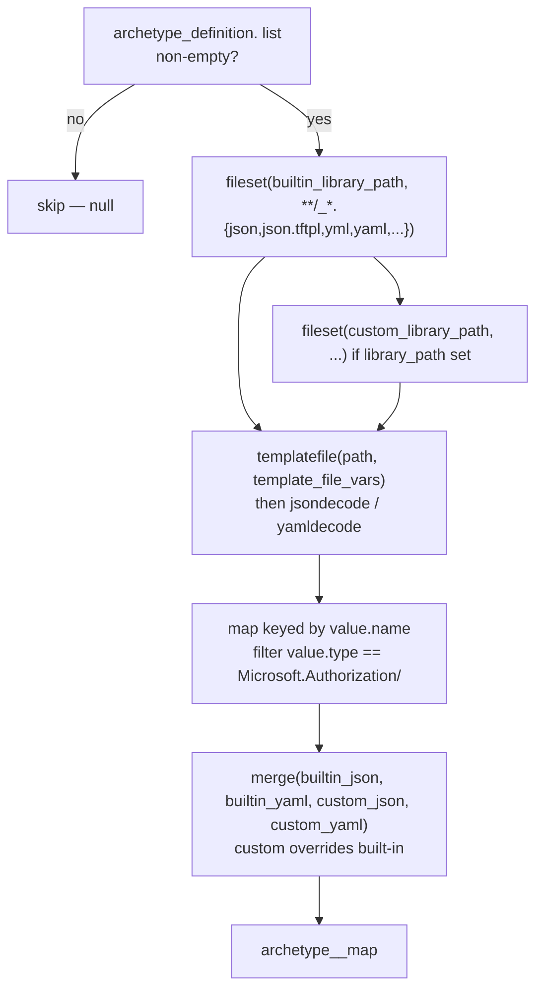
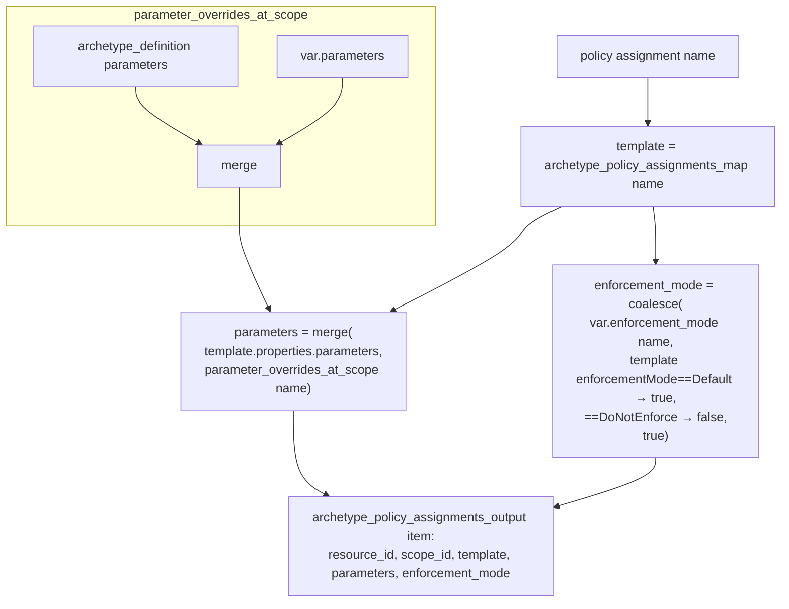

# Module: `archetypes` — the archetype engine (core)

| Field | Value |
|-------|-------|
| Repository | `Azure/terraform-azurerm-caf-enterprise-scale` |
| Path | `modules/archetypes/` |
| Called as | `module.management_group_archetypes` (`for_each` over every MG) |
| Entry | `main.tf` (no resources — pure data-gen via `locals.*.tf`) |
| Output | `configuration` = 5 lists of policy/role resource data |
| Source URL | <https://github.com/Azure/terraform-azurerm-caf-enterprise-scale/tree/main/modules/archetypes> |
| Mode | deep |
| Last reviewed | 2026-06-17 |

## Purpose

The HCL-native engine that turns a named **archetype** + a **scope** (management group) into the concrete
Azure Policy + RBAC objects to deploy there. It reads a JSON/YAML **library** (built-in + optional custom),
selects the assets the archetype references, merges in parameter/enforcement overrides, and outputs five
data lists that the root module materializes into `azurerm_*` resources.

> This is the conceptual ancestor of **alzlib (G2)** — same job (archetype → scoped policy/role objects),
> but implemented in Terraform `locals` with `fileset`/`templatefile` instead of a Go library.

## Inputs (`variables.tf`)

| Input | Type | Meaning |
|-------|------|---------|
| `root_id` | string (req) | The ES root MG resource id (where policy **definitions** are created by default). Validated as a MG resource id. |
| `scope_id` | string (req) | The MG (or subscription) resource id to apply the archetype against. |
| `archetype_id` | string (req) | The archetype to apply (must exist in built-in `lib/` or the custom `library_path`). |
| `parameters` | any | Per-policy-assignment parameter overrides. |
| `enforcement_mode` | map(bool) | Per-assignment enforcement override (`true`=Default, `false`=DoNotEnforce). |
| `access_control` | map(list(string)) | Role-definition-name → principal ids → role assignments. |
| `library_path` | string | Optional custom library folder (layered over built-in). |
| `template_file_variables` | any | Extra variables for library-file templating. |
| `default_location` | string | Default region (exposed to templates). |

The root calls it once per MG:

```hcl
module "management_group_archetypes" {
  for_each       = local.es_landing_zones_map
  source         = "./modules/archetypes"
  root_id        = "${local.provider_path.management_groups}${local.root_id}"
  scope_id       = each.key                                  # the MG resource id
  archetype_id   = each.value.archetype_config.archetype_id  # e.g. es_root, es_corp
  parameters     = each.value.archetype_config.parameters
  access_control = each.value.archetype_config.access_control
  enforcement_mode = each.value.archetype_config.enforcement_mode
  library_path   = local.library_path
  template_file_variables = local.template_file_variables
  default_location = local.default_location
}
```

## Library loading (the heart of the engine)

For each asset type (policy assignment/definition/set definition, role definition), `locals.<type>.tf`
runs the same pipeline — only loading files if the archetype actually references that type (to save compute):



- **Built-in path:** `${path.module}/lib`; **custom path:** `var.library_path` (both globbed).
- **Templating:** every file is run through `templatefile(...)` with `template_file_vars` = merge of
  `var.template_file_variables` + `core_template_file_variables` (`root_scope_id`, `current_scope_id`,
  `current_scope_resource_id`, `default_location`, `location`, `builtin`/`custom` paths). This is how
  library files reference the current scope and injected values (e.g. a workspace id) at parse time.
- **Keying + filtering:** decoded objects are mapped by `value.name`, filtered by
  `value.type == "Microsoft.Authorization/<type>"`. **Custom files override built-in** by merge order.

## Archetype definition resolution

`archetype_id` resolves to an **archetype definition** (an `archetype_definition_*` file) that lists which
asset **names** belong to the archetype: `policy_assignments`, `policy_definitions`, `policy_set_definitions`,
`role_definitions`. Each `locals.<type>.tf` reads `local.archetype_definition.<type>` to decide what to emit.

## Policy-assignment generation (parameter + enforcement merge)

From `locals.policy_assignments.tf`, for each assignment name the archetype references:



- **`resource_id`** = `${scope_id}/providers/Microsoft.Authorization/policyAssignments/<name>`.
- **Parameters** are merged in two stages: the archetype-definition defaults + `var.parameters` (per scope),
  then layered onto the assignment template's own `properties.parameters`.
- **Enforcement** falls back through: explicit `var.enforcement_mode` → the template's `enforcementMode` →
  default `true`.
- **Role assignments** (`locals.role_assignments.tf`) build a deterministic `resource_id` via nested
  `uuidv5(uuidv5(uuidv5("url", role_definition_name), scope_id), member)` so re-runs are stable.

## Output (`outputs.tf` → `module_output`)

```hcl
configuration = {
  azurerm_policy_assignment     = [...]   # resource_id, scope_id, template, parameters, enforcement_mode
  azurerm_policy_definition     = [...]
  azurerm_policy_set_definition = [...]
  azurerm_role_assignment       = [...]   # resource_id, scope_id, principal_id, role_definition_name
  azurerm_role_definition       = [...]
}
```

The root module collects these across all MGs (`for_each` results) and creates the actual
`azurerm_policy_definition.enterprise_scale`, `azurerm_management_group_policy_assignment.enterprise_scale`,
`azurerm_role_definition.enterprise_scale`, `azurerm_role_assignment.enterprise_scale`, etc.

## Resources Created

**None.** Pure data generation. All resources are created centrally by the root module from this output.

## Dependencies

**Upstream:** the built-in `lib/` library + optional custom `library_path`; `template_file_variables`
(including values injected by the management/connectivity/identity submodules via `archetype_config_overrides`).
**Downstream:** the root module's `locals.policy_*.tf` / `resources.policy_*.tf` / `resources.role_*.tf`.

## Notes & Gotchas

- **Conditional loading** — files are only read if the archetype references that asset type
  (`*_specified` guards), avoiding the cost of parsing the whole library for every MG.
- **Templating = late binding** — `templatefile` lets library files embed `${current_scope_resource_id}`,
  `${default_location}`, a workspace id, a DDoS plan id, etc., resolved per scope. This is how the platform
  submodules feed runtime ids into policy parameters (see [module-platform-submodules.md](./module-platform-submodules.md)).
- **Custom overrides built-in** — dropping a same-named file under `library_path` replaces the built-in asset.
- **Names are the join key** — archetype definitions reference assets by `.name` (same principle as the G1 ALZ Library).

## Open Questions

- [ ] `TODO: verify` the exact `archetype_definition_*` file schema + how `archetype_id` maps to the file (lookup logic in the omitted `locals.archetype_definition`-style block).
