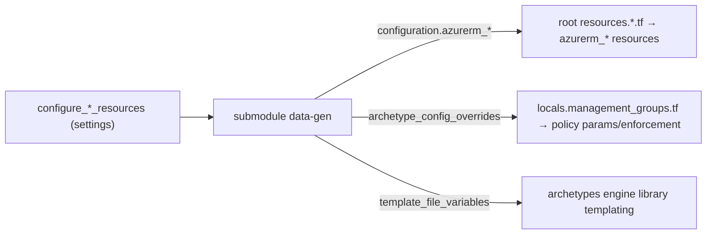
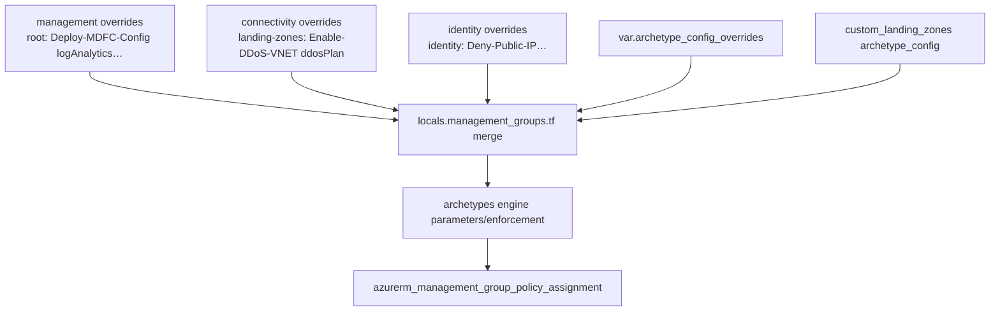

# Module: platform submodules (`management` / `connectivity` / `identity` / `role_assignments_for_policy`)

| Field | Value |
|-------|-------|
| Repository | `Azure/terraform-azurerm-caf-enterprise-scale` |
| Paths | `modules/management`, `modules/connectivity`, `modules/identity`, `modules/role_assignments_for_policy` |
| Pattern | **Data-generation** — emit a `configuration` object; the root module creates the resources |
| Source URL | <https://github.com/Azure/terraform-azurerm-caf-enterprise-scale/tree/main/modules> |
| Mode | deep |
| Last reviewed | 2026-06-17 |

## Purpose

The platform-domain submodules generate the **configuration data** for the management, connectivity and
identity landing zones, plus the **policy-parameter overrides** that wire runtime resource ids into the
governance baseline. Like the archetype engine, three of them **create no Azure resources** — the root
module materializes everything from their `configuration` output.

## The shared pattern

Each submodule:
1. Takes `enabled` + `settings` (+ `subscription_id`, `location`, `tags` for the resource-bearing ones).
2. Derives `deploy_*` booleans from `settings` (e.g. `deploy_log_analytics = enabled && settings.log_analytics.enabled`).
3. Builds a `configuration` / `module_output` object containing:
   - resource data lists (for management/connectivity), and/or
   - **`archetype_config_overrides`** — per-MG policy `parameters` + `enforcement_mode`, and
   - **`template_file_variables`** — runtime ids exposed to the archetype engine's library templating.

## `modules/management`

| Aspect | Detail |
|--------|--------|
| Creates (via root) | Log Analytics workspace, solutions, linked service, Automation account, AMA `user_assigned_identity`, 3 DCRs (`azapi_resource.data_collection_rule`), resource group, diag settings. |
| `settings` | `ama` (enable UAMI / VM Insights DCR / Change Tracking DCR / Defender-SQL DCR), `log_analytics` (retention, monitoring for VM/VMSS, Sentinel, change tracking, solutions), `security_center` (email contact + per-plan Defender toggles). |
| Policy override | Emits `archetype_config_overrides` for the **root** MG: e.g. `Deploy-MDFC-Config-H224` parameters get `emailSecurityContact`, `logAnalytics` (the workspace id), `ascExportResourceGroup*`, and per-Defender `DeployIfNotExists/Disabled` effects. |
| Equivalent | **B2 `avm-ptn-alz-management`** — same LAW/Automation/Sentinel/DCR/AMA scope; outputs feed policy the same way. |

## `modules/connectivity`

| Aspect | Detail |
|--------|--------|
| Creates (via root) | Resource groups, hub VNet(s) + subnets, VNet gateways (VPN/ER), peerings, Azure Firewall + policy, public IPs, DDoS protection plan, DNS + Private DNS zones + VNet links; plus Virtual WAN resources (`locals.virtual_wan.tf`). |
| `settings` | `hub_networks[]`, `vwan_hub_networks[]`, `ddos_protection_plan`, `dns` (private-link zones per service, private DNS zone VNet links). |
| Policy override | Emits `archetype_config_overrides` for the **landing-zones** MG: `Enable-DDoS-VNET` → `ddosPlan = ddos_protection_plan_resource_id` (+ enforcement gated on whether DDoS is deployed). |
| `template_file_variables` | Exposes `ddos_protection_plan_resource_id`, `private_dns_zone_prefix`, `connectivity_location[_short]`, `virtual_network_resource_id_by_location`, `vpn_gateway_resource_id_by_location`, `firewall_resource_id_by_location` to the archetype library templating. |
| Equivalent | **B3 `avm-ptn-alz-connectivity-hub-and-spoke-vnet`** + **B4 `avm-ptn-alz-connectivity-virtual-wan`**. |

## `modules/identity`

| Aspect | Detail |
|--------|--------|
| Creates | **Nothing** — identity has no platform resources; the module only shapes policy. |
| `settings` | `identity.config`: `enable_deny_public_ip`, `enable_deny_rdp_from_internet`, `enable_deny_subnet_without_nsg`, `enable_deploy_azure_backup_on_vms`. |
| Policy override | Emits `archetype_config_overrides` for the **identity** MG: sets `Deny-Public-IP`, `Deny-RDP-From-Internet`, `Deny-Subnet-Without-Nsg` effects + `Deploy-VM-Backup` (DINE), and toggles each assignment's `enforcement_mode` from the `enable_*` flags. |
| Equivalent | In AVM, identity guardrails come from the G1 Library archetype assigned by B1 (no separate identity resource module). |

## `modules/role_assignments_for_policy`

| Aspect | Detail |
|--------|--------|
| Purpose | Creates the **role assignments that DINE/Modify policy assignments' managed identities need** (so remediation can act). |
| Inputs | The policy assignments that use an identity + their `roleDefinitionIds`; `custom_policy_roles` can override which role(s) to assign for a given `policyDefinitionId`. |
| Output | Drives `azurerm_role_assignment.policy_assignment` at the root. |
| Equivalent | alzlib's `PolicyRoleAssignment` generation (G2) surfaced by the G3 provider's `policy_role_assignments`. |

## How overrides reach the policy (the cross-module merge)

`locals.management_groups.tf` merges, per MG, the `archetype_config_overrides` from **all three** platform
submodules + the user's `archetype_config_overrides` + any `custom_landing_zones` config, then passes the
merged `parameters` / `enforcement_mode` into the archetypes engine:

> This merge is the classic-module equivalent of the modern **`policy_default_values`** mechanism: B2's
> workspace/DCR ids, the DDoS plan id, etc. get injected into the right policy assignment parameters — but
> here it happens in HCL `locals` rather than via the `alz` provider.

## Resources Created

- `management` + `connectivity`: **none directly** — data only; root creates the resources.
- `identity`: **none** — policy overrides only.
- `role_assignments_for_policy`: drives the root's `azurerm_role_assignment.policy_assignment`.

## Dependencies

**Upstream:** `configure_*_resources` settings; the AzureRM provider aliases (`azurerm.management`,
`azurerm.connectivity`) for subscription placement. **Downstream:** root `locals.*.tf` / `resources.*.tf`
(resource creation) and `locals.management_groups.tf` (policy override merge → archetype engine).

## Notes & Gotchas

- **Three of four create nothing** — the value is the *data model* + *policy parameter injection*, not resources.
- **`template_file_variables` is the back-channel** — connectivity exposes ids (DDoS plan, firewall, DNS prefix)
  that library policy files template in; management injects the workspace id via `archetype_config_overrides`.
- **Maps to the AVM split** — management→B2, connectivity→B3/B4, identity→(G1 archetype via B1),
  role_assignments_for_policy→(alzlib `policy_role_assignments`). Useful when reading a v5/v6 → AVM migration.

## Open Questions

- [ ] `TODO: verify` the precise `custom_policy_roles` override path in `role_assignments_for_policy` (policyDefinitionId → roleDefinitionId mapping).
