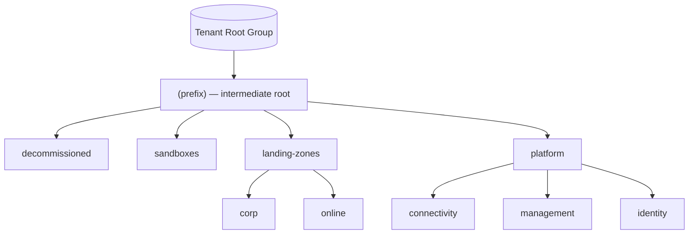

# Repository Overview: `Azure/Enterprise-Scale`

| Field | Value |
|-------|-------|
| Repository | `Azure/Enterprise-Scale` (catalog E1) |
| Flavor | ARM + Docs (languages: **PowerShell 88.7%**, **Bicep 11.3%** — policy authored in Bicep, generated to ARM JSON) |
| Role | The **Azure Landing Zones (Enterprise-Scale) reference implementation** — the conceptual + ARM authority for ALZ; the portal "Deploy to Azure" experience |
| Aliases | "ESLZ", "eslz", `aka.ms/alz` |
| Entry | `eslzArm/eslzArm.json` ("one template to rule them all") + `eslzArm/eslz-portal.json` (portal UI) |
| Docs | moved to the central techdocs library: <https://aka.ms/alz/techdocs> (this repo keeps templates + automation) |
| Latest | release `2026-04-29`; 52 releases |
| Source URL | <https://github.com/Azure/Enterprise-Scale> |
| Mode | deep (remote analysis via GitHub) |
| Last reviewed | 2026-06-17 |

## Purpose

`Enterprise-Scale` is the **original, authoritative reference implementation** of Azure Landing Zones. It
provides prescriptive architecture guidance (the CAF "Ready" design areas) **and** the first-party **ARM
templates** that the Azure Portal uses to bootstrap a tenant: management-group hierarchy, the policy/role
governance baseline, platform subscriptions, and connectivity.

This is the **conceptual ancestor** of everything else in this study:

- The **policy definitions/initiatives** authored here (in Bicep → generated to ARM JSON) are the upstream
  source mirrored by the modern **G1 ALZ Library** and the classic **D1 caf-enterprise-scale** module.
- The **archetype/MG/policy concepts** it defines are what D1's HCL archetype engine and B1's `alz` provider
  implement in their respective languages.
- **G4 `arm-template-parser`** was historically used to copy these ARM policy assignments into other IaC
  (Terraform/Bicep).

> Per the README, this repo represents *"the strategic design path and target technical state for your Azure
> environment"* — policy-driven governance over a multi-subscription design, for the whole tenant.

## Repository structure

```text
Enterprise-Scale/
├── eslzArm/                      # ★ first-party ARM templates (portal deployment)
│   ├── eslzArm.json              # the master template ("one template to rule them all")
│   ├── eslz-portal.json          # createUiDefinition for the Azure Portal wizard
│   ├── eslzArm.test.param.*.json # parameter sets: std / hns / vwan / test / terraform-sync
│   ├── managementGroupTemplates/ # MG structure, subscription org, policy defs + assignments
│   ├── subscriptionTemplates/    # subscription-scoped templates
│   ├── resourceGroupTemplates/   # RG-scoped (e.g. userAssignedIdentity.json, LAW)
│   └── prerequisites/
├── src/
│   ├── templates/policies.bicep + initiatives.bicep   # ★ policy SOURCE (Bicep → generated JSON)
│   ├── resources/                # policy/role source resources
│   ├── scripts/                  # PowerShell automation (deploy, AMA upgrade, generate ARM/config)
│   └── Alz.Tools/                # PowerShell module (deploy/destroy/codegen helpers)
├── docs/                         # wiki content (architecture, es-schema, deploy guides)
├── examples/                     # example ARM templates: management-groups + landing-zones (sub vending)
├── workloads/                    # workload-specific policy content
├── tests/ + utils/
```

> Languages reflect the model: **policy is authored in Bicep** (`src/templates/*.bicep`) and
> **programmatically generated** to the ARM JSON in `eslzArm/managementGroupTemplates/policyDefinitions/`
> (`policies.json` / `initiatives.json` are marked *"DO NOT UPDATE MANUALLY"*). PowerShell drives the
> generation + deployment.

## The "one template to rule them all" model

From `docs/Deploy/es-schema.md`: ARM is the unified control-plane; *"everything in Azure is a Resource"*, so
the whole tenant goal-state can be declared in **one ARM template** (`eslzArm.json`). It starts at the
**Tenant root** and navigates across all scopes using logical operators + resource conditions, doing nested
deployments to the correct scope per resource type.

```mermaid
flowchart TD
    portal["Azure Portal (eslz-portal.json)"] --> master[eslzArm.json @ Tenant root]
    master -->|condition: create MG| mg[Microsoft.Management/managementGroups]
    master -->|nested deploy to MG/Sub| pol[policyDefinitions / policySetDefinitions]
    master -->|nested deploy to scope| pa[policyAssignments]
    master -->|nested deploy to scope| rd[roleDefinitions / roleAssignments]
    master -->|scope escape "/"| sub[Microsoft.Subscription/aliases + MG placement]
    master -->|nested deploy to Sub| conn[connectivity / management resources]
```

## Azure resources in scope (platform)

Per `es-schema.md`, the platform template manages only these (workload resources are out of scope):

| Resource type | Scope |
|---------------|-------|
| `Microsoft.Management/managementGroups` | Tenant root |
| `Microsoft.Subscription/subscriptions` / `Microsoft.Subscription/aliases` | Tenant root |
| `Microsoft.Management/managementGroups/subscriptions` | Management Group (placement) |
| `Microsoft.Authorization/policyDefinitions` | MG / Subscription |
| `Microsoft.Authorization/policySetDefinitions` | MG / Subscription |
| `Microsoft.Authorization/policyAssignments` | MG / Subscription |
| `Microsoft.Authorization/roleDefinitions` | MG / Subscription |
| `Microsoft.Authorization/roleAssignments` | MG / Subscription |

## Management-group hierarchy (canonical ALZ)

The hierarchy E1 defines is the **canonical ALZ MG tree** that every other repo mirrors (`<prefix>` =
`topLevelManagementGroupPrefix`, max 10 chars, e.g. `alz`):



Built by `managementGroupTemplates/mgmtGroupStructure/mgmtGroups.json`; subscriptions are placed with
`subscriptionOrganization/subscriptionOrganization.json`.

## Design principles & critical design areas (concepts)

The README frames ESLZ as *"design principles across the **critical design areas**."* These are the CAF
Azure Landing Zone design areas (the conceptual backbone implemented as policy/RBAC here); full current
guidance lives at <https://aka.ms/alz/techdocs>:

- **Azure billing & Microsoft Entra tenant** — enterprise enrollment + tenant.
- **Identity & access management** — the `identity` platform LZ, Entra, RBAC.
- **Resource organization** — the MG hierarchy + subscriptions above.
- **Network topology & connectivity** — hub-spoke / Virtual WAN in the `connectivity` LZ.
- **Security** — Microsoft Defender for Cloud, Microsoft Cloud Security Benchmark via policy.
- **Management** — Log Analytics / monitoring in the `management` LZ.
- **Governance** — **policy-driven** guardrails (DINE/DENY/Audit) across the hierarchy.
- **Platform automation & DevOps** — IaC (ARM/Bicep/Policy) + pipelines (AzOps).

> `TODO: verify` the exact wording/enumeration against the current techdocs — the repo's in-repo
> architecture doc was consolidated to the central library, so the list above is the established CAF
> framing rather than a verbatim quote from this repo.

## Dependencies

**Upstream:** none — it is the policy/architecture source of truth (policy authored in `src/templates/*.bicep`).
**Downstream:** the policy library here is the upstream mirrored by **G1 `Azure-Landing-Zones-Library`** and
the classic **D1 `caf-enterprise-scale`**; the portal "Deploy to Azure" experience consumes `eslzArm.json`;
**G4 `arm-template-parser`** historically copied these policy assignments into other IaC; **J1 `AzGovViz`**
`git clone`s this repo at runtime (its ALZ Policy Version Checker) to diff the ALZ policy/set-definition
history against a tenant.

## Notes & Gotchas

- **Reference implementation, not a module** — you consume it via the **Azure Portal** or by deploying the
  `eslzArm.json` templates directly (PowerShell/CLI), not as a registry module.
- **Policy is generated, not hand-written** — edit `src/templates/policies.bicep` / `initiatives.bicep`; the
  `eslzArm/.../policies.json` is auto-generated (works across AzureCloud / China / US Gov).
- **ARM scope gymnastics** — uses **scope escape** (`"scope": "/"`) and **inner/outer expression evaluation**
  to create tenant-level resources (subscription aliases) and chain subscription vending; documented in
  [module-eslzArm.md](./module-eslzArm.md).
- **The conceptual root** — the `es_*` archetypes (D1), the G1 architecture, and B1's default MG tree all
  trace back to the hierarchy + policy baseline defined here.
- **Still maintained** — releases continue (2026-04-29) for policy refreshes, even as new deployments are
  steered to AVM.

## Open Questions

- [ ] `TODO: verify` the precise contents/sequence inside `eslzArm.json` (it's a very large generated master template) — captured via `es-schema.md` description + the per-step deploy scripts rather than line-by-line.
- [ ] `TODO: verify` the full `subscriptionTemplates/` + `resourceGroupTemplates/` inventory (only key ones — subscriptionOrganization, userAssignedIdentity, LAW — observed).
