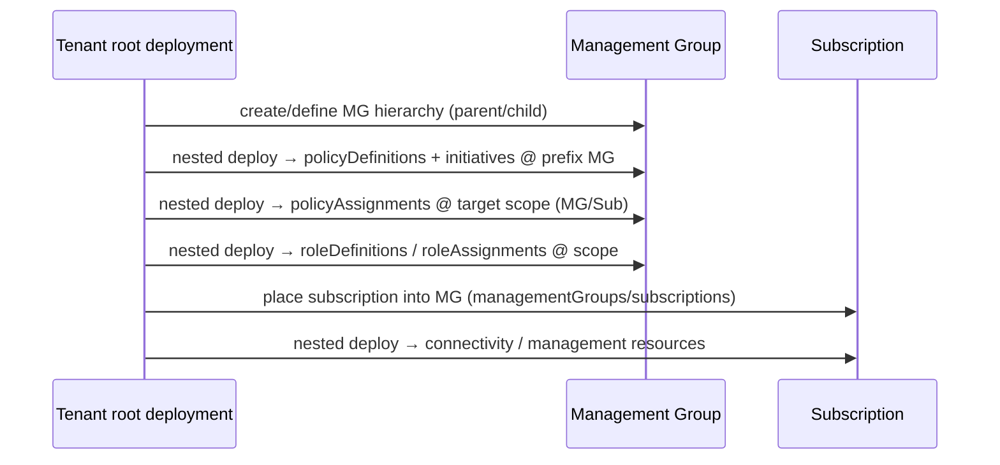

# Module: `eslzArm` — the Enterprise-Scale ARM templates

| Field | Value |
|-------|-------|
| Repository | `Azure/Enterprise-Scale` |
| Path | `eslzArm/` (+ `src/templates/*.bicep` policy source) |
| Entry | `eslzArm.json` (master) + `eslz-portal.json` (portal UI) |
| Flavor | ARM JSON (policy authored in Bicep, generated to JSON) |
| Source URL | <https://github.com/Azure/Enterprise-Scale/tree/main/eslzArm> |
| Mode | deep |
| Last reviewed | 2026-06-17 |

## Purpose

The first-party **ARM templates** that build the Enterprise-Scale platform from the Azure Portal: the MG
hierarchy, the policy/role governance baseline, platform subscriptions, and connectivity. `eslzArm.json` is
the single master template; the `managementGroupTemplates/` folder holds the modular templates the portal
(and the deploy scripts) invoke per design area.

## Structure

```text
eslzArm/
├── eslzArm.json                         # master template (Tenant-root deployment)
├── eslz-portal.json                     # createUiDefinition (portal wizard)
├── eslzArm.test.param.{json,std,hns,vwan}.json + terraform-sync.param.json
├── managementGroupTemplates/
│   ├── mgmtGroupStructure/mgmtGroups.json          # the MG hierarchy
│   ├── subscriptionOrganization/subscriptionOrganization.json  # place sub into MG
│   ├── policyDefinitions/policies.json + initiatives.json       # GENERATED from src Bicep
│   └── policyAssignments/DINE-*.json | DENY-*.json | DENYACTION-*.json  # per-guardrail
├── subscriptionTemplates/               # subscription-scoped (e.g. connectivity)
├── resourceGroupTemplates/              # RG-scoped (userAssignedIdentity.json, LAW…)
└── prerequisites/
```

## Inputs (key parameters)

| Parameter | Meaning |
|-----------|---------|
| `topLevelManagementGroupPrefix` | The ALZ prefix (max 10 chars, e.g. `alz`); prefixes the intermediate-root MG + all core MGs. |
| `scope` | Target scope for policy definitions (`/`, `/subscriptions/<id>`, or `/providers/Microsoft.Management/managementGroups/<id>`); defaults to the prefix MG. |
| `location` | Deployment location (also the default for DINE-effect policies). |
| `enterpriseScaleCompanyPrefix` | The root id used by the deploy scripts. |
| `managementSubscriptionId` / `connectivitySubscriptionId` / `identitySubscriptionId` | Platform subscription placement. |
| `corpLzSubscriptionId` / `onlineLzSubscriptionId` | Landing-zone subscription placement. |
| per-assignment params | e.g. `logAnalyticsResourceId`, `dataCollectionRuleResourceId`, `userAssignedIdentityResourceId`, `emailContactAsc`, `retentionInDays`. |

## Policy authoring → generation (the Bicep source)

Policy is **not** hand-edited as JSON. It's authored in Bicep and generated:

```mermaid
flowchart LR
    bicep["src/templates/policies.bicep<br/>initiatives.bicep"] -->|New-AlzPoliciesArmTemplate.ps1<br/>(Alz.Tools)| json["eslzArm/managementGroupTemplates/<br/>policyDefinitions/policies.json + initiatives.json"]
    json -->|deployed to prefix MG| azpol[(Azure Policy defs + initiatives)]
```

- `src/templates/policies.bicep` + `initiatives.bicep` (`targetScope = 'managementGroup'`) are the source.
- `New-AlzPoliciesArmTemplate.ps1` generates `policies.json`/`initiatives.json` (the files carry a
  *"programmatically generated — DO NOT UPDATE MANUALLY"* banner).
- Designed to be **multi-cloud**: emits the supported policy set for AzureCloud / AzureChinaCloud /
  AzureUSGovernment.

## Deployment sequencing (from `es-schema.md`)

The master template honors the ARM graph from the **Tenant root** and resolves scopes with conditions:



- **New MG** → Tenant-root deployment defines it + its parent/child relationship.
- **New subscription** → Tenant-level deployment updates its MG placement.
- **New policyAssignment / roleDefinition** → start at Tenant root, **nested deploy** to the target scope.

## ARM scope techniques (two patterns worth knowing)

### 1. Scope escape (`"scope": "/"`)
To create a **tenant-level** resource while *invoking the deployment at a management group* (so you don't
need tenant-root permissions), resources use `"scope": "/"` to route the request to the tenant root:

```json
{
  "scope": "/",
  "type": "Microsoft.Management/managementGroups",
  "apiVersion": "2020-05-01",
  "name": "[parameters('mgmtGroupName')]",
  "properties": { "displayName": "[parameters('mgmtGroupName')]" }
}
```

Subscription aliases (`Microsoft.Subscription/aliases`) are created the same way, with the MG placement in
the property bag: `"managementGroupId": "[tenantResourceId('Microsoft.Management/managementGroups/', parameters('targetManagementGroup'))]"`.

### 2. Inner/outer expression evaluation (subscription vending)
When creating a subscription and then deploying *into* it in the same template, the generated `subscriptionId`
is passed from **outer → inner** scope:

```json
{
  "type": "Microsoft.Resources/deployments",
  "scope": "[concat('Microsoft.Management/managementGroups/', parameters('targetManagementGroup'))]",
  "properties": {
    "expressionEvaluationOptions": { "scope": "inner" },
    "parameters": { "subAliasName": { "value": "[parameters('subscriptionAliasName')]" } }
  }
}
```

The creating deployment outputs `"[reference(parameters('subAliasName')).subscriptionId]"`, which subsequent
deployments consume via `reference(...).outputs.subscriptionId.value` to target the new subscription. This is
the **original subscription-vending pattern** later productized as C1/A2/B6.

## Policy-assignment templates (the guardrail catalog)

`managementGroupTemplates/policyAssignments/` holds one template per guardrail, named by effect:

| Prefix | Effect | Examples |
|--------|--------|----------|
| `DINE-` | DeployIfNotExists | `DINE-VMMonitoringPolicyAssignment`, `DINE-ChangeTrackingVMPolicyAssignment`, `DINE-LogAnalyticsPolicyAssignment`, `DINE-ASBPolicyAssignment`, `DINE-MDFCConfigPolicyAssignment`, `DINE-SQLAuditingPolicyAssignment` |
| `DENY-` | Deny | `DENY-SubnetWithoutNsgPolicyAssignment`, `DENY-IPForwardingPolicyAssignment`, `DENY-PublicEndpointPolicyAssignment`, `DENY-RDPFromInternetPolicyAssignment`, `DENY-AksPrivilegedPolicyAssignment` |
| `DENYACTION-` | DenyAction | `DENYACTION-DeleteUAMIAMAPolicyAssignment` (protect the AMA identity) |

These are assigned per scope (e.g. monitoring at `management`, DDoS/NSG at `landing-zones`, RDP/NSG/backup at
`identity`) — the exact mapping the modern G1 archetypes encode by `.name`.

## Resources Created

Management groups, subscription placements, subscription aliases, policy definitions, policy set definitions
(initiatives), policy assignments, role definitions, role assignments — plus platform resources (Log
Analytics workspace, user-assigned identity for AMA, connectivity) via the subscription/RG templates.

## Dependencies

**Upstream:** `src/templates/*.bicep` (policy source) + `Alz.Tools` PowerShell module (generation/deploy).
**Downstream:** the Azure Portal "Deploy to Azure" experience; the policy library mirrored by G1/D1; G4
arm-template-parser for IaC extraction.

## Notes & Gotchas

- **Don't edit `policies.json`/`initiatives.json`** — edit the Bicep source and regenerate.
- **Tenant-root deployment + conditions** is how one template spans MG/Sub/RG scopes — very different from
  the modular AVM approach (one module per concern).
- **Scope escape + inner/outer eval** are the canonical ARM idioms for tenant-level resources and sub
  vending; understanding them explains both this repo and the example `landing-zones/*` templates.
- **Param sets** (`std`/`hns`/`vwan`) select hub-spoke vs Virtual WAN vs hub-and-spoke-with-NVA topologies —
  the ARM ancestor of F1's starter scenarios.

## Open Questions

- [ ] `TODO: verify` the internal resource ordering inside the generated `eslzArm.json` master template (analyzed via the schema doc + per-step scripts, not line-by-line — it is large + generated).
- [ ] `TODO: verify` the complete `policyAssignments/` filename list (representative DINE-/DENY-/DENYACTION- set captured from the AMA upgrade script + China deploy guide).
